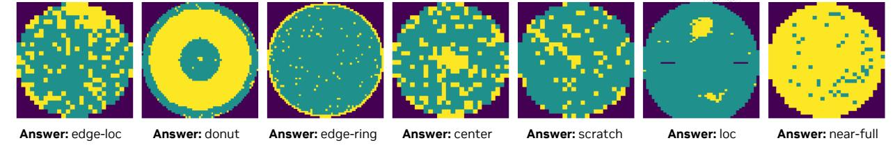
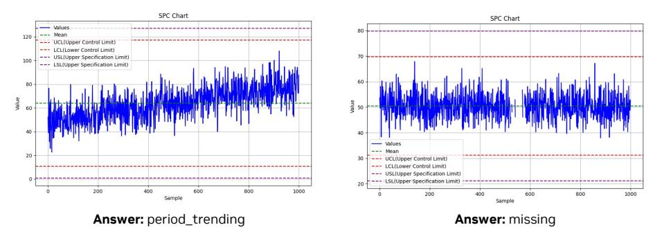

# *B.5.2. Factory and Industrial Time Series Understanding*

We apply OmniVinci to Statistical Process Control (SPC) chart recognition, a representative task in industrial quality monitoring and root cause analysis. Our model recognizes a wide range of fault categories, including out-of-control points such as spikes or drops, persistent runs and monotonic trends such as level shifts up or down, cyclic oscillations, mixture or random fluctuations, as well as missing values or short outages, as illustrated in Figure [13.](#page-27-2) On a held-out test set, our model achieves 87% accuracy, showing that by transforming time-series signals into visual representations, we can effectively leverage large-scale vision-language pretraining for sensor monitoring and industrial diagnostics. This demonstrates the feasibility of deploying our framework

#### **Long-horizon temporal reasoning & localization**

You will be asked multi-choice questions. Your replies must contain only a single letter (either A, B, C, D). If each subtle intensity change in the lung fields represents a 5% adjustment in diagnostic confidence for pneumonia, how many such changes occur from 0 to 120 seconds, requiring tracking across the entire video duration?

- A. 4 adjustments (20% to
- B. 10 adjustments (50% total)
- C. 6 adjustments (30% total)
- D. 8 adjustments (40% total)'}

Ground truth: **B** Qwen2.5-Omni: **C** Ours: **B**

#### **Audio-visual synchronization & understanding**

You will be asked multi-choice questions. Your replies must contain only a single letter (either A, B, C, D). What structure is highlighted by the green circular marker added near the lung area at 20-30 s?

- A. Spine
- B. Trachea
- C. Bronchus
- D. Lung nodule

Ground truth: **D** Qwen2.5-Omni: **C** Ours: **D**

#### **Anti-shortcutting**

You will be asked multi-choice questions. Your replies must contain only a single letter (either A, B, C, D). How many bone lesions were identified in the thorax that would support a diagnosis of metastasis?

- A. No lesions
- B. Multiple lesions (>3)
- C. One lesion
- D. Two lesions

Ground truth: **C** Qwen2.5-Omni: **A** Ours: **C**

#### **Temporal reasoning**

You will be asked multi-choice questions. Your replies must contain only a single letter (either A, B, C, D). How do the lung textures in the CT scan change over time, based on the visual cues?

- A. They transition to uniform density
- B. They become more homogeneous
- C. They show increasing bright white areas
- D. They display consistent heterogeneous patterns

Ground truth: **D** Qwen2.5-Omni: **C** Ours: **D**

Figure 11 | Qualitative comparison between OmniVinci and Qwen2.5-Omni on an omni-modal medical QA task based on radiologist-narrated CT interpretation videos. We organize the evaluation into four categories of questions: long-horizon temporal reasoning and localization, audio-visual synchronization and understanding, anti-shortcutting, and temporal reasoning.

**User**: This is a image of a wafer map, the yellow pattern in the circle refers to the defect pattern. There are 8 possible types of defect of wafer map (1) loc. (2) edge-loc. (3) center. (4) edge-ring. (5) scratch. (6) near-full. (7) donut. (8) random. What type of anomaly does the provided image present?

Figure 12 | Illustration of wafer robust defect analysis task for smart factory agent.

in real manufacturing pipelines, where timely detection of process abnormalities is crucial for preventing defects and reducing downtime.

We assess our framework on time series classification tasks using datasets from the UCR archive [\[23\]](#page-13-12), where time series are transformed into line plots to exploit large-scale vision–language pretraining. Our first comparison is against VLM-TSC [\[83\]](#page-17-15), a LLaVA-based VLM that adopts a similar conversion strategy. As shown in Table [16,](#page-27-3) our approach achieves superior performance on the PenDigits and ItalyPowerDemand datasets.

**User**: What class do these images belong to? The possible classes are: cluster, constant, cycling, missing, period\_trending, periodic\_patterns, shift, trending, uneven.

Figure 13 | Illustration of SPC chart recognition for industrial fault detection.

Table 16 | Performance comparison of test accuracy (%) on selected UCR datasets [\[23\]](#page-13-12).

|                               | Acc. ↑           |         |            |              |         |                |                |
|-------------------------------|------------------|---------|------------|--------------|---------|----------------|----------------|
| Dataset                       | Type             | Length  | Train      | Test         | Class   | VLM-TSC [83]   | Ours           |
| PenDigits ItalyPowerDemand | MOTION SENSOR | 8 24 | 7494 67 | 3498 1029 | 10 2 | 85.08 95.00 | 96.88 95.82 |

