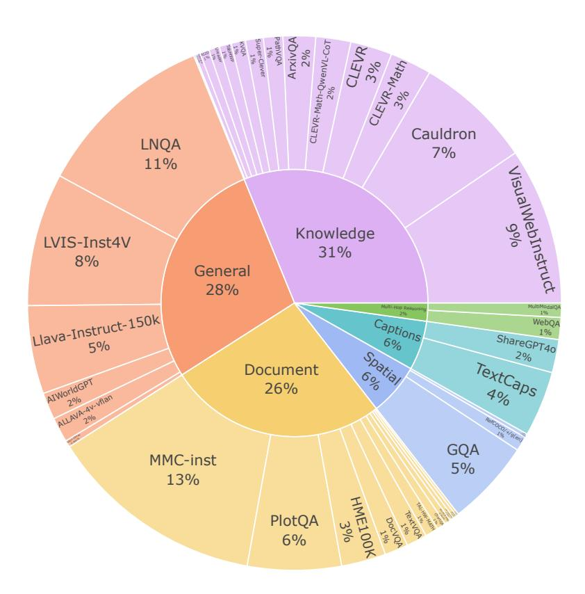
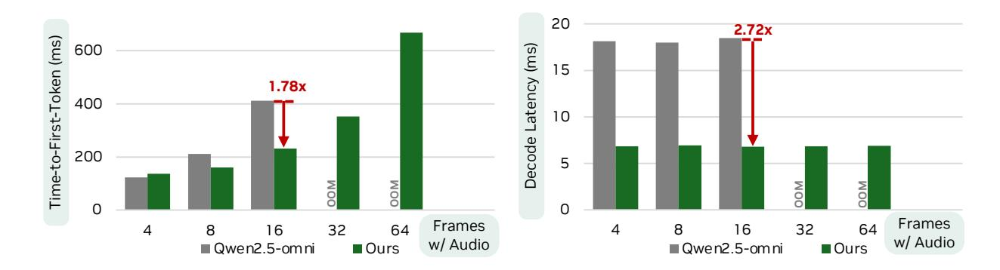

# **D.1. Audio Encoding**

**Audio Encoder Backbone.** To investigate the choice of audio representations for the omni-modal model, we evaluate two state-of-the-art audio encoders: Qwen2-Audio [\[20\]](#page-13-0) used by Qwen2.5-Omni [\[106\]](#page-18-2), and the AF-Whisper backbone [\[39\]](#page-14-0) from Audio Flamingo 3 [\[39\]](#page-14-0). This comparative analysis enables us to identify the backbone that provides the most effective encoding for downstream multimodal tasks. Specifically, we ablate these key components by aligning them with the LLM backbone model we used in audio-only training. We use 10% of the audio/speech training data to fairly evaluate the effectiveness of the two encoders under the same data budget. As shown in Table [17,](#page-29-4) AF-Whisper consistently outperforms the Qwen-2 Audio encoder backbone on audio and speech understanding tasks. Therefore, our final model architecture adopts the AF-Whisper backbone to extract informative audio features.

Table 17 | Ablation study on different Audio Encoder backbones.

| Audio Encoder       | LS-clean | LS-other | MMAU-mini | MMAU |
|---------------------|----------|----------|-----------|------|
| Qwen2-Audio         | 5.5      | 7.1      | 61.5      | 59.0 |
| AF-Whisper – chosen | 2.1      | 5.2      | 70.5      | 63.3 |

**Audio Token Compression.** For the AF-Whisper encoder, similar to Whisper-large-v3 [\[86\]](#page-17-14), the process begins by resampling the audio to a 16 kHz sampling rate, followed by transforming the raw waveform into a 128-channel mel-spectrogram using a 25 ms analysis window and a 10 ms hop interval (*i.e.*, a hop length of

Figure 14 | Data distribution of our synthetic speech-prompted multimodal conversation.

160). This yields 3,000 audio frames for a 30-second audio, which are then processed through convolutional layers and a transformer model to extract audio features, resulting in 750 sequential audio feature vectors. Therefore, each second of audio is roughly represented by 25 tokens. While this may not seem like a lot for a 30-second audio, encoding one hour of audio would require about 90,000 tokens, which could overwhelm the context length of multimodal models.

We next explore several audio information compression strategies to improve efficiency in representing audio information. In our ablation study, we fine-tune the preliminary checkpoint before large-scale training on a 2.6M audio-only dataset, referring to this configuration as the *Baseline*. We then evaluate two audio feature compression methods: (i) Applying 1-D convolution with kernel size 3 and stride 2 before audio projector, or (ii) Applying average or max pooling with kernel size 2 before audio projector. We assess performance on audio understanding benchmarks, including Librispeech, Gigaspeech, VoxPopuli, and Long Audio Bench [39] and present results in Table 18. We also report the embedding per minute of input audio and the average end-to-end latency of the LLM forward pass on Long Audio Bench for each variant in the table.

Table 18 | Downsampling method comparison for audio token compression in OmniVinci. For Librispeech, Gigaspeech, and VoxPopuli we report WER (lower is better). For Long Audio Bench we report accuracy (higher is better) and latency (lower is better). Gains are computed relative to the baseline (All audio tokens).

| Model                       | Emb./min | Librispeech-cl.              | Librispeech-oth.             | Gigaspeech                    | VoxPopuli-ASR      | Long A             | Audio               |
|-----------------------------|----------|------------------------------|------------------------------|-------------------------------|--------------------|--------------------|---------------------|
| Wodei                       | (\psi)   | WER $(\downarrow)$           | WER $(\downarrow)$           | WER $(\downarrow)$            | WER $(\downarrow)$ | Acc. $(\uparrow)$  | Lat. $(\downarrow)$ |
| Baseline - All audio tokens | 750      | 1.91                         | 4.49                         | 10.77                         | 5.89               | 41.28              | 1.78                |
| Audio Compression           | -        | -                            | -                            | -                             | -                  | -                  | -                   |
| Conv1D stride 2             | 375      | 2.10-0.19                    | $5.22_{-0.73}$               | $11.01_{-0.24}$               | $6.25_{-0.36}$     | $41.79_{\pm 0.51}$ | $1.45_{+0.33}$      |
| Avg. pooling                | 375      | <u>1.96</u> -0.05            | <b>4.75</b> -0.26 | $10.85_{-0.08}$               | $6.24_{-0.35}$     | 42.16 + 0.88       | $1.41_{\pm 0.37}$   |
| Max pooling – <b>chosen</b> | 375      | <b>1.93</b> -0.02 | <u>4.99</u> -0.50 | <b>10.78</b> -0.01 | $6.17_{-0.28}$     | $43.15_{\pm 1.87}$ | $1.40_{\pm 0.38}$   |

Figure 15 | Latency comparison between Qwen2.5-Omni and our OmniVinci model on a GeForce RTX 4090 GPU. Our model achieves 1.7× faster time-to-first-token latency and 2.72× faster decoding latency.

We observe several advantages via compression. Halving audio tokens leads to significantly shorter latency, from 1.78 sec/sample to 1.40 sec/sample (+17.7% improvement). For the long audio understanding task, applying audio token downsampling improves the accuracy by 2% as it compresses information into a more condense representative embeddings, alleviates the burden on LLMs when handling large volumes of audio embeddings. For short-form benchmarks, we study varying downsampling options, where we observe max pooling maintains performance across benchmarks without minimal accuracy degradations.

