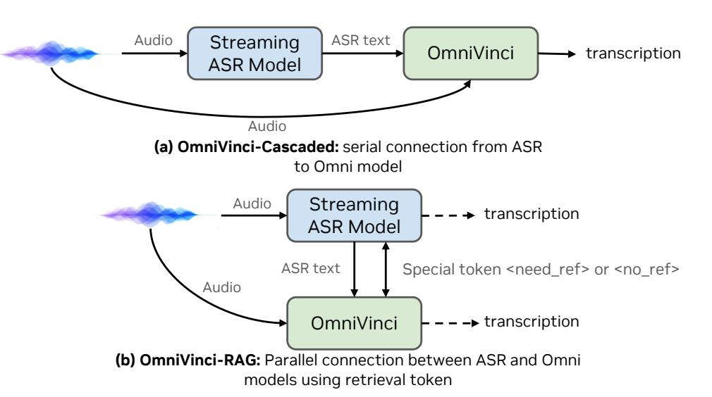

# **D.3. OmniVinci with ASR Test-Time Scaling Methods**

To push the limit of transcription accuracy, we investigate our model's ability to leverage pretrained ASR models in downstream speech understanding tasks. In a cascaded post-ASR processing setup [\[108\]](#page-18-16) as shown in Figure [16](#page-32-0) (a), speech inputs are first transcribed by the model's ASR module and then processed by LLM based generative ASR error correction. We use a popular 800M streaming variant of Whisper-v3-Turbo from SimulStreaming as the cascaded ASR module.

The results are also shown in Table [19.](#page-32-1) The cascaded pipeline yields additional improvements on ASR tasks, making it particularly beneficial in offline transcription scenarios. We use Phi-4-mm-instruct 's 5-shot [\[1\]](#page-12-1) speech modeling setup as one test-time baseline. For Qwen2.5-Omni experiment, we follow the official inference

Figure 16 | We illustrate two test-time scaling methods using an extra ASR model: (a) OmniVinci-Cascaded, using ASR history as an additional input to the Omni model with the audio inputs, and (b) OmniVinci-RAG, using the retrieval token for prediction. The related results are reported in Table 19.

script2 for the evaluation reported in the fourth row of Table 19, with the original results shown in the third row. From the extended test-time scaling results, OmniVinci-cascaded improves average WER from 6.3 to 5.7. The OmniVinci-RAG setup yields a further improvement, reducing average WER from 6.3 to 5.0 with the same model size of ASR parallel cascading by using ASR text as index for OmniVinci on mutlimodal ASR correction [66]. We introduce the retriever training details of this setup in the following section.

Table 19 | Speech Recognition WER (%) comparison of different models on speech recognition datasets.

| Model                                   | WER $(\downarrow)$             |                  |      |         |           |      |  |
|-----------------------------------------|--------------------------------|------------------|------|---------|-----------|------|--|
| Wiodei                                  | $\mathrm{LS}_{\mathrm{clean}}$ | $LS_{\rm other}$ | AMI  | Tedlium | Voxpopuli | Avg. |  |
| Phi-4-MM                                | 1.7                            | 3.8              | 11.5 | 2.9     | 5.9       | 5.2  |  |
| Phi-4-MM-in-context (5-shots)           | 1.6                            | 3.6              | 11.5 | 3.0     | 6.1       | 5.2  |  |
| Qwen2.5-omni: reported [106]            | 1.8                            | 3.4              | -    | -       | 5.8       | -    |  |
| Qwen2.5-omni: reproduced                | 2.1                            | 3.8              | 17.8 | 5.2     | 6.1       | 7.0  |  |
| OmniVinci                               | 1.7                            | 3.7              | 16.1 | 3.4     | 6.8       | 6.3  |  |
| ${\bf OmniVinci}\text{-}{\rm cascaded}$ | 1.6                            | 3.0              | 14.1 | 3.3     | 6.5       | 5.7  |  |
| OmniVinci-RAG                           | 1.5                            | 3.0              | 11.6 | 3.0     | 5.7       | 5.0  |  |

