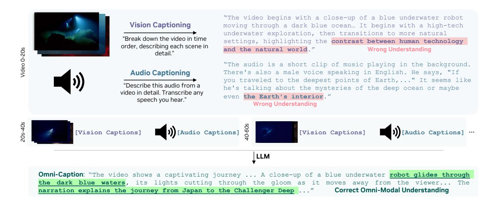

# **3.2. Omni-Modal Joint Training**

We employ two types of data in the omni-modal joint training phase: (i) modality-specific data, randomly sampled from the datasets used in the earlier vision-only and audio-only training, and (ii) omni-modal data, which contains both vision and audio inputs. For the omni-modal data, which contains both visual and audio inputs, can be further divided into two categories, *i.e.*, implicit omni-modal learning data and explicit omni-modal learning data, depending on how the omni-modal understanding ability is supervised in training.

- **(i) Implicit Learning Data.** Videos are naturally omni-modal when visual and audio streams are present simultaneously but remains under explored. We first take advantage of the existing video QA datasets to supervise the visual-audio joint understanding ability implicitly, which is underutilized in most previous video LLMs. This practice, we refer as *implicit omni-modal learning*, leads to notably improved performance in video understanding that remains under utilized by prior work.
- **(ii) Explicit Learning Data.** To obtain more direct and accurate supervision for joint visual-audio understanding ability, we further propose an omni-modal data engine to synthesize omni-modal labeling for videos with audio tracks, enabling us to conduct *explicit omni-modal learning*.

**Omni-Modal Data Engine.** The whole data engine is visualized in Figure [4.](#page-5-0) We start with synthetic audio and video captions using pretrained vision captioning model [\[118\]](#page-19-0) and audio captioning model [\[106\]](#page-18-2). We immediately observed that captions generated from either modality alone can lead to wrong understanding due to the inherent modality-specific limitations. As illustrated in Figure [4,](#page-5-0) the video is centered around deep-sea exploration. However, the vision-captioning model incorrectly interpreted it as being only about human technology, relying solely on visual cues without access to the speech in video. Conversely, the audio-captioning model wrongly labeled it as related to "Earth's interior", since it could only draw meaning from the audio track. We refer to this limitation as "*modality-specific hallucination*". To address this issue, we employ a LLM [\[107\]](#page-18-3) to correct and summarize the visual and audio captions based on information from both sides, producing a comprehensive joint caption for each 2-minute segment. From our observation, this method can help achieve correct omni-modal understanding, as shown in the example in Figure [4.](#page-5-0) Furthermore, we enhance the diversity and quality of the omni-modal data by synthesizing QA pairs with reasoning trace from the omni-modal captions using a reasoning LLM [\[44\]](#page-15-0). The resulting dataset greatly assists with learning, as

Figure 4 | Omni-modal captions generation pipeline. Video is segmented into 20-second clips. Visual and audio captions are generated independently for each segment, but lack cross-modal context and contain wrong understanding (modality-specific hallucination). A separate LLM performs cross-modal correction and summarization to create accurate omni-modal captions.

we show in experiments.

**Key Insight 1.** Captioning based solely on audio or visual is often inaccurate because of the inherent limitations of each modality. Hence, a joint captioning approach is preferred to integrate both modalities and produce comprehensive summaries across clips.

**Joint Training Data Distribution.** As shown in Figure [5,](#page-6-0) the overall training dataset contains 24 million modality-specific conversations from 150+ sub-datasets across image, video, and audio understanding tasks. Omni-modal data contributes 15%, image data constitutes the largest share at 36%, speech data represents 17% of the total, and video data forms the remaining 11%. For more details, please refer to Appendix [C.4.](#page-29-0) To enable audio-prompted ability, we convert text prompts in multimodal tasks into speech using Magpie TTS model [\[49,](#page-15-1) [79,](#page-17-6) [11\]](#page-13-1), generating omni-modal speech-visual input pairs. The questions are generated from a comprehensive collection of multimodal datasets, including general multimodal understanding, image captioning, spatial relationship reasoning and referring, chart and table interpretation, scientific figure analysis, document understanding, and multi-hop reasoning. This diverse range enables comprehensive evaluation across core vision-language capabilities such as factual grounding, reasoning over structured data, and complex multi-step inference in both scientific and general domains. See detailed distribution of speech-prompted omni QA datasets in Figure [14.](#page-30-0)

