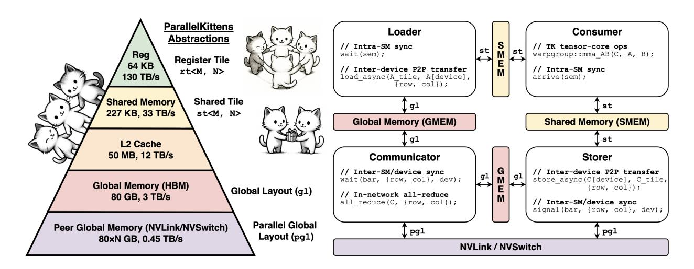
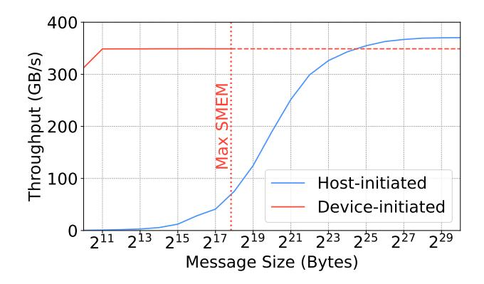
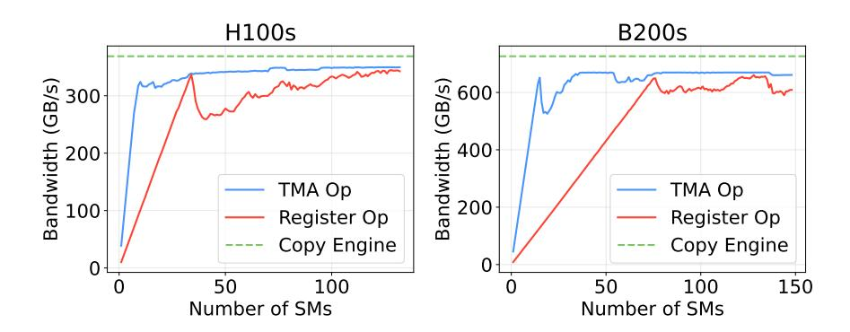
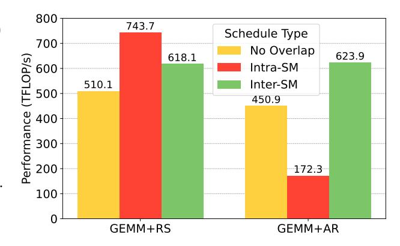
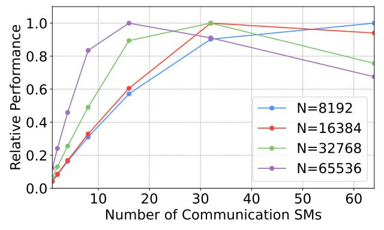
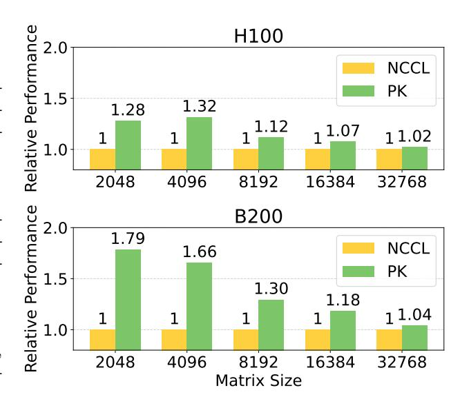

# ParallelKittens: Systematic and Practical Simplification of Multi-GPU AI Kernels

Stuart H. Sul, Simran Arora, Benjamin F. Spector, and Christopher R´e Department of Computer Science, Stanford University {ssul,simarora,bfs,chrismre}@stanford.edu

November 19, 2025

### Abstract

Inter-GPU communication has become a major bottleneck for modern AI workloads as models scale and improvements in hardware compute throughput outpace improvements in interconnect bandwidth. Existing systems mitigate this through compute-communication overlap but often fail to meet theoretical peak performance across heterogeneous workloads and new accelerators. Instead of operator-specific techniques, we ask whether a small set of simple, reusable principles can systematically guide the design of optimal multi-GPU kernels. We present ParallelKittens (PK), a minimal CUDA framework that drastically simplifies the development of overlapped multi-GPU kernels. PK extends the ThunderKittens framework and embodies the principles of multi-GPU kernel design through eight core primitives and a unified programming template, derived from a comprehensive analysis of the factors that govern multi-GPU performance—data-transfer mechanisms, resource scheduling, and design overheads. We validate PK on both Hopper and Blackwell architectures. With fewer than 50 lines of device code, PK achieves up to 2.33× speedup for data- and tensor-parallel workloads, 4.08× for sequence-parallel workloads, and 1.22× for expert-parallel workloads.

### 1 Introduction

A few years ago, GPU compute utilization was often limited by intra-GPU memory access. However, IO-aware algorithms like FlashAttention [\[4\]](#page-13-0), domain-specific languages (DSLs) that support efficient mapping of operators to hardware [\[18,](#page-15-0) [27,](#page-15-1) [29\]](#page-15-2), and the continued scaling of AI models have have left inter-GPU communication as the primary remaining bottleneck. Even with high-speed interconnects like NVLink [\[15\]](#page-15-3) and compute-friendly phases like prefill, communication can occupy over 50% of execution time in large language model (LLM) workloads, leaving GPU compute idle [\[3\]](#page-13-1). The problem is compounded by the relatively slow improvements in communication hardware: from the Nvidia A100 [\[17\]](#page-15-4) to the B200 [\[20\]](#page-15-5), BF16 tensor core performance improved by 7.2× and High Bandwidth Memory (HBM) bandwidth by 5.1×, while intra-node communication (NVLink) improved by only 3× and inter-node (PCIe/InfiniBand) by just 2×.

To mitigate communication overhead, prior methods overlap inter-GPU communication with intra-GPU computation for common operators like General Matrix Multiplication (GEMM), attention, and Mixtureof-Experts (MoE) layers [\[1,](#page-13-2) [3,](#page-13-1) [13,](#page-14-0) [31,](#page-16-0) [32,](#page-16-1) [35\]](#page-16-2). These approaches reduce non-overlapped communication time in data, tensor, sequence, and expert parallelism [\[12,](#page-14-1) [25\]](#page-15-6), which are common strategies for distributing industry-scale training and inference across many GPUs. However, prior works either (i) rely on bespoke kernels for specific AI operators and depend on complex low-level primitives (e.g., CUTLASS, NVSHMEM, Linux IPC), (ii) employ compiler-based approaches that fail to adapt to new accelerators—occasionally generating kernels slower than non-overlapped baselines—or (iii) utilize off-the-shelf libraries, resulting in up to 4.08× slower performance than hand-tuned implementations.

As hardware shifts toward unified multi-GPU systems—illustrated by Nvidia's roadmap from NVL72 to NVL144 (2026) and NVL576 (2027) [\[21\]](#page-15-7)—we would need simple, general principles and programming

Figure 1: We study the principles for high performance multi-GPU kernels and introduce ParallelKittens (PK), an opinionated collection of programming primitives to encapsulate these principles. The GPU memory hierarchy and corresponding PK abstractions are shown on the left (Section 3.2.1), and the PK program template with its key multi-GPU kernel components is shown on the right (Section 3.2.3).

primitives that enable peak-performance multi-GPU operations. In this work, we identify three key principles for designing efficient multi-GPU kernels and analyze each in detail (Section 3.1).

- 1. Transfer mechanism. Inter-GPU networking relies on three mechanisms—copy engines, tensor memory accelerators (TMA), and register-level instructions—that differ in maximum bandwidth, effective message granularity, supported functionality, and compute occupancy. Understanding these trade-offs and choosing the right mechanism is crucial for peak performance. For instance, copy engines achieve the highest efficiency (81% of theoretical maximum) but require large messages (≥ 256 MB) for saturation. TMA attains near-peak throughput (74%) with only 2 KB messages (Figure 2). Register-level instructions operate efficiently at a 128 B granularity but need about 76 streaming multiprocessors (SMs) to saturate bandwidth (70%), whereas TMA needs 15 (Figure 3). However, only register-level instructions support in-network reduction. Existing systems do not capture these trade-offs; for instance, Triton Distributed, Flux, and CUTLASS rely on the copy engine for intra-node all-gather GEMM, becoming slower than the non-overlapped baseline on smaller matrix sizes (Figure 7).
- 2. Scheduling. The distribution of compute and communication work across SMs must be chosen based on workload characteristics. We identify *inter-SM* and *intra-SM* overlapping as the two primary scheduling strategies, trading off compute utilization and communication versatility. Intra-SM overlapping is preferred when computation and communication granularities align; for example, in GEMM reduce-scatter, intra-SM overlapping outperforms inter-SM by 1.2×. In contrast, inter-SM overlapping enables communication patterns that can significantly reduce transfer size. For instance, leveraging in-network reduction through inter-SM overlapping achieves a 3.62× performance improvement for GEMM all-reduce (Figure 5) and 1.57× for all-gather GEMM. No prior work explores both scheduling strategies; existing methods either rely on a single type or omit device-side overlapping altogether, thereby failing to generalize (e.g., applying the Flux intra-SM overlapping design to GEMM all-reduce would lead to the slowdown above).
- 3. **Design overheads.** Widely used communication libraries (e.g., NCCL, NVSHMEM) encapsulate design choices—specifically in synchronization and buffering—that favor simplicity over performance. We show that the choices in prior libraries can cause over 1.7× performance loss in pure communication kernels (e.g., all-reduce) and up to 4.5× higher communication latency. By adopting a design that enables explicit user control over memory allocation and synchronization, these overheads can be substantially reduced.

Building on these insights, we introduce **ParallelKittens** (PK), an opinionated collection of C++ embedded programming primitives that extends the ThunderKittens (TK) framework [27] (Section 3.2). PK exposes only the most efficient transfer mechanisms for each functionality (e.g., TMA for point-wise communication, register operations for in-network acceleration), provides minimal synchronization primitives

and a general program template that simplifies achieving both inter- and intra-SM overlapping scheduling, and offers full control over performance-critical components (e.g., NVLink transfers) while abstracting away non-essential multi-GPU complexities (e.g., inter-process communication and virtual memory exchange).

We validate PK across diverse parallel AI workloads on both Hopper and Blackwell architectures, including data, tensor, sequence, and expert parallelism (i.e., fused parallel GEMMs, distributed attention variants, and MoEs). Compared with the strongest baselines, PK achieves up to 2.33× higher compute throughput (FLOP/s) for data- and tensor-parallel workloads, 4.08× for sequence-parallel workloads, and 1.22× for expert-parallel workloads, effectively reducing non-overlapped communication time down to 1%, 9%, and 15%, respectively. PK matches the performance of the strongest hand-optimized kernels (Flux, Comet, CUTLASS), outperforms compiler-based approaches (Triton Distributed) by 1.07–5.63×, and surpasses communication library-based approaches (xDiT, YunChang) by 1.01–4.08× across varying problem sizes.

Each PK kernel required fewer than 50 lines of additional device code beyond the original single-GPU GEMM or attention kernels. The complete implementation of PK, including its kernels, is fully open-sourced and is currently being adopted at Cursor for large-scale in-house training.

To summarize, our contributions are:

- A detailed analysis of multi-GPU programming that decomposes performance into interpretable factors (transfer mechanisms, scheduling strategies, and design overheads) and validates each with microbenchmarks.
- Parallelkittens, a minimal collection of multi-GPU primitives and a unified programming template that extends the familiar Thunderkittens framework.
- Kernels built with ParallelKittens that match or surpass hand-optimized kernel performance while substantially reducing code complexity.

### 2 Background

In this section, we provide background on modern datacenter-grade GPUs and review prior efforts on optimizing multi-GPU AI kernels.1

### 2.1 GPU Architecture

A GPU kernel loads data from HBM, performs computation, and writes the results back to HBM. Multi-GPU kernels distribute the workload across multiple GPUs and access the HBMs of all devices.

**GPU hierarchy.** GPU kernels execute tens of thousands of hardware *threads* in parallel across over a hundred *streaming multiprocessors* (SMs). Memory farther from the SM provides greater capacity at higher latency. Each SM contains 64 KB of registers private to individual threads and accessible every clock cycle. Threads are organized into *thread blocks*, each executing on a single assigned SM. Threads in a thread block communicate via 227 KB of shared memory (SMEM), a per-SM on-chip SRAM offering up to 33 TB/s of bandwidth. All threads share a 50 MB L2 cache ( $\approx$ 12 TB/s) connected to 80 GB HBM (3 TB/s). Threads can also access *peer GPU HBM* over NVLink (450 GB/s unidirectional), enabling multi-GPU kernel development.

GPU networking. Multi-GPU systems rely on a hierarchy of interconnects. *PCIe* (64 GB/s) is the channel for CPU-to-GPU (e.g., kernel launches, host-initiated transfers) and multinode communication over InfiniBand/TCP. *NVLink* (450 GB/s) provides point-to-point connections between GPUs and the NVSwitch; *NVSwitch* interconnects all NVLink endpoints into a non-blocking fabric for full GPU-to-GPU communication. NVSwitch also supports in-network, off-device acceleration for multicast and reduction. Unless otherwise noted, all inter-GPU communication in this paper occurs via NVLink/NVSwitch.

&lt;sup>1Unless otherwise specified, we use the Nvidia HGX H100 [30] platform with 8×H100 80GB SXM GPUs, 4th generation NVLink/NVSwitch, and 5th generation PCIe as our running example; however, the principles extend to other modern platforms (e.g., Blackwell architecture) and hardware vendors (e.g., AMD).

Execution overlap. GPUs contain various execution units specialized for different compute, memory, and communication operations. For compute, Tensor Cores perform tiled matrix multiplications, while CUDA Cores handle element-wise arithmetic. For memory, the Tensor Memory Accelerator (TMA) performs bulk data transfers between SMEM and HBM and can be invoked asynchronously by a single thread. Alternatively, a per-GPU copy engine (dedicated DMA unit) moves large contiguous regions of device memory independently of the SMs and is invoked from the host.

Within an SM, threads can concurrently issue instructions to different execution units. Achieving optimal performance therefore depends on effectively overlapping their use to hide non-critical operations and maximize the throughput of critical ones. We distinguish inter-SM overlapping, where entire SMs are dedicated almost exclusively to compute, memory, or communication tasks, from intra-SM overlapping, where different warps or threads within the same SM concurrently drive compute, memory, or inter-GPU traffic. These resources saturate at different rates, creating opportunities for various overlapping strategies.

### 2.2 Related Works

We are inspired by the extensive amount of work that accelerates multi-GPU AI workloads.

Operator-specific kernels. Many prior works hand-tune particular AI operators by overlapping computation and communication, e.g., TP-Async [\[9\]](#page-14-2), Flux [\[3\]](#page-13-1), Ring Attention [\[13\]](#page-14-0), DeepEP [\[5\]](#page-14-3), Comet [\[31\]](#page-16-0), FlashDMoE [\[1\]](#page-13-2), and several distributed GEMM kernels from CUTLASS [\[28\]](#page-15-8). These approaches employ techniques ranging from overlapping host-triggered copies with device kernels, to highly optimized on-device schedulers and device-initiated communication. While these systems deliver strong performance for specific targets, they demand complex implementations and offer limited reusable abstractions. For instance, FlashD-MoE is optimized only for TF32 precision, with BF16/FP16 support still under development five months after its release. In contrast, PK distills general principles applicable across diverse workloads, achieving speedups comparable to hand-optimized kernels while simplifying implementation.

Scheduling frameworks. Frameworks such as Megatron-LM [\[25\]](#page-15-6), FlexFlow [\[11\]](#page-14-4), and NanoFlow [\[37\]](#page-16-4) automate parallelization and scheduling, and are complementary to PK. These systems primarily orchestrate bulk collective operations (e.g., NCCL), which require synchronization before and after data transfers, and employ stream-level overlap. NanoFlow offers finer-grained scheduling by partitioning SMs among compute, memory, and network operations to saturate available bandwidth without full occupancy (i.e., inter-SM overlapping). However, achieving peak kernel performance also requires intra-SM warp specialization with device-initiated, tile-level transfers; PK provides that layer.

Multi-GPU programming primitives. DSLs and libraries have been proposed to simplify multi-GPU kernel development [\[2,](#page-13-3) [8,](#page-14-5) [16,](#page-15-9) [22,](#page-15-10) [35\]](#page-16-2). Triton Distributed [\[35\]](#page-16-2) and TileLink [\[36\]](#page-16-5) extend Triton [\[29\]](#page-15-2) with OpenSHMEM-style one-sided operations, enabling compiler-based generation of multi-GPU kernels. However, these approaches lack explicit workload distribution control (e.g., warp or SM specialization) needed for optimal overlap. Also, our benchmarks show that Triton Distributed, originally tuned for H800 GPUs, fails to adapt efficiently to other architectures such as H100s (Section [4\)](#page-9-1). In contrast, PK provides a lightweight C++ layer that enables direct control over communication workload distribution, enabling arbitrary scheduling and optimization across Hopper and Blackwell GPUs. NCCLX [\[26\]](#page-15-11) complements PK by accelerating inter-node collectives for large clusters (≥ 100k GPUs), but does not exploit device-initiated asynchronous overlapping (via TMA) or in-network acceleration, both critical for fine-grained overlap with peak bandwidth utilization.

### 3 ParallelKittens

We present our analysis of the design tradeoffs of multi-GPU kernels and present ParallelKittens.

### 3.1 Analysis

We start with a general, high-level cost model that provides a roadmap for the analysis.

### 3.1.1 Cost Model

The objective of designing a multi-GPU kernel is to minimize its total wall-clock time Tkernel, which reflects the combined cost of compute, memory, and communication operations. The key contributors include:

$$T_{\text{kernel}} = T_{\text{launch}} + \max(T_{\text{comp}}, T_{\text{mem}}, T_{\text{comm}}) + T_{\text{non-overlap}} + T_{\text{sync}}$$

In this simple model, Tlaunch denotes the per-kernel launch cost, including host-side latency and per-thread block setup and teardown (e.g., tensor memory allocation and pipeline fill/drain phases). Tcomp, Tmem, and Tcomm represent the full-pipeline time spent on computation, memory access, and communication, respectively. Ideally, these components overlap so that the total time equals the maximum of the three, but Tnon-overlap accounts for operations that cannot be overlapped. The cost of each component (e.g., Tcomm) depends on the work size (Scomm) and achievable bandwidth (Bcomm), i.e., Tcomm = Scomm/Bcomm. Finally, Tsync captures the synchronization overhead across SMs or devices.

These costs are controlled by three design decisions: first, the specific transfer mechanism that we select to move data between GPUs (Section [3.1.2\)](#page-4-0); second, the kernel scheduling strategy for overlapping computation and communication (Section [3.1.3\)](#page-5-1); and third, the communication abstraction's design choices, including peer-memory allocation, management, and access (Section [3.1.4\)](#page-7-1).

### 3.1.2 Transfer Mechanism

We now discuss the choice of communication mechanism.

### Host versus device-initiated communication. The per-GPU copy engine is host-initiated and sup-

ports only contiguous memory transfers. As shown in Table [1,](#page-4-1) it achieves the highest throughput for large, all-at-once data movements. However, when fine-grained communication is required (e.g., all-toall communication in MoEs), performance degrades significantly because additional overhead is incurred for data rearrangement or repeated transfer invocations. Figure [2](#page-5-0) illustrates this behavior. To sustain over 80% bandwidth utilization, the transfer granu-

Table 1: The observed NVLink bandwidth utilization (GB/s) when using all SMs to transfer 1GB of data, and its ratio to the theoretical maximum (450 GB/s for H100s, 900 GB/s for B200s).

| Method      | H100 BW (Ratio) | B200 BW (Ratio) |
|-------------|-----------------|-----------------|
| Copy Engine | 368.82 (82%)    | 726.13 (81%)    |
| TMA Op      | 350.01 (78%)    | 669.12 (74%)    |
| Register Op | 342.68 (76%)    | 628.35 (70%)    |

larity must be at least 256 MB when using the copy engine, whereas device-side methods achieve comparable utilization with only 2 KB.

Consequently, PK relies exclusively on device-side communication for the following reasons. First, hostinitiated transfers are suitable primarily for large contiguous data blocks (e.g., weight movements in fully sharded data parallelism [\[33\]](#page-16-6)). In such cases, overlapping computation and communication is often trivial: the host transfer and device kernel can be launched on separate streams without kernel modifications. Second, although the copy engine has the advantage of not occupying SM resources, only a small number of SMs are needed to saturate the interconnect bandwidth using device-initiated communication, as shown in Figure [3.](#page-6-0) Moreover, intra-SM overlapping enables computation to proceed concurrently with that communication.

Device-initiated communication mechanisms. There are two main mechanisms for device-initiated communication in modern datacenter-grade GPUs:

- 1. The first is via the Tensor Memory Accelerator (TMA), which supports NVLink transfers and NVSwitchaccelerated broadcasts. A key advantage of TMA is that it can be launched asynchronously by a single thread without increasing register pressure, allowing other threads in the same SM to overlap the execution of compute or memory work (intra-SM overlap).
- 2. The second is via plain register-level instructions (e.g., ld, st). As shown in Table [1,](#page-4-1) they are relatively inefficient, achieving about 70% of the peak bandwidth on B200 GPUs. Because these instructions are

Figure 2: Observed memory bandwidth utilization for a 1 GB peer-to-peer transfer over NVLink. For device-initiated (TMA) transfers, the maximum supported message size is 227 KB; throughput values beyond this limit are held constant for visual comparison.

synchronous and operate at the register level, saturating NVLink bandwidth requires full SM occupancy—thousands of threads issuing instructions concurrently—as well as higher register pressure and manual memory coalescing.

We find that these mechanisms excel in different scenarios. As illustrated in Figure 3, register-level operations require 3.2–5.1× more SMs than TMA to saturate NVLink bandwidth, leaving little opportunity for intra-SM overlap. Register instructions are therefore useful when neither the copy engine nor TMA provides the required functionality. A representative case is NVSwitch in-network reduction (e.g., multimem.ld\_reduce and multimem.red), which can substantially speed up workloads like all-reduce. Existing communication libraries do not

Table 2: Different multi-GPU transfer mechanisms (copy engine, TMA, and register operations) and supported functionalities.

| FUNCTIONALITY        | CE           | TMA          | Reg          |
|----------------------|--------------|--------------|--------------|
| P2P Transfer         | ✓            | ✓            | ✓            |
| In-fabric Broadcast  | $\checkmark$ | $\checkmark$ | $\checkmark$ |
| P2P REDUCTION        | ×            | $\checkmark$ | $\checkmark$ |
| In-fabric Reduction  | ×            | ×            | $\checkmark$ |
| Elementwise Transfer | ×            | ×            | $\checkmark$ |
|                      |              |              |              |

exploit this design space; for instance, NVSHMEM relies exclusively on register-level operations for intra-node data transfers. Table 2 summarizes the functionalities supported by each mechanism.

### 3.1.3 Scheduling

We now examine workload scheduling strategies for multi-GPU kernels. There are two main ways to overlap compute and communication within a kernel:

- 1. *Intra-SM* overlapping partitions the threads within an SM into two pools: one issuing compute/memory instructions and the other issuing communication instructions.
- $2.\ Inter-SM$  overlapping partitions the SMs into two pools: one for computation and the other for communication.

While prior work primarily uses inter-SM overlapping [31, 37], we find that each provides different compute-communication trade-offs depending on workload characteristics.2

**Intra-SM overlapping.** Intra-SM overlapping is effective when the ideal communication pattern aligns with that of computation, allowing communication to be naturally embedded within the computation pipeline. In such cases, it is superior to inter-SM overlapping for two main reasons:

1. Unlike in inter-SM overlapping, all compute units (i.e., tensor cores) across all SMs are busy in an intra-SM overlapping scheme. This is crucial because, unlike communication bandwidth, compute throughput scales linearly with the number of SMs that perform computation.

&lt;sup>2The focus on inter-SM overlap in prior work is largely due to pre-Hopper architecture limitations, which lacked single-thread bulk asynchronous transfers and therefore required entire warps or thread blocks to participate, increasing register pressure.

Figure 3: The number of SMs it takes to saturate NVLink Bandwidth, using different communication mechanisms.

2. Inter-SM communication incurs additional synchronization overhead  $T_{\rm sync}$ , as it must traverse the HBM. Our microbenchmarks show that a single intra-SM synchronization using mbarrier objects incurs approximately 64 ns of latency, whereas inter-SM synchronization through the HBM takes about 832 ns.

We illustrate these effects using a kernel that fuses a GEMM with a reduce-scatter (RS). Figure 4 (left) shows that the GEMM+RS kernel achieves higher compute throughput under an intra-SM overlapping schedule, due to higher compute utilization and lower synchronization overhead.

We further show that intra-SM overlapping can almost completely hide communication overhead in certain regimes. Consider an  $M \times N \times K$  GEMM+RS fused kernel with per-iteration tiles of size  $m \times n \times k$  In a typical GEMM kernel, an output tile region is selected, and the  $m \times n \times k$  sub-GEMM is executed K/k times before the result is stored.

Given the per-element size s, sustained tensor core throughput R (in FLOP/s), and per-GPU NVLink bandwidth B (in bytes/s), the compute and communication times for producing a single output tile of size  $m \times n$  are given by:

Figure 4: GEMM reduce-scatter (RS) and all-reduce (AR) performance across overlapping schedules. Measured on  $8 \times H100$  GPUs with local GEMM shape  $N \times N \times N/8$  (N = 32768) and element type BF16.

$$T_{\text{comp\_tile}} = \frac{2mnk}{R} \times \frac{K}{k} = \frac{2mnK}{R}$$
 
$$T_{\text{comm\_tile}} = \frac{smn}{B}$$

From this, communication can be completely hidden by computation when  $T_{\text{comp-tile}} \geq T_{\text{comm-tile}}$ , i.e.,

$$K \ge \frac{sR}{2B}$$

For BF16 GEMM on H100 GPUs, s=2,  $R=989\times 10^{12}$ , and  $B=450\times 10^{9}$ , implying that communication is hidden when  $K\gtrsim 2197$ . We verify this empirically in Table 3, where we ablate our fused GEMM+RS kernel against a standalone GEMM kernel. The results show that at K=2048, the non-overlapped communication ratio drops by roughly half, and beyond that, communication becomes nearly fully hidden. The residual communication time near K=2048 arises from atomic additions required for output tile accumulation, which prevent complete overlap.

| Table 3: Measured BF16 GEMM and C | GEMM+RS performance | (ms). |
|-----------------------------------|---------------------|-------|
|-----------------------------------|---------------------|-------|

| M&N   | K    | GEMM   | GEMM+RS | COMM RATIO  |
|-------|------|--------|---------|-------------|
| 32768 | 512  | 2.071  | 6.483   | 68%         |
| 32768 | 1024 | 2.918  | 6.613   | <b>56</b> % |
| 32768 | 2048 | 5.567  | 7.531   | 26%         |
| 32768 | 4096 | 11.78  | 11.828  | <1 $%$      |
| 32768 | 8192 | 23.285 | 25.325  | 8%          |

Inter-SM overlapping. While intra-SM overlapping fully utilizes GPU compute, it constrains communication to follow the computation pattern. This leads to two potential drawbacks: the inability to exploit in-network acceleration and suboptimal L2 caching behavior. Inter-SM overlapping mitigates these issues but introduces a partitioning trade-off: deciding how many SMs to allocate to communication versus computation.

In-network acceleration. Recent networking hardware integrates compute directly into the interconnect fabric, enabling in-network reductions and collective offload within switches and link controllers [19, 23] This transforms the interconnect from a passive data mover into an active participant in collectives. For communication-heavy kernels such as fused GEMM all-reduce (AR), in-network reduction can significantly reduce bandwidth usage. However, performing it within the same SM is impractical due to register pressure, limited occupancy, and inter-GPU synchronization costs. A more effective approach is to accumulate partial results in HBM, signal completion after each local write, and delegate a few specialized SMs to execute a single in-network all-reduce once all devices finish.

This tradeoff is shown in Figure 4 (right). Intra-SM overlapping issues N atomic writes to N destinations for each output tile, where N is the number of GPUs. Even with a fully interconnected NVSwitch fabric, each GPU is limited by its 450 GB/s per-port bandwidth, causing concurrent peer writes to serialize at the destination. Inter-SM overlapping reduces  $T_{\text{comm}}$  by roughly a factor of N, typically outweighing the cost of dedicating a few SMs to communication.

Remote cache reuse. Another limitation of intra-SM overlapping arises from the far-sided nature of L2 caching for peer HBM accesses. Data fetched from a peer GPU is cached only on the source device, not on the requester. Consequently, every remote access is bottlenecked by NVLink bandwidth. A representative case appears in Ring Attention [13], where key and value (KV) tensors are reused across multiple attention blocks. Letting each thread block independently load them from remote GPUs leads to redundant transfers and rapid interconnect saturation. Instead, performing bulk transfers of the next block's K and V tensors to local HBM using communication-dedicated SMs, while the remaining SMs compute, substantially reduces  $T_{\text{comm}}$  and improves L2 reuse, as shown in Section 4.2.

Figure 5: Comparison of different inter-SM scheduling performance on all-gather (AG) GEMM  $(N \times N/8 \times N)$ .

*SM partitioning.* Inter-SM overlapping requires balancing SMs between communication and computation. As shown in Figure 5, the optimal split depends on input size: larger workloads favor more compute SMs, while smaller ones need proportionally more SMs for communication. PK allows users to automatically search for the optimal SM allocation at runtime through a unified program template.

### 3.1.4 Minimizing design overheads

Ideally, abstractions should preserve the developer's ability to achieve peak hardware performance. In practice, however, certain design choices in widely used communication libraries like NCCL and NVSHMEM—particularly in synchronization and buffering—constrain this ability.

Two-way synchronization and intermediate **buffering.** Many multi-GPU communication libraries impose synchronization and buffering constraints. For example, NCCL enforces two-way synchronization for every operation: both sender and receiver must be ready and acknowledge each other before data transfer begins, even for point-to-point communication. In addition, to reduce peer memory exchange overhead, NCCL employs small preallocated intermediate buffers (communication channels), introducing extra data movement. While such overheads are masked for large inputs, they become significant in fine-grained communication. PK avoids these issues by using pre-allocated destination buffers. enabling direct, one-way transfers without intermediate staging. As shown in Figure 6, this design improves the performance of pure communication kernels such as all-reduce by up to  $1.79\times$ .

Figure 6: All-reduce sum kernel comparison (BF16).

**Peer-memory access and synchronization.** NVSHMEM, the de facto low-level standard for multi-GPU communication, also introduces additional overhead in its public API functions. Each remote peer access performs a global memory load (\_\_ldg) to retrieve the peer address and enforces a group synchronization (e.g., \_\_syncthreads). By keeping peer addresses in registers and removing unnecessary synchronizations, PK eliminates these costs, achieving up to 4.5× lower element-wise NVLink access latency and about 20 GB/s higher bandwidth utilization.

### 3.2 Abstractions

We introduce Parallel Kittens (PK), a collection of abstractions that generalizes the tile-based programming principles proposed in Thunder Kittens—and successor systems such as CuTe DSL and TileLang—to the multi-GPU setting. PK provides a minimal and complementary set of primitives for efficient multi-GPU communication. These abstractions expose high-performance communication mechanisms, enable the work-load scheduling patterns described earlier, and minimize performance overheads by design. PK hides low-level complexity that does not impact performance, while preserving full user control through its CUDA/C++ embedded design.

#### 3.2.1 Data Structure

PK defines a data structure for each level of the GPU memory hierarchy, as illustrated in Figure 1 (left). At the register level, the minimum unit of execution is a 16 × 16 tile, consistent with the original TK design. At the shared memory level, users operate on shared tiles that enable asynchronous, tile-granularity loads from and stores to peer HBM by a single thread. Store operations optionally support atomic reductions on peer memory and multicast to multiple devices via in-network broadcast. These operations preserve tensor-core–friendly layouts to remain efficient within local compute pipelines. At the HBM level, PARALLELKITTENS introduces the Parallel Global Layout (PGL), which represents identically shaped and sized memory regions allocated across all devices. PGL serves as the central data structure enabling asynchronous P2P transfers, broadcasts, and synchronous in-fabric multicasts and reductions over tile-indexed regions. All data abstractions enforce essential principles such as coalesced interconnect access, swizzling to minimize bank conflicts and match tensor-core layouts, and fully device-initiated communication.

#### 3.2.2 Multi-GPU Operations

We introduce eight new primitives, which suffice to implement all kernels demonstrated in Section 4. The original ThunderKittens operators are also extended to remain fully compatible with the aforementioned data structures.

### P2P communication primitives

- store async(dst, src, coord) // Store a shared tile to multicast memory.
- store add async(dst, src, coord) // Atomically add a shared tile to multicast memory.

### Network-accelerated communication primitives

- reduce(dst, dst coord, src, src coord) // Reduce data from multicast memory to local HBM.
- all reduce(dst and src, coord) // Reduce data from multicast memory and write back to it.

### Inter-device and inter-SM synchronization primitives

- signal(bar, coord, dev idx, val) // Signal a specific device's barrier.
- signal all(bar, coord, val) // Signal all devices' barriers simultaneously.
- wait(bar, coord, dev idx, expected) // Wait until a device's barrier reaches a value.
- barrier(bar, coord, dev idx) // Wait for all devices to reach this point.

Because all PK data structures are tile-based, the new primitives also operate at tile granularity, ranging from 16 × 16 (the minimum tile) up to the shared-memory limit (about 256 × 256). All operations are device-initiated and use coordinates (coord) represented as int4 values specifying tile indices in local or remote HBM. P2P primitives are asynchronous and single-threaded, enabling fusion with other operations (e.g., tensor-core compute), whereas network-accelerated primitives require at least warp-level participation for optimal throughput. Synchronization primitives provide simple signaling and waiting mechanisms, enabling users to design arbitrary workload scheduling schemes. A complete API description is provided in Appendix [C.](#page-19-0)

### 3.2.3 Program Template

We provide a unified program template for implementing a wide range of multi-GPU kernels. As shown in Figure [1](#page-1-0) (right), the template defines four worker components—loader, storer, consumer, and communicator each encapsulating a common warp/SM specialization. The loader performs local or peer HBM reads, while the storer handles local or peer HBM writes. When either component accesses peer HBM, intra-SM overlapping is employed. The communicator occupies one or more SMs exclusively to perform dedicated communication, enabling inter-SM overlapping. Finally, the consumer issues tensor- or CUDA-core–based local compute. Beyond providing a structural pattern, the template automates common low-level tasks, including kernel configuration, shared memory and TMA setup, barrier and synchronization management, and tuning for optimal SM/warp partitioning. This allows users to focus solely on the per-tile compute and communication logic. A detailed description of the template and an example kernel are provided in Appendix [D.](#page-22-0)

### 3.2.4 Utilities

We provide inter-process communication (IPC) and PyTorch utilities for seamless integration with multiprocess execution (e.g., via torchrun). These utilities manage low-level OS driver interactions and support pre-allocation of multi-GPU memory, enabling direct P2P communication without intermediate staging overheads. Appendices [E](#page-23-0) and [F](#page-25-0) provide further implementation details.

