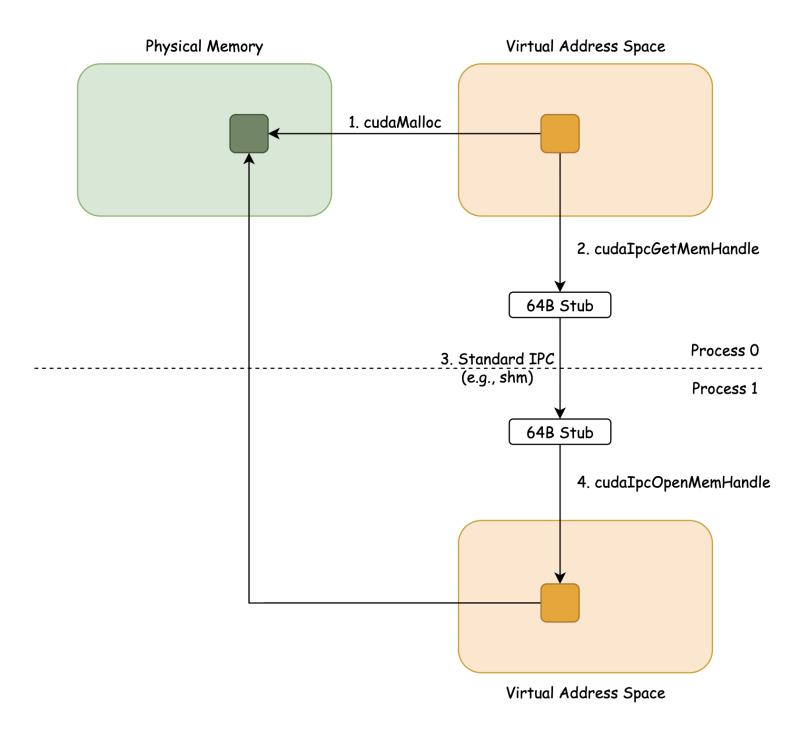
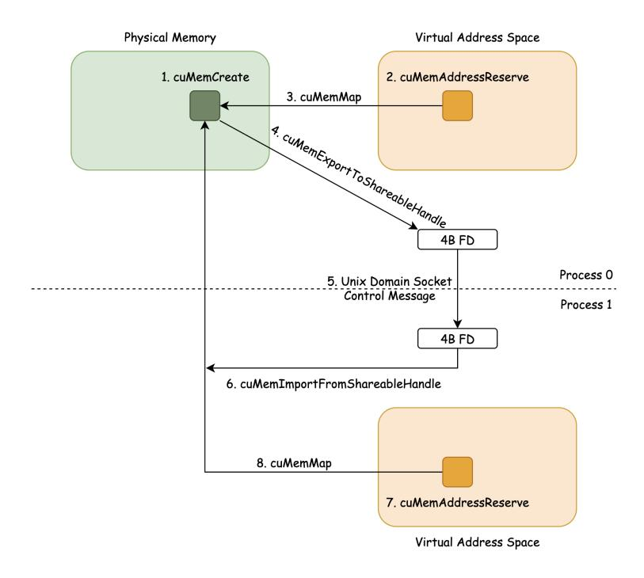

# E Multi-GPU Memory Setup Process

We describe the low-level multi-GPU memory setup process, a major complexity in multi-GPU programming, which PK abstracts away from programmers.

Figure 19: CUDA IPC flow.

The basic requirement of multi-GPU programming is that kernels must be able to access memory (HBM) on peer devices. To enable this, we need to create a new mapping in the current device's virtual address space that points to the peer device's physical memory. After such, the kernel can simply dereference the address, and the NVLink and NVSwitch fabric handle the underlying transfer.

There are three ways to create such mappings: (1) CUDA Unified Virtual Addressing, (2) CUDA Inter-Process Communication, and (3) manual Virtual Memory Management.

### E.1 CUDA Unified Virtual Addressing (UVA)

UVA provides a single unified virtual address space across GPUs, but with the limitation that it applies only within a single process. That is, if we avoid using multiple processes altogether, there exists no heterogeneous virtual address spaces.

However, we note that modern production distributed training and inference are built around a multiprocessing model. Distributed runners like torchrun assume 1 GPU device per rank (process), and working around this is quite complicated. Thus, multi-processing is the preferred model of launching multi-GPU workloads, which brings us to the next two methods.

### E.2 CUDA Inter-Process Communication (IPC)

Calling cudaIpcGetMemHandle on the address in the current virtual address space returns a 64-byte stub that can be shared across processes through standard IPC mechanisms like shared memory or Unix domain sockets. The receiving process then can call cudaIpcOpenMemHandle, which maps the given stub into its own address space. Figure [19](#page-24-0) visualizes this flow.

While this method is straightforward and works on pre-allocated device memory (e.g., existing PyTorch tensors), its drawback is that it cannot use the NVSwitch accelerator for faster reduction and broadcast operations.

Figure 20: CUDA VMM flow.

### E.3 Manual Virtual Memory Management (VMM)

For VMM, we start by manually allocating the GPU physical memory with cuMemCreate. This allows setting the CU MEM HANDLE TYPE POSIX FILE DESCRIPTOR property on this physical memory, which then lets us export the physical memory reference as a Linux file descriptor by calling cuMemExportToShareableHandle.

Because file descriptors are tied to a specific process in Linux, they cannot be shared directly. The standard way to transfer a file descriptor in Linux is to send it as a control message over a Unix domain socket. Once we send the file descriptor over to the destination process, it can then import the physical memory reference using cuMemImportFromShareableHandle and map it into its own virtual address space using the VMM API. The overall flow is illustrated in Figure [20.](#page-25-1)

A downside of this approach is that the given memory must be allocated with VMM and is subject to size granularity requirements, typically at 2MB for H100s and B200s. As a result, a PyTorch-allocated tensor, which is usually allocated by the standard cudaMalloc without size alignment, cannot be shared directly across processes. Instead, we need a custom tensor class that manages device memory allocation and deallocation with custom VMM logic. The main advantage, however, is that this method enables the use of NVSwitch in-network accelerators.

