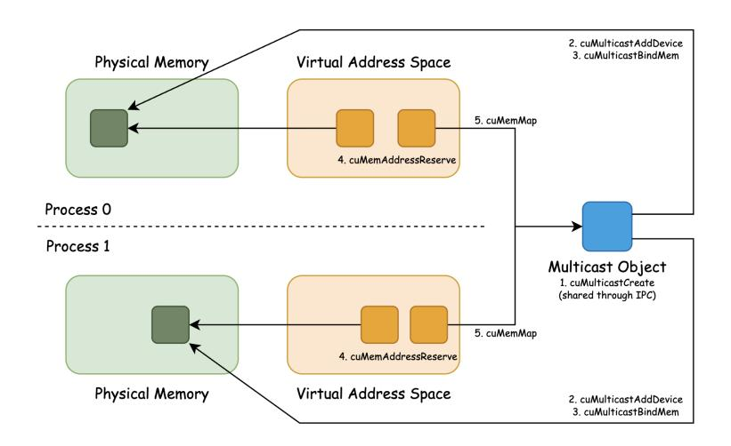
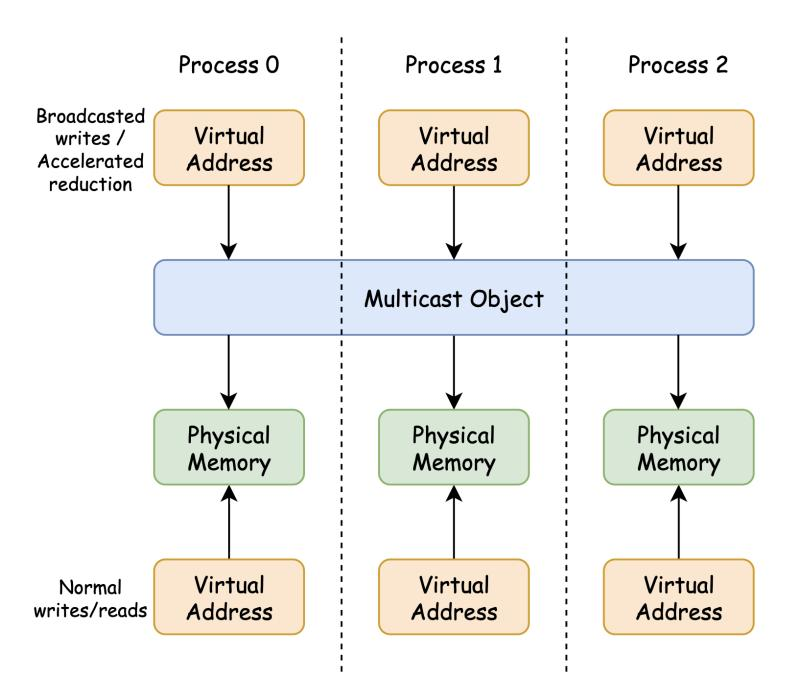

# F In-network Acceleration Setup Process

In order to utilize NVSwitch acceleration, we first allocate local memory on each participating device with VMM. Then we create a multicast object, which is an abstraction over multiple physical locations in multiple devices. To do this, we create a 8-byte stub that represents the multicast object with cuMulticastCreate, register all devices as participants, and map each device's physical memory region to it.

A multicast object behaves just like VMM-allocated physical memory: we can share it with other processes and map a virtual address to it using the same mechanism described in the VMM setup process. That is, we export the multicast object as a POSIX file descriptor, open them on each device, and map them into each process's virtual address space. The overall setup process and the exact names of the CUDA functions called are shown in Figure [21.](#page-26-0)

After completing the above, each process has two addresses: one mapping to the current device's physical

Figure 21: CUDA multicast object creation process.

memory (local address) and another mapping to the multicast object (multicast address). Writing to and reading from the local address is a standard global memory access. Writing to the multicast address triggers a broadcast across all participating devices, multicasted in the NVSwitch fabric. Reading from the multicast address causes undefined behavior. Finally, in-fabric reduction operations can be invoked on the multicast address using the PTX instructions multimem.red and multimem.ld reduce. This is illustrated in Figure [22.](#page-26-1)

Figure 22: CUDA multicast object hierarchy.