# 4 Experiments

We demonstrate that PK generalizes across a diverse range of multi-GPU AI workloads by implementing representative kernels with its abstractions and comparing them against existing frameworks and handoptimized baselines.

All experiments were conducted using 8×Nvidia H100 80GB SXM GPUs, interconnected via 4th-generation NVLink and NVSwitch, using CUDA 12.6 and PyTorch 2.8.0. All matrix multiplications use BF16 as the element type and FP32 as the tensor core accumulator type. For brevity, we denote the GEMM shape as

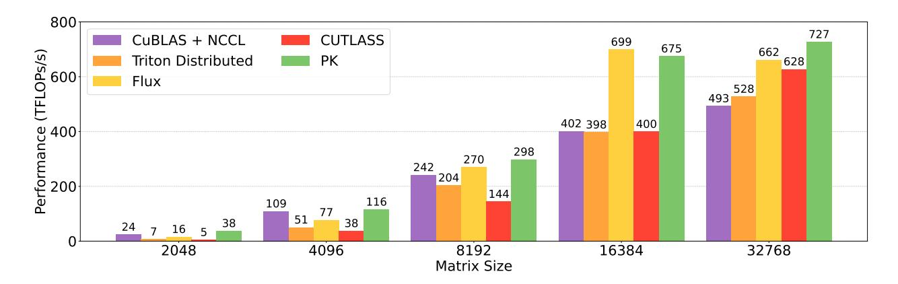

Figure 7: AG + GEMM performance. Local GEMM size is  $N \times N/8 \times N$ , with N given in the X-axis.

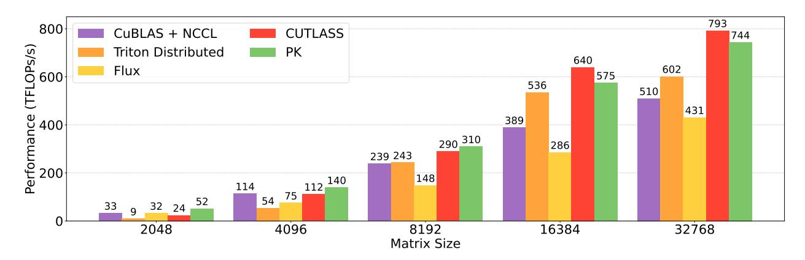

Figure 8: GEMM + RS performance. Local GEMM size is  $N \times N \times N/8$ , with N given in the X-axis.

 $M \times N \times K$ , where the first operand has dimensions  $M \times K$  and the second has dimensions  $K \times N$ . We report the observed average compute throughput.

Although the experiments in this section use H100 GPUs, PK is fully compatible with B200 GPUs and exhibits similar performance characteristics. We present results on Blackwell GPUs in Appendices A and B.

### 4.1 Data and Tensor Parallelism

To efficiently scale large models, weights are often sharded across multiple devices using tensor parallelism [25, 34], which partitions weight matrices along the row or column dimension. A common strategy combines this with data parallelism [14]: inputs sharded by rows are first all-gathered (AG), followed by a GEMM with column-sharded weights, a non-linear activation, and a second GEMM with row-sharded weights, after which a reduce-scatter (RS) or all-reduce (AR) is applied. Communication and computation are overlapped by pairing AG with the first GEMM (AG+GEMM) and RS or AR with the second (GEMM+RS, GEMM+AR).

For these workloads, we compare against the cuBLAS GEMM combined with NCCL as the non-overlapped baseline, compiler-based approaches (Triton Distributed), and hand-optimized kernels (Flux and CUTLASS). Flux and CUTLASS do not provide GEMM–AR kernels and are therefore omitted in those cases. Figures 7, 8, and 9 show the results. Overall, PK achieves a  $1.06-1.68\times$  speedup over the non-overlapped baseline and outperforms compiler-based approaches by  $1.07-5.63\times$ . Compared to hand-optimized kernels, PK matches or surpasses their performance, achieving  $0.97-2.33\times$  speedup over Flux and  $0.90-7.39\times$  over CUTLASS. We also note that AG+GEMM and GEMM+RS are often used back-to-back in practice, and no single baseline outperforms PK when both are combined.

We further observe that compiler-based approaches can exhibit inconsistent performance across diverse hardware platforms. For instance, Triton Distributed, originally developed for H800 GPUs, sometimes

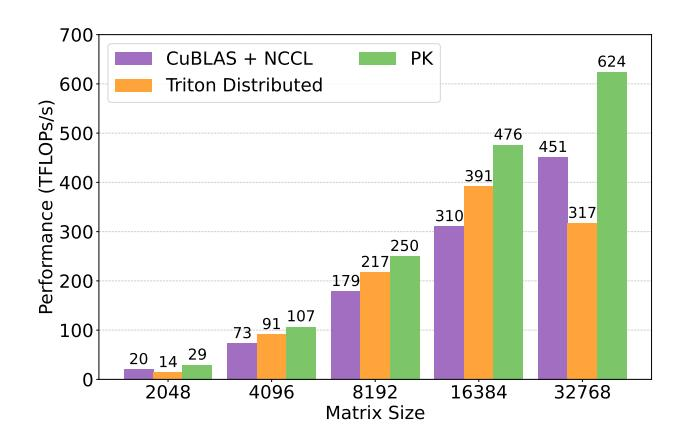

Figure 9: GEMM + AR performance. Local GEMM size is  $N \times N \times N/8$ , with N given in the X-axis.

performs below the non-overlapped baseline on H100s. Hand-tuned kernels also show reduced efficiency on certain problem shapes.

Under sufficiently large reduction axes, the non-overlapped portion of communication time in PK falls below 1%. The communication component of our kernels (excluding GEMM) is implemented in fewer than 50 lines of device code, using the primitives introduced in Section 3.2.

### 4.2 Sequence Parallelism

Modern AI workloads increasingly involve inputs with long sequence lengths, requiring a single sequence to be distributed across multiple devices. While sharding along the sequence dimension has minimal impact on MLP or MoE layers, attention layers require each token to attend to all others within the same sequence. This necessitates sequence-parallel approaches such as Ring Attention [13] and DeepSpeed-Ulysses [10]. In our evaluation, we compare against the state-of-the-art implementations: xDiT [7] for Ring Attention and YunChang [6] for DeepSpeed-Ulysses.

Ring Attention. In Ring Attention, key-value (KV) tensors are partitioned across devices, with each GPU computing blockwise attention on its local shard while concurrently transmitting it to a peer. The baseline xDiT implementation overlaps computation and KV exchange coarsely by launching NCCL P2P sends and FlashAttention-3 kernels on separate CUDA streams. In contrast, PK can fuse these into a single kernel with explicit inter-SM overlap, precisely allocating SMs between computation and communication, deciding how they synchronize, and auto-tuning this partitioning for optimal performance. As shown in Figure 10, this

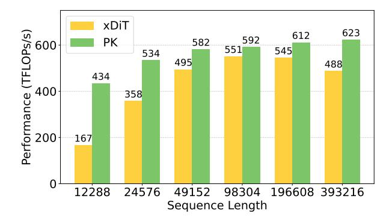

Figure 10: Ring Attention performance across sequence lengths (B = 16, H = 16, D = 128).

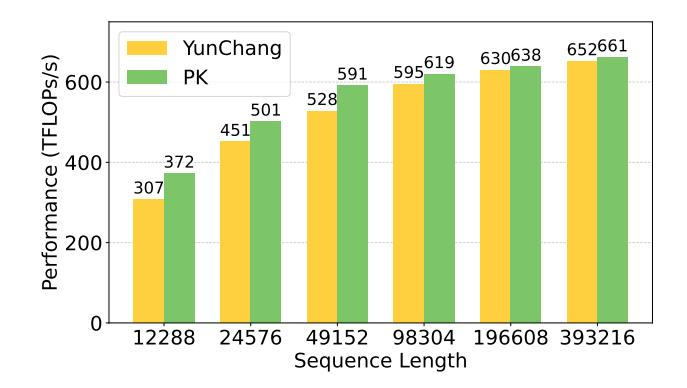

Figure 11: DeepSpeed-Ulysses attention layer performance across sequence lengths (B = 16, H = 128, D = 128).

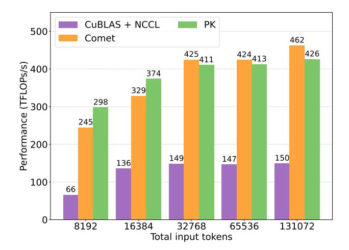

Figure 12: Expert-parallel token dispatch + GEMM performance (TopK = 8,  $N_{\text{experts}} = 256$ , H = 7168,  $H_{\text{expert}} = 2048$ ).

yields a  $1.07 \times -4.08 \times$  speedup over the baseline—evaluated at total sequence lengths (shown on the X-axis)3 evenly partitioned across 8 devices—and reduces the non-overlapped communication fraction down to 9%.

**DeepSpeed-Ulysses.** In DeepSpeed-Ulysses, an all-to-all exchange occurs before and after self-attention. Everything except self-attention is sequence-sharded, while self-attention remains head-sharded. The main bottleneck is the fine-grained all-to-all; as NCCL does not natively support this along the inner dimension, the baseline relies on tensor reshaping before and after communication. Using PK, we implement a fine-grained all-to-all kernel that removes this overhead. As shown in Figure 11, this yields a  $1.01 \times -1.39 \times$  speedup, evaluated at total sequence lengths (shown on the X-axis) evenly split across 8 devices. The complete kernel remains under 50 lines of device code.

### 4.3 Expert Parallelism

To scale architectures with MoE layers [24], multiple experts are distributed evenly across devices, a strategy known as expert parallelism. However, this approach requires costly scattering and gathering of tokens before and after the expert MLP layers. Several approaches mitigate this by overlapping token communication with GEMM computation [1, 31, 32]. We compare against COMET [31], the state-of-the-art fine-grained

&lt;sup>3Sequence lengths are intentionally set as multiples of 768 because this is required by the original TK attention forward kernel.

overlapping strategy for expert parallelism. For demonstration, we evaluate the first half of the MoE layer: overlapping token dispatch with the first expert MLP. As shown in Figure [12,](#page-12-2) where the total set of input tokens (shown on the X-axis) is initially partitioned evenly across devices, PK matches or surpasses the hand-tuned baseline, achieving 0.92–1.22× the performance of Comet, with fewer than 40 lines of device code added to a grouped GEMM kernel.

## 5 Conclusion

This work presents ParallelKittens, a minimal and systematic framework for building high-performance multi-GPU kernels. By formalizing the design space through three key principles—transfer mechanisms, scheduling strategies, and design overheads—we demonstrate that a small set of primitives can match or surpass the performance of hand-optimized kernels while greatly simplifying implementation. As this work focuses on intra-node execution, extending these abstractions to inter-node communication remains an important direction for future work. At the same time, intra-node systems are rapidly scaling, as shown by Nvidia's NVL72 and upcoming NVL144, NVL576 architectures, which makes the study of efficient intra-node kernel design increasingly critical for distributed AI workloads.

Our framework and kernels are open sourced at: <https://github.com/HazyResearch/ThunderKittens>.

### Acknowledgements

We are grateful to Cursor and Together AI for making this work possible. We thank Dylan Lim for his assistance with the initial implementation of PGL operations. We thank Yasa Baig, Kelly Buchanan, Francois Chaubard, Mayee Chen, Catherine Deng, Andy Dimnaku, Owen Dugan, Daniel Y. Fu, Roberto Garcia, Ronny Junkins, Ishane Khare, Hermann Kumbong, Jerry Liu, Avanika Narayan, Jon Saad-Falcon, and Alex Waitz for helpful feedback and discussions during this work. We gratefully acknowledge the support of NIH under No. U54EB020405 (Mobilize), NSF under Nos. CCF2247015 (Hardware-Aware), CCF1763315 (Beyond Sparsity), CCF1563078 (Volume to Velocity), and 1937301 (RTML); US DEVCOM ARL under Nos. W911NF-23-2-0184 (Long-context) and W911NF-21-2-0251 (Interactive Human-AI Teaming); ONR under Nos. N000142312633 (Deep Signal Processing); Stanford HAI under No. 247183; NXP, Xilinx, LETI-CEA, Intel, IBM, Microsoft, NEC, Toshiba, TSMC, ARM, Hitachi, BASF, Accenture, Ericsson, Qualcomm, Analog Devices, Google Cloud, Salesforce, Total, the HAI-GCP Cloud Credits for Research program, the Stanford Data Science Initiative (SDSI), and members of the Stanford DAWN project: Meta, Google, and VMWare. The U.S. Government is authorized to reproduce and distribute reprints for Governmental purposes notwithstanding any copyright notation thereon. Any opinions, findings, and conclusions or recommendations expressed in this material are those of the authors and do not necessarily reflect the views, policies, or endorsements, either expressed or implied, of NIH, ONR, or the U.S. Government.

### References

- [1] Osayamen Jonathan Aimuyo, Byungsoo Oh, and Rachee Singh. FlashDMoE: Fast Distributed MoE in a Single Kernel. arXiv preprint arXiv:2506.04667, June 2025.
- [2] AMD. Iris: First-class multi-gpu programming experience in triton. <https://github.com/ROCm/iris>, 2025.
- [3] Liwen Chang, Wenlei Bao, Qi Hou, Chengquan Jiang, Ningxin Zheng, Xuanrun Zhang, Zuquan Song, Ziheng Jiang, Haibin Lin, and Xin Liu. FLUX: Fast Software-based Communication Overlap On GPUs Through Kernel Fusion. arXiv preprint arXiv:2406.06858v1, June 2024.
- [4] Tri Dao, Daniel Y. Fu, Stefano Ermon, Atri Rudra, and Christopher R´e. FlashAttention: Fast and memory-efficient exact attention with IO-awareness. In Advances in Neural Information Processing Systems (NeurIPS), 2022.

- [5] DeepSeek-AI, Aixin Liu, Bei Feng, Bing Xue, Bingxuan Wang, Bochao Wu, Chengda Lu, Chenggang Zhao, Chengqi Deng, Chenyu Zhang, Chong Ruan, Damai Dai, Daya Guo, Dejian Yang, Deli Chen, Dongjie Ji, Erhang Li, Fangyun Lin, Fucong Dai, Fuli Luo, Guangbo Hao, Guanting Chen, Guowei Li, H. Zhang, Han Bao, Hanwei Xu, Haocheng Wang, Haowei Zhang, Honghui Ding, Huajian Xin, Huazuo Gao, Hui Li, Hui Qu, J.L. Cai, Jian Liang, Jianzhong Guo, Jiaqi Ni, Jiashi Li, Jiawei Wang, Jin Chen, Jingchang Chen, Jingyang Yuan, Junjie Qiu, Junlong Li, Junxiao Song, Kai Dong, Kai Hu, Kaige Gao, Kang Guan, Kexin Huang, Kuai Yu, Lean Wang, Lecong Zhang, Lei Xu, Leyi Xia, Liang Zhao, Litong Wang, Liyue Zhang, Meng Li, Miaojun Wang, Mingchuan Zhang, Minghua Zhang, Minghui Tang, Mingming Li, Ning Tian, Panpan Huang, Peiyi Wang, Peng Zhang, Qiancheng Wang, Qihao Zhu, Qinyu Chen, Qiushi Du, R.J. Chen, R.L. Jin, Ruiqi Ge, Ruisong Zhang, Ruizhe Pan, Runji Wang, Runxin Xu, Ruoyu Zhang, Ruyi Chen, S.S. Li, Shanghao Lu, Shangyan Zhou, Shanhuang Chen, Shaoqing Wu, Shengfeng Ye, Shirong Ma, Shiyu Wang, Shuang Zhou, Shuiping Yu, Shunfeng Zhou, Shuting Pan, T. Wang, Tao Yun, Tian Pei, Tianyu Sun, W.L. Xiao, Wangding Zeng, Wanjia Zhao, Wei An, Wen Liu, Wenfeng Liang, Wenjun Gao, Wenqin Yu, Wentao Zhang, X.Q. Li, Xiangyue Jin, Xianzu Wang, Xiao Bi, Xiaodong Liu, Xiaohan Wang, Xiaojin Shen, Xiaokang Chen, Xiaokang Zhang, Xiaosha Chen, Xiaotao Nie, Xiaowen Sun, Xiaoxiang Wang, Xin Cheng, Xin Liu, Xin Xie, Xingchao Liu, Xingkai Yu, Xinnan Song, Xinxia Shan, Xinyi Zhou, Xinyu Yang, Xinyuan Li, Xuecheng Su, Xuheng Lin, Y.K. Li, Y.Q. Wang, Y.X. Wei, Y.X. Zhu, Yang Zhang, Yanhong Xu, Yanping Huang, Yao Li, Yao Zhao, Yaofeng Sun, Yaohui Li, Yaohui Wang, Yi Yu, Yi Zheng, Yichao Zhang, Yifan Shi, Yiliang Xiong, Ying He, Ying Tang, Yishi Piao, Yisong Wang, Yixuan Tan, Yiyang Ma, Yiyuan Liu, Yongqiang Guo, Yu Wu, Yuan Ou, Yuchen Zhu, Yuduan Wang, Yue Gong, Yuheng Zou, Yujia He, Yukun Zha, Yunfan Xiong, Yunxian Ma, Yuting Yan, Yuxiang Luo, Yuxiang You, Yuxuan Liu, Yuyang Zhou, Z.F. Wu, Z.Z. Ren, Zehui Ren, Zhangli Sha, Zhe Fu, Zhean Xu, Zhen Huang, Zhen Zhang, Zhenda Xie, Zhengyan Zhang, Zhewen Hao, Zhibin Gou, Zhicheng Ma, Zhigang Yan, Zhihong Shao, Zhipeng Xu, Zhiyu Wu, Zhongyu Zhang, Zhuoshu Li, Zihui Gu, Zijia Zhu, Zijun Liu, Zilin Li, Ziwei Xie, Ziyang Song, Ziyi Gao, and Zizheng Pan. DeepSeek-V3 Technical Report. arXiv preprint arXiv:2412.19437, December 2024.
- [6] Jiarui Fang and Shangchun Zhao. A unified sequence parallelism approach for long context generative ai. arXiv preprint arXiv:2405.07719, 2024.
- [7] Jiarui Fang, Jinzhe Pan, Xibo Sun, Aoyu Li, and Jiannan Wang. xdit: an inference engine for diffusion transformers (dits) with massive parallelism. arXiv preprint arXiv:2411.01738, 2024.
- [8] Google. Pallas: a jax kernel language, 2025. URL [https://docs.jax.dev/en/latest/pallas/index.](https://docs.jax.dev/en/latest/pallas/index.html) [html](https://docs.jax.dev/en/latest/pallas/index.html).
- [9] Horace He, Less Wright, Luca Wehrstedt, Tianyu Liu, and Wanchao Liang. Introducing async tensor parallelism in pytorch. https://discuss.pytorch.org/t/distributed-w-torchtitan-introducing-async-tensorparallelism-in-pytorch/209487/1, September 2024.
- [10] Sam Ade Jacobs, Masahiro Tanaka, Chengming Zhang, Minjia Zhang, Shuaiwen Leon Song, Samyam Rajbhandari, and Yuxiong He. System optimizations for enabling training of extreme long sequence transformer models. In Proceedings of the 43rd ACM Symposium on Principles of Distributed Computing (PODC '24), pp. 121–130, New York, NY, USA, 2024. Association for Computing Machinery. doi: 10.1145/3662158.3662806. URL <https://doi.org/10.1145/3662158.3662806>.
- [11] Zhihao Jia, Matei Zaharia, and Alex Aiken. Beyond Data and Model Parallelism for Deep Neural Networks. Proceedings of the 2nd SysML Conference, 2019.
- [12] Wanchao Liang, Tianyu Liu, Less Wright, Will Constable, Andrew Gu, Chien-Chin Huang, Iris Zhang, Wei Feng, Howard Huang, Junjie Wang, Sanket Purandare, Gokul Nadathur, and Stratos Idreos. Torchtitan: One-stop pytorch native solution for production ready LLM pretraining. In The Thirteenth International Conference on Learning Representations, 2025. URL <https://openreview.net/forum?id=SFN6Wm7YBI>.
- [13] Hao Liu, Matei Zaharia, and Pieter Abbeel. Ringattention with blockwise transformers for nearinfinite context. In The Twelfth International Conference on Learning Representations, 2024. URL <https://openreview.net/forum?id=WsRHpHH4s0>.

- [14] Deepak Narayanan, Mohammad Shoeybi, Jared Casper, Patrick LeGresley, Mostofa Patwary, Vijay Korthikanti, Dmitri Vainbrand, Prethvi Kashinkunti, Julie Bernauer, Bryan Catanzaro, Amar Phanishayee, and Matei Zaharia. Efficient Large-Scale Language Model Training on GPU Clusters Using Megatron-LM. Proceedings of the International Conference for High Performance Computing, Networking, Storage and Analysis, 2021.
- [15] Nvidia. Nvidia NVLink and NVLink Switch. <https://www.nvidia.com/en-us/data-center/nvlink/>.
- [16] Nvidia. Nvshmem. <https://developer.nvidia.com/nvshmem>.
- [17] Nvidia. Nvidia ampere architecture in-depth. [https://developer.nvidia.com/blog/](https://developer.nvidia.com/blog/nvidia-ampere-architecture-in-depth/) [nvidia-ampere-architecture-in-depth/](https://developer.nvidia.com/blog/nvidia-ampere-architecture-in-depth/), May 2020.
- [18] Nvidia. Nvidia CuTe. [https://github.com/NVIDIA/cutlass/blob/main/media/docs/cute/00\\_](https://github.com/NVIDIA/cutlass/blob/main/media/docs/cute/00_quickstart.md) [quickstart.md](https://github.com/NVIDIA/cutlass/blob/main/media/docs/cute/00_quickstart.md), 2024.
- [19] Nvidia. Advancing performance with nvidia sharp in-network computing. [https://developer.nvidia.](https://developer.nvidia.com/blog/advancing-performance-with-nvidia-sharp-in-network-computing/) [com/blog/advancing-performance-with-nvidia-sharp-in-network-computing/](https://developer.nvidia.com/blog/advancing-performance-with-nvidia-sharp-in-network-computing/), 2024.
- [20] Nvidia. Nvidia blackwell architecture technical brief. [https://resources.nvidia.com/](https://resources.nvidia.com/en-us-blackwell-architecture) [en-us-blackwell-architecture](https://resources.nvidia.com/en-us-blackwell-architecture), 2025.
- [21] Nvidia. Company Overview. [https://s201.q4cdn.com/141608511/files/doc\\_presentations/2025/](https://s201.q4cdn.com/141608511/files/doc_presentations/2025/08/Q226-NVDA-Company-Overview-Final.pdf) [08/Q226-NVDA-Company-Overview-Final.pdf](https://s201.q4cdn.com/141608511/files/doc_presentations/2025/08/Q226-NVDA-Company-Overview-Final.pdf), August 2025.
- [22] Nvidia. Nvidia collective communications library (nccl). <https://developer.nvidia.com/nccl>, 2025.
- [23] Nvidia. Nvidia nvlink and nvlink switch. <https://www.nvidia.com/en-us/data-center/nvlink/>, 2025.
- [24] Noam Shazeer, Azalia Mirhoseini, Krzysztof Maziarz, Andy Davis, Quoc Le, Geoffrey Hinton, and Jeff Dean. Outrageously large neural networks: The sparsely-gated mixture-of-experts layer. In International Conference on Learning Representations, 2017. doi: 1701.06538. URL [https://arxiv.org/abs/1701.](https://arxiv.org/abs/1701.06538) [06538](https://arxiv.org/abs/1701.06538).
- [25] Mohammad Shoeybi, Mostofa Patwary, Raul Puri, Patrick LeGresley, Jared Casper, and Bryan Catanzaro. Megatron-LM: Training Multi-Billion Parameter Language Models Using Model Parallelism. arXiv preprint arXiv:1909.08053, September 2019.
- [26] Min Si, Pavan Balaji, Yongzhou Chen, Ching-Hsiang Chu, Adi Gangidi, Saif Hasan, Subodh Iyengar, Dan Johnson, Bingzhe Liu, Regina Ren, Ashmitha Jeevaraj Shetty, Greg Steinbrecher, Yulun Wang, Bruce Wu, Xinfeng Xie, Jingyi Yang, Mingran Yang, Kenny Yu, Minlan Yu, Cen Zhao, Wes Bland, Denis Boyda, Suman Gumudavelli, Prashanth Kannan, Cristian Lumezanu, Rui Miao, Zhe Qu, Venkat Ramesh, Maxim Samoylov, Jan Seidel, Srikanth Sundaresan, Feng Tian, Qiye Tan, Shuqiang Zhang, Yimeng Zhao, Shengbao Zheng, Art Zhu, and Hongyi Zeng. Collective communication for 100k+ gpus. arXiv preprint arXiv:2510.20171, October 2025.
- [27] Benjamin F. Spector, Simran Arora, Aaryan Singhal, Arjun Parthasarathy, Daniel Y. Fu, and Christopher R´e. Thunderkittens: Simple, fast, and adorable kernels. In The Thirteenth International Conference on Learning Representations, April 2025. URL <https://openreview.net/forum?id=0fJfVOSUra>.
- [28] Vijay Thakkar, Pradeep Ramani, Cris Cecka, Aniket Shivam, Honghao Lu, Ethan Yan, Jack Kosaian, Mark Hoemmen, Haicheng Wu, Andrew Kerr, Matt Nicely, Duane Merrill, Dustyn Blasig, Fengqi Qiao, Piotr Majcher, Paul Springer, Markus Hohnerbach, Jin Wang, and Manish Gupta. Cutlass: Cuda templates for linear algebra subroutines. <https://github.com/NVIDIA/cutlass>.
- [29] Philippe Tillet, H. T. Kung, and David Cox. Triton: an intermediate language and compiler for tiled neural network computations. In Proceedings of the 3rd ACM SIGPLAN International Workshop on Machine Learning and Programming Languages, 2019.

- [30] William Tsu. Introducing Nvidia HGX H100: An Accelerated Server Platform for AI and High-Performance Computing. [https://developer.nvidia.com/blog/](https://developer.nvidia.com/blog/introducing-nvidia-hgx-h100-an-accelerated-server-platform-for-ai-and-high-performance-computing/) [introducing-nvidia-hgx-h100-an-accelerated-server-platform-for-ai-and-high-performance-computing/](https://developer.nvidia.com/blog/introducing-nvidia-hgx-h100-an-accelerated-server-platform-for-ai-and-high-performance-computing/), April 2022.
- [31] Shulai Zhang, Ningxin Zheng, Haibin Lin, Ziheng Jiang, Wenlei Bao, Chengquan Jiang, Qi Hou, Weihao Cui, Size Zheng, Li-Wen Chang, Quan Chen, and Xin Liu. Comet: Fine-grained Computationcommunication Overlapping for Mixture-of-Experts. Proceedings of the 8th MLSys Conference, March 2025.
- [32] Chenggang Zhao, Shangyan Zhou, Liyue Zhang, Chengqi Deng, Zhean Xu, Yuxuan Liu, Kuai Yu, Jiashi Li, and Liang Zhao. Deepep: an efficient expert-parallel communication library. [https://github.com/](https://github.com/deepseek-ai/DeepEP) [deepseek-ai/DeepEP](https://github.com/deepseek-ai/DeepEP), 2025.
- [33] Yanli Zhao, Andrew Gu, Rohan Varma, Liang Luo, Chien-Chin Huang, Min Xu, Less Wright, Hamid Shojanazeri, Myle Ott, Sam Shleifer, Alban Desmaison, Can Balioglu, Pritam Damania, Bernard Nguyen, Geeta Chauhan, Yuchen Hao, Ajit Mathews, and Shen Li. Pytorch fsdp: Experiences on scaling fully sharded data parallel, 2023.
- [34] Lianmin Zheng, Zhuohan Li, Hao Zhang Zhang, Yonghao Zhuang, Zhifeng Chen, Yanping Huang, Yida Wang, Yuanzhong Xu Xu, Danyang Zhuo, and Eric P Xing. Alpa: Automating inter-and Intra-Operator parallelism for distributed deep learning. 16th USENIX Symposium on Operating Systems Design and Implementation (OSDI 22), 2022.
- [35] Size Zheng, Wenlei Bao, Qi Hou, Xuegui Zheng, Jin Fang, Chenhui Huang, Tianqi Li, Haojie Duanmu, Renze Chen, Ruifan Xu, Yifan Guo, Ningxin Zheng, Ziheng Jiang, Xinyi Di, Dongyang Wang, Jianxi Ye, Haibin Lin, Li-Wen Chang, Liqiang Lu, Yun Liang, Jidong Zhai, and Xin Liu. Triton-distributed: Programming Overlapping Kernels on Distributed AI Systems with the Triton Compiler. arXiv preprint arXiv:2504.19442, June 2025.
- [36] Size Zheng, Jin Fang, Xuegui Zheng, Qi Hou, Wenlei Bao, Ningxin Zheng, Ziheng Jiang, Dongyang Wang, Jianxi Ye, Haibin Lin, Li-Wen Chang, and Xin Liu. TileLink: Generating Efficient Compute-Communication Overlapping Kernels using Tile-Centric Primitives. arXiv preprint arXiv:2503.20313, March 2025.
- [37] Kan Zhu, Yufei Gao, Yilong Zhao, Liangyu Zhao, Gefei Zuo, Yile Gu, Dedong Xie, Tian Tang, Qinyu Xu, Zihao Ye, Keisuke Kamahori, Chien-Yu Lin, Ziren Wang, Stephanie Wang, Arvind Krishnamurthy, and Baris Kasikci. NanoFlow: Towards Optimal Large Language Model Serving Throughput. arXiv preprint arXiv:2408.12757, May 2025.

### **Appendix**

We present ParallelKittens performance on Blackwell GPUs (Appendix A), additional collective performance results (Appendix B), ParallelKittens API specification (Appendix C), program template and example kernels (Appendix D), multi-GPU setup process (Appendix E), and in-network acceleration setup process (Appendix F).

### A Blackwell GPU Performance

In this section, we demonstrate that PK generalizes across different hardware architectures by presenting representative kernel performance on Blackwell GPUs and comparing against available baselines that also support this architecture.

All experiments were conducted using 8×Nvidia B200 GPUs, interconnected via 5th-generation NVLink and NVSwitch (900 GB/s unidirectional bandwidth), using CUDA 12.8 and PyTorch 2.8.0. All matrix multiplications use BF16 as the element type and FP32 as the tensor core accumulator type. For brevity, we denote the GEMM shape as  $M \times N \times K$ , where the first operand has dimensions  $M \times K$  and the second has dimensions  $K \times N$ . We report the observed average compute throughput.

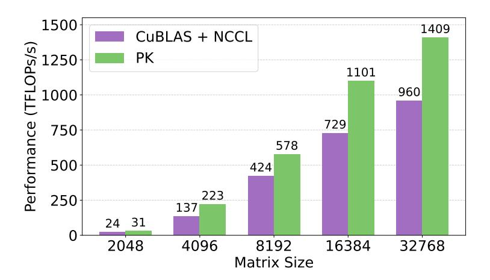

Figure 13: GEMM + RS performance. Local GEMM size is  $N \times N \times N/8$ , with N given in the X-axis.

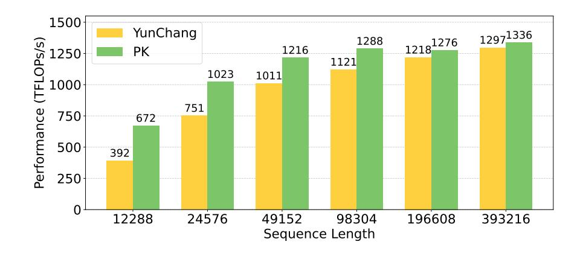

Figure 14: DeepSpeed-Ulysses attention layer performance across sequence lengths (B = 16, H = 128, D = 128).

### B Additional Collective Performance

In this section, we report additional results on pure collective kernel performance and compare them against NCCL. We particularly examine how performance can improve significantly when the communication pattern is *fine-grained*: for example, when performing all-gather or reduce-scatter along the tensor dimension (the last dimension) instead of the batch dimension (the first dimension), or when performing all-to-all operations across head and sequence dimensions. In such cases, the memory layout becomes discontiguous, which makes NCCL inefficient, as it supports collectives only on contiguous partitions and thus requires extra reshaping and copying. In contrast, PK can execute these collectives directly on the original layout. The results below illustrate this advantage.

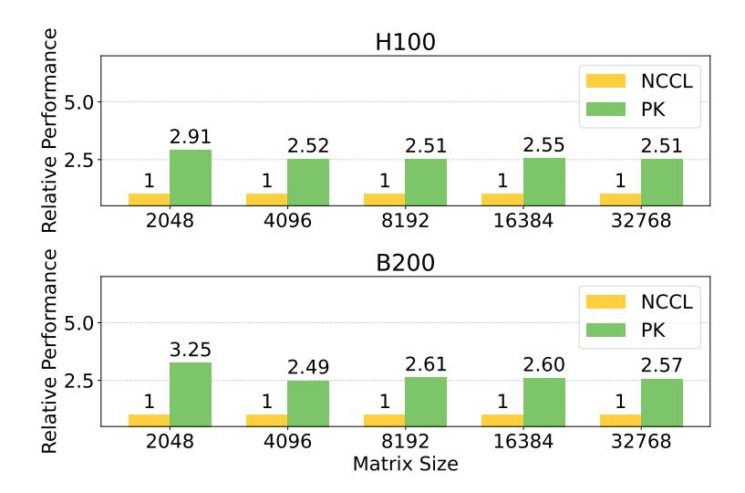

Figure 15: Tensor dimension all-gather performance comparison (BF16). The gathered matrix size is  $N \times N$ , with N given in the X-axis.

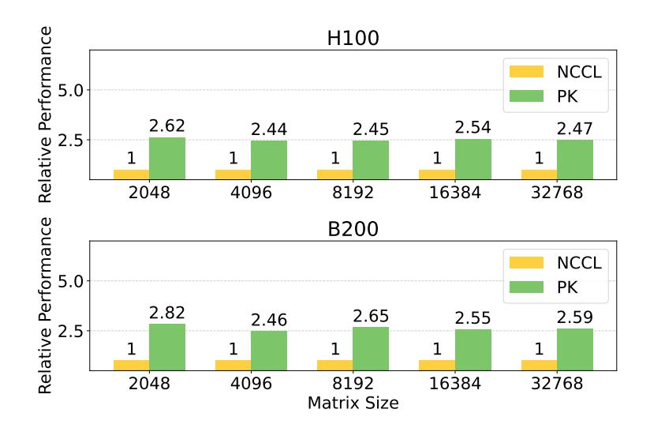

Figure 16: Tensor dimension reduce-scatter performance comparison (BF16). The scattered matrix size is  $N \times N/8$ , with N given in the X-axis.

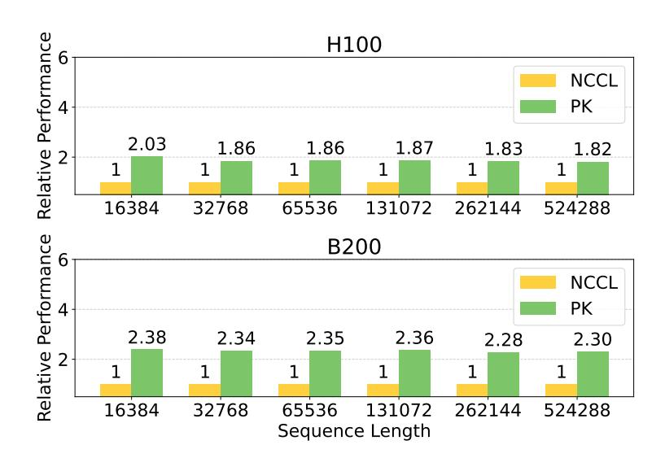

Figure 17: 4-dimensional (B, S, H, D) all-to-all performance comparison (BF16), with B = 1, H = 128, D = 128, and varying S given in the X-axis. The S dimension is gathered and the H dimension is evenly scattered across 8 GPUs.

