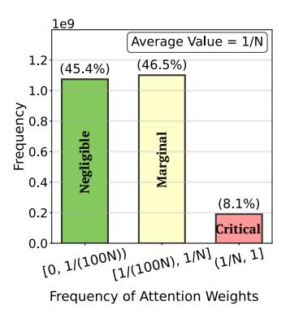
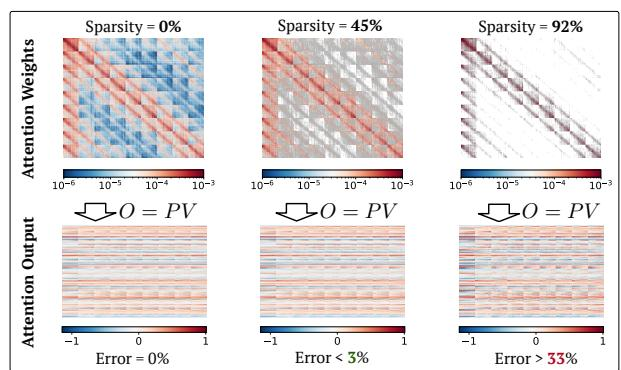
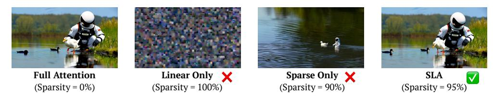
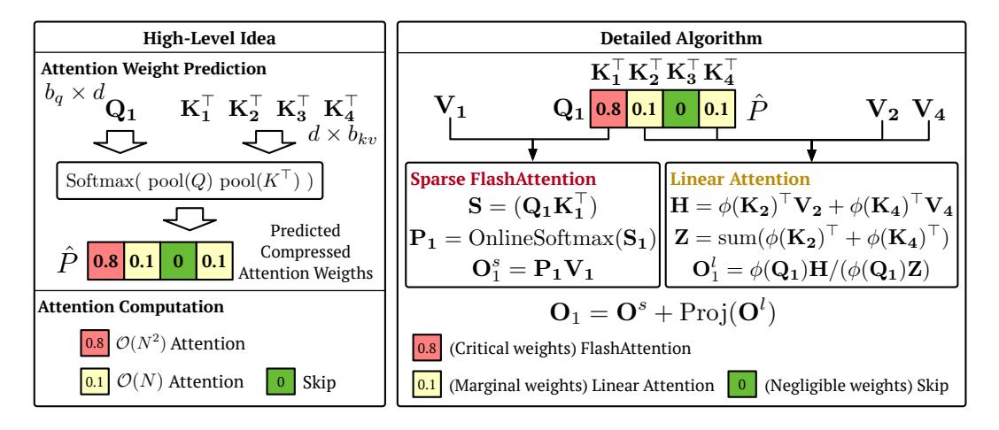

# 3.1 MOTIVATION OF SLA

Due to the softmax operator, the attention weights P lie in [0,1] with each row summing to 1. Furthermore, because of the exponential scaling in softmax, only a small fraction of entries in P

Figure 1: The left figure shows a typical distribution of attention weights sampled from the Wan2.1 model. The right figure shows the accuracy of sparse attention with different sparsity.

are relatively large, while the vast majority are close to zero. Figure 1 (left) shows the typical distribution of attention weights P sampled from the Wan2.1 model (Wan et al., 2025). We highlight two key observations: (1) Only about 8.1% of the weights are larger than the average value 1/N. (2) A considerable proportion of weights are extremely small. In our case, approximately 45% fall below 1/(100N). As shown in Figure 1 (right), skipping these smallest 45% of weights in sparse attention (i.e., setting the corresponding entries in M to 0) introduces a relative L1 error of less than 3% compared to the full attention output. In contrast, retaining only the largest 8.1% of weights (sparsity = 92%) leads to a sharp increase in error, reaching about 33%. This explains why existing sparse attention methods struggle to achieve a sparsity beyond 90%.

The intermediate values between 1/(100N) and 1/N (the yellow column in Figure 1) present a dilemma: omitting them introduces significant accuracy loss, yet computing them with full attention causes a great decrease in sparsity. Fortunately, these values are far less critical than the largest ones. This finding motivates us to categorize the attention weights into three types: *critical*, *marginal*, and *negligible*. For *critical* weights, we use sparse FlashAttention to compute the output as they dominate the attention distribution; For *negligible* weights, we skip the computation; For *marginal* weights, we employ a linear attention method to reduce the computational complexity to  $\mathcal{O}(Nd^2)$  and enhance the performance of sparse attention.

Figure 2: Video generation examples on Wan2.1 fine-tuned with full attention, linear attention, sparse attention, and SLA. SLA could achieve a high sparsity of 95% and lossless video quality.

Empirical results. In Figure 2, we present some videos generated by Wan2.1 fine-tuned with different attention methods: using only linear attention, sparse attention with 90% sparsity, and SLA with 95% sparsity. Note that the computational complexity of SLA at 95% sparsity is nearly half that of 90% sparse attention, since the cost of linear attention is almost negligible. For example, in the Wan2.1 model, linear attention accounts for less than 0.5% of the cost of full attention. These empirical results show that SLA significantly outperforms the other two methods in video quality.

#### 3.2 SEPARATING ATTENTION WEIGHTS: SPARSE FEW, LOW-RANK MANY

**Observation.** As shown in Figure 3, full attention weights can be decoupled into two parts: (1) a small subset (< 10%) with rank comparable to full attention, and (2) a large subset (> 90%) with very low rank. Since the methods for accelerating attention focus mainly on sparsity or low-rank structure, this suggests a **natural and elegant strategy**: apply sparse attention to the first part and low-rank approximation to the second.

Figure 3: Decomposition of attention weights. We sample attention weights from the Wan2.1 model: the left figure shows the full weights, the middle the top 8%, and the right the bottom 92%.

Previous failures of linear attention are largely due to the high rank of full attention weights (Fan et al., 2025), while linear attention is restricted to a rank at most d. Figure 3 (left) illustrates this with a typical example using the notion of stable rank (Rudelson & Vershynin, 2006). We observe that after removing the top values in the attention weights P, the remaining matrix becomes extremely low-rank. This motivates the decomposition of P using the sparse mask M:

$$P = \underbrace{P \odot M}_{\text{sparse component}} + \underbrace{P \odot (1 - M)}_{\text{low-rank component}}.$$
 (1)

Since linear attention is essentially a low-rank version of attention, we are provided with a possibility to replace the low-rank component  $P \odot (1 - M)$  with linear attention.

## 4 SLA

SLA effectively integrates sparse and linear attention within a unified framework, allowing them to complement each other. In particular, we fuse both attention into a single efficient GPU kernel. In this section, we introduce the sparse and linear attention components of SLA.

SLA first predicts a compressed attention weights matrix  $P_c \in \mathbb{R}^{N/b_q \times N/b_{kv}}$ :

$$P_c = \operatorname{Softmax}(\operatorname{pool}(Q)\operatorname{pool}(K)^{\top}/\sqrt{d}). \tag{2}$$

where  $\operatorname{pool}(\cdot)$  is a mean pooling operator along the token dimension. For each element of  $P_c$ , we classify it into three types and record the results in a compressed mask  $M_c \in \mathbb{R}^{N/b_q \times N/b_{kv}}$ . Specifically, the top  $k_h\%$  positions are marked as critical (labeled 1), the bottom  $k_l\%$  positions as negligible (labeled -1), and the remaining positions as marginal (labeled 0). Formally,

$$M_c[i, j] = \{1 \text{ (top } k_h\%), -1 \text{ (bottom } k_l\%), 0 \text{ (otherwise)}\}.$$
 (3)

We apply different methods according to  $M_c$ .

#### 4.1 Sparse Attention in SLA

Guided by the mask  $M_c$ , sparse FlashAttention is used to compute the sparse attention output. For each Q block  $\mathbf{Q}_i$ , we iterate over all K, V blocks  $\mathbf{K}_j, \mathbf{V}_j$  with  $j = 0, \dots, N/b_{kv}$ . Whenever  $M_c[i,j] = 1$ , we perform:

$$\mathbf{S}_{ij} = \mathbf{Q}_i \mathbf{K}_i^{\top} / \sqrt{d}, \quad \mathbf{P}_{ij} = \text{OnlineSoftmax}(\mathbf{S}_{ij}), \quad \mathbf{O}_i^s = \mathbf{O}_i^s + \mathbf{P}_{ij} \mathbf{V}_j.$$
 (4)

Here, OnlineSoftmax(·) operator (Milakov & Gimelshein, 2018) computes the softmax of a matrix in a block-wise manner (see lines 10-11 of Algorithm 1 for implementation). The initial value of each  $O_i^s$  is set to zero. Algorithm 1 describes the forward computation of the sparse attention component, and we denote the final output of the sparse attention component  $O_i^s$ .

#### 4.2 LINEAR ATTENTION IN SLA

Inspired by the idea of low-rank approximation, we replace the low-rank component  $P\odot(1-M)$  in Equation 1 with linear attention introduced in Section 2.2 as

$$\frac{\phi(Q)\phi(K)^{\top}}{\operatorname{rowsum}(\phi(Q)\phi(K)^{\top})}\odot(1-M).$$

Specifically, the entries of 0 in  $M_c$  determine the blocks processed by linear attention. For each query block  $\mathbf{Q}_i$ , we compute the corresponding linear attention output:

$$\mathbf{H}_{i} = \sum_{j:M_{c}[i,j]=0} \phi(\mathbf{K}_{j})^{\top} \mathbf{V}_{j}, \quad \mathbf{Z}_{i} = \sum_{j:M_{c}[i,j]=0} \operatorname{rowsum}(\phi(\mathbf{K}_{j})^{\top}), \quad \mathbf{O}_{i}^{l} = \frac{\phi(\mathbf{Q}_{i})\mathbf{H}_{i}}{\phi(\mathbf{Q}_{i})\mathbf{Z}_{i}}.$$
(5)

Here, as mentioned in Section 2.2,  $\phi(\cdot)$  denotes the activation function, and  $\mathbf{H}_i \in \mathbb{R}^{d \times d}$ ,  $\mathbf{Z}_i \in \mathbb{R}^{d \times 1}$  are intermediate results similar to H and Z. Algorithm 1 describes the forward pass of the linear attention component, and the final output of this component is denoted as  $O^l$ .

Finally, the overall attention output of SLA is defined as:

$$O = O^s + \operatorname{Proj}(O^l). \tag{6}$$

where Proj is a learnable linear transformation  $\mathbb{R}^d \to \mathbb{R}^d$ . Applying this projection to  $O^l$  helps reduce the distribution mismatch between softmax and linear attention. Its computational cost is  $\mathcal{O}(Nd^2)$ , the same as computing  $O^l$  and negligible compared with the  $\mathcal{O}(N^2d)$  cost of full attention.

**Insight.** Linear attention in SLA does not approximate the output corresponding to marginal attention weights, but serves as a learnable compensation that enhances the effectiveness of sparse attention. This is because linear attention alone struggles to approximate the output of full attention (Choromanski et al., 2020; Qin et al., 2022). Therefore, we need to fine-tune the parameters of the target model, enabling it to adapt to the use of linear attention.

Figure 4: Overview of SLA. The left figure illustrates the high-level idea: attention weights are classified into three categories and assigned to computations of different complexity. The right figure shows the detailed forward algorithm of SLA using the predicted compressed attention weights.

## 5 FINE-TUNING USING SLA

To apply SLA to a diffusion model, we can simply replace the original attention with SLA and finetune the model for a few steps on a dataset consistent with the pretraining data. In this section, we describe the forward and backward passes of SLA. Moreover, we detail some additional efficiency optimization for SLA in Appendix A.3.

