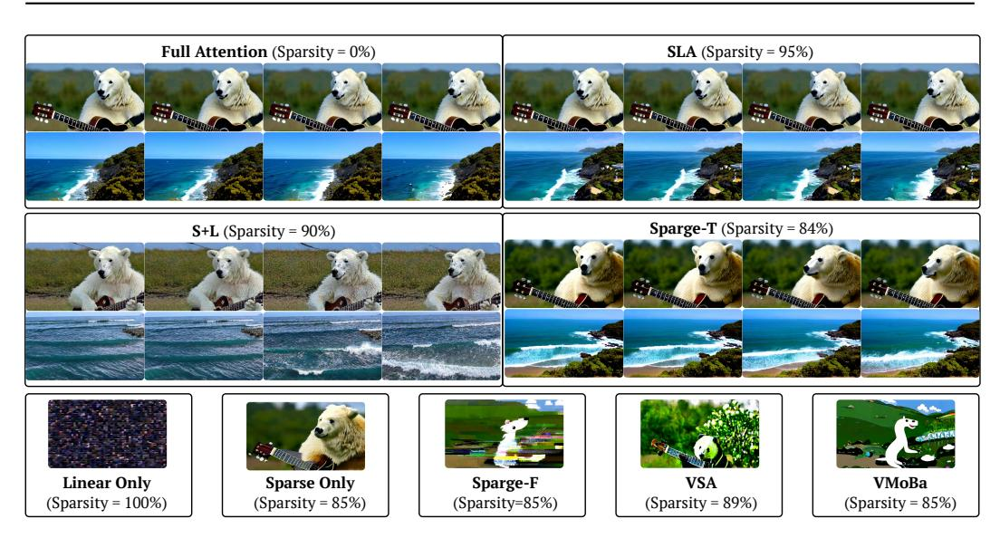
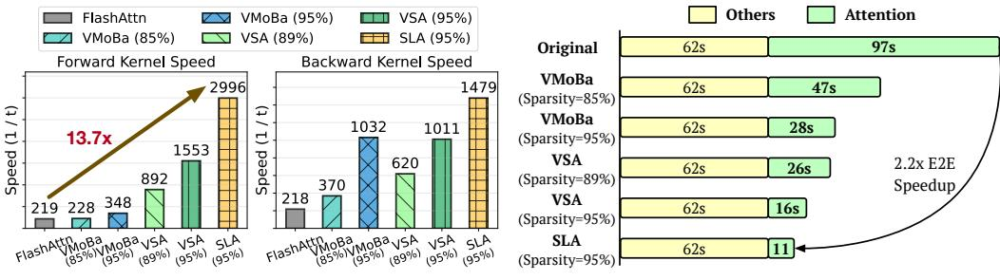

# 5.1 FORWARD PASS

The formulation of the forward computation was introduced in Section 4. The complete algorithm of the forward pass of SLA is presented in Algorithm 1. It's worth noting that we precompute  $h_j = \phi(\mathbf{K}_j)^\top \mathbf{V}_j$  and  $z_j = \operatorname{rowsum}(\phi(\mathbf{K}_j)^\top)$  for each pair  $(K_j, V_j)$  (Line 4 in Algorithm 1). This design ensures that, when  $M_c[i,j] = 0$ , the corresponding operation only involves a single matrix addition (Line 13 in Algorithm 1), thereby improving efficiency. To simplify the notation, we denote  $Q^\phi = \phi(Q)$  and  $K^\phi = \phi(K)$  in the following.

#### **Algorithm 1:** Forward pass of SLA.

```
1: Input: Matrices Q, K, V, Q^{\phi}, K^{\phi} \in \mathbb{R}^{N \times d}, block sizes b_q, b_{kv}, hyper-parameters k_h, k_l.
 2: Divide Q, Q^{\phi} to T_m = N/b_q blocks \{\mathbf{Q}_i\} and \{\mathbf{Q}_i^{\phi}\};
 3: Divide K, V, K^{\phi} to T_n = N/b_{kv} blocks \{\mathbf{K}_i\}, \{\mathbf{V}_i\} and \{\mathbf{K}_i^{\phi}\};
 4: h = \{h_j\} = \{(\mathbf{K}_i^{\phi})^{\top} \mathbf{V}_j\}; z = \{z_j\} = \{\text{rowsum}((\mathbf{K}_i^{\phi})^{\top})\}; // Precompute for linear attention
 5: P_c = \operatorname{Softmax}(\operatorname{pool}(Q)\operatorname{pool}(K)^{\top}/\sqrt{d}); Initialize M_c = 0;
 6: M_c[i,j] = 1 if P_c[i,j] \in \text{TopK}(P_c[i,:],k_h); M_c[i,j] = 0 if P_c[i,j] \in \text{BottomK}(P_c[i,:],k_l);
 7: for i = 1 to T_m do
          for j=1 to T_n do
 9:
                if M_c[i,j]=1 then
10:
                     \mathbf{S}_{ij} = \mathbf{Q}_i \mathbf{K}_j^{\top} / \sqrt{d};
                                                          m_{ij} = \max(m_{i,j-1}, \operatorname{rowmax}(\mathbf{S}_{ij})); \mathbf{P}_{ij} = \exp(\mathbf{S}_{ij} - m_{ij});
                     l_{ij} = e^{m_{i,j-1} - m_{ij}} l_{i,j-1} + \text{rowsum}(\mathbf{P}_{ij}); \quad \mathbf{O}_{ij}^s = \text{diag}(e^{m_{i,j-1} - m_{ij}}) \mathbf{O}_{i,j-1}^s + \mathbf{P}_{ij} \mathbf{V}_j;
11:
                else if M_c[i,j] = 0 then
12:
                     \mathbf{H}_i \leftarrow \mathbf{H}_i + h_j; \quad \mathbf{Z}_i \leftarrow \mathbf{Z}_i + z_j;
13:
14:
15:
           end for
           \mathbf{O}_{i}^{s} = \operatorname{diag}(l_{i}^{T_{n}})^{-1} \mathbf{O}_{i,T_{n}}^{s}; \quad \mathbf{O}_{i}^{l} = \mathbf{Q}_{i}^{\phi} \mathbf{H}_{i} / (\mathbf{Q}_{i}^{\phi} \mathbf{Z}_{i}); \quad \mathbf{L}_{i} = m_{i,T_{n}} + \log(l_{i,T_{n}});
17: end for
18: return O^s = \{ \mathbf{O}_i^s \}, \ O^l = \{ \mathbf{O}_i^l \};
```

## Algorithm 2: Backward pass of SLA.

```
1: Input: Q, K, V, Q^{\phi}, K^{\phi}, M_c, \{\mathbf{L}_i\}, \{\mathbf{H}_i\}, \{\mathbf{Z}_i\}, O^s, O^l from the forward, dO^s, dO^l \in \mathbb{R}^{N \times d}.
  2: D^s = \text{rowsum}(dO^s \odot O^s), D^l = \text{rowsum}(dO^l \odot O^l), \text{ divide } D^s, D^l \text{ into } T_m \text{ blocks } \{\mathbf{D}_i^s\}, \{\mathbf{D}_i^l\};
 3: for i=1 to T_m do
             \mathbf{dH}_i = (\mathbf{Q}_i^{\phi}/(\mathbf{Q}_i^{\phi}\mathbf{Z}_i))^{\top}\mathbf{dO}_i^l; \ \mathbf{dZ}_i = -(\mathbf{Q}_i^{\phi}/(\mathbf{Q}_i^{\phi}\mathbf{Z}_i))^{\top}D_i^l;
              \mathbf{dQ}_{i}^{\phi} = (\mathbf{dO}_{i}^{l}(\mathbf{H}_{i})^{\top} - \mathbf{D}_{i}^{l}\mathbf{Z}_{i}^{\top})/(\mathbf{Q}_{i}^{\phi}\mathbf{Z}_{i});
 6: end for
 7: for j = 1 to T_n do
 8:
             Initialize d\mathbf{H} = 0, d\mathbf{Z} = 0;
             for i=1 to T_m do
 9:
                   if M_c[i,j]=1 then
10:
                         \mathbf{S}_{ij} = \mathbf{Q}_i \mathbf{K}_i^{\top} / \sqrt{d}; \ \mathbf{P}_{ij} = \exp(\mathbf{S}_{ij} - \mathbf{L}_i); \ \mathbf{d} \mathbf{V}_j \leftarrow \mathbf{d} \mathbf{V}_j + \mathbf{P}_{ij}^{\top} \mathbf{d} \mathbf{O}_i^s; \ \mathbf{d} \mathbf{P}_{ij} = \mathbf{d} \mathbf{O}_{ij}^s \mathbf{V}_i^{\top};
11:
12:
                         \mathbf{dS}_{ij} = \mathbf{P}_{ij} \odot (\mathbf{dP}_{ij} - \mathbf{D}_i^s); \quad \mathbf{dQ}_i \leftarrow \mathbf{dQ}_i + \mathbf{dS}_{ij}\mathbf{K}_j; \quad \mathbf{dK}_j \leftarrow \mathbf{dK}_j + \mathbf{dS}_{ij}^{\top}\mathbf{Q}_i;
13:
                   else if M_c[i,j] = 0 then
14:
                         d\mathbf{H} \leftarrow d\mathbf{H} + d\mathbf{H}_i;
                                                                       \mathbf{dZ} \leftarrow \mathbf{dZ} + \mathbf{dZ}_i ;
15:
                   end if
16:
              end for
              \mathbf{dK}_{i}^{\phi} = \mathbf{V}_{i}(\mathbf{dH})^{\top} + (\mathbf{dZ})^{\top}; \quad \mathbf{dV}_{i} = \mathbf{K}_{i}^{\phi}\mathbf{dH};
17:
18: end for
19: return dQ = \{\mathbf{dQ}_i\}, dK = \{\mathbf{dK}_i\}, dV = \{\mathbf{dV}_i\}, dQ^{\phi} = \{\mathbf{dQ}_i^{\phi}\}, dK^{\phi} = \{\mathbf{dK}_i^{\phi}\};
```

#### 5.2 BACKWARD PASS

The backward pass computes gradients for both the sparse and linear components, which are also fused into a single GPU kernel for efficiency.

**Gradient notation.** The prefix d or  $\mathbf{d}$  is used to denote gradients, e.g.,  $dO^s$ ,  $dO^l$  are the gradients of  $O^s$ ,  $O^l$  with respect to some loss function  $\ell$ , respectively.

**Sparse attention gradients.** The output gradient  $dO^s$  is backpropagated to compute dQ, dK, and dV, following the same derivation as in FlashAttention (Dao, 2023). Given  $dO^s$ , the backward pass is carried out as follows:

$$\mathbf{dP}_{ij} = \mathbf{dO}_{ij}^{s} \mathbf{V}_{j}^{\top}, \quad \mathbf{D}_{i}^{s} = \text{rowsum}(\mathbf{dO}_{i}^{s} \odot \mathbf{O}_{i}^{s}), \quad \mathbf{dS}_{ij} = \mathbf{P}_{ij} \odot (\mathbf{dP}_{ij} - \mathbf{D}_{i}^{s}),$$

$$\mathbf{dQ}_{i} = \mathbf{dS}_{ij} \mathbf{K}_{j}, \quad \mathbf{dK}_{j} = \mathbf{dS}_{ij}^{\top} \mathbf{Q}_{i}, \quad \mathbf{dV}_{j} = \mathbf{P}_{ij}^{\top} \mathbf{dO}_{i}^{s}.$$
(7)

Here, we consider  $\mathbf{D}_i^s \in \mathbb{R}^{b_q \times 1}$  as a column vector.

**Linear attention gradients.** The gradient  $dO^l$  yields  $dQ^{\phi}$ ,  $dK^{\phi}$ , dV through the chain rule:

$$\mathbf{d}\mathbf{H}_{i} = \left(\frac{\mathbf{Q}_{i}^{\phi}}{\mathbf{Q}_{i}^{\phi}\mathbf{Z}_{i}}\right)^{\top} \mathbf{d}\mathbf{O}_{i}^{l}, \quad \mathbf{D}_{i}^{l} = \operatorname{rowsum}(\mathbf{d}\mathbf{O}_{i}^{l} \odot \mathbf{O}_{i}^{l}), \quad \mathbf{d}\mathbf{Z}_{i} = -\left(\frac{\mathbf{Q}_{i}^{\phi}}{\mathbf{Q}_{i}^{\phi}\mathbf{Z}_{i}}\right)^{\top} \mathbf{D}_{i}^{l}$$

$$\mathbf{d}\mathbf{Q}_{i}^{\phi} = \frac{(\mathbf{d}\mathbf{O}_{i}^{l}(\mathbf{H}_{i})^{\top} - \mathbf{D}_{i}^{l}\mathbf{Z}_{i}^{\top})}{\mathbf{Q}_{i}^{\phi}\mathbf{Z}_{i}}, \quad \mathbf{d}\mathbf{K}_{j}^{\phi} = \mathbf{V}_{j}(\mathbf{d}\mathbf{H}_{i})^{\top} + (\mathbf{d}\mathbf{Z}_{i})^{\top}, \quad \mathbf{d}\mathbf{V}_{j} = \mathbf{K}_{j}^{\phi}\mathbf{d}\mathbf{H}_{i}$$

$$(8)$$

Here,  $d\mathbf{K}_{j}^{\phi}$  and  $d\mathbf{V}_{j}$  are obtained by aggregating  $d\mathbf{H}_{i}$  and  $d\mathbf{Z}_{i}$ . Similar to the forward pass, each  $d\mathbf{H}_{i}$  and  $d\mathbf{Z}_{i}$  is precomputed so that the remaining computation reduces to simple matrix additions. The detailed algorithm is provided in Algorithm 2.

#### 6 EXPERIMENT

#### <span id="page-6-0"></span>6.1 SETUP

**Model and Datasets.** We use the Wan2.1-1.3B model (Wan et al., 2025) for video generation experiments in the main text and LightningDiT (Yao et al., 2025) for image generation experiments in the Appendix A.2. For video experiments, we use a private dataset collected from websites such as Pexels (Pexels) and Common Crawl (Common Crawl), consisting of 20,000 5-second videos at 480p resolution for fine-tuning. For image experiments, following LightningDiT (Yao et al., 2025), we use the ImageNet (Deng et al., 2009) dataset at a resolution of  $512 \times 512$ .

Baselines. We compare SLA with state-of-the-art sparse attention methods applicable to diffusion models, including (1) VSA (Zhang et al., 2025c), (2) VMoBa (Wu et al., 2025), and (3) the training-free SparseAttn (Zhang et al., 2025a) (Sparge-F) and (4) a trainable implementation of SpargeAttn (Sparge-T). For VSA and VMoBa, we use their official implementations, while for Sparse-T, we implement the method ourselves because there is no official implementation. In addition, we design several baselines for ablation studies: (5) Linear Only, which applies only linear attention; (6) Sparse Only, which applies only the sparse attention component of SLA; and (7) L+S, which directly sums the attention outputs of the Linear Only and Sparse Only.

**Metrics.** For video quality, following Zhang et al. (2024a); Yang et al. (2025b), we use four evaluation dimensions of VBench (Zhang et al., 2024a): Imaging Quality (IQ), Overall Consistency (OC), Aesthetic Quality (AQ), Subject Consistency (SC). We also use the Vision Reward (VR) (Xu et al., 2024) for human preference evaluation, Aesthetic Video Quality (VA), and Techniqual Video Quality (VT) (Liu et al., 2023). For image quality, following Yao et al. (2025), we use FID. For attention computation complexity, we use FLOPs (floating point of operations). For attention efficiency, we use FLOPS (floating-point operations per second) for attention kernel efficiency. Specifically, FLOPS here is  $\mathcal{O}$ (full attention)/t, where  $\mathcal{O}$ (·) denotes the operation count and t the attention latency. We use seconds for end-to-end generation latency.

**Hyper-parameters.** We use a training batch size of 64 and fine-tune the Wan2.1 model for 2000 steps. For the activation function  $\phi$ , we use softmax according to our ablation experiments.  $k_h\%$  is 5% and  $k_l\%$  is 10%. For block size, we use  $b_q = b_{kv} = 64$ . The hyper-parameters for image generation tasks are detailed in Appendix A.2.

#### <span id="page-6-1"></span>6.2 Effectiveness

Table 1 compares the video generation quality and efficiency of SLA with baseline methods on Wan2.1-1.3B, fine-tuned separately with SLA, Full Attention, and each baseline. SLA delivers about a  $19.3\times$  efficiency gain while maintaining video quality comparable to Full Attention. Moreover, compared with the baselines, SLA consistently achieves higher quality even under greater sparsity. For example, 95% (1-5%) sparsity in SLA is actually about  $3\times$  more efficient than 85% (1-15%) while still producing better video quality.

#### 6.3 EFFICIENCY

Figure 6 compares the kernel speed and end-to-end latency of SLA on Wan2.1–1.3B with an RTX5090. Note that even VSA in 89% sparsity and VMoBa in 85% sparsity, their generation quality

<span id="page-7-0"></span>Table 1: Quality and efficiency comparison of SLA and other baseline methods.

| Method         | Quality |       |      |      |      |      | Efficiency |         |            |
|----------------|---------|-------|------|------|------|------|------------|---------|------------|
|                | VA ↑    | VT ↑  | IQ ↑ | oc↑  | AQ ↑ | SC↑  | VR ↑       | FLOPs ↓ | Sparsity ↑ |
| Full Attention | 76.78   | 82.88 | 62.5 | 23.3 | 56.1 | 93.0 | 0.059      | 52.75T  | 0%         |
| Sparge-F       | 0.002   | 0.026 | 26.0 | 4.6  | 35.7 | 85.1 | -0.216     | 7.91T   | 85%        |
| Sparge-T       | 73.83   | 77.87 | 61.9 | 22.7 | 55.4 | 93.1 | 0.014      | 7.38T   | 84%        |
| VMoBa          | 32.33   | 35.79 | 58.0 | 18.8 | 46.2 | 89.9 | -0.175     | 7.91T   | 85%        |
| VSA            | 55.37   | 64.61 | 60.6 | 22.4 | 51.9 | 83.6 | -0.069     | 5.92T   | 89%        |
| SLA            | 76.96   | 83.92 | 62.2 | 23.6 | 55.9 | 93.1 | 0.048      | 2.74T   | 95%        |

<span id="page-7-1"></span>Table 2: Ablation results for SLA.

| Table 2: Holation regards for SER: |         |       |      |      |      |      |            |         |            |
|------------------------------------|---------|-------|------|------|------|------|------------|---------|------------|
| Method                             | Quality |       |      |      |      |      | Efficiency |         |            |
| 11201104                           | VA ↑    | VT ↑  | IQ↑  | oc↑  | AQ ↑ | sc↑  | VR ↑       | FLOPs ↓ | Sparsity ↑ |
| Full Attention                     | 76.78   | 82.88 | 62.5 | 23.3 | 56.1 | 93.0 | 0.059      | 52.75T  | 0%         |
| Linear Only                        | 0.042   | 0.099 | 39.5 | 3.6  | 28.8 | 90.7 | -0.213     | 0.10T   | 100%       |
| Sparse Only                        | 64.00   | 70.50 | 57.2 | 21.8 | 51.7 | 88.7 | -0.073     | 7.91T   | 85%        |
| L+S                                | 29.65   | 41.15 | 58.6 | 18.8 | 45.3 | 87.1 | -0.105     | 5.37T   | 90%        |
| SLA (softmax)                      | 76.96   | 83.92 | 62.2 | 23.6 | 55.9 | 93.1 | 0.048      | 2.73T   | 95%        |
| SLA (elu+1)                        | 75.50   | 81.01 | 62.8 | 23.5 | 55.3 | 92.9 | 0.034      | 2.74T   | 95%        |
| SLA (hedgehog)                     | 74.59   | 82.62 | 61.9 | 22.5 | 54.3 | 93.2 | 0.035      | 3.11T   | 95%        |
| SLA (Top 5%)                       | 76.96   | 83.92 | 62.2 | 23.6 | 55.9 | 93.1 | 0.048      | 2.73T   | 95%        |
| SLA (Top 10%)                      | 75.29   | 82.20 | 62.5 | 22.6 | 55.8 | 93.5 | 0.057      | 5.38T   | 90%        |
| SLA (Top 20%)                      | 75.81   | 83.82 | 62.7 | 22.4 | 54.5 | 92.6 | 0.059      | 10.65T  | 80%        |



<span id="page-7-2"></span>Figure 5: Video examples using Wan2.1 fine-tuned with SLA and baselines. For Linear Only, Sparse Only, Sparge-F, VSA, and VMoBa, only a single frame per prompt is shown, as their video quality is not sufficient. The full visible comparison is in Figure 7 in Appendix A.1.

is already worse than SLA, so higher sparsity settings (e.g., 95%) are not quality-matched comparisons. In the forward pass, SLA achieves a  $13.7\times$  speedup over FlashAttention2 and is  $1.93\times$  faster than VSA with 95% sparsity and  $3.36\times$  faster than VMoBa with 95% sparsity. In the backward pass, it delivers a  $6.8\times$  speedup over FlashAttention2, still outperforming VSA and VMoBa. For end-to-end video generation, SLA reduces attention latency from 97s to 11s ( $8.8\times$  reduction), resulting in a  $2.2\times$  end-to-end speedup. For fine-tuning overhead, we train Wan2.1-1.3B for only 2,000 steps with a batch size of 64, which is less than 0.1% of the cost of pretraining (typically  $10^5-10^6$  steps with a batch size of  $10^3-10^4$ ) (Wan et al., 2025).



<span id="page-8-0"></span>(a) Attention GPU Kernel speed comparison on RTX5090

(b) End-to-end video generation latency comparison.

Figure 6: Attention kernel speed and end-to-end generation latency of SLA and baselines on Wan2.1-1.3B with RTX5090. FlashAttn refers to FlashAttn2, the fastest available version on RTX5090.

#### 6.4 ABLATION STUDY

**Fusing sparse and linear attention.** To evaluate the effectiveness of SLA in integrating sparse and linear attention, we compare SLA with Sparse Only, Linear Only, and S+L on Wan2.1 in terms of end-to-end generation quality and efficiency. As shown in Table 2, SLA achieves the best generation quality and is more efficient than Sparse Only and S+L, confirming the effectiveness of our fusion strategy.

**Activation function in linear attention.** To study the effect of the activation function  $\phi$  in the linear attention component of SLA, we evaluate softmax, elu+1, and hedgehog. Results in Table 2 show that softmax generally provides better generation quality and efficiency.

Impact of parameter  $k_h$ . We vary  $k_h$  from 5% to 20% and report the results in Table 2. We find that  $k_h = 5\%$  already yields generation quality close to that of full attention. Since  $k_h = 5\%$  saves about half and a quarter of the computation compared with  $k_h = 10\%$  and  $k_h = 20\%$ , it offers the best trade-off between efficiency and quality.

#### 6.5 VISIBLE EXAMPLES

Figure 5 and Figure 7 show video examples from Wan2.1-1.3B fine-tuned using SLA and baselines. SLA produces videos comparable to full attention even at **95**% sparsity, while other methods exhibit noticeable distortions even at sparsity levels below 90%.

#### 7 RELATED WORK

As sequence lengths in generative models (e.g., language and video) grow, the quadratic cost of attention becomes a key bottleneck (Zhang et al.). Many studies aim to improve efficiency in two main directions: sparse and linear attention. Most sparse attention methods (Xiao et al., 2024b;;; Jiang et al., 2024; Gao et al., 2024; Fu et al., 2024; Xi et al., 2025; Zhang et al., 2025a; Ribar et al., 2023; Yang et al., 2025a) speed up inference without training by masking computation at test time. Some (Zhang et al., 2025c; Wu et al., 2025) add sparsity during training, enabling higher sparsity. Linear attention methods (Wang et al., 2020; Choromanski et al., 2020; Katharopoulos et al., 2020; Qin et al., 2024; Yang et al., 2024; Sun et al., 2023) are mainly studied in language models. For DiT, SANA (Xie et al., 2024) and Dig (Zhu et al., 2025) show linear attention works for image generation pre-training, but in video generation, existing methods cannot rely on it alone for lossless quality. Another direction is hardware-efficient attention (Dao et al., 2022; Dao, 2023; Shah et al., 2024; Zhang et al., 2024c;b; 2025b), which optimizes GPU execution through tiling, kernel fusion, and quantization.

#### 8 CONCLUSION

We propose SLA, a trainable attention that unifies sparse and linear attention to accelerate Diffusion Transformers. SLA assigns computation according to importance: it computes  $\mathcal{O}(N^2)$  attention for critical weights,  $\mathcal{O}(N)$  attention for marginal weights, and skips negligible computations. This design enables substantial reductions in attention cost while preserving effectiveness. Experiments show that just a few fine-tuning steps enable SLA to accelerate models effectively. Specifically, SLA

achieves a 20× reduction in attention computation, along with a 13.7× GPU kernel speedup and a 2.2× end-to-end speedup on Wan2.1-1.3B, all without degrading the quality of video generation.

