# SageAttention3: Microscaling FP4 Attention for Inference and An Exploration of 8-bit Training

Jintao Zhang∗12, Jia Wei∗<sup>1</sup> , Haoxu Wang<sup>1</sup> , Pengle Zhang<sup>1</sup> , Xiaoming Xu<sup>1</sup> , Haofeng Huang<sup>1</sup> , Kai Jiang<sup>1</sup> , Jianfei Chen†<sup>1</sup> , Jun Zhu†<sup>12</sup>

<sup>1</sup>Dept. of Comp. Sci. and Tech., Institute for AI, BNRist Center, THBI Lab, Tsinghua-Bosch Joint ML Center, Tsinghua University; <sup>2</sup>Shengshu Tech., Beijing, China. {zhang-jt24@mails., jianfeic@, dcszj@}tsinghua.edu.cn

### Abstract

The efficiency of attention is important due to its quadratic time complexity. We enhance the efficiency of attention through two key contributions: First, we leverage the new FP4 Tensor Cores in Blackwell GPUs to accelerate attention computation. Our implementation achieves 1038 TOPS on RTX5090, which is a 5× speedup over the fastest FlashAttention on RTX5090. Experiments show that our FP4 attention can accelerate inference of various models in a plug-and-play way. Second, we pioneer low-bit attention to training tasks. Existing low-bit attention works like FlashAttention3 and SageAttention focus only on inference. However, the efficiency of training large models is also important. To explore whether low-bit attention can be effectively applied to training tasks, we design an accurate and efficient 8-bit attention for both forward and backward propagation. Experiments indicate that 8-bit attention achieves lossless performance in fine-tuning tasks but exhibits slower convergence in pretraining tasks. The code is available at <https://github.com/thu-ml/SageAttention>.

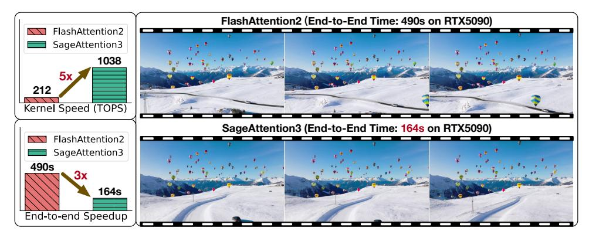

Figure 1: The upper left figure shows the kernel speedup on RTX5090. The other two figures show the end-to-end inference speedup of generating a video using HunyuanVideo on RTX5090. Note that FlashAttention3 can only run on Hopper GPUs, so FlashAttention2 is already the fastest on RTX5090.

### 1 Introduction

Motivation. The efficiency of attention is critical for generation models, especially given their quadratic time complexity with longer sequences [\[1,](#page-10-0) [2\]](#page-10-1). Quantization offers an effective way to

<sup>∗</sup> co-first authors, † Corresponding authors.

accelerate inference by utilizing low-bit Tensor Cores in GPUs [3, 4, 5, 6]. The new FP4 Tensor Cores in Blackwell GPUs deliver significantly faster performance compared to FP16 [7]. We want to propose a novel FP4 attention implementation that provides plug-and-play compatibility for inference acceleration. Beyond inference, training efficiency is equally important. However, no prior work has explored low-bit attention for training large models. To address this gap, we design a trainable 8-bit attention to explore its feasibility in training tasks.

To the best of our knowledge, we are the <u>first work</u> that designs FP4 attention for inference and the first work to explore the feasibility of low-bit attention for training large models.

**Challenges.** There are two primary obstacles for FP4 attention and one key difficulty for 8-bit trainable attention. First, **(C1)** FP4 quantization suffers from severe value limitations (only 15 representable values), making both per-tensor and per-token quantization approaches inadequate for preserving model accuracy. Second, **(C2)** The attention map P consists primarily of small values in the range [0, 1]. When directly quantized to FP4, these values force the scaling factors into an extremely narrow dynamic range. However, hardware requires the quantization factors to be in FP8 data type. This leads to significant accuracy loss when presenting these scale factors in FP8. Third, **(C3)** When employing 8-bit attention during training, we find that the attention map gradients are particularly vulnerable to quantization errors, resulting in accumulated errors in the input gradients.

Our Method. To address (C1), we propose to use FP4 microscaling quantization for the two matrix multiplications in attention, i.e.,  $QK^{\dagger}$  and PV. By constraining the quantization group size to 1x16 (instead of per-tensor or per-channel), our method effectively contains outlier effects within each block while improving FP4 quantization accuracy. To overcome (C2), we propose a two-level quantization method for P to fully utilize the presentative range of the FP8 scaling factor, enhancing the quantization accuracy of P. Specifically, this approach first normalizes each token's range to  $[0,448\times6]$  through per-token quantization, then applies FP4 microscaling quantization for enhanced precision. To address (C3), we identify the most accuracy-sensitive matrix multiplication among the five in backpropagation and maintain its accuracy in FP16.

**Result.** Our FP4 attention, named SageAttention3, could achieve **1038** TOPS on RTX5090, which is a  $5 \times$  speedup than FlashAttention. Furthermore, we demonstrate that 8-bit trainable attention, named SageBwd, could achieve lossless performance when fine-tuning base models for instruction-following tasks, but is not suitable for pretraining tasks.

**Contribution.** Our work makes the following key contributions:

- (1) We design the first FP4 attention to accelerate inference, achieving 1000+ TOPS on RTX5090.
- (2) We propose the first trainable low-bit attention, enabling accelerated training with lossless fine-tuning performance, while revealing key insights for low-bit attention in training.

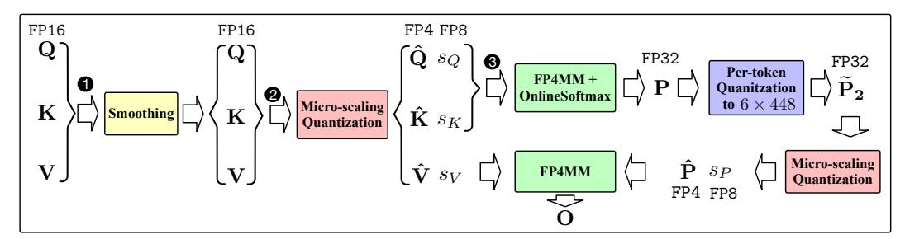

Figure 2: Workflow of microscaling FP4 attention.

### <span id="page-1-0"></span>2 Preliminary

**FlashAttention.** The attention computation contains two matrix multiplications and one softmax calculation:  $S = QK^{\top}, P = \mathtt{Softmax}(S), O = PV$ . The Q, K, V are in the shape of  $N \times D$ , where N means the sequence length and D means the dimension of an attention head. P, S are in the shape of  $N \times N$ . FlashAttention divides Q to blocks  $\{Q_i\}$  in the shape of  $B_q \times D$ , and divides K, V to  $\{K_i\}, \{V_i\}$  in the shape of  $B_{kv} \times D$ . Then it uses online softmax to avoid the large memory IO for S and P:  $S_{ij} = Q_i K_j^{\top}, P_{ij} = \mathtt{OnlineSoftmax}(S_{ij}), O_{ij} = P_{ij}V_j$ .

**Notation.** For simplicity, we omit subscripts and use **Q**, **K**, **V**, **S**, **P**, **O** to denote the matrix blocks in FlashAttention, while retaining full subscript notation in Algorithm 1, 2, and 3.

**Quantization.** Quantization is used to accelerate Matmul by converting two matrices from highbit to low-bit with scale factors. Take INT8 quantization for Matmul AB as an example, where A and B are in FP16 data type. It can be formulated:  $s_A = \max(|A|)/127$ ,  $\hat{A} = \lceil A/s_A \rfloor$ ,  $s_B = \max(|B|)/127$ ,  $\hat{B} = \lceil B/s_B \rfloor$ , where  $\hat{A}, \hat{B}$  are in INT8 and the others are in FP32. Then,  $AB \approx \hat{A}\hat{B} \times s_A \times s_B$ , which can be accelerated by the INT8 Tensor Core. The granularity of quantization is determined by the dimensions reduced by the max operation. For example, in *pertoken quantization*, the max is computed along each row of a matrix. In *per-block quantization*, the max is computed on a block of a matrix, which in our paper means a FlashAttention block.

### 3 FP4 Attention for Inference Acceleration

This section presents our microscaling FP4 attention through three key components: (1) the fundamental workflow for applying microscaling FP4 quantization to attention in Section 3.1, (2) the two-level quantization approach for the attention map in Section 3.2, and (3) critical hardware implementation optimization in Section 3.3.

<span id="page-2-1"></span>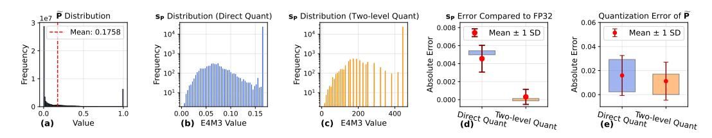

Figure 3: Analysis of the benefit of two-level quantization. (a) shows the distribution of  $\widetilde{\mathbf{P}}$ . (b) and (c) show the distribution of  $\mathbf{s_P}$  using direct quantization and two-level quantization. (d) and (e) show the error of  $\mathbf{s_P}$  and  $\widetilde{\mathbf{P}}$  using direct quantization and two-level quantization.

### <span id="page-2-0"></span>3.1 Microscaling FP4 Attention

**FP4 microscaling quantization**. Given a matrix  $X \in \mathbb{R}^{N \times d}$ , we quantize it to  $\hat{X}$  in FP4 data type with a scale factor matrix  $s_X$  in FP8 data type. Specifically, X is partitioned into  $X_{ij} \in \mathbb{R}^{1 \times n}$  blocks, where each  $1 \times n$  block corresponds to one scale factor  $s_{ij}$ . The FP4 microscaling quantization  $([\hat{X}, s_X = \phi(X)])$  and dequantization  $(X' = \phi^{-1}(\hat{X}, s_X))$  can be formulated as follows.

Quantization 
$$\phi$$
:  $s_{ij} = \max(|X|)/6$ ,  $\hat{X}_{ij} = \lceil X_{ij}/s_{ij} \rceil$  (1)

**Dequantization** 
$$\phi^{-1}$$
:  $X'_{ij} = s_{ij} \times \hat{X}_{ij}$  (2)

Where the  $\lceil \cdot \rceil$  means FP4 rounding.

**FP4 microscaling quantization Matmul.** Consider a matrix multiplication AB, where A and B are in FP16 precision. The speed of the Matmul is about 200 TOPS on RTX5090. In contrast, the speed of the FP4 microscaling Matmul is about 1600 TOPS, which is an 8x speedup. The FP4 microscaling Matmul instruction (FP4MM) takes four inputs, i.e.,  $\hat{A}, s_A, \hat{B}, s_B$ , and the output C equals to the Matmul result between  $\phi^{-1}(\hat{A}, s_A)$  and  $\phi^{-1}(\hat{B}, s_B)$ :

$$C = \text{FP4MM}(\hat{A}, s_A, \hat{B}, s_B) \tag{3}$$

**Attention computation.** We accelerate attention computation by applying FP4 microscaling quantization to both matrix multiplications:  $\mathbf{Q}\mathbf{K}^{\top}$  and  $\mathbf{P}\mathbf{V}$ .

$$\begin{split} \hat{\mathbf{Q}}, \mathbf{s}_{\mathbf{Q}} &= \phi(\mathbf{Q}), \quad \hat{\mathbf{K}}, \mathbf{s}_{\mathbf{K}} = \phi(\mathbf{K}^{\top}), \quad \mathbf{S} = \mathtt{FP4MM}(\hat{\mathbf{Q}}, \mathbf{s}_{\mathbf{Q}}, \hat{\mathbf{K}}, \mathbf{s}_{\mathbf{K}}) \\ &\qquad \qquad \tilde{\mathbf{P}} = \mathtt{OnlineSoftmax}(\mathbf{S}) \\ \hat{\mathbf{P}}, \mathbf{s}_{\mathbf{P}} &= \phi(\widetilde{\mathbf{P}}), \quad \hat{\mathbf{V}}, \mathbf{s}_{\mathbf{V}} = \phi(\mathbf{V}), \qquad \mathbf{O} = \mathtt{FP4MM}(\hat{\mathbf{P}}, \mathbf{s}_{\mathbf{P}}, \hat{\mathbf{V}}, \mathbf{s}_{\mathbf{V}}) \end{split} \tag{4}$$

It is important to note that our hardware implementation builds on FlashAttention, where the matrices  $\mathbf{Q}$ ,  $\mathbf{K}$ ,  $\widetilde{\mathbf{P}}$ , and  $\mathbf{V}$  in our formulation correspond to FlashAttention's tiled Q, K,  $\widetilde{P}$ , and V blocks as described in Section 2. Additionally, to enhance the attention accuracy, we adopt the smoothing Q and K in SageAttention2 [4]. The complete algorithm is presented in Algorithm 1.

**Data type determination.** There are two choices for the FP4 data type [8]. The first one is the NVFP4, which is in E2M1 data type and its quantization block size is  $1 \times 16$  and its scale factor is in E4M3 data type. The second one is the MXFP4, which is also in E2M1 data type. However, its quantization block size is  $1 \times 32$  and its scale factor is in E8M0 data type. We choose NVFP4 because the accuracy of NVFP4 is much higher than that of MXFP4 in attention quantization. Empirical results: Table 1(a) shows the accuracy of MXFP4 and NVFP4 using real  $\bf Q, K, V$  across all layers of CogVideoX. Results indicate that the accuracy of NVFP4 outperforms that of MXFP4.

### **Algorithm 1:** Implementation of the microscaling FP4 attention.

```
1: Input: Matrices Q(\text{FP16}), K(\text{FP16}), V(\text{FP16}) \in \mathbb{R}^{N \times d}, block size B_q, B_{kv}.

    2: Preprocessing: K = K - mean(K) // Smoothing K of SageAttention.
    3: Divide Q to T<sub>m</sub> = N/B<sub>q</sub> blocks {Q<sub>i</sub>}; divide K, and V to T<sub>n</sub> = N/B<sub>kv</sub> blocks {K<sub>i</sub>}, {V<sub>i</sub>};

                \bar{q}_i = \text{mean}(\mathbf{Q}_i), \ (\mathbf{s}_{\mathbf{Q}}, \hat{\mathbf{Q}}_i) = \phi(\mathbf{Q}_i - \bar{q}_i) ; // \text{Smoothing Q of SageAttention 2}.
                for j in [1, T_n] do
                       (\mathbf{s}_{\mathbf{K}}, \hat{\mathbf{K}}_i) = \phi(\mathbf{K}_i^{\top}), \quad (\mathbf{s}_{\mathbf{V}}, \hat{\mathbf{V}}_i) = \phi(\mathbf{V}_i);
  7:
                       \mathbf{S}_{ij} = \mathtt{FP4MM}(\hat{\mathbf{Q}}_i, \mathbf{s}_{\mathbf{Q}}, \hat{\mathbf{K}}_j, \mathbf{s}_{\mathbf{K}}) + \mathtt{GEMV}(\bar{q}_i, \mathbf{K}_j^{\top}); // Smoothing Q.
  8:
                       m_{ij} = \max(m_{i,j-1}, \text{rowmax}(\mathbf{S}_{ij})), \ \widetilde{\mathbf{P}}_{ij} = \exp(\mathbf{S}_{ij} - m_{ij}),
                       l_{ij} = e^{m_{i,j-1} - m_{ij}} l_{i,j-1} + \text{rowsum}(\widetilde{\mathbf{P}}_{ij});
                       \begin{split} \mathbf{s_{P_1}} &= \operatorname{rowmax}(\widetilde{\mathbf{P}}_{ij})/(448 \times 6), \quad \widetilde{\mathbf{P}}_{ij} = \widetilde{\mathbf{P}}_{ij}/\mathbf{s_{P_1}}, \quad \mathbf{s_{P_2}}, \hat{\mathbf{P}}_{ij} = \phi(\widetilde{\mathbf{P}}_{ij}); \text{# two-level quantization} \\ \mathbf{O}_{ij} &= \operatorname{diag}(e^{m_{i,j-1}-m_{ij}})\mathbf{O}_{i,j-1} + \operatorname{FP4MM}(\hat{\mathbf{P}}_{ij}, \mathbf{s_{P_2}}, \hat{\mathbf{V}}_{j}, \mathbf{s_{V}}) \times \mathbf{s_{P_1}} \end{split}
10:
11:
12:
                 end for
                 \mathbf{O}_i = \operatorname{diag}(l_{i,T_n})^{-1} \mathbf{O}_{i,T_n};
13:
14: end for
15: return O = \{ O_i \}
```

### <span id="page-3-1"></span>3.2 Two-level Scaling for $\widetilde{\mathbf{P}}$

Applying microscaling FP4 quantization for  $\widetilde{\mathbf{P}}$  presents a challenge to attention accuracy. For example, Fig. 12( c) shows direct quantization severely degrades output quality, producing results substantially different from full-precision outputs. Our analysis reveals that the issue occurs because microscaling NVFP4 quantization requires the scale factor to be represented in E4M3 FP8 format [9], rather than the FP32 data type typically used for scale factors. This causes accuracy loss when the scale factor is directly converted to E4M3 format. To better understand this accuracy loss, we analyze the data distribution of  $\widetilde{\mathbf{P}}$  and its scale factors in Fig. 3. Since  $\widetilde{\mathbf{P}}$  is computed using online softmax [10], the values in each microscaling block  $\widetilde{\mathbf{P}}_{ij}$  fall [0, 1]. Consequently, the scale factor (scale factor =  $\max(\widetilde{\mathbf{P}}_{ij})/6$ ) ranges between 0 and 0.167. This narrow range leads to inefficient usage of E4M3's representable range, increasing accuracy loss. To reduce accuracy loss by fully utilizing E4M3's range, we propose a two-level quantization method for the  $\widetilde{\mathbf{P}}$  matrix. Specifically, we first quantize each row of  $\widetilde{\mathbf{P}}$  to [0,448 × 6]. Then we apply the standard FP4 quantization  $\phi$  for the quantized  $\widetilde{\mathbf{P}}$ . The two-level quantization can be formulated as follows:

$$\mathbf{s_{P_1}} = \operatorname{rowmax}(\widetilde{\mathbf{P}})/(448 \times 6), \quad \widetilde{\mathbf{P}}_2 = \widetilde{\mathbf{P}}/\mathbf{s_{P_1}}, \quad \mathbf{s_{P_2}}, \hat{\mathbf{P}}_2 = \phi(\widetilde{\mathbf{P}}_2)$$

$$(\widetilde{\mathbf{P}} \approx \hat{\mathbf{P}}_2 \times \mathbf{s_{P_2}} \times \mathbf{s_{P_1}}), \quad \mathbf{O} = \operatorname{FP4MM}(\hat{\mathbf{P}}_2, \mathbf{s_{P_2}}, \hat{\mathbf{V}}, \mathbf{s_{V}}) \times \mathbf{s_{P_1}}$$
(5)

Where  $\widetilde{\mathbf{P}}$ ,  $\widetilde{\mathbf{P}}_2$ , and  $\mathbf{s}_{\mathbf{P_1}}$  are in FP32 data type.  $\mathbf{s}_{\mathbf{P_2}}$  and  $\mathbf{s}_{\mathbf{V}}$  are in FP8 data type.  $\hat{\mathbf{P}}_2$  and  $\hat{\mathbf{V}}$  are in FP4 data type.

Empirical results: As shown in Fig. 3, our two-level quantization maximizes the E4M3 range utilization for  $\mathbf{s_P}$ , thereby reducing both the numerical representation error of  $\mathbf{s_P}$  and the quantization error of  $\widetilde{\mathbf{P}}$ . A more formal theoretical analysis is provided in Appendix A.5. Table 1(b) shows the accuracy of

two-level quantization against naive direct quantization, using real Q, K, V from layers of CogVideoX. Results indicate that two-level quantization boosts the accuracy.

### <span id="page-4-1"></span>3.3 Implementation and Optimization on Hardware

**Permutation for K.** Unlike FP16, the FP32 accumulator's memory layout in FP4 MatMul [11] differs from its operand A's register layout (shown in Fig. 20 and 19). Performing thread shuffles to match operand A's layout would degrade kernel performance. Our solution transforms the accumulator layout (Fig. 21) by permuting the P tile's columns. To maintain correct MatMul, we correspondingly rearrange K's columns, which can be fused with the quantization kernel.

**Reuse shuffle.** The in-kernel micro-scaling quantization of  $\widetilde{\mathbf{P}}$  requires finding the max value of 16 consecutive row elements. However, as shown in Fig. 21, these 16 elements are distributed across four threads, necessitating intra-thread max reduction followed by inter-thread shuffling, significantly slowing down the kernel. We optimize this by fusing quantization with online softmax, which also computes row-wise maxima. First, we compute the max over 16 elements in S and reuse it in the subsequent softmax max-reduction. This fusion reduces redundant shuffles and max operations by 50%, yielding about 10% whole kernel speedup.

**Producer warp epilogue.** In conventional warp-specialized kernels, consumer warps typically handle both MatMul and store operations while producers merely load inputs, with ping-pong scheduling between consumers enabling stage overlap [12]. However, register constraints make this approach infeasible for our FP4 attention kernel. Instead, we implement ping-pong scheduling between producer warps: while one producer loads inputs for the next MatMul operation, another concurrently stores outputs to global memory, with consumer warps solely responsible for transferring MatMul results from registers to shared memory. This novel design overlaps MatMul and global memory stores within register constraints, boosting throughput.

### 4 INT8 Attention for Training

Low-bit quantization attention works, such as FlashAttention3 and SageAttention, are only for inference. In this section, we propose an INT8 attention for training, named SageBwd, which quantizes six of seven matrix multiplications in attention to INT8, achieving no performance degradation in fine-tuning tasks. Besides, we implement both INT8 SageBwd and FP8 SageBwd and conduct comparison experiments, proving INT8 SageBwd is superior to FP8 SageBwd in Section 5.4.

### Algorithm 2: Forward pass of the 8-bit attention.

```
1: Input: FP16 matrices Q, K, V \in \mathbb{R}^{N \times d}, and block size B_q, B_{kv}.
 2: K_m = \text{mean}(K); K \leftarrow K - K_m; // Smooth-k technique.
 3: Divide Q to T_m = N/B_q blocks \{\mathbf{Q}_i\}; divide K, and V to T_n = N/B_{kv} blocks \{\mathbf{K}_i\}, \{\mathbf{V}_i\};
  4: Quantization: \{\mathbf{s}_{\mathbf{Q}}, \hat{\mathbf{Q}}_i\} = \{\psi(\mathbf{Q}_i)\}, \{\mathbf{s}_{\mathbf{K}}, \hat{\mathbf{K}}_i\} = \{\psi(\mathbf{K}_i^\top)\}, \{\mathbf{s}_{\mathbf{V}}, \hat{\mathbf{V}}_i\} = \{\psi(\mathbf{V}_i)\}; // \text{Per-block.}
 5: for i=1 to T_m do 6: \mathbf{O}_i \in \mathbb{R}^{B_q \times D} = (0), \ \mathbf{L}_i \in \mathbb{R}^{B_q} = (0), \ m_i \in \mathbb{R}^{B_{kv}} = (0);
 7:
             for j in [1, T_n] do
                   \mathbf{S}_{ij} = \mathtt{MM}(\hat{\mathbf{Q}}_i, \hat{\mathbf{K}}_j) \times \mathbf{s}_{\mathbf{Q}} \times \mathbf{s}_{\mathbf{K}};
 8:
                   m_{ij} = \max(m_{i,j-1}, \operatorname{rowmax}(\mathbf{S}_{ij})), \widetilde{\mathbf{P}}_{ij} = \exp(\mathbf{S}_{ij} - m_{ij}),
                   l_{ij} = e^{m_{i,j-1} - m_{ij}} l_{i,j-1} + \text{rowsum}(\widetilde{\mathbf{P}}_{ij});
                   \mathbf{s}_{\mathbf{P}} = \exp(\operatorname{rowmax}(\mathbf{S}_{ij}) - m_{ij})/127, \quad \hat{\mathbf{P}}_{ij} = \widetilde{\mathbf{P}}_{ij}/\mathbf{s}_{\mathbf{P}}; // \text{ Per-token quantization.}
10:
                   \mathbf{O}_{ij} = \operatorname{diag}(e^{m_{i,j-1}-m_{ij}})\mathbf{O}_{i,j-1} + \operatorname{MM}(\hat{\mathbf{P}}_{ij}, \hat{\mathbf{V}}_{i}) \times \mathbf{s}_{\mathbf{P}} \times \mathbf{s}_{\mathbf{V}}
11:
             end for
12:
             \mathbf{O}_i = \operatorname{diag}(l_{i,T_n})^{-1} \mathbf{O}_{i,T_n} ;
13:
             \mathbf{L}_i = m_{i,T_n} + \log(l_{i,T_n}) \; ;
15: end for
16: return O = \{ \mathbf{O}_i \}, L = \{ \mathbf{L}_i \} ;
```

#### 4.1 Forward

There are two matrix multiplications in the forward pass of attention:

$$\mathbf{S} = \mathbf{Q}\mathbf{K}^{\mathsf{T}}, \quad \mathbf{O} = \mathbf{P}\mathbf{V} \tag{6}$$

**Per-token quantization for P.** Following SageAttention [3], we apply smoothing K and per-block INT8 quantization for the  $\mathbf{Q}\mathbf{K}^{\top}$ . However, for the  $\widetilde{\mathbf{P}}\mathbf{V}$ , a static per-block INT8 quantization with a static scale factor of 1/127 for  $\widetilde{\mathbf{P}}$  is inaccurate [3]. Fortunately, we find applying per-token INT8 quantization for  $\widetilde{\mathbf{P}}\mathbf{V}$  and per-block INT8 quantization for  $\mathbf{V}$  can enhance the attention accuracy. Furthermore, we eliminate the need for explicit max operations on  $\mathbf{P}$  by reusing both global and local maximum values from the online softmax computation (Line 9 in Algorithm 2). The algorithm for the forward is shown in Algorithm 2.

Given our extensive use of INT8 per-block quantization in trainable attention, we formalize the process as follows. For each FlashAttention block  $\mathbf{X}$ , the quantization process  $\mathbf{s}_{\mathbf{X}}$ ,  $\hat{\mathbf{X}} = \psi(\mathbf{X})$  can be formulated as:

$$\mathbf{s}_{\mathbf{X}} = \max(|\mathbf{X}|)/127, \quad \hat{\mathbf{X}} = \mathbf{X}/\mathbf{s}_{\mathbf{X}} \tag{7}$$

### **Algorithm 3:** Backward pass of the 8-bit attention.

```
1: Input: \{\mathbf{s}_{\mathbf{Q}}, \hat{\mathbf{Q}}_i\}, \{\mathbf{s}_{\mathbf{K}}, \hat{\mathbf{K}}_i\}, \{\mathbf{s}_{\mathbf{V}}, \hat{\mathbf{V}}_i\}, K_m, O, \{\mathbf{L}_i\} \text{ from forward, } dO \in \mathbb{R}^{N \times d}, \text{ block size } B_a, B_{kn};
 2: D = \text{rowsum}(dO \circ O), divide D to T_m = N/B_q blocks \{D_i\};
 3: for j=1 to T_n do
              for i in [1, T_m] do
                     \mathbf{S}_{ij} = \mathtt{MM}(\hat{\mathbf{Q}}_i, \hat{\mathbf{K}}_j) \times \mathbf{s}_{\mathbf{Q}} \times \mathbf{s}_{\mathbf{K}}; \quad \mathbf{P}_{ij} = \exp(\mathbf{S}_{ij} - \mathbf{L}_i);
  5:
                     \mathbf{s}_{\mathbf{P}}, \hat{\mathbf{P}}_{ij} = \psi(\mathbf{P}_{ij}), \quad \mathbf{s}_{\mathbf{dO}}, \hat{\mathbf{dO}}_i = \psi(\mathbf{dO}_i);  // INT8 per-block quantization.
 6:
                     \mathbf{dV}_j \leftarrow \mathbf{dV}_j + \mathtt{MM}(\hat{\mathbf{P}}_{ij}^{\top}, \hat{\mathbf{dO}}_i) \times \mathbf{s}_{\mathbf{P}} \times \mathbf{s}_{\mathbf{dO}};
 7:
 8:
                     \mathbf{dP}_{ij} = \mathtt{MM}(\mathbf{dO}, \mathbf{V}_{j}^{\top}); // Keep in FP16.
 9:
                     d\mathbf{S}_{ij} = \mathbf{P}_{ij} \circ (d\mathbf{P}_{ij} - \mathbf{D}_i); \quad \mathbf{s}_{d\mathbf{S}}, \hat{d\mathbf{S}}_{ij} = \psi(d\mathbf{S}_{ij}); \text{ // INT8 per-block quantization.}
10:
                     d\mathbf{Q}_i \leftarrow d\mathbf{Q}_i + \mathbf{M}(d\mathbf{\hat{S}}_{ij}, \mathbf{\hat{K}}_j) \times \mathbf{s_{dS}} \times \mathbf{s_K} + \text{rowsum}(d\mathbf{S}_{ij})K_m; // Backward for smooth-k.
                     \mathbf{dK}_{i} \leftarrow \mathbf{dK}_{i} + \mathbf{MM}(\hat{\mathbf{dS}}_{ij}^{\top}, \hat{\mathbf{Q}}_{i}) \times \mathbf{s}_{\mathbf{dS}} \times \mathbf{s}_{\mathbf{Q}};
11:
12:
               end for
13: end for
14: return dQ, dK, dV;
```

#### 4.2 Backward

There are five matrix multiplications in the backward pass of attention:

$$\mathbf{S} = \mathbf{Q}\mathbf{K}^{\top}, \quad \mathbf{d}\mathbf{V} = \widetilde{\mathbf{P}}^{\top}\mathbf{d}\mathbf{O}, \quad \mathbf{d}\mathbf{P} = \mathbf{d}\mathbf{O}\mathbf{V}^{\top}, \quad \mathbf{d}\mathbf{Q} = \mathbf{d}\mathbf{S}\mathbf{K}, \quad \mathbf{d}\mathbf{K} = \mathbf{d}\mathbf{S}^{\top}\mathbf{Q}$$
(8)

We observe that whether applying quantizing to  $\mathbf{dOV}^{\top}$  has a significant impact on the accuracy of the gradient of Q, K. This is because the accuracy of  $\mathbf{dOV}^{\top}$  directly determines the accuracy of  $\mathbf{dP}$  and  $\mathbf{dS}$  (see computational dependencies in Algorithm 3). The accuracy loss in  $\mathbf{dS}$  will continuously accumulate errors into  $\mathbf{dQ}$  and  $\mathbf{dK}$  during the recurrent process along the sequence length in FlashAttention's backward pass, meaning longer sequences lead to greater error accumulation. Therefore, we maintain  $\mathbf{dOV}^{\top}$  in FP16 while accelerating the other four matrix multiplications using INT8 per-block quantization. The algorithm for the forward is shown in Algorithm 3. Empirical results: Table 1 (c) shows the accuracy of the  $\mathbf{dQ}$  with and without quantization of  $\mathbf{dOV}^{\top}$ . We find that the accuracy of  $\mathbf{dQ}$  is significantly improved when keeping  $\mathbf{dOV}^{\top}$  in FP16.

Table 1: Accuracy ablation using different quantization strategies.

<span id="page-5-1"></span>(a) Different FP4 choices (b) Different scale strategies for  $\widetilde{\mathbf{P}}$  (c) Different data types for  $\mathbf{dOV}^{\top}$ 

| Type | <b>CosSim</b> ↑          | L1↓ | RMSE↓ | Method              | CosSim                   | L1 | RMSE | Method | CosSim                   | L1 | RMSE |
|------|--------------------------|-----|-------|---------------------|--------------------------|----|------|--------|--------------------------|----|------|
|      | 98.37%<br><b>99.52</b> % |     |       | Direct<br>Two-level | 93.32%<br><b>99.52</b> % |    |      |        | 97.47%<br><b>99.77</b> % |    |      |

<span id="page-6-0"></span>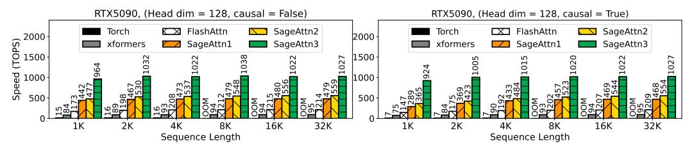

Figure 4: Speed comparison between SageAttention3 and Baselines (RTX5090, headim=128).

<span id="page-6-1"></span>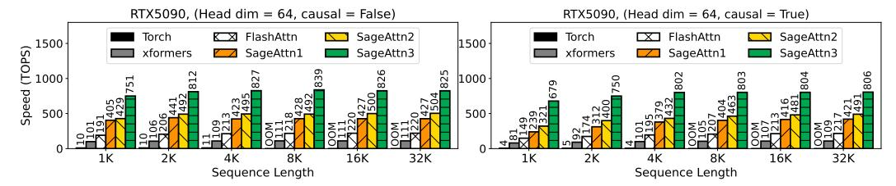

Figure 5: Speed comparison between SageAttention3 and Baselines (RTX5090, headim=64).

<span id="page-6-2"></span>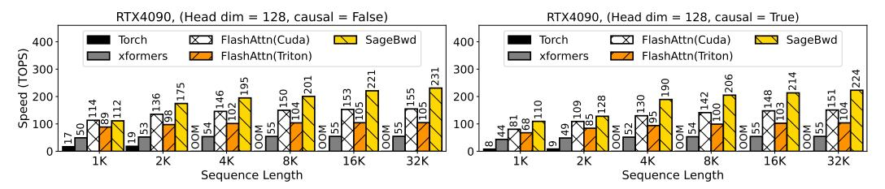

Figure 6: Speed comparison between SageBwd and Baselines (RTX4090, headim=128).

<span id="page-6-3"></span>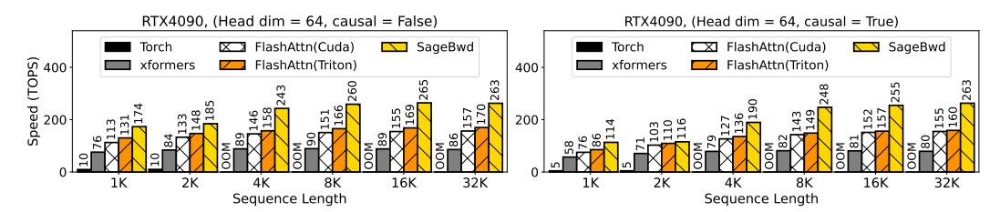

Figure 7: Speed comparison between SageBwd and Baselines (RTX4090, headim=64).

Table 2: End-to-end metrics comparison on various models.

<span id="page-6-4"></span>

| Model            | Attention              | CLIPSIM ↑ | CLIP-T↑ | VQA-a↑  | VQA-t↑  | FScore ↑ |
|------------------|------------------------|-----------|---------|---------|---------|----------|
|                  | Full-Precision (16bit) | 0.1865    | 0.9968  | 70.476  | 69.875  | 4.780    |
| CogvideoX        | SageAttention2 (8bit)  | 0.1880    | 0.9969  | 69.414  | 70.750  | 4.534    |
|                  | SageAttention3 (4bit)  | 0.1881    | 0.9969  | 69.860  | 70.364  | 4.035    |
|                  | Full-Precision (16bit) | 0.1838    | 0.9993  | 68.998  | 78.891  | 1.4793   |
| Hunyuan<br>Video | SageAttention2 (8bit)  | 0.1836    | 0.9993  | 69.497  | 77.019  | 1.4741   |
| video            | SageAttention3 (4bit)  | 0.1866    | 0.9993  | 70.552  | 75.440  | 1.232    |
|                  | Full-Precision (16bit) | 0.1828    | 0.9990  | 61.9840 | 61.0000 | 1.8042   |
| Mochi            | SageAttention2 (8bit)  | 0.1819    | 0.9990  | 61.0093 | 60.3732 | 1.7539   |
| -                | SageAttention3 (4bit)  | 0.1800    | 0.9993  | 61.863  | 59.429  | 1.649    |
| Model            | Attention              | FID ↓     | sFID .  | ļ C     | LIP ↑   | IR↑      |
|                  | Full-Precision (16bit) | 162.812   | 146.98  | 0 3     | 1.409   | 0.91     |
| Flux             | SageAttention2 (8bit)  | 163.107   | 146.21  | 3 3     | 31.436  |          |
|                  | SageAttention3 (4bit)  | 162.121   | 142.83  | 9 3     | 1.450   | 0.94     |
| Stable-Di        | Full-Precision (16bit) | 166.421   | 146.37  | 9 :     | 31.93   | 0.93     |
|                  | SageAttention( (Shit)  | 164.986   | 148.55  | 7 (     | 32.01   | 0.93     |
| ffusion3.5       | SageAttention3 (4bit)  | 166.102   | 145.58  | 7 :     | 32.01   | 0.92     |

<span id="page-7-0"></span>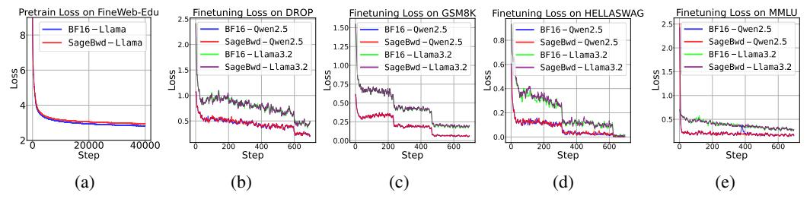

Figure 8: Pretraining and Finetuing loss curves of BF16 and 8-bit attention.

<span id="page-7-1"></span> $GSM8K(\text{Acc}\uparrow)$  $DROP(\text{F1}\uparrow)$  $HELLASWAG(\mathsf{Acc}\uparrow)$ Model Method  $MMLU_{(Acc\uparrow)}$ 0.521 0.733 0.569 0.905 BF16 Qwen2.5(1.5B)0.734 0.574 0.911 SageBwd 0.520 BF16 0.601 0.785 0.640 0.944 Qwen2.5 (3B)0.607 0.782 0.653 0.943 SageBwd 0.259 0.641 0.464 0.828 BF16 Llama3.2(1B)0.268 0.637 0.458 0.823 SageBwd

Table 3: 8-bit attention finetune results on Qwen2.5 and Llama3.2 models.

### 5 Experiments

**Main results.** SageAttention3 is faster than FlashAttention and xformers by  $5 \times$  and  $11 \times$  on RTX5090, and maintains end-to-end metrics across various models. Furthermore, SageBwd is faster than FlashAttention and xformers by  $1.67 \times$  and  $3 \times$  on RTX4090, and achieves no measurable degradation in fine-tuning tasks.

#### 5.1 Setup

Models and attentions. We validate the effectiveness of SageAttention3 and SageBwd across a diverse set of representative models from language, image, and video generation. Specifically, we conduct experiments on: Qwen2.5 [13] and Llama3.2 [14] for text2text, CogvideoX [15], HunyuanVideo [16], and Mochi [17] for text2video, Flux [18], and Stable-Diffusion3.5 [19] for text2image. We compare our method with FlashAttention2 [20], xformers [21], SageAttention [3], and SageAttention2 [4]. Please note that FlashAttention3 can only run on Hopper GPUs, so FlashAttention2 is already the fastest version for RTX5090 and RTX4090.

**Datasets, metrics, and hyperparameters.** For the details about the datasets, metrics, and hyperparameters we used, please refer to Appendix A.3.

**Implementation.** We implement SageAttention3 using CUTLASS [22] and CUDA, and implement SageBwd using OpenAI Triton [23].

<span id="page-7-2"></span>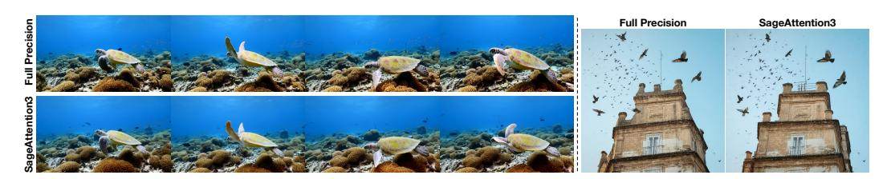

Figure 9: Visible examples of video generation on HunyuanVideo (left) and image generation on Stable-Diffusion3.5 (right).

Table 4: End-to-end speedup performance using SageAttention3 and SageBwd.

<span id="page-8-0"></span>(a) Inference latency using SageAttention3.

(b) One iteration training latency using SageBwd.

| Model          | Original | Sage1            | Sage2 | Sage3 |
|----------------|----------|------------------|-------|-------|
| CogvideoX (2B) | 64 s     | 55 s             | 46 s  | 27 s  |
| HunyuanVideo   | 489 s    | $257 \mathrm{s}$ | 240 s | 164 s |

| Model                            | Original         | SageBwd |  |  |
|----------------------------------|------------------|---------|--|--|
| Llama (8K)                       | 2.1 s            | 1.9 s   |  |  |
| $\mathtt{Llama}\left(16K\right)$ | $6.0 \mathrm{s}$ | 5.2 s   |  |  |

#### **5.2** Efficiency and Effectiveness

**Kernel Speed.** Fig. 4 and 5 show the kernel speed of SageAttention3 and baselines on RTX5090. We can see that SageAttention3 achieves  $4\sim5\times$  speedup over FlashAttention2 and  $8\sim11\times$  speedup over xformers. Fig. 6 and 7 show the forward+backward speed of SageBwd and baselines on RTX4090. It shows that SageBwd achieves **1.67**× speedup at most than FlashAttention2 and a higher speedup than FlashAttention2 implemented in Triton and xformers.

**End-to-end metrics loss of SageAttention3.** In Table 2, we compare the end-to-end quality metrics on various models using SageAttention3 and other attention methods. The results demonstrate that SageAttention3 almost incurs almost no end-to-end quality loss across these models.

End-to-end metrics loss of SageBwd. To evaluate the effectiveness of SageBwd on training tasks, we conduct two experiments. First, we fine-tune the base models of Qwen2.5 (3B) and Llama3.2 (1B) on GSM8K [24], DROP [25], MMLU [26], and HELLASWAG [27] datasets. Fig. 8 (b-e) shows the fine-tuning loss results, indicating that SageBwd perfectly aligns with BF16. Moreover, our evaluation of the fine-tuned models' answer quality across multiple test datasets (Table 3) demonstrates that SageBwd achieves the same performance as BF16. Second, we conduct pre-training tasks on FineWebEdu [28] using a Llama (400M) [29] model. Fig. 8 (a) shows the loss curve, indicating that while SageBwd can achieve loss convergence, its convergence speed is relatively slow. This limitation restricts its applicability in pretraining tasks.

**Visible example.** Fig. 9 visualizes some comparative examples of video generation on HunyuanVideo and image generation on Stable-diffsion3.5 using SageAttention3. The results demonstrate that SageAttention3 maintains full generation quality. Additional visible examples are provided in Fig. 10, 11, 13, and 14 in the Appendix.

**End-to-end speedup.** Table 4(a) and 4(b) summarize end-to-end inference and training latency improvements. The results show that SageAttention3 (Table 4(a)) achieved about  $3\times$  (HunyuanVideo) and  $2.4\times$  (CogVideoX) end-to-end inference generation speedups on RTX5090. Furthermore, SageBwd (Table 4(b)) accelerates the training of Llama (1B) by about  $1.15\times$  using 8K/16K token micro-batches on RTX4090.

#### <span id="page-8-1"></span>5.3 Benefit of Using Both SageAttention3 and SageBwd

Table 5: Comparison between BF16 and INT8 fine-tuning followed by FP4 inference.

(a) Qwen2.5-1.5B results.

(b) Qwen2.5-3B results.

| Method              | GSM8k↑ | MMLU ↑ |
|---------------------|--------|--------|
| BF16 Fine-tuning    | 0.4912 | 0.4688 |
| SageBwd Fine-tuning | 0.5232 | 0.4934 |

| Method              | GSM8k↑ | MMLU 1 |
|---------------------|--------|--------|
| BF16 Fine-tuning    | 0.5860 | 0.6000 |
| SageBwd Fine-tuning | 0.5945 | 0.6032 |

We first apply SageBwd during fine-tuning, followed by SageAttention3 during inference. Specifically, we fine-tuned Qwen2.5 for 1,000 steps using either BF16 or SageBwd, and then evaluated inference performance using SageAttention3. The results on GSM8k and MMLU are shown in Table 5, INT8 SageBwd fine-tuning followed by FP4 SageAttention3 inference achieves higher accuracy on GSM8k and MMLU, suggesting the approaches are complementary. This improvement is likely because INT8 and FP4 share a more similar representable data distribution, reducing the mismatch error compared to BF16.

### <span id="page-9-0"></span>5.4 INT8 SageBwd vs FP8 SageBwd

We choose INT8 for SageBwd for two key reasons: (1) Higher gradient accuracy in attention backward. The backward of INT8 attention yields more accurate gradients for Q, K, and V compared to FP8. We evaluate all layers of CogVideoX-2B and report the L1 error and cosine similarity of the gradients in Table [6](#page-9-1) and Table [7.](#page-9-1) For fairness, dOV<sup>⊤</sup> is kept in FP16 for both methods. As shown in the results, INT8 SageBwd achieves lower L1 error and higher cosine similarity than FP8 SageBwd. (2) Wider hardware support. INT8 is supported on almost all modern GPUs, including NVIDIA A100 and many non-NVIDIA devices (e.g., AMD MI250 [\[30\]](#page-11-14), Ascend 910B [\[31\]](#page-11-15)), while FP8 support remains limited to newer architectures. Addintionally, we fine-tune Qwen2.5-1.5B and Qwen2.5-3B for 1,000 steps using either INT8 or FP8 SageBwd (both with dOV<sup>⊤</sup> kept in FP16 for fairness), and then inference with FP4 SageAttention3. As shown in Table [8,](#page-9-2) models fine-tuned with INT8 attention achieve higher accuracy on both GSM8K and MMLU benchmarks.

<span id="page-9-1"></span>Table 6: L1 error of Q, K, and V gradients.

| Method       | dQ ↓   | dK ↓   | dV ↓   |
|--------------|--------|--------|--------|
| INT8 SageBwd | 0.0290 | 0.0317 | 0.0423 |
| FP8 SageBwd  | 0.0696 | 0.0999 | 0.0873 |

Table 7: Cos similarity of Q, K, and V gradients.

| Method       | dQ ↑   | dK ↑   | dV ↑   |
|--------------|--------|--------|--------|
| INT8 SageBwd | 0.9987 | 0.9993 | 0.9995 |
| FP8 SageBwd  | 0.9880 | 0.9910 | 0.9955 |

<span id="page-9-2"></span>Table 8: Comparison of INT8 and FP8 SageBwd fine-tuning on Qwen2.5 models.

(a) Qwen2.5-1.5B

|  | (b) Qwen2.5-3B |  |
|--|----------------|--|
|--|----------------|--|

| Method           | GSM8K ↑ | MMLU ↑ |
|------------------|---------|--------|
| INT8 Fine-tuning | 0.5232  | 0.4934 |
| FP8 Fine-tuning  | 0.5031  | 0.4689 |

| Method           | GSM8K ↑ | MMLU ↑ |
|------------------|---------|--------|
| INT8 Fine-tuning | 0.5945  | 0.6032 |
| FP8 Fine-tuning  | 0.5868  | 0.5907 |

### 6 Related Work

Recent efficient attention works [\[2\]](#page-10-1) that utilize hardware features to accelerate attention computation methods mainly include the following: FlashAttention [\[32\]](#page-12-0) introduces tiling to reduce the GPU memory I/O between global memory and on-chip SRAM, achieving significant speedup. FlashAttention2 [\[20\]](#page-11-4) improves the parallelism and warp partition strategies. FlashAttention3 [\[33\]](#page-12-1) exclusively optimizes the kernel speed on the Hopper GPUs. xformers [\[21\]](#page-11-5) accelerates attention using dedicated CUDA kernels. SageAttention [\[3\]](#page-10-2) and SageAttention2 [\[4,](#page-10-3) [34\]](#page-12-2) accelerate attention using quantization and some novel outlier smoothing techniques. RingAttention [\[35\]](#page-12-3) extends FlashAttention to multi-GPU/Node environments. In these works, although FlashAttention3 proposes a version of FP8 attention, it has failed to be applied to video generation models in a plug-and-play way [\[4\]](#page-10-3). Moreover, the FP8 attention in FlashAttention3 does not support the backward pass, limiting its applicability to training tasks. Additionally, numerous efficient attention variants have emerged, including linear attention [\[36,](#page-12-4) [37,](#page-12-5) [38,](#page-12-6) [39,](#page-12-7) [40,](#page-12-8) [41\]](#page-12-9) and sparse attention [\[42,](#page-12-10) [43,](#page-12-11) [44,](#page-12-12) [45,](#page-12-13) [46,](#page-12-14) [47,](#page-12-15) [48,](#page-13-0) [49,](#page-13-1) [50,](#page-13-2) [51,](#page-13-3) [52,](#page-13-4) [53,](#page-13-5) [54\]](#page-13-6). Although these works represent promising research directions, they are orthogonal to our work.

### 7 Conclusions

In this paper, we make two key contributions. Firstly, we design SageAttention3, the first microscaling FP4 attention for inference acceleration, achieving 1038 TOPS on RTX5090, which is a 5× speedup than the fastest FlashAttention on RTX5090. Experiments show that SageAttention3 could accelerate various models with no end-to-end quality metrics degradation. Secondly, we introduce the first trainable 8-bit attention (SageBwd) for training acceleration and explore its feasibility in training tasks. We find that the 8-bit attention could achieve lossless performance in fine-tuning tasks, but currently has some limitations in pertaining tasks.

Future Work. First, while SageBwd demonstrates faster performance than FP16 implementation, we observe a noticeable gap between its current speed and theoretical upper bounds. This gap may be caused by suboptimal Triton kernel implementations, which we plan to further optimize. Second, and more importantly, investigating the application of low-bit attention in pretraining tasks presents a promising research direction worthy of exploration.

## Acknowledgments

This work was supported by the NSFC Projects (Nos. 62550004, 92270001, 62376131). J.Z is also supported by the XPlorer Prize.

### References

- <span id="page-10-0"></span>[1] A Vaswani. Attention is all you need. *Advances in Neural Information Processing Systems*, 2017.
- <span id="page-10-1"></span>[2] Jintao Zhang, Rundong Su, Chunyu Liu, Jia Wei, Ziteng Wang, Pengle Zhang, Haoxu Wang, Huiqiang Jiang, Haofeng Huang, Chendong Xiang, et al. A survey of efficient attention methods: Hardware-efficient, sparse, compact, and linear attention.
- <span id="page-10-2"></span>[3] Jintao Zhang, Jia Wei, Pengle Zhang, Jianfei Chen, and Jun Zhu. Sageattention: Accurate 8-bit attention for plug-and-play inference acceleration. In *The International Conference on Learning Representations*, 2025.
- <span id="page-10-3"></span>[4] Jintao Zhang, Haofeng Huang, Pengle Zhang, Jia Wei, Jun Zhu, and Jianfei Chen. Sageattention2: Efficient attention with thorough outlier smoothing and per-thread int4 quantization. In *International Conference on Machine Learning (ICML)*, 2025.
- <span id="page-10-4"></span>[5] Jintao Zhang, Kaiwen Zheng, Kai Jiang, Haoxu Wang, Ion Stoica, Joseph E Gonzalez, Jianfei Chen, and Jun Zhu. Turbodiffusion: Accelerating video diffusion models by 100-200 times. *arXiv preprint arXiv:2512.16093*, 2025.
- <span id="page-10-5"></span>[6] Jianfei Chen, Yu Gai, Zhewei Yao, Michael W Mahoney, and Joseph E Gonzalez. A statistical framework for low-bitwidth training of deep neural networks. *Advances in neural information processing systems*, 33:883–894, 2020.
- <span id="page-10-6"></span>[7] NVIDIA. Nvidia rtx blackwell gpu architecture. [https://images.nvidia.com/aem-dam/](https://images.nvidia.com/aem-dam/Solutions/geforce/blackwell/nvidia-rtx-blackwell-gpu-architecture.pdf) [Solutions/geforce/blackwell/nvidia-rtx-blackwell-gpu-architecture.pdf](https://images.nvidia.com/aem-dam/Solutions/geforce/blackwell/nvidia-rtx-blackwell-gpu-architecture.pdf).
- <span id="page-10-7"></span>[8] Bita Darvish Rouhani, Ritchie Zhao, Ankit More, Mathew Hall, Alireza Khodamoradi, Summer Deng, Dhruv Choudhary, Marius Cornea, Eric Dellinger, Kristof Denolf, et al. Microscaling data formats for deep learning. *arXiv preprint arXiv:2310.10537*, 2023.
- <span id="page-10-8"></span>[9] Paulius Micikevicius, Dusan Stosic, Neil Burgess, Marius Cornea, Pradeep Dubey, Richard Grisenthwaite, Sangwon Ha, Alexander Heinecke, Patrick Judd, John Kamalu, et al. Fp8 formats for deep learning. *arXiv preprint arXiv:2209.05433*, 2022.
- <span id="page-10-9"></span>[10] Maxim Milakov and Natalia Gimelshein. Online normalizer calculation for softmax. *arXiv preprint arXiv:1805.02867*, 2018.
- <span id="page-10-10"></span>[11] NVIDIA. Parallel Thread Execution ISA Version 8.7. [https://docs.nvidia.com/cuda/](https://docs.nvidia.com/cuda/pdf/ptx_isa_8.4.pdf) [pdf/ptx\\_isa\\_8.4.pdf](https://docs.nvidia.com/cuda/pdf/ptx_isa_8.4.pdf), 2025. Accessed: 2025-05-16.
- <span id="page-10-11"></span>[12] NVIDIA. Efficient gemm in cuda. [https://docs.nvidia.com/cutlass/media/docs/](https://docs.nvidia.com/cutlass/media/docs/cpp/efficient_gemm.html) [cpp/efficient\\_gemm.html](https://docs.nvidia.com/cutlass/media/docs/cpp/efficient_gemm.html), 2025. Accessed: 2025-05-16.
- <span id="page-10-12"></span>[13] An Yang, Baosong Yang, Beichen Zhang, Binyuan Hui, Bo Zheng, Bowen Yu, Chengyuan Li, Dayiheng Liu, Fei Huang, Haoran Wei, et al. Qwen2. 5 technical report. *arXiv preprint arXiv:2412.15115*, 2024.
- <span id="page-10-13"></span>[14] Abhimanyu Dubey, Abhinav Jauhri, Abhinav Pandey, Abhishek Kadian, Ahmad Al-Dahle, Aiesha Letman, Akhil Mathur, Alan Schelten, Amy Yang, Angela Fan, et al. The llama 3 herd of models. *arXiv preprint arXiv:2407.21783*, 2024.
- <span id="page-10-14"></span>[15] Zhuoyi Yang, Jiayan Teng, Wendi Zheng, Ming Ding, Shiyu Huang, Jiazheng Xu, Yuanming Yang, Wenyi Hong, Xiaohan Zhang, Guanyu Feng, et al. Cogvideox: Text-to-video diffusion models with an expert transformer. In *The Thirteenth International Conference on Learning Representations*, 2025.

- <span id="page-11-0"></span>[16] Weijie Kong, Qi Tian, Zijian Zhang, Rox Min, Zuozhuo Dai, Jin Zhou, Jiangfeng Xiong, Xin Li, Bo Wu, Jianwei Zhang, Kathrina Wu, Qin Lin, Aladdin Wang, Andong Wang, Changlin Li, Duojun Huang, Fang Yang, Hao Tan, Hongmei Wang, Jacob Song, Jiawang Bai, Jianbing Wu, Jinbao Xue, Joey Wang, Junkun Yuan, Kai Wang, Mengyang Liu, Pengyu Li, Shuai Li, Weiyan Wang, Wenqing Yu, Xinchi Deng, Yang Li, Yanxin Long, Yi Chen, Yutao Cui, Yuanbo Peng, Zhentao Yu, Zhiyu He, Zhiyong Xu, Zixiang Zhou, Zunnan Xu, Yangyu Tao, Qinglin Lu, Songtao Liu, Daquan Zhou, Hongfa Wang, Yong Yang, Di Wang, Yuhong Liu, Jie Jiang, and Caesar Zhong. Hunyuanvideo: A systematic framework for large video generative models. *arXiv preprint arXiv:2412.03603*, 2024.
- <span id="page-11-1"></span>[17] Genmo Team. Mochi 1. <https://github.com/genmoai/models>, 2024.
- <span id="page-11-2"></span>[18] Black Forest Labs. Flux. <https://github.com/black-forest-labs/flux>, 2023.
- <span id="page-11-3"></span>[19] Stability AI. Introducing stable diffusion 3.5. [https://stability.ai/news/](https://stability.ai/news/introducing-stable-diffusion-3-5) [introducing-stable-diffusion-3-5](https://stability.ai/news/introducing-stable-diffusion-3-5), 2023.
- <span id="page-11-4"></span>[20] Tri Dao. Flashattention-2: Faster attention with better parallelism and work partitioning. In *The Twelfth International Conference on Learning Representations*, 2024.
- <span id="page-11-5"></span>[21] Benjamin Lefaudeux, Francisco Massa, Diana Liskovich, Wenhan Xiong, Vittorio Caggiano, Sean Naren, Min Xu, Jieru Hu, Marta Tintore, Susan Zhang, Patrick Labatut, Daniel Haziza, Luca Wehrstedt, Jeremy Reizenstein, and Grigory Sizov. xformers: A modular and hackable transformer modelling library. <https://github.com/facebookresearch/xformers>, 2022.
- <span id="page-11-6"></span>[22] NVIDIA. CUTLASS: CUDA Templates for Linear Algebra Subroutines and Solvers. GitHub repository, 2023.
- <span id="page-11-7"></span>[23] Philippe Tillet, H. T. Kung, and David Cox. Triton: an intermediate language and compiler for tiled neural network computations. MAPL 2019, page 10–19, New York, NY, USA, 2019. Association for Computing Machinery.
- <span id="page-11-8"></span>[24] Karl Cobbe, Vineet Kosaraju, Mohammad Bavarian, Mark Chen, Heewoo Jun, Lukasz Kaiser, Matthias Plappert, Jerry Tworek, Jacob Hilton, Reiichiro Nakano, Christopher Hesse, and John Schulman. Training verifiers to solve math word problems. *arXiv preprint arXiv:2110.14168*, 2021.
- <span id="page-11-9"></span>[25] Dheeru Dua, Yizhong Wang, Pradeep Dasigi, Gabriel Stanovsky, Sameer Singh, and Matt Gardner. DROP: A reading comprehension benchmark requiring discrete reasoning over paragraphs. In *Proc. of NAACL*, 2019.
- <span id="page-11-10"></span>[26] Dan Hendrycks, Collin Burns, Steven Basart, Andy Zou, Mantas Mazeika, Dawn Song, and Jacob Steinhardt. Measuring massive multitask language understanding. *Proceedings of the International Conference on Learning Representations (ICLR)*, 2021.
- <span id="page-11-11"></span>[27] Rowan Zellers, Ari Holtzman, Yonatan Bisk, Ali Farhadi, and Yejin Choi. Hellaswag: Can a machine really finish your sentence? In *Proceedings of the 57th Annual Meeting of the Association for Computational Linguistics*, 2019.
- <span id="page-11-12"></span>[28] Anton Lozhkov, Loubna Ben Allal, Leandro von Werra, and Thomas Wolf. Fineweb-edu: the finest collection of educational content, 2024.
- <span id="page-11-13"></span>[29] Hugo Touvron, Thibaut Lavril, Gautier Izacard, Xavier Martinet, Marie-Anne Lachaux, Timothée Lacroix, Baptiste Rozière, Naman Goyal, Eric Hambro, Faisal Azhar, et al. Llama: Open and efficient foundation language models. *arXiv preprint arXiv:2302.13971*, 2023.
- <span id="page-11-14"></span>[30] AMD. Amd instinct mi250 gpu architecture. [https://rocm.docs.amd.com/en/docs-6.4.](https://rocm.docs.amd.com/en/docs-6.4.2/conceptual/gpu-arch/mi250.html) [2/conceptual/gpu-arch/mi250.html](https://rocm.docs.amd.com/en/docs-6.4.2/conceptual/gpu-arch/mi250.html), 2024. Accessed: 2025-10-21, ROCm Documentation.
- <span id="page-11-15"></span>[31] Heng Liao, Jiajin Tu, Jing Xia, Hu Liu, Xiping Zhou, Honghui Yuan, and Yuxing Hu. Ascend: a scalable and unified architecture for ubiquitous deep neural network computing: Industry track paper. In *2021 IEEE International Symposium on High-Performance Computer Architecture (HPCA)*, pages 789–801. IEEE, 2021.

- <span id="page-12-0"></span>[32] Tri Dao, Daniel Y Fu, Stefano Ermon, Atri Rudra, and Christopher Re. Flashattention: Fast and memory-efficient exact attention with IO-awareness. In Alice H. Oh, Alekh Agarwal, Danielle Belgrave, and Kyunghyun Cho, editors, *Advances in Neural Information Processing Systems*, 2022.
- <span id="page-12-1"></span>[33] Jay Shah, Ganesh Bikshandi, Ying Zhang, Vijay Thakkar, Pradeep Ramani, and Tri Dao. Flashattention-3: Fast and accurate attention with asynchrony and low-precision. In *The Thirty-eighth Annual Conference on Neural Information Processing Systems*, 2024.
- <span id="page-12-2"></span>[34] Jintao Zhang, Xiaoming Xu, Jia Wei, Haofeng Huang, Pengle Zhang, Chendong Xiang, Jun Zhu, and Jianfei Chen. Sageattention2++: A more efficient implementation of sageattention2. *arXiv preprint arXiv:2505.21136*, 2025.
- <span id="page-12-3"></span>[35] Hao Liu, Matei Zaharia, and Pieter Abbeel. Ringattention with blockwise transformers for near-infinite context. In *The Twelfth International Conference on Learning Representations*, 2024.
- <span id="page-12-4"></span>[36] Sinong Wang, Belinda Z Li, Madian Khabsa, Han Fang, and Hao Ma. Linformer: Self-attention with linear complexity. *arXiv preprint arXiv:2006.04768*, 2020.
- <span id="page-12-5"></span>[37] Krzysztof Marcin Choromanski, Valerii Likhosherstov, David Dohan, Xingyou Song, Andreea Gane, Tamas Sarlos, Peter Hawkins, Jared Quincy Davis, Afroz Mohiuddin, Lukasz Kaiser, David Benjamin Belanger, Lucy J Colwell, and Adrian Weller. Rethinking attention with performers. In *International Conference on Learning Representations*, 2021.
- <span id="page-12-6"></span>[38] Weihao Yu, Mi Luo, Pan Zhou, Chenyang Si, Yichen Zhou, Xinchao Wang, Jiashi Feng, and Shuicheng Yan. Metaformer is actually what you need for vision. In *Proceedings of the IEEE/CVF conference on computer vision and pattern recognition*, pages 10819–10829, 2022.
- <span id="page-12-7"></span>[39] Angelos Katharopoulos, Apoorv Vyas, Nikolaos Pappas, and François Fleuret. Transformers are rnns: Fast autoregressive transformers with linear attention. In *International conference on machine learning*, pages 5156–5165. PMLR, 2020.
- <span id="page-12-8"></span>[40] Zhen Qin, Weigao Sun, Dong Li, Xuyang Shen, Weixuan Sun, and Yiran Zhong. Lightning attention-2: A free lunch for handling unlimited sequence lengths in large language models. *arXiv preprint arXiv:2401.04658*, 2024.
- <span id="page-12-9"></span>[41] Songlin Yang, Jan Kautz, and Ali Hatamizadeh. Gated delta networks: Improving mamba2 with delta rule. *arXiv preprint arXiv:2412.06464*, 2024.
- <span id="page-12-10"></span>[42] Jintao Zhang, Chendong Xiang, Haofeng Huang, Jia Wei, Haocheng Xi, Jun Zhu, and Jianfei Chen. Spargeattn: Accurate sparse attention accelerating any model inference. In *International Conference on Machine Learning (ICML)*, 2025.
- <span id="page-12-11"></span>[43] Jintao Zhang, Haoxu Wang, Kai Jiang, Shuo Yang, Kaiwen Zheng, Haocheng Xi, Ziteng Wang, Hongzhou Zhu, Min Zhao, Ion Stoica, et al. Sla: Beyond sparsity in diffusion transformers via fine-tunable sparse-linear attention. *arXiv preprint arXiv:2509.24006*, 2025.
- <span id="page-12-12"></span>[44] Haocheng Xi, Shuo Yang, Yilong Zhao, Chenfeng Xu, Muyang Li, Xiuyu Li, Yujun Lin, Han Cai, Jintao Zhang, Dacheng Li, et al. Sparse videogen: Accelerating video diffusion transformers with spatial-temporal sparsity. *arXiv preprint arXiv:2502.01776*, 2025.
- <span id="page-12-13"></span>[45] Shuo Yang, Haocheng Xi, Yilong Zhao, Muyang Li, Jintao Zhang, Han Cai, Yujun Lin, Xiuyu Li, Chenfeng Xu, Kelly Peng, et al. Sparse videogen2: Accelerate video generation with sparse attention via semantic-aware permutation. *arXiv preprint arXiv:2505.18875*, 2025.
- <span id="page-12-14"></span>[46] Ze Liu, Yutong Lin, Yue Cao, Han Hu, Yixuan Wei, Zheng Zhang, Stephen Lin, and Baining Guo. Swin transformer: Hierarchical vision transformer using shifted windows. In *Proceedings of the IEEE/CVF international conference on computer vision*, pages 10012–10022, 2021.
- <span id="page-12-15"></span>[47] Xiangxiang Chu, Zhi Tian, Yuqing Wang, Bo Zhang, Haibing Ren, Xiaolin Wei, Huaxia Xia, and Chunhua Shen. Twins: Revisiting the design of spatial attention in vision transformers. In A. Beygelzimer, Y. Dauphin, P. Liang, and J. Wortman Vaughan, editors, *Advances in Neural Information Processing Systems*, 2021.

- <span id="page-13-0"></span>[48] Guangxuan Xiao, Yuandong Tian, Beidi Chen, Song Han, and Mike Lewis. Efficient streaming language models with attention sinks. In *The Twelfth International Conference on Learning Representations*, 2024.
- <span id="page-13-1"></span>[49] Chaojun Xiao, Pengle Zhang, Xu Han, Guangxuan Xiao, Yankai Lin, Zhengyan Zhang, Zhiyuan Liu, and Maosong Sun. Infllm: Training-free long-context extrapolation for llms with an efficient context memory. In *First Workshop on Long-Context Foundation Models@ ICML 2024*, 2024.
- <span id="page-13-2"></span>[50] Yukang Chen, Shengju Qian, Haotian Tang, Xin Lai, Zhijian Liu, Song Han, and Jiaya Jia. Longlora: Efficient fine-tuning of long-context large language models. In *The International Conference on Learning Representations*, 2024.
- <span id="page-13-3"></span>[51] Huiqiang Jiang, YUCHENG LI, Chengruidong Zhang, Qianhui Wu, Xufang Luo, Surin Ahn, Zhenhua Han, Amir H. Abdi, Dongsheng Li, Chin-Yew Lin, Yuqing Yang, and Lili Qiu. MInference 1.0: Accelerating pre-filling for long-context LLMs via dynamic sparse attention. In *The Thirty-eighth Annual Conference on Neural Information Processing Systems*, 2024.
- <span id="page-13-4"></span>[52] Shashanka Venkataramanan, Amir Ghodrati, Yuki M Asano, Fatih Porikli, and Amir Habibian. Skip-attention: Improving vision transformers by paying less attention. In *The Twelfth International Conference on Learning Representations*, 2024.
- <span id="page-13-5"></span>[53] Yizhao Gao, Zhichen Zeng, Dayou Du, Shijie Cao, Hayden Kwok-Hay So, Ting Cao, Fan Yang, and Mao Yang. Seerattention: Learning intrinsic sparse attention in your llms. *arXiv preprint arXiv:2410.13276*, 2024.
- <span id="page-13-6"></span>[54] Tianyu Fu, Haofeng Huang, Xuefei Ning, Genghan Zhang, Boju Chen, Tianqi Wu, Hongyi Wang, Zixiao Huang, Shiyao Li, Shengen Yan, Guohao Dai, Huazhong Yang, and Yu Wang. Moa: Mixture of sparse attention for automatic large language model compression. *arXiv preprint arXiv:2406.14909*, 2024.
- <span id="page-13-7"></span>[55] Zangwei Zheng, Xiangyu Peng, Tianji Yang, Chenhui Shen, Shenggui Li, Hongxin Liu, Yukun Zhou, Tianyi Li, and Yang You. Open-sora: Democratizing efficient video production for all. *arXiv preprint arXiv:2412.20404*, 2024.
- <span id="page-13-8"></span>[56] Tsung-Yi Lin, Michael Maire, Serge Belongie, James Hays, Pietro Perona, Deva Ramanan, Piotr Dollár, and C Lawrence Zitnick. Microsoft coco: Common objects in context. In *Computer Vision–ECCV 2014: 13th European Conference, Zurich, Switzerland, September 6-12, 2014, Proceedings, Part V 13*, pages 740–755. Springer, 2014.
- <span id="page-13-9"></span>[57] Yaofang Liu, Xiaodong Cun, Xuebo Liu, Xintao Wang, Yong Zhang, Haoxin Chen, Yang Liu, Tieyong Zeng, Raymond Chan, and Ying Shan. Evalcrafter: Benchmarking and evaluating large video generation models. In *Proceedings of the IEEE/CVF Conference on Computer Vision and Pattern Recognition*, pages 22139–22149, 2024.
- <span id="page-13-10"></span>[58] Haoning Wu, Erli Zhang, Liang Liao, Chaofeng Chen, Jingwen Hou, Annan Wang, Wenxiu Sun, Qiong Yan, and Weisi Lin. Exploring video quality assessment on user generated contents from aesthetic and technical perspectives. In *Proceedings of the IEEE/CVF International Conference on Computer Vision*, pages 20144–20154, 2023.
- <span id="page-13-11"></span>[59] Martin Heusel, Hubert Ramsauer, Thomas Unterthiner, Bernhard Nessler, and Sepp Hochreiter. Gans trained by a two time-scale update rule converge to a local nash equilibrium. *Advances in neural information processing systems*, 30, 2017.
- <span id="page-13-12"></span>[60] Tim Salimans, Ian Goodfellow, Wojciech Zaremba, Vicki Cheung, Alec Radford, and Xi Chen. Improved techniques for training gans. *Advances in neural information processing systems*, 29, 2016.
- <span id="page-13-13"></span>[61] Jack Hessel, Ari Holtzman, Maxwell Forbes, Ronan Le Bras, and Yejin Choi. Clipscore: A reference-free evaluation metric for image captioning. In *Proceedings of the 2021 Conference on Empirical Methods in Natural Language Processing*, pages 7514–7528, 2021.

- <span id="page-14-0"></span>[62] Jiazheng Xu, Xiao Liu, Yuchen Wu, Yuxuan Tong, Qinkai Li, Ming Ding, Jie Tang, and Yuxiao Dong. Imagereward: Learning and evaluating human preferences for text-to-image generation. In *Thirty-seventh Conference on Neural Information Processing Systems*, 2023.
- <span id="page-14-1"></span>[63] Guangxuan Xiao, Ji Lin, Mickael Seznec, Hao Wu, Julien Demouth, and Song Han. Smoothquant: Accurate and efficient post-training quantization for large language models. In *International Conference on Machine Learning*, pages 38087–38099. PMLR, 2023.
- <span id="page-14-2"></span>[64] Ji Lin, Jiaming Tang, Haotian Tang, Shang Yang, Wei-Ming Chen, Wei-Chen Wang, Guangxuan Xiao, Xingyu Dang, Chuang Gan, and Song Han. Awq: Activation-aware weight quantization for llm compression and acceleration. In *MLSys*, 2024.

## A Appendix

### <span id="page-15-1"></span>A.1 Visible Comparison Examples

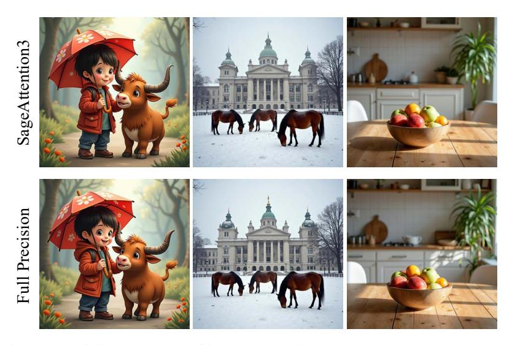

Figure 10: Visible examples of image generation on Stable-Diffusion3.5.

<span id="page-15-2"></span>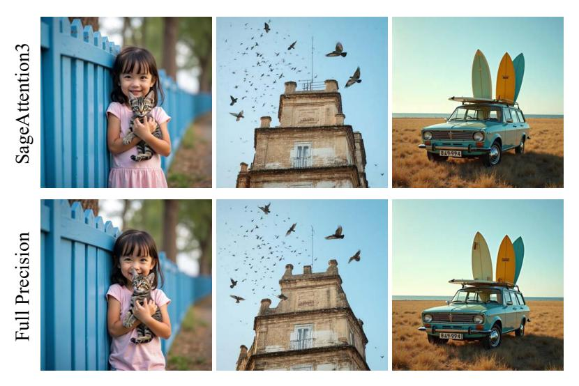

Figure 11: Visible examples of image generation on Flux.

<span id="page-15-0"></span>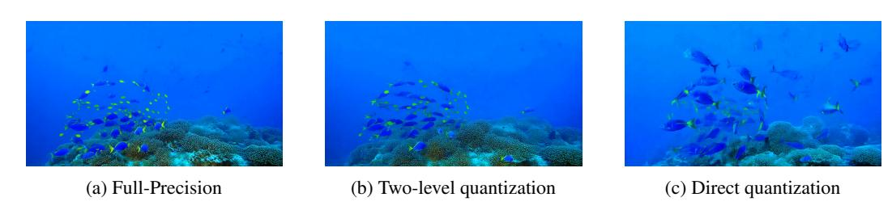

Figure 12: Visual comparison of different scale strategies for Pe from CogVideoX.

<span id="page-16-0"></span>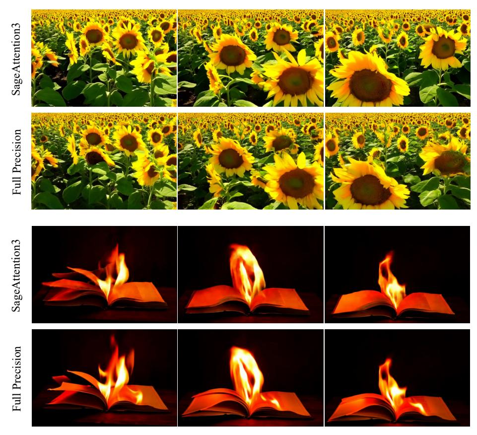

Figure 13: Visible examples of video generation on CogVideoX.

<span id="page-16-1"></span>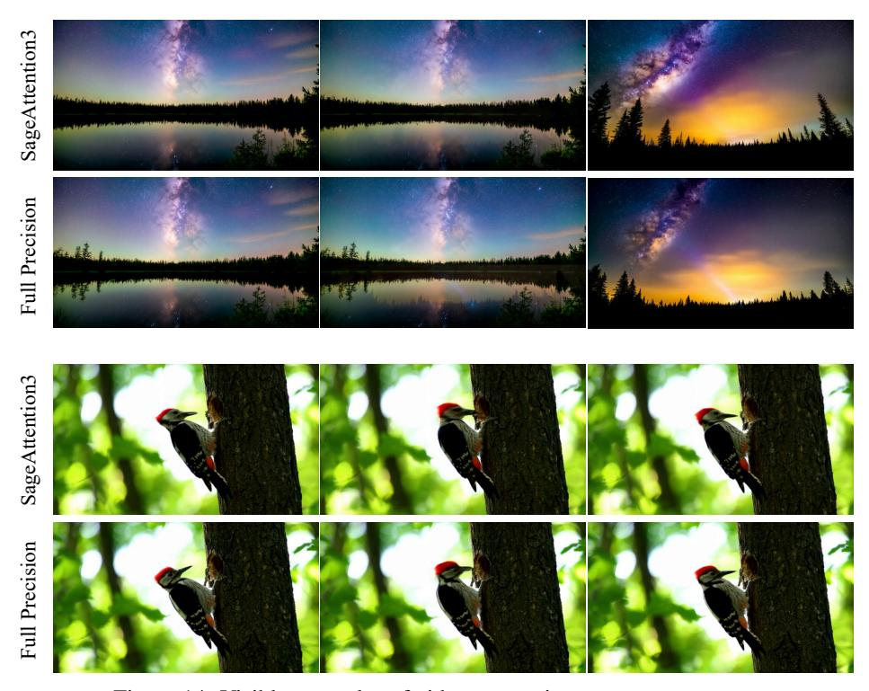

Figure 14: Visible examples of video generation on HunyuanVideo.

Fig. 10 and Fig. 11 show additional visual comparison examples of image generation tasks. Fig. 13 and Fig. 14 show more visual comparison examples of video generation tasks.

#### A.2 Additional Kernel Speed Comparison

Fig. 15 and Fig. 16 show the forward kernel speed of SageBwd. Fig. 17 and Fig. 18 show the backward kernel speed of SageBwd. SageBwd achieved a **2x** speed up than FlashAttention in the forward propagation. SageBwd achieved a 1.2~**1.6x** speed up than FlashAttention in the backward propagation.

<span id="page-17-0"></span>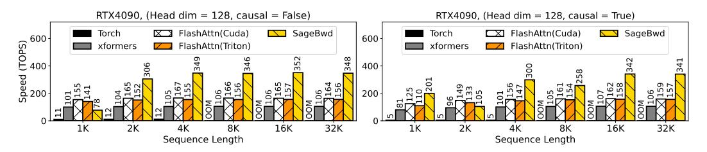

Figure 15: Forward speed comparison between SageBwd and Baselines (RTX4090, headim=128).

<span id="page-17-1"></span>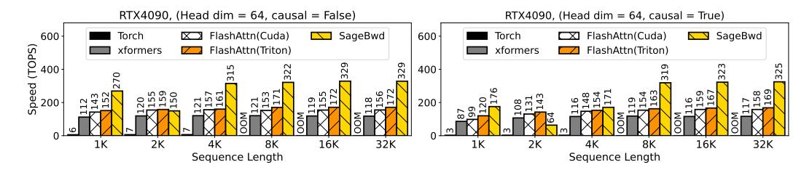

Figure 16: Forward speed comparison between SageBwd and Baselines (RTX4090, headim=64).

<span id="page-17-2"></span>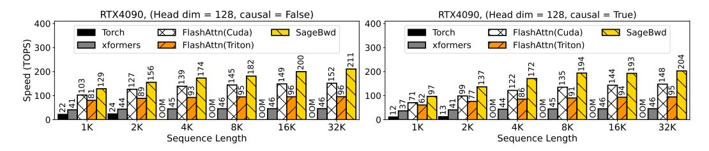

Figure 17: Backward speed comparison between SageBwd and Baselines (RTX4090, headim=128).

<span id="page-17-3"></span>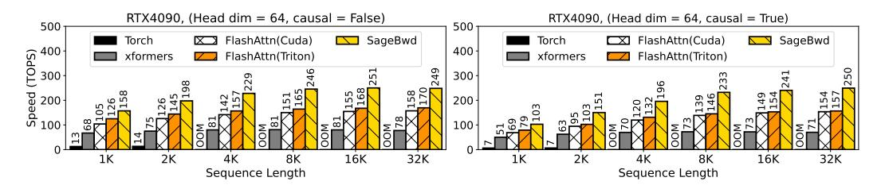

Figure 18: Backward speed comparison between SageBwd and Baselines (RTX4090, headim=64).

#### <span id="page-18-3"></span>A.3 Datasets, Metrics, and Hyperparameters

**Datasets.** Text-to-video models are evaluated using the open-sora [55] prompt sets. Text-to-image models are assessed on COCO annotations [56]. Language models are evaluated on GSM8K [24], DROP [25], MMLU [26], and HELLASWAG [27] datasets.

**End-to-end metrics.** For text-to-text models, we use Accuracy (Acc.) and F1-Score (F1). For text-to-video models, we evaluate the quality of generated videos on five metrics: CLIPSIM and CLIP-Temp (CLIP-T) [57] to measure the text-video alignment; (VQA-a) and (VQA-t) to assess the video aesthetic and technical quality, respectively; and Flow-score (FScore) for temporal consistency [58]. For text-to-image models, generated images are evaluated in three aspects: FID [59] and sFID [60] for fidelity evaluation, *Clipscore* (CLIP) [61] for text-image alignment, and *ImageReward* (IR) [62] for human preference.

Accuracy metrics. We use three metrics to assess the accuracy of quantized attention output O' compared to attention output in full-precision O: First, we flatten O' and O into vectors in the shape of  $1 \times n$ . Then, Cosine similarity:  $CosSim = \sum OO'/\sqrt{\sum O^2}\sqrt{\sum O'^2}$ , Relative L1 distance:  $L1 = \sum |O-O'|/\sum |O|$ , Root mean square error:  $RMSE = \sqrt{(1/n)\sum(O-O')^2}$ .

**Hyperparameters.** For pretraining tasks, we use a 400M model with a hidden size of 1024, 20 layers, an intermediate size of 3072, and 16 attention heads. The training uses a learning rate of 1e-3 with linear decay over 1000 warmup steps, and each step processes 2M tokens. For finetuning tasks, we train for 700 steps using a learning rate of 3e-5 with linear decay and 100 warmup steps with a batch size of 32 on GSM8K dataset and 128 on MMLU, DROP, and HELLASWAG datasets.

<span id="page-18-1"></span>

| T0{v0, v1} | T0{v2, v3}   | T0{v4, v5}   | T0{v6, v7}   | T1{v0, v1} | T1{v2, v3}   | T1{v4, v5}   | T1{v6, v7}   | T2{v0, v1} | T2{v2, v3}   | T2{v4, v5}   | T2{v6, v7}   | T3{v0, v1} | T3{v2, v3}   | T3{v4, v5}   | T3{v6, v7}   |
|------------|--------------|--------------|--------------|------------|--------------|--------------|--------------|------------|--------------|--------------|--------------|------------|--------------|--------------|--------------|
| T0{v8, v9} | T0{v10, v11} | T0{v12, v13} | T0{v14, v15} | T1{v8, v9} | T1{v10, v11} | T1{v12, v13} | T1{v14, v15} | T2{v8, v9} | T2{v10, v11} | T2{v12, v13} | T2{v14, v15} | T0{v8, v9} | T3{v10, v11} | T3{v12, v13} | T3{v14, v15} |

Figure 19: FP4 operand A register layout - rows 0 and 8, thread 0-3, entries 0-15.

<span id="page-18-0"></span>

|   | T0{v0, v1} | T1{v0, v1} | T2{v0, v1} | T3{v0, v1} | T0{v4, v5} | T1{v4, v5} | T2{v4, v5} | T3{v4, v5} | T0{v8, v9}   | T1{v8, v9}   | T0{v8, v9}   | T1{v8, v9}   | T0{v12, v13} | T1{v12, v13}  | T2{v12, v13} | T3{v12, v13} |
|---|------------|------------|------------|------------|------------|------------|------------|------------|--------------|--------------|--------------|--------------|--------------|---------------|--------------|--------------|
| ı | T0{v2, v3} | T1{v2, v3} | T2{v2, v3} | T3{v2, v3} | T0{v6, v7} | T1{v6, v7} | T2{v6, v7} | T3{v6, v7} | T0{v10, v11} | T1{v10, v11} | T2{v10, v113 | T3{v10, v11} | T0{v14, v15} | T1 (v14, v15) | T2{v14, v15} | T3{v14, v15} |
| L |            |            |            |            |            |            |            |            |              |              | ,,           |              |              |               |              |              |

Figure 20: FP32 accumulator register layout - rows 0 and 8, thread 0-3, entries 0-15.

<span id="page-18-2"></span>

|   | T0{v0, v1} | T1{v0, v1} | T2{v0, v1} | T3{v0, v1} | T0{v2, v3}   | T1{v2, v3}   | T2{v2, v3}   | T3{v2, v3}   | T0{v4, v5}   | T1{v4, v5}   | T2{v4, v5}   | T3{v4, v5}   | T0{v6, v7}   | T1{v6, v7}   | T2{v6, v7}   | T3{v6, v7}   |
|---|------------|------------|------------|------------|--------------|--------------|--------------|--------------|--------------|--------------|--------------|--------------|--------------|--------------|--------------|--------------|
| [ | T0{v8, v9} | T1{v8, v9} | T0{v8, v9} | T1{v8, v9} | T0{v10, v11} | T1{v10, v11} | T2{v10, v11} | T3{v10, v11} | T0{v12, v13} | T1{v12, v13} | T2{v12, v13} | T3{v12, v13} | T0{v14, v15} | T1{v14, v15} | T2{v14, v15} | T3{v14, v15} |

Figure 21: Permuted FP32 accumulator register layout - rows 0 and 8, thread 0-3, entries 0-15.

### A.4 Additional Experiments of using SageBwd

Table 9–14 show Qwen2.5 (1.5B), Qwen2.5 (3B), and Llama3.2 (3B) fine-tuning results on four datasets with five different random seeds. The average and standard deviation show SageBwd is highly consistent with BF16 across various random seeds.

<span id="page-19-0"></span>Table 9: Comparison of SageBwd and BF16 performance on GSM8K and DROP across different seeds on Qwen2.5 (1.5B).

| Seed | GSM8K   |        | DROP    |        |
|------|---------|--------|---------|--------|
|      | SageBwd | BF16   | SageBwd | BF16   |
| 42   | 0.5133  | 0.5125 | 0.7316  | 0.7364 |
| 233  | 0.5027  | 0.5042 | 0.7269  | 0.7295 |
| 1234 | 0.4973  | 0.4973 | 0.7329  | 0.7342 |
| 5678 | 0.5201  | 0.5208 | 0.7340  | 0.7332 |
| 1    | 0.5049  | 0.5057 | 0.7278  | 0.7404 |
| Avg  | 0.5077  | 0.5081 | 0.7307  | 0.7348 |
| Std  | 0.0090  | 0.0089 | 0.0032  | 0.0040 |

Table 10: Comparison of SageBwd and BF16 performance on MMLU and HellaSwag across different seeds on Qwen2.5 (1.5B).

| Seed | MMLU    |        | HellaSwag |        |  |
|------|---------|--------|-----------|--------|--|
|      | SageBwd | BF16   | SageBwd   | BF16   |  |
| 42   | 0.5814  | 0.5873 | 0.9089    | 0.9065 |  |
| 233  | 0.5746  | 0.5785 | 0.9082    | 0.9049 |  |
| 1234 | 0.5805  | 0.5836 | 0.9025    | 0.9047 |  |
| 5678 | 0.5736  | 0.5693 | 0.9112    | 0.9053 |  |
| 1    | 0.5830  | 0.5823 | 0.9058    | 0.9075 |  |
| Avg  | 0.5786  | 0.5802 | 0.9073    | 0.9058 |  |
| Std  | 0.0043  | 0.0069 | 0.0033    | 0.0012 |  |

Table 11: Comparison of SageBwd and BF16 performance on GSM8K and DROP across different seeds on Qwen2.5 (3B).

| Seed | GSM8K   |        | DROP    |        |  |
|------|---------|--------|---------|--------|--|
|      | SageBwd | BF16   | SageBwd | BF16   |  |
| 42   | 0.5982  | 0.6232 | 0.7800  | 0.7812 |  |
| 233  | 0.5997  | 0.5974 | 0.7786  | 0.7812 |  |
| 1234 | 0.6156  | 0.6103 | 0.7786  | 0.7824 |  |
| 5678 | 0.6065  | 0.6012 | 0.7816  | 0.7853 |  |
| 1    | 0.6171  | 0.6073 | 0.7813  | 0.7832 |  |
| Avg  | 0.6074  | 0.6079 | 0.7800  | 0.7827 |  |
| Std  | 0.0001  | 0.0001 | 0.0000  | 0.0000 |  |

Table 12: Comparison of SageBwd and BF16 performance on MMLU and HellaSwag across different seeds on Qwen2.5 (3B).

| Seed | MMLU    |        | HellaSwag |        |  |
|------|---------|--------|-----------|--------|--|
|      | SageBwd | BF16   | SageBwd   | BF16   |  |
| 42   | 0.6434  | 0.6425 | 0.9419    | 0.9402 |  |
| 233  | 0.6431  | 0.6437 | 0.9405    | 0.9402 |  |
| 1234 | 0.6492  | 0.6492 | 0.9414    | 0.9429 |  |
| 5678 | 0.6531  | 0.6400 | 0.9430    | 0.9440 |  |
| 1    | 0.6510  | 0.6454 | 0.9446    | 0.9434 |  |
| Avg  | 0.6480  | 0.6442 | 0.9423    | 0.9421 |  |
| Std  | 0.0000  | 0.0000 | 0.0000    | 0.0000 |  |

Table 13: Comparison of SageBwd and BF16 performance on GSM8K and DROP across different seeds on Llama3.2 (1B).

| Seed | GSM8K   |        | DROP    |        |
|------|---------|--------|---------|--------|
|      | SageBwd | BF16   | SageBwd | BF16   |
| 42   | 0.2722  | 0.2547 | 0.6367  | 0.6447 |
| 233  | 0.2661  | 0.2570 | 0.6456  | 0.6424 |
| 1234 | 0.2616  | 0.2873 | 0.6439  | 0.6352 |
| 5678 | 0.2684  | 0.2585 | 0.6372  | 0.6409 |
| 1    | 0.2646  | 0.2335 | 0.6393  | 0.6441 |
| Avg  | 0.2666  | 0.2582 | 0.6405  | 0.6414 |
| Std  | 0.0000  | 0.0003 | 0.0000  | 0.0000 |

<span id="page-20-1"></span>Table 14: Comparison of SageBwd and BF16 performance on MMLU and HellaSwag across different seeds on Llama3.2 (3B).

| Seed       | MMLU             |                  | HellaSwag        |                  |  |
|------------|------------------|------------------|------------------|------------------|--|
|            | SageBwd          | BF16             | SageBwd          | BF16             |  |
| 42         | 0.4665           | 0.4705           | 0.8230           | 0.8319           |  |
| 233        | 0.4646           | 0.4560           | 0.8327           | 0.8256           |  |
| 1234       | 0.4702           | 0.4757           | 0.8202           | 0.8243           |  |
| 5678       | 0.4580           | 0.4639           | 0.8232           | 0.8276           |  |
| 1          | 0.4666           | 0.4691           | 0.8218           | 0.8236           |  |
| Avg<br>Std | 0.4652<br>0.0000 | 0.4670<br>0.0000 | 0.8242<br>0.0000 | 0.8266<br>0.0000 |  |

### <span id="page-20-0"></span>A.5 Transposing V .

Performing the forward propagation of attention in full FP4 precision poses additional challenges compared to FP16. The input tensors Q, K, and V are typically contiguous in the head dimensions. However, the row-major constraints on FP4 MMA for the second GEMM necessitate V to be contiguous in the sequence length dimension. Calling a standalone pre-processing transpose kernel for this purpose incurs excessive overhead, particularly during inference, which is often a memorybound situation. We address the problem by kernel fusion. For the first problem, we fuse the transpose of V into the quantization kernel, thereby avoiding additional I/O overhead.

### A.6 Accmulated Quantization Error Analysis.

<span id="page-20-2"></span>Table 15: Layer-wise L1 error analysis of SageAttention3 on CogVideoX-2B. The second row shows the results by retaining the three most sensitive layers in FP16.

| Method                               | Layer1 ↓ | Layer10 ↓ | Layer20 ↓ | Layer30 ↓ |
|--------------------------------------|----------|-----------|-----------|-----------|
| Use SageAttention3 directly          | 0.0076   | 0.0922    | 0.1146    | 0.0571    |
| Keep 3 most sensitive layers in FP16 | 0.0076   | 0.0447    | 0.0773    | 0.0429    |

To explore the issue of accumulated quantization error across layers, we conduct an analysis using SageAttention3 on CogVideoX-2B and report the per-layer L1 error in Table [15.](#page-20-2) We observe that the accumulated error generally increases with layer depth, though it occasionally decreases in deeper layers, suggesting partial error cancellation. To mitigate this drift, we apply a simple yet effective strategy: keeping the three layers with the largest observed error growth in FP16 precision. As shown in the table, this adjustment significantly reduces the overall error accumulation across layers.

### A.7 Ablation of Smoothing Techniques.

<span id="page-21-0"></span>Table 16: Ablation of attention accuracy with different smoothing methods on CogVideoX-2B. Smoothing K and Smoothing Q are techniques from SageAttention and SageAttention2.

| Method      | Cossim ↑ | L1 Error ↓ | RMSE ↓   |
|-------------|----------|------------|----------|
| None        | 0.915642 | 0.335867   | 0.303483 |
| SmoothQuant | 0.930125 | 0.267617   | 0.252883 |
| Hadamard    | 0.941222 | 0.262047   | 0.223970 |
| Smoothing_Q | 0.982848 | 0.115658   | 0.125862 |
| Smoothing_K | 0.991176 | 0.094832   | 0.097668 |

To investigate the impact of different smoothing strategies on attention accuracy, we compare several existing techniques, including SmoothQuant [\[63\]](#page-14-1) and Hadamard transformations, which provide per-token or per-tensor scaling control. However, we find these methods less effective in our setting. SageAttention3 inherits the smoothing Q and smoothing K mechanisms introduced in SageAttention2. We conduct an ablation study on all layers of CogVideoX-2B to evaluate their effects. As shown in Table [16,](#page-21-0) both smoothing Q and smoothing K yield substantially higher cosine similarity and lower reconstruction errors, demonstrating their effectiveness in stabilizing quantized attention computation.

### A.8 Theoretical Speed Comparison.

<span id="page-21-1"></span>Table 17: Theoretical throughput comparison between FlashAttention3 and SageAttention3 across different GPUs.

| Method               | B300 TOPS ↑ | B200 TOPS ↑ | RTX5090 TOPS ↑ |
|----------------------|-------------|-------------|----------------|
| FlashAttention3      | 2500        | 2500        | 209.5          |
| FlashAttenion3 (FP8) | 5000        | 5000        | 419            |
| SageAttention3 (FP4) | 15000       | 10000       | 1676           |

To provide a theoretical comparison with FlashAttention3, we refer to NVIDIA's official documentation on throughput (TOPS) across different precisions. Since FlashAttention3 is currently only supported on H100 GPUs, a direct empirical comparison is not feasible. Instead, we estimate the theoretical compute throughput of both FlashAttention3 and our SageAttention3 on GPUs that support FP4 Tensor Cores (B300, B200, and RTX5090). As summarized in Table [17,](#page-21-1) SageAttention3 achieves substantially higher theoretical peak throughput, highlighting its potential for further accelerating attention computation beyond FlashAttention-3.

### <span id="page-21-2"></span>A.9 FlashAttentions vs SageAttentions.

Table 18: Speed–accuracy trade-off of different attention methods.

| Method                  | TOPS on 5090 ↑ | TOPS on H100 ↑ | Accuracy (CosSim) ↑ |
|-------------------------|----------------|----------------|---------------------|
| FlashAttention2         | 214            | 338            | 100.000%            |
| FlashAttention3 (16bit) | N/A            | 470            | 100.000%            |
| FlashAttention3 (8bit)  | N/A            | 890            | 98.570%             |
| SageAttention1          | 479            | 518            | 99.996%             |
| SageAttention2 (8bit)   | 643            | 885            | 99.995%             |
| SageAttention3 (4bit)   | 1038           | N/A            | 99.551%             |
|                         |                |                |                     |

To illustrate the trade-off between accuracy and speed, we recorded the accuracy (Cosine similarity) of various attention methods across all layers of CogVideoX-2B, along with their theoretical throughput on RTX5090 and H100 GPUs. These results are summarized in the Table [18.](#page-21-2)

### A.10 Analysis of Two-Level Quantization.

*Proof.* We analyze the relative quantization error of Pe using both direct quantization and two-level quantization as follows:

For direct quantization, the relative quantization error, denoted as E1, is defined as:

<span id="page-22-0"></span>
$$\mathbf{s}_{\mathbf{P}}, \hat{\mathbf{P}} = \phi(\widetilde{\mathbf{P}}), \quad E_1 = \frac{|\mathbf{s}_{\mathbf{P}} \times \hat{\mathbf{P}} - \widetilde{\mathbf{P}}|}{|\widetilde{\mathbf{P}}|}$$
 (9)

For two-level quantization, the first level proceeds as:

$$\mathbf{s}_{\mathbf{P_1}} = \operatorname{rowmax}(\widetilde{\mathbf{P}})/(448 \times 6), \quad \widetilde{\mathbf{P}}_2 = \widetilde{\mathbf{P}}/\mathbf{s}_{\mathbf{P_1}},$$

The quantization error introduced in this first step is negligible because Pe, Pe <sup>2</sup>, and sP<sup>1</sup> are all represented in FP32 format.

We focus primarily on the second-level quantization, where the relative quantization error E<sup>2</sup> is given by:

<span id="page-22-1"></span>
$$\mathbf{s}_{\mathbf{P}_2}, \hat{\mathbf{P}}_2 = \phi(\widetilde{\mathbf{P}}_2), \quad E_2 = \frac{|\mathbf{s}_{\mathbf{p}_2} \times \hat{\mathbf{P}}_2 - \widetilde{\mathbf{P}}_2|}{|\widetilde{\mathbf{P}}_2|}$$
 (10)

The key difference between Equation [9](#page-22-0) and [10](#page-22-1) lies in the range of the FP8 scale factor.

Let {X}<sup>n</sup> denote the number of distinct representable values in the set X. Then:

in direct quantization:

$$0 \le \mathbf{s_P} \le 0.167, \ \mathbf{s_P} \in \mathbf{E4M3}, \ \{\mathbf{s_P}\}_n = 35$$

In two-level quantization:

$$0 \le \mathbf{s_{P_2}} \le 448.0, \ \mathbf{s_{P_2}} \in \mathbf{E4M3}, \ \{\mathbf{s_{P_2}}\}_n = 127$$

Since {E2M1}<sup>n</sup> = 8, the number of unique outputs after dequantization is:

For direct quantization:

$$\widetilde{\mathbf{P}}' = \mathbf{s}_{\mathbf{P}} \times \hat{\mathbf{P}}, \quad {\widetilde{\mathbf{P}}'}_n = 35 \times 8 = 280$$

For two-level quantization:

$$\widetilde{\mathbf{P}}_2' = \mathbf{s}_{\mathbf{P}_2} \times \hat{\mathbf{P}}_2, \quad \{\widetilde{\mathbf{P}}_2'\}_n = 127 \times 8 = 1016$$

Let ∆(pi) denote the interval between the two nearest quantization levels surrounding the value p<sup>i</sup> ∈ Pe. Then the absolute quantization error satisfies:

$$|\hat{p}_i - p_i| \le \frac{\Delta(p_i)}{2}$$

The relative error ε satisfies:

$$\varepsilon_i \le \frac{\Delta(p_i)}{2 \times p_i}$$

Given that {Pe′ <sup>2</sup>}<sup>n</sup> <sup>&</sup>gt; {Pe′}n, the quantization intervals in the two-level scheme are finer:

$$\frac{\Delta(\widetilde{\mathbf{P}}_2)}{\widetilde{\mathbf{P}}_2} < \frac{\Delta(\widetilde{\mathbf{P}})}{\widetilde{\mathbf{P}}}$$

Thus, the relative quantization error satisfies:

$$\frac{|\widetilde{\mathbf{P}}_2' - \widetilde{\mathbf{P}}_2|}{\widetilde{\mathbf{P}}_2} < \frac{|\mathbf{P}' - \widetilde{\mathbf{P}}|}{\widetilde{\mathbf{P}}}$$

Which leads to the conclusion:

$$E_2 < E_1$$

#### A.11 Analysis of the Benefit of Keeping dOiV<sup>⊤</sup> j in FP16 in SageBwd.

The backward pass of SageBwd involves 5 MatMuls. The accuracy of Sij = QiK<sup>⊤</sup> j is fully addressed in SageAttention2. The remaining four are as follows:

$$(1) \ \mathbf{dP}_{ij} = \mathbf{dO}_i \mathbf{V}_j^{\top}.$$

$$(2) \ \mathbf{dQ}_i \leftarrow \mathbf{dQ}_i + \mathbf{dS}_{ij} \mathbf{K}_j$$

$$(3) \ \mathbf{dK}_j \leftarrow \mathbf{dK}_j + \mathbf{dS}_{ij}^{\top} \mathbf{Q}_i$$

$$(4) \ \mathbf{dV}_j \leftarrow \mathbf{dV}_j + \mathbf{P}_{ij}^{\top} \mathbf{dO}_i$$

We choose to keep (1) in FP16, while quantizing others to INT8. This choice can be formally justified:

*Proof.* Following [\[64\]](#page-14-2), we assume that any matrix <sup>X</sup> <sup>∈</sup> <sup>R</sup> n×d (e.g. Q, K, V, dO) satisfies:

- The entries in X are mutually independent.
- <sup>X</sup>ij <sup>∼</sup> <sup>N</sup>(µX,j , σ<sup>2</sup> <sup>X</sup>,j ), i.e. the distribution of each token is identical.

The quantization error of a matrix X is denoted as:

$$\Delta \mathbf{X} := s_{\mathbf{X}} \hat{\mathbf{X}} - \mathbf{X}, \text{ where } s_{\mathbf{X}}, \hat{\mathbf{X}} = \psi(\mathbf{X}).$$

For example, consider the error in dQ. Neglecting second-order error terms, we have:

$$\Delta \mathbf{dQ} = \underbrace{(\mathbf{P} \circ (\mathbf{dO}\Delta\mathbf{V}^{\top} + \Delta\mathbf{dO}\mathbf{V}^{\top}))\mathbf{K}}_{\Delta\mathbf{dQ}^{(1)} \text{ from } (1)} + \underbrace{\Delta\mathbf{dSK} + \mathbf{dS}\Delta\mathbf{K}}_{\mathbf{dQ}^{(2)} \text{ from } (2)}.$$

Here, dS <sup>=</sup> <sup>P</sup> ◦ (dP <sup>−</sup> <sup>D</sup>) = <sup>P</sup> ◦ (dOV<sup>⊤</sup> <sup>−</sup> <sup>D</sup>), where <sup>D</sup> <sup>=</sup> dO <sup>⊙</sup> <sup>O</sup>. In element-wise terms (the subscript denotes a single element):

$$\mathbf{dS}_{ij} = \mathbf{P}_{ij} \sum_k \mathbf{dO}_{ik} (\mathbf{V}_{jk} - \mathbf{O}_{ik}) = \mathbf{P}_{ij} \sum_k \mathbf{dO}_{ik} \left( \mathbf{V}_{jk} - \sum_\ell \mathbf{P}_{i\ell} \mathbf{V}_{\ell k} \right)$$

Since V is independent of other variables, by linearity of expectation:

$$\mathbb{E}[\mathbf{dS}_{ij}] = \mathbb{E}\left[\mathbf{P}_{ij} \sum_{k} \mathbf{dO}_{ik} \left(\mu_{\mathbf{V},k} - \sum_{\ell} \mathbf{P}_{i\ell} \mu_{\mathbf{V},k}\right)\right] = 0.$$

Moreover, as negating V flips the sign of dSij , the PDF of dSij is symmetric. Using a "round-tonearest" quantization policy, we have E[∆dS] = 0. Thus

$$\mathbb{E}\left[\mathbf{dQ}^{(2)}\right] = \mathbb{E}[\Delta \mathbf{dSK} + \mathbf{dS}\Delta \mathbf{K}] = 0,$$

while E h ∆dQ(1)<sup>i</sup> is generally non-zero (e.g. when distributions have non-zero means), indicating that dQ's error is dominated by ∆dQ(1) .

### A.12 Broader Impact

This paper presents work that aims to advance the field of efficient machine learning systems. It can be used to accelerate the inference and training processes of various models. None of the negative impacts we feel must be specifically highlighted here.

### NeurIPS Paper Checklist

### 1. Claims

Question: Do the main claims made in the abstract and introduction accurately reflect the paper's contributions and scope?

Answer: [Yes]

Justification: Both the Abstract and the Introduction indicate the scope and contributions of this paper.

### Guidelines:

- The answer NA means that the abstract and introduction do not include the claims made in the paper.
- The abstract and/or introduction should clearly state the claims made, including the contributions made in the paper and important assumptions and limitations. A No or NA answer to this question will not be perceived well by the reviewers.
- The claims made should match theoretical and experimental results, and reflect how much the results can be expected to generalize to other settings.
- It is fine to include aspirational goals as motivation as long as it is clear that these goals are not attained by the paper.

### 2. Limitations

Question: Does the paper discuss the limitations of the work performed by the authors?

Answer: [Yes]

Justification: Limitations are discussed in Introduction and Conclusion.

### Guidelines:

- The answer NA means that the paper has no limitation while the answer No means that the paper has limitations, but those are not discussed in the paper.
- The authors are encouraged to create a separate "Limitations" section in their paper.
- The paper should point out any strong assumptions and how robust the results are to violations of these assumptions (e.g., independence assumptions, noiseless settings, model well-specification, asymptotic approximations only holding locally). The authors should reflect on how these assumptions might be violated in practice and what the implications would be.
- The authors should reflect on the scope of the claims made, e.g., if the approach was only tested on a few datasets or with a few runs. In general, empirical results often depend on implicit assumptions, which should be articulated.
- The authors should reflect on the factors that influence the performance of the approach. For example, a facial recognition algorithm may perform poorly when image resolution is low or images are taken in low lighting. Or a speech-to-text system might not be used reliably to provide closed captions for online lectures because it fails to handle technical jargon.
- The authors should discuss the computational efficiency of the proposed algorithms and how they scale with dataset size.
- If applicable, the authors should discuss possible limitations of their approach to address problems of privacy and fairness.
- While the authors might fear that complete honesty about limitations might be used by reviewers as grounds for rejection, a worse outcome might be that reviewers discover limitations that aren't acknowledged in the paper. The authors should use their best judgment and recognize that individual actions in favor of transparency play an important role in developing norms that preserve the integrity of the community. Reviewers will be specifically instructed to not penalize honesty concerning limitations.

### 3. Theory assumptions and proofs

Question: For each theoretical result, does the paper provide the full set of assumptions and a complete (and correct) proof?

Answer: [Yes]

Justification: We provide and check the proof for theoretical results.

### Guidelines:

- The answer NA means that the paper does not include theoretical results.
- All the theorems, formulas, and proofs in the paper should be numbered and crossreferenced.
- All assumptions should be clearly stated or referenced in the statement of any theorems.
- The proofs can either appear in the main paper or the supplemental material, but if they appear in the supplemental material, the authors are encouraged to provide a short proof sketch to provide intuition.
- Inversely, any informal proof provided in the core of the paper should be complemented by formal proofs provided in appendix or supplemental material.
- Theorems and Lemmas that the proof relies upon should be properly referenced.

### 4. Experimental result reproducibility

Question: Does the paper fully disclose all the information needed to reproduce the main experimental results of the paper to the extent that it affects the main claims and/or conclusions of the paper (regardless of whether the code and data are provided or not)?

Answer: [Yes]

Justification: Result can be reproduced according to the sections of Method, Experiment, and Appendix [A.3](#page-18-3) sections.

### Guidelines:

- The answer NA means that the paper does not include experiments.
- If the paper includes experiments, a No answer to this question will not be perceived well by the reviewers: Making the paper reproducible is important, regardless of whether the code and data are provided or not.
- If the contribution is a dataset and/or model, the authors should describe the steps taken to make their results reproducible or verifiable.
- Depending on the contribution, reproducibility can be accomplished in various ways. For example, if the contribution is a novel architecture, describing the architecture fully might suffice, or if the contribution is a specific model and empirical evaluation, it may be necessary to either make it possible for others to replicate the model with the same dataset, or provide access to the model. In general. releasing code and data is often one good way to accomplish this, but reproducibility can also be provided via detailed instructions for how to replicate the results, access to a hosted model (e.g., in the case of a large language model), releasing of a model checkpoint, or other means that are appropriate to the research performed.
- While NeurIPS does not require releasing code, the conference does require all submissions to provide some reasonable avenue for reproducibility, which may depend on the nature of the contribution. For example
- (a) If the contribution is primarily a new algorithm, the paper should make it clear how to reproduce that algorithm.
- (b) If the contribution is primarily a new model architecture, the paper should describe the architecture clearly and fully.
- (c) If the contribution is a new model (e.g., a large language model), then there should either be a way to access this model for reproducing the results or a way to reproduce the model (e.g., with an open-source dataset or instructions for how to construct the dataset).
- (d) We recognize that reproducibility may be tricky in some cases, in which case authors are welcome to describe the particular way they provide for reproducibility. In the case of closed-source models, it may be that access to the model is limited in some way (e.g., to registered users), but it should be possible for other researchers to have some path to reproducing or verifying the results.

### 5. Open access to data and code

Question: Does the paper provide open access to the data and code, with sufficient instructions to faithfully reproduce the main experimental results, as described in supplemental material?

Answer: [Yes]

Justification: Source code and instructions will be provided in supplementary materials.

### Guidelines:

- The answer NA means that paper does not include experiments requiring code.
- Please see the NeurIPS code and data submission guidelines ([https://nips.cc/](https://nips.cc/public/guides/CodeSubmissionPolicy) [public/guides/CodeSubmissionPolicy](https://nips.cc/public/guides/CodeSubmissionPolicy)) for more details.
- While we encourage the release of code and data, we understand that this might not be possible, so "No" is an acceptable answer. Papers cannot be rejected simply for not including code, unless this is central to the contribution (e.g., for a new open-source benchmark).
- The instructions should contain the exact command and environment needed to run to reproduce the results. See the NeurIPS code and data submission guidelines ([https:](https://nips.cc/public/guides/CodeSubmissionPolicy) [//nips.cc/public/guides/CodeSubmissionPolicy](https://nips.cc/public/guides/CodeSubmissionPolicy)) for more details.
- The authors should provide instructions on data access and preparation, including how to access the raw data, preprocessed data, intermediate data, and generated data, etc.
- The authors should provide scripts to reproduce all experimental results for the new proposed method and baselines. If only a subset of experiments are reproducible, they should state which ones are omitted from the script and why.
- At submission time, to preserve anonymity, the authors should release anonymized versions (if applicable).
- Providing as much information as possible in supplemental material (appended to the paper) is recommended, but including URLs to data and code is permitted.

### 6. Experimental setting/details

Question: Does the paper specify all the training and test details (e.g., data splits, hyperparameters, how they were chosen, type of optimizer, etc.) necessary to understand the results?

Answer: [Yes]

Justification: Please refer to the Sections of Experiment and Appendex [A.3.](#page-18-3)

### Guidelines:

- The answer NA means that the paper does not include experiments.
- The experimental setting should be presented in the core of the paper to a level of detail that is necessary to appreciate the results and make sense of them.
- The full details can be provided either with the code, in appendix, or as supplemental material.

### 7. Experiment statistical significance

Question: Does the paper report error bars suitably and correctly defined or other appropriate information about the statistical significance of the experiments?

Answer: [Yes]

Justification: As listed in the Appendix, for those experiments with large errors, we provide mean and standard deviation values of the results.

- The answer NA means that the paper does not include experiments.
- The authors should answer "Yes" if the results are accompanied by error bars, confidence intervals, or statistical significance tests, at least for the experiments that support the main claims of the paper.
- The factors of variability that the error bars are capturing should be clearly stated (for example, train/test split, initialization, random drawing of some parameter, or overall run with given experimental conditions).
- The method for calculating the error bars should be explained (closed form formula, call to a library function, bootstrap, etc.)
- The assumptions made should be given (e.g., Normally distributed errors).

- It should be clear whether the error bar is the standard deviation or the standard error of the mean.
- It is OK to report 1-sigma error bars, but one should state it. The authors should preferably report a 2-sigma error bar than state that they have a 96% CI, if the hypothesis of Normality of errors is not verified.
- For asymmetric distributions, the authors should be careful not to show in tables or figures symmetric error bars that would yield results that are out of range (e.g. negative error rates).
- If error bars are reported in tables or plots, The authors should explain in the text how they were calculated and reference the corresponding figures or tables in the text.

### 8. Experiments compute resources

Question: For each experiment, does the paper provide sufficient information on the computer resources (type of compute workers, memory, time of execution) needed to reproduce the experiments?

Answer: [Yes]

Justification: We provide the specific computer resources.

### Guidelines:

- The answer NA means that the paper does not include experiments.
- The paper should indicate the type of compute workers CPU or GPU, internal cluster, or cloud provider, including relevant memory and storage.
- The paper should provide the amount of compute required for each of the individual experimental runs as well as estimate the total compute.
- The paper should disclose whether the full research project required more compute than the experiments reported in the paper (e.g., preliminary or failed experiments that didn't make it into the paper).

### 9. Code of ethics

Question: Does the research conducted in the paper conform, in every respect, with the NeurIPS Code of Ethics <https://neurips.cc/public/EthicsGuidelines>?

Answer: [Yes]

Justification: The authors have reviewed the NeurIPS Code of Ethics.

### Guidelines:

- The answer NA means that the authors have not reviewed the NeurIPS Code of Ethics.
- If the authors answer No, they should explain the special circumstances that require a deviation from the Code of Ethics.
- The authors should make sure to preserve anonymity (e.g., if there is a special consideration due to laws or regulations in their jurisdiction).

### 10. Broader impacts

Question: Does the paper discuss both potential positive societal impacts and negative societal impacts of the work performed?

Answer: [Yes]

Justification: Please refer to Appendix.

- The answer NA means that there is no societal impact of the work performed.
- If the authors answer NA or No, they should explain why their work has no societal impact or why the paper does not address societal impact.
- Examples of negative societal impacts include potential malicious or unintended uses (e.g., disinformation, generating fake profiles, surveillance), fairness considerations (e.g., deployment of technologies that could make decisions that unfairly impact specific groups), privacy considerations, and security considerations.

- The conference expects that many papers will be foundational research and not tied to particular applications, let alone deployments. However, if there is a direct path to any negative applications, the authors should point it out. For example, it is legitimate to point out that an improvement in the quality of generative models could be used to generate deepfakes for disinformation. On the other hand, it is not needed to point out that a generic algorithm for optimizing neural networks could enable people to train models that generate Deepfakes faster.
- The authors should consider possible harms that could arise when the technology is being used as intended and functioning correctly, harms that could arise when the technology is being used as intended but gives incorrect results, and harms following from (intentional or unintentional) misuse of the technology.
- If there are negative societal impacts, the authors could also discuss possible mitigation strategies (e.g., gated release of models, providing defenses in addition to attacks, mechanisms for monitoring misuse, mechanisms to monitor how a system learns from feedback over time, improving the efficiency and accessibility of ML).

### 11. Safeguards

Question: Does the paper describe safeguards that have been put in place for responsible release of data or models that have a high risk for misuse (e.g., pretrained language models, image generators, or scraped datasets)?

Answer: [NA]

Justification: The paper does not release models, generators, or datasets with a high risk for misuse.

### Guidelines:

- The answer NA means that the paper poses no such risks.
- Released models that have a high risk for misuse or dual-use should be released with necessary safeguards to allow for controlled use of the model, for example by requiring that users adhere to usage guidelines or restrictions to access the model or implementing safety filters.
- Datasets that have been scraped from the Internet could pose safety risks. The authors should describe how they avoided releasing unsafe images.
- We recognize that providing effective safeguards is challenging, and many papers do not require this, but we encourage authors to take this into account and make a best faith effort.

### 12. Licenses for existing assets

Question: Are the creators or original owners of assets (e.g., code, data, models), used in the paper, properly credited and are the license and terms of use explicitly mentioned and properly respected?

Answer: [Yes]

Justification: Please refer to the Experiment Section and the Appendix.

- The answer NA means that the paper does not use existing assets.
- The authors should cite the original paper that produced the code package or dataset.
- The authors should state which version of the asset is used and, if possible, include a URL.
- The name of the license (e.g., CC-BY 4.0) should be included for each asset.
- For scraped data from a particular source (e.g., website), the copyright and terms of service of that source should be provided.
- If assets are released, the license, copyright information, and terms of use in the package should be provided. For popular datasets, <paperswithcode.com/datasets> has curated licenses for some datasets. Their licensing guide can help determine the license of a dataset.
- For existing datasets that are re-packaged, both the original license and the license of the derived asset (if it has changed) should be provided.

• If this information is not available online, the authors are encouraged to reach out to the asset's creators.

### 13. New assets

Question: Are new assets introduced in the paper well documented and is the documentation provided alongside the assets?

Answer: [Yes]

Justification: Please refer to README.md in our following supplemental material submission.

### Guidelines:

- The answer NA means that the paper does not release new assets.
- Researchers should communicate the details of the dataset/code/model as part of their submissions via structured templates. This includes details about training, license, limitations, etc.
- The paper should discuss whether and how consent was obtained from people whose asset is used.
- At submission time, remember to anonymize your assets (if applicable). You can either create an anonymized URL or include an anonymized zip file.

### 14. Crowdsourcing and research with human subjects

Question: For crowdsourcing experiments and research with human subjects, does the paper include the full text of instructions given to participants and screenshots, if applicable, as well as details about compensation (if any)?

Answer: [NA]

Justification: The paper does not involve crowdsourcing nor research with human subjects. Guidelines:

- The answer NA means that the paper does not involve crowdsourcing nor research with human subjects.
- Including this information in the supplemental material is fine, but if the main contribution of the paper involves human subjects, then as much detail as possible should be included in the main paper.
- According to the NeurIPS Code of Ethics, workers involved in data collection, curation, or other labor should be paid at least the minimum wage in the country of the data collector.

### 15. Institutional review board (IRB) approvals or equivalent for research with human subjects

Question: Does the paper describe potential risks incurred by study participants, whether such risks were disclosed to the subjects, and whether Institutional Review Board (IRB) approvals (or an equivalent approval/review based on the requirements of your country or institution) were obtained?

Answer: [NA]

Justification: The paper does not involve crowdsourcing nor research with human subjects. Guidelines:

- The answer NA means that the paper does not involve crowdsourcing nor research with human subjects.
- Depending on the country in which research is conducted, IRB approval (or equivalent) may be required for any human subjects research. If you obtained IRB approval, you should clearly state this in the paper.
- We recognize that the procedures for this may vary significantly between institutions and locations, and we expect authors to adhere to the NeurIPS Code of Ethics and the guidelines for their institution.
- For initial submissions, do not include any information that would break anonymity (if applicable), such as the institution conducting the review.

### 16. Declaration of LLM usage

Question: Does the paper describe the usage of LLMs if it is an important, original, or non-standard component of the core methods in this research? Note that if the LLM is used only for writing, editing, or formatting purposes and does not impact the core methodology, scientific rigorousness, or originality of the research, declaration is not required.

Answer: [NA]

Justification: The core method development in this research does not involve LLMs as any important, original, or non-standard components.

- The answer NA means that the core method development in this research does not involve LLMs as any important, original, or non-standard components.
- Please refer to our LLM policy (<https://neurips.cc/Conferences/2025/LLM>) for what should or should not be described.