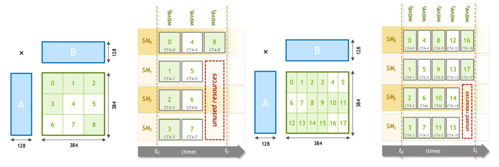
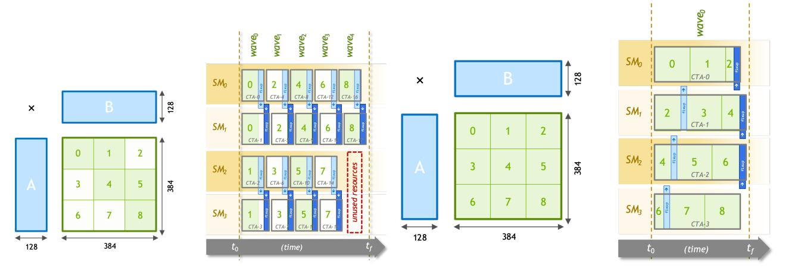
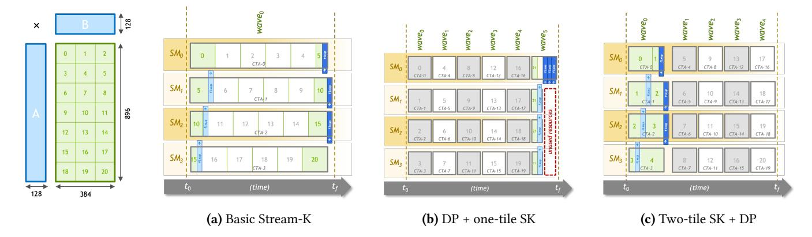
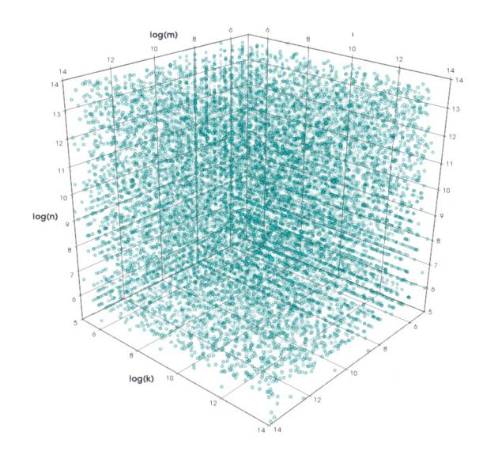
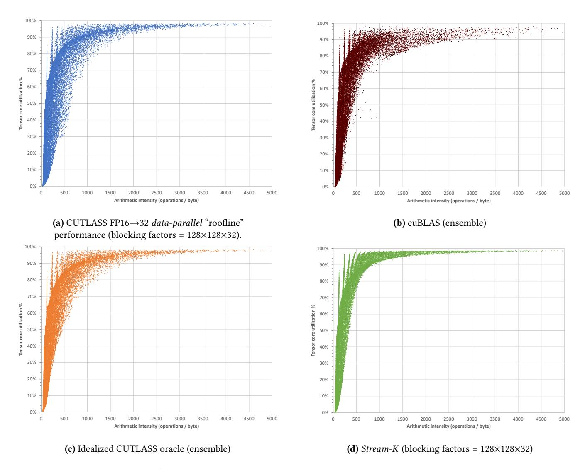
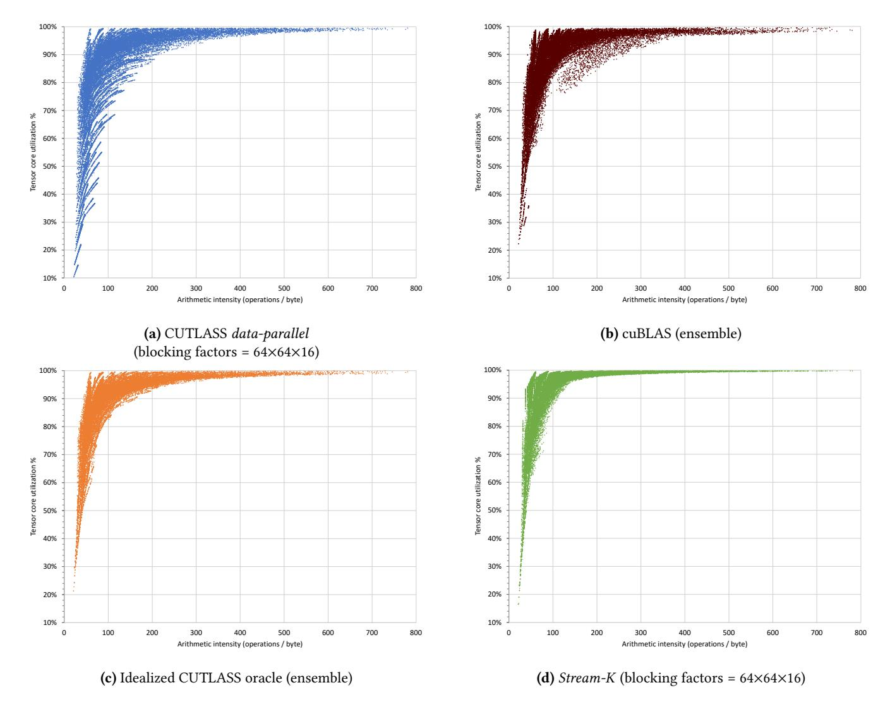

# 1 Introduction

General matrix-matrix product (GEMM), convolution, and other similar computations constitute the dominant workloads in many deep learning and scientific computing applications. High-performance processors such as GPUs, for example, are designed to achieve nearly 100% of their theoretical peak math throughput when computing GEMM. Doing so, however, requires a work decomposition that perfectly occupies the underlying physical cores. As we show, attaining such high levels of processor utilization across a broad landscape of problems shapes and sizes can be challenging.

Classically, GEMM implementations block their computation using a data-parallel tiling of the output matrix, assigning the independent production of output tiles among concurrent threads (or thread groups) [\[1,](#page-9-0) [8,](#page-10-0) [14\]](#page-10-1). The work per

output tile is regular, and tile production tends to dispatch across idle physical cores in "waves". The overall workload is well-balanced and processor utilization is highest when there are many waves, i.e., the number of output tiles greatly oversubscribes the number of cores.

However, such oversubscription has shrunk considerably as processors have grown in size. An increased core count will require fewer waves to produce a given tile count. Bigger cores will compel larger matrix blocking factors, leading to fewer waves of larger tiles. In general, execution schedules with fewer waves are much more likely to suffer from quantization inefficiency, i.e., the processor underutilization that occurs when the number of output tiles is not an even multiple of the number of processor cores. When the last wave is partially full, the unused cores must wait for the remaining threads to execute millions (if not billions) of multiply-accumulate (MAC) instructions before they are able to execute any dependent work.

Figure [1a](#page-1-0) illustrates such a scenario on a hypothetical GPU with four streaming multiprocessor cores (SMs). If we block a 384×384×128 GEMM computation into nine 128×128 output tiles, a data-parallel decomposition cannot achieve more than 75% of the processor's rated throughput. This theoretical utilization ceiling can be improved to 90% by halving the tile size as shown in Figure [1b.](#page-1-0) However, the finer-grained blocking factor will be less cache and scratchpad efficient, and may preclude any practical performance improvement.

Quantization inefficiency is a concern for increasingly wide processors such as GPUs, where ALUs-per-core and cores-per-processor both currently number in the hundreds. Consequently, many common GEMM-like workloads now exhibit a final, partially full wave that comprises a significant fraction of the total computation time.

The current remedy employed by GPU-based math and deep learning libraries is to deploy an ensemble of tiling configurations. When the ideal blocking factor does not quantize well, the library chooses among tiling alternatives with smaller concurrent work volumes, such as those illustrated in Figure [1b](#page-1-0) and Figure [2a.](#page-1-1)

<span id="page-1-0"></span>

- (a) Data parallel decomposition with grid size g=9 CTAs, large 128 × 128 × 128 CTA work volumes, and 75% processor utilization ceiling
- (b) Data parallel decomposition with grid size g=18 CTAs, smaller 128 × 64 × 128 CTA work volumes, and 90% processor utilization ceiling

<span id="page-1-1"></span>**Figure 1.** Data-parallel execution schedules for 384 × 384 × 128 GEMM across a hypothetical four-SM GPU.



- (a) Fixed-split decomposition with splitting factor s=2, grid size g=18 CTAs, smaller  $128 \times 128 \times 64$  CTA work volumes, and 90% quantization efficiency
- **(b)** Basic *Stream-K* decomposition with grid size g=4 CTAs, larger  $128 \times 128 \times 288$  CTA work volumes, and nearly 100% quantization efficiency

Figure 2. Tile-splitting execution schedules for 384 × 384 × 128 GEMM across a hypothetical four-SM GPU.

Tile-based ensembles, however, present performance and logistical challenges for math libraries seeking to deliver the best-achievable performance across diverse problem sizes and shapes. Distributable code size can be problematic for large ensembles. For example, NVIDIA's cuBLAS library [15] is hundreds of megabytes, often providing more than twenty pre-compiled kernel specializations per architecture for a given API entry point. Large ensembles also require sophisticated selection heuristics. In our evaluation, we show these heuristics can struggle to consistently identify the optimal configuration for arbitrary problems.

Unlike these tile-based methods, our *Stream-K* decomposition always distributes an even share (within one) of the

aggregate multiply-accumulate loop iterations required by the GEMM computation across SMs. Because the instruction workload of a single MAC-loop iteration is far smaller than that of an entire output tile, any variance in core workload is practically negligible. *Stream-K* uses the ideal blocking factor regardless of problem shape, has communication overheads that scale with processor width (rather than output tiles), and compiles to a single kernel.

We use an enormous corpus of 32,824 GEMM shapes and sizes to evaluate *Stream-K*, which we implemented within NVIDIA's CUTLASS library [8]. In comparison with CUTLASS's *data-parallel* implementation of the same blocking factor, *Stream-K* provides a substantially higher performance

response across our landscape of GEMM problems, demonstrating up to 14× speedup on NVIDIA A100 GPUs.

To highlight the practical challenges of ensemble-based solutions, we also evaluate NVIDIA's cuBLAS library as well as an oracle-driven ensemble of *data-parallel* CUTLASS tilings. Relative to both ensembles, we show that our single-kernel *Stream-K* achieves both (1) higher average performance, and (2) higher performance consistency. Versus cuBLAS, *Stream-K* demonstrates up to 6.7× speedup and virtually no instances of slowdown for compute-bound problems.

### 2 Background

General Matrix Multiplication (GEMM) is defined as the product  $\mathbf{C} = \alpha \mathbf{AB} + \beta \mathbf{C}$  where  $\alpha$  and  $\beta$  are scalar values and  $\mathbf{A}$ ,  $\mathbf{B}$ , and  $\mathbf{C}$  are matrices. (For simplicity, we assume  $\alpha = 1$ ,  $\beta = 0$  throughout this paper.) We refer to the *shape* of a given GEMM problem by the volumetric extents of its computation. For example, a  $m \times n \times k$  GEMM consumes  $m \times k$  and  $k \times n$  input matrices  $\mathbf{A}$  and  $\mathbf{B}$ , respectively, performs  $m \times n \times k$  multiply-accumulate operations, and produces an  $m \times n$  output matrix  $\mathbf{C}$ .

GEMM is a performance-critical subroutine in many large-scale engineering and scientific applications. It plays an important role in matrix factorization methods such as LU, QR, and Cholesky decomposition. High-performance modeling and simulation applications in engineering, climate simulation, cosmology, quantum chemistry, and other scientific domains rely on these factorization methods.

Matrix multiplication is also the fundamental building block of modern deep learning (DL) methods. The training of deep neural networks (DNNs) is often performed on massive datasets across large distributed systems [13]. Many DL training and inference operations are cast as matrix multiplications. For example, image recognition and computer vision models rely on convolution, which can be implemented directly as the product of filter and image datasets [4]. Transformer architectures, which have come to dominate natural language processing and other applications, are almost entirely limited by the performance of large matrix products.

Early work on GPU matrix-matrix multiplication from Larsen and McAllister framed the computation as a multitexture multiplication and blending operation [11]. The user-programmable shared memory provided by subsequent GPU architectures enabled higher-performing *data parallel* schemes with two levels of blocking (shared memory and registers) with tile sizes informed via extensive micro-benchmarking analysis [2, 14, 17, 19] and auto-tuning [5, 7, 12].

The MAGMA GPU math library was perhaps the first to optimize for diverse GEMM problem shapes [9]. Their solution applied a constrained set of tiling parameters to a templated CUDA C++ code stencil, generating several hundred data-parallel variants per API primitive (e.g., hgemm\_tt() for half-precision transpose-transpose GEMM). They evaluated

these variants to distill a small ensemble of typically three to five kernels that collectively perform well across a diversity of problem shapes. Kernel selection and dispatch for a given problem was governed by size thresholds expressed via simple handwritten rules.

Subsequent GPU math libraries have employed more sophisticated code-generation and kernel-selection components. For example, the ISAAC project uses machine learning techniques to predict an optimal tiling and/or splitting parameterization for a given GEMM shape, which can then be instantiated either online or offline via a PTX-level code generator [18].

NVIDIA's cuBLAS [15] library has provided an extended cublasGemmEx interface that allows the caller to select from among 24 different GEMM "algorithms". Carefully trained heuristics choose between this large space of alternatives when using the default interface. These algorithms implement a variety of different *data-parallel* and *fixed-split* variants, and it is common for cuBLAS to have assembled each variant into its own architecture-specific kernel program for code optimization purposes. The cross product of GEMM API functionality, strategic variants, and microarchitecture has resulted in distributions that are increasingly enormous, exceeding hundreds of megabytes of executable code.

Given the fast-paced and rapidly changing nature of contemporary deep learning, recent work has focused on programming models for simplifying the expression and construction high performance kernels that alter or supplement the GEMM computation. The CUTLASS C++ library provides data-movement and multiply-accumulation classes for composing custom GEMM-like computations at all levels of the GPU thread hierarchy [8]. Triton [19] is a domain-specific language for tensor programming centered on the expression, transformation, and optimization of block/tile concepts. Other domain-specific programming languages such as Halide [16] and TVM [3] separate the expression of pointwise operators from that of loop scheduling. Fireiron [6] further adds data movement constructs into the scheduling grammar.

### 3 Existing Work Decomposition Strategies

Modern processors typically store **A**, **B**, and **C** in a large, slow, distant memory and have access to a small, fast, scratchpad or cache memory. A primary goal for any GEMM implementation is to leverage these local storage resources so that the resulting implementation is computation-bound.

#### 3.1 Sequential Cache-Blocked

The classic cache-blocked formulation of GEMM divides its computational volume into blocks and chooses a traversal order that exposes memory locality. Algorithm 1 presents a simplified implementation comprising six loops. The innermost three loops iterate within the blocking factors BLK M,

BLK\_N, and BLK\_K, while the outermost three iterate across them. If the cache can capture one block from each of the three matrices, the resulting data reuse among those elements will significantly reduce the number of last-level memory accesses [10].

### <span id="page-3-0"></span>Algorithm 1 Sequential cache-blocked GEMM.

```
1: ⊳ tile-processing outer loops
 2: for mm \leftarrow 0 to m step BLK_M do
        for nn \leftarrow 0 to n step BLK_N do
 3:
 4:

 5:
            for mmm \leftarrow mm to (mm + BLK M) do
 6:
                for nnn \leftarrow nn to (nn + BLK_N) do
                    C[mmm,nnn] \leftarrow 0
 7:
 ۶.
                end for
 9:
            end for
10:
            > perform the MAC iterations for this tile
            for kk \leftarrow 0 to k step BLK_K do
11:
                ▶ MAC iteration (fully unrolled)
12:
                for mmm \leftarrow mm to (mm + BLK_M) do
13:
14:
                    for nnn ← nn to (nn + BLK N) do
                        for kkk \leftarrow kk to (kk + BLK_K) do
15:
                            C[mmm,nnn] \leftarrow C[mmm,nnn] +
16:
17:
                               (A[mmm,kkk] \times B[kkk,nnn])
                        end for
18:
                    end for
19.
20:
                end for
            end for
21:
23: end for
```

### 3.2 Data-parallel

As shown in Algorithm 2, the *data-parallel* GPU formulation of GEMM is decomposed across a grid of parallel thread blocks, or *cooperative thread arrays* (CTAs)<sup>1</sup>. The grid is sized such that each CTA produces its own (BLK\_M  $\times$  BLK\_N) output tile.

For exposition, the MacLoop() subroutine of Algorithm 3 encapsulates the multiply-accumulate workloads that compute the values of the CTA's output tile. It performs a sequence of MAC-loop iterations in the accumulation domain, e.g., the k-axis for GEMM. Each MAC-loop iteration comprises a per-thread volume of (BLK\_M × BLK\_N × BLK\_K) / CTA\_THREADS MAC operations. As the computation proceeds, fragments of the input matrices are staged through the SM's shared memory for local reuse among individual threads.

Although this particular presentation of MacLoop() deploys one thread per output tile element, the sophisticated implementations in CUTLASS [8] and cuBLAS [8] will: (1) fully unroll the per-thread MAC-loop iteration; (2) implement additional blocking at the warp and/or thread levels; and (3) orchestrate a software pipeline of shared memory data movement across MAC-loop iterations.

Unfortunately, this classic *data-parallel* decomposition is liable to suffer from quantization inefficiency on modern GPUs, as illustrated in Figure 1. Although an ensemble of diverse blocking factors may uncover opportunities for greater processor utilization, it is unlikely to facilitate perfect quantizations for arbitrary problem sizes. Furthermore, smaller blocking factors have two drawbacks: (1) fewer instructions per MAC-loop iteration for covering the latencies of global and shared memory transfers in pipelined implementations; and (2) a higher proportion of memory operations relative to MAC instructions, which may prevent them from being computation-bound.

### <span id="page-3-1"></span>Algorithm 2 Data-parallel GPU GEMM.

```
1: _shared_ accum[BLK_M,BLK_N]
2: iters_per_tile ← [k/BLK_K]
3: ▷ instantiate one CTA per output tile
4: fork CTA<sub>[x]</sub> in [ [m/BLK_M] × [n/BLK_N] ] do
5: ▷ perform the MAC iterations for this tile
6: accum ← MacLoop(x, 0, iters_per_tile)
7: ▷ store accumulators to output tile
8: StoreTile(C, x, accum)
9: join
```

<span id="page-3-3"></span>**Algorithm 3** CTA-wide MacLoop() subroutine for performing a sequence of MAC-loop iterations.

```
1: procedure MacLoop(tile_idx, iter_begin, iter_end)
        shared accum[BLK M,BLK N]
 3:
        _shared_ frag_a[BLK_M,BLK_K]
 4:
        _shared_ frag_b[BLK_K,BLK_N]
 5:

 6:
        mm \leftarrow BLK M \times (tile idx / \lceil m/BLK M \rceil)
 7:
        nn \leftarrow BLK_N \times (tile_idx \% \lceil m/BLK_M \rceil)
 8:

 9:
        accum \leftarrow 0
10:
        > perform the specified range of MAC iters for this tile
11:
        for iter ← iter_begin to iter_end do
            kk \leftarrow iter \times BLK K
12:
13:

            frag_a \leftarrow LoadFragment(A, mm, kk)
14:
15:
            frag_b ← LoadFragment(B, kk, nn)
            fork THREAD[mmm,nnn] in [BLK_M, BLK_N] do
16:
17.
               ▶ MAC iteration per thread (fully unrolled)
18:
               for kkk \leftarrow 0 to BLK_K do
19:
                    accum[mmm, nnn] \leftarrow accum[mmm, nnn] +
                      (frag_a[mmm,kkk] \times frag_b[kkk,nnn])
20:
21.
               end for
22.
            join
23:
        end for
        return accum
25: end procedure
```

#### 3.3 Fixed-split

Alternatively, the granularity of work assigned to each CTA can be reduced via parallelization across the accumulation dimension. For a given output tile, the associativity of addition allows the iteration domain to be split among multiple

<span id="page-3-2"></span><sup>&</sup>lt;sup>1</sup>Blocks of GPU threads are coscheduled in CTAs, which virtualize the hardware's streaming multiprocessor cores (SMs).

concurrent CTAs, followed by a dependent "fixup" step to reduce the partial sums computed by each CTA. We highlight this *fixed-split* approach in Algorithm 4, where each output tile is cooperatively produced by s CTAs. Notably, it functions identically to the *data-parallel* decomposition when the splitting factor s = 1.

The fixed-split decomposition is also featured in CUTLASS and cuBLAS. The splitting factor is implemented as a runtime parameter, allowing a single kernel executable to support multiple work volumes while retaining the ideal blocking factors for optimal data sharing and latency hiding. However, as illustrated in Figure 2a, the prospect of achieving a perfect quantization from a uniform tile-splitting is unlikely. Furthermore, the extra overheads of communication and synchronization scale with both the overall problem size as well as the splitting factor.

## <span id="page-4-0"></span>Algorithm 4 Fixed-split GPU GEMM with splitting factor s.

```
1: _shared_ accum[BLK_M,BLK_N]
 2: iters_per_tile \leftarrow \lceil k/BLK_K \rceil
 3: iters_per_split \leftarrow \lceil iters_per_tile/s \rceil
 4: ⊳ instantiate s CTAs per output tile
 5: fork CTA_{[x,y]} in [\lceil m/BLK\_M \rceil \times \lceil n/BLK\_N \rceil, s] do
         ⊳ perform the range of MAC iterations for this split
 7:
         iter \leftarrow y \times iters_per_split
         iter\_end \leftarrow min(iters\_per\_tile, iter + iters\_per\_split)
 ۶٠
         accum \leftarrow MacLoop(x, iter, iter\_end)
 9:
10:
         ⊳ consolidate partial-sums across CTAs
         if y \neq 0 then
11:

    ► store accumulators to temporary global storage

12.
             StorePartials(partials[x,y], accum)
13:
14:
             Signal(flags[x,y])
15:
         else
16:

    ▷ accumulate partial sums from other CTAs contributing to this

    tile
17:
             for cta \leftarrow 1 to s do
18:
                  Wait(flags[x,cta])
19:
                  accum \leftarrow accum + LoadPartials(partials[x,cta])
20:
             end for
21:
             > store accumulators to output tile
22:
             StoreTile(C, tile_id, accum)
24: join
```

### 4 Our Stream-K Decomposition

Our *Stream-K* decomposition is a tile-splitting parallelization in which the splitting seams are completely dissociated from the tiling structure itself. Although we employ familiar blocking and tiling strategies for data reuse, we instead quantize the GEMM computation into MAC-loop iterations, i.e., small volumes of CTA-wide BLK\_M × BLK\_N × BLK\_K work. As presented in Algorithm 5, *Stream-K* evenly partitions the GEMM's aggregate workload of MAC-loop iterations across a constant-sized grid of g CTAs. Each CTA's range of MAC-loop iterations is mapped contiguously into the  $m \to n \to k$  linearization of the GEMM shape, crossing output-tile boundaries as it may.

### <span id="page-4-1"></span>**Algorithm 5** Basic *Stream-K* GPU GEMM with grid size g.

```
1: shared accum[BLK M,BLK N]
 2: iters per tile \leftarrow \lceil k/BLK \ K \rceil
 3: total_iters ← [m/BLK_M] × [n/BLK_N] × iters_per_tile
 4: iters_per_cta ← [total_iters / g]
 5: ⊳ instantiate g CTAs
 6: fork CTA_{[x]} in [g] do
 7:
        iter \leftarrow x \times iters\_per\_cta
 8:
        iter end ← iter + iters per cta
 9:

    iteration-processing outer loop

10:
        while iter < iter end do
11:
             tile idx \leftarrow iter / iters per tile
             tile_iter \leftarrow tile_idx \times iters_per_tile
12:
13.
             tile_iter_end \leftarrow tile_iter + iters_per_tile
14:
             ⊳ perform the range of MAC iterations for this tile
             local iter \leftarrow iter - tile iter
15:
16:
             local\_iter\_end \leftarrow
17.
               min(iter_end, tile_iter_end) - tile_iter
18:
             accum ←
19:
               MacLoop(tile_id, local_iter, local_iter_end)
20:
             ⊳ consolidate partial-sums across CTAs
             tile\_started \leftarrow iter = tile\_iter
21:
22:
             tile\_ended \leftarrow (iter\_end \ge tile\_iter\_end)
23:
             if ¬tile started then

    ► store accum to temporary global storage

25:
                 StorePartials(partials[x], accum)
26:
                 Signal(flags[x])
27.
28:

        ► store accumulators to output tile

29:
                 if ¬tile ended then
30:
                     > accumulate partial sums from other CTA contributing
    to this tile
                     cta\_end \leftarrow tile\_iter\_end / iters\_per\_tile
31:
32:
                     for cta \leftarrow (x+1) in cta_end do
                         Wait(flags[cta])
33:
34:
                         accum ← accum
                            + LoadPartials(partials[cta])
35:
                     end for
36:
                 end if
37:
38:
                 StoreTile(C, tile_id, accum)
39:
             end if
40:
             iter ← tile iter end
        end while
41:
42: join
```

Should a given CTA's starting and/or ending iterations not coincide with tile boundaries (as is expected to be the common case), it must consolidate its partial results with those of the other CTA(s) also covering that tile. In this basic implementation, each output tile in  $\bf C$  is written by the CTA that performed that tile's k=0 MAC-loop iteration. Before it can do so, however, it must accumulate any partial sums shared from other CTAs in temporary global storage. Notably, Stream-K's communication, synchronization, and global storage overheads are independent of problem size, scaling instead with the number of CTAs  $\bf g$ .

A secondary benefit of *Stream-K* is that synchronization-waiting is likely negligible when the number of output tiles is greater than the number of CTAs. In this regime, each output tile is covered by at most two CTAs, and the tile-processing

skew ensures that the accumulating CTA will not need its peer contributions until well after those collaborators have finished producing them.

Continuing our earlier example, Figure 2b illustrates the basic *Stream-K* execution schedule of the  $384 \times 384 \times 128$  GEMM problem on a hypothetical four-SM GPU. To fully occupy the GPU, we launch g=4 CTAs. Assuming BLK\_M = 128, BLK\_N = 128, and BLK\_K = 4, each CTA is tasked with a  $128 \times 128 \times 288$  work volume comprising 72 MAC-loop iterations. This results in a 100% quantization efficiency, as all four SMs will execute the same number of MAC instructions.

Additionally, the work volume of a single MAC-loop iteration is 32× smaller than that of an entire output tile. Consequently, a 32-way *fixed-split* decomposition would also provide a 100% quantization efficiency, but at the expense of an 8× larger "fixup" overhead. Furthermore, *Stream-K* is better able to hide the latency of inter-CTA synchronization due to the temporal skew between writers and readers when sharing partial sums.

Stream-K also generalizes to both fixed-split and data-parallel decompositions. When the grid size g is an even multiple of the number of output tiles, Stream-K functions exactly as the fixed-split decomposition. Similarly, when g equals the number of output tiles, Stream-K behaves identically to the data-parallel decomposition. We take advantage of this generalization to create an optimized hybridization of the Stream-K decomposition in following section (5.2).

### <span id="page-5-1"></span>5 Implementation Details

The work decomposition we introduced in the last section can be instantiated in a number of different ways to suit the needs of different hardware architectures and software library designs. Our implementation targets NVIDIA GPUs and is designed to be integrated into existing libraries like cuBLAS and CUTLASS. In this section, we describe how we configure the kernels we launch and introduce a hybridization scheme that helps ensure users achieve maximum GEMM performance across the widest possible range of problem shapes.

We also emphasize that these are truly internal implementation details. They are completely transparent to the user of a BLAS-like library and do not alter the library's interface. The only observable impact is the improved performance characteristics that we analyze in Section 6.

#### 5.1 Kernel Configuration

The tile size chosen for blocking the GEMM computation is, of course, a critical parameter controlling the performance of the GEMM kernel. For modern NVIDIA GPUs, appropriate tile sizes are determined by the shape of matrices supported by the GPU's Tensor Cores. Based on extensive empirical experience, we selected the smallest CTA-wide tile size capable of achieving 99% of the GPU's peak TFLOP/s for very

large GEMM volumes for each supported precision. For the NVIDIA A100 GPU used in our experiments, these sizes are  $64\times64\times16$  for FP64 problems and  $128\times128\times32$  for FP16 $\rightarrow32$  problems.

Achieving maximal GEMM performance from *Stream-K* parallelization also requires some degree of dynamic problem-specific configuration. Before launching a kernel we choose a grid size likely to yield the best performance on the specific problem shape at hand. This is in contrast to ensemble-based approaches which accommodate diverse problem shapes through the static generation of many kernel variants based on workload decomposition and blocking factor.

Our grid size selection heuristic is based on a simple analytical model that minimizes the cost of reading, writing, and accumulating partial sums while equally distributing the MAC-loop iterations per CTA. Details of this analytical model are provided in the supplementary material (Appendix A.1). Parameters to the model are trivially chosen with empirical measurements and need only be done once per target architecture. The resulting parameters can then be compiled statically into the library. Again, this is in contrast to ensemble-based approaches that rely on potentially complex heuristics and machine learning models for kernel selection at run time.

#### <span id="page-5-0"></span>5.2 Data-parallel Hybridization

The basic *Stream-K* decomposition can, in certain cases, exhibit tile-processing skew that leads to potentially adverse effects on cache performance. When the number of output tiles t is not an even multiple of the grid size g, the starting k-offset for the first MAC-loop iteration in each CTA will be different. Depending on the sizes and shapes of the input matrices and blocking factors, this skew may preclude these fragments from seeing reuse across CTAs in the GPU's cache structure. In Figure 3a, for example, the initial k-axis fragment offsets for each of the four CTAs will be k=0, k=32, k=64, and k=96, respectively. Furthermore, this 32-element skew between CTAs will persist for the duration of the GEMM computation.

Tile-processing skew is a direct consequence of *Stream-K*'s workload balancing strategy. However, we can take measures to limit its duration by applying *Stream-K*'s iteration balancing to a smaller, tile-aligned region of the total iteration domain such that the remaining tiles can be produced in full, temporally aligned waves.

The simplest hybrid scheme is the "data-parallel + one-tile Stream-K" schedule illustrated in Figure 3b. It applies iteration balancing only among the tiles otherwise remaining for a final, partially full data-parallel wave. The total number of full waves is  $w = \lfloor t/p \rfloor$ , where t is the number of output tiles and p is the number of SM cores in the GPU. Consequently, each Stream-K CTA receives an even share of iterations that is less than one tile's worth. Unfortunately, this strategy has

<span id="page-6-1"></span>

Figure 3. Basic Stream-K vs. hybrid execution schedules for 896 × 384 × 128 GEMM across a hypothetical four-SM GPU.

little ability to hide the synchronization latency for the exchange of partial sums when three or more CTAs cover the same tile. In these scenarios, the accumulating CTA may be forced to wait for the contributions of other CTAs to become visible, as all but the last will be completing their final iterations at roughly the same time. Furthermore, the basic version of our scheme for aggregating partials is serialized within a single CTA, and thus will likely cause SM workload imbalance when the number of contributing CTAs per tile is large.

We address these problems with our "two-tile *Stream-K* + *data-parallel*" hybrid schedule, illustrated in Figure 3c. It performs one fewer full data-parallel wave in exchange for each *Stream-K* CTA receiving more than one tile's worth of iterations (but fewer than two). This provides much better latency hiding when  $w \geq 2$ , and each accumulating CTA will only need to receive partials from one other contributing CTA. Otherwise, it behaves identically to the " $DP + one \ tile \ SK$ " schedule. This hybrid approach results in both improved memory access patterns and latency hiding. It also shows the versatility of the generic Stream-K looping structure to implement different scheduling policies within the same kernel instance.

### <span id="page-6-0"></span>**6 Performance Evaluation**

We have implemented our *Stream-K* decomposition using NVIDIA's CUTLASS library of CUDA C++ template abstractions for authoring GEMM-like computations. CUTLASS provides the optimized equivalent of the CTA-wide MacLoop() subroutine in Algorithm 3, which performs blocking, tiling, and software-pipelined data movement that is analogous to the closed-source cuBLAS and cuDNN implementations. Our evaluation encompasses both (1) double-precision FP64 GEMM, and (2) mixed-precision FP16→32 GEMM. For the latter, the input matrices **A** and **B** comprise half-precision FP16 values, yet the internal accumulation and output matrix **C** values are single-precision FP32.

<span id="page-6-2"></span>

Figure 4. The test domain of 32,824 GEMM problem shapes and sizes used for performance evaluation.

 $\{m\} = \{128 \dots 8192\}, \{n\} = \{128 \dots 8192\}, \{k\} = \{128 \dots 8192\}$ 

*Hardware environment.* Our test GPU is the NVIDIA A100, which contains 108 SM cores. For measurement stability, we lock the power envelope at 400 W and SM clocks at 1005 MHz ( $\sim$ 71% of their dynamic peak). This establishes FP64 tensor-core peak throughput of 13.9 TFLOP/s, and mixed FP16 $\rightarrow$ 32 tensor-core peak throughput of 222.3 TFLOP/s.

**Dataset.** Our test corpus intends to approximate the enormous breadth and scope of device-wide GEMM problems that GPU math kernel libraries are designed to accommodate. As shown in Figure 4, we evaluate 32,824 different problem sizes and shapes, log-sampled at random within a domain of m, n, and k matrix dimensions whose volume spans six orders of magnitude.

<span id="page-7-0"></span>

|         | vs.<br>CUTLASS<br>64 × 64 × 16 | vs.<br>cuBLAS | vs.<br>cuBLAS<br>> 150 ops/B | vs.<br>CUTLASS<br>oracle |
|---------|--------------------------------|---------------|------------------------------|--------------------------|
| Average | 1.23×                          | 1.06×         | 1.03×                        | 1.05×                    |
| StdDev  | 0.45                           | 0.10          | 0.03                         | 0.09                     |
| Min     | 0.77×                          | 0.68×         | 0.99×                        | 0.70×                    |
| Max     | 5.63×                          | 2.55×         | 1.24×                        | 1.64×                    |

**Table 1.** Stream-K FP64 Relative Performance

|         | vs.<br>CUTLASS<br>128 × 128 × 32 | vs.<br>cuBLAS | vs.<br>cuBLAS<br>> 150 ops/B | vs.<br>CUTLASS<br>oracle |
|---------|----------------------------------|---------------|------------------------------|--------------------------|
| Average | 1.63×                            | 1.13×         | 1.15×                        | 1.12×                    |
| StdDev  | 1.46                             | 0.45          | 0.12                         | 0.37                     |
| Min     | 0.80×                            | $0.64 \times$ | 0.98×                        | 0.61×                    |
| Max     | 14.7×                            | 6.74×         | 1.85×                        | 4.63×                    |

**Table 2.** *Stream-K* FP16→32 Relative Performance

**Methodology.** For both GEMM precisions, we build a single *Stream-K* kernel that has been specialized per the guidelines in the Section 5. Furthermore, these kernels implement our "two-tile *Stream-K* + *data-parallel*" hybrid decomposition. Our evaluation compares each *Stream-K* kernel with:

- the default data-parallel CUTLASS kernel of the same blocking factor;
- the cuBLAS ensemble for that precision (CUDA 11.6);
- 3. an idealized oracle that will always select the highest performing *data-parallel* CUTLASS blocking factor to execute for a given GEMM instance.

For FP64 problems, this oracle selects among the ensemble of  $\{(32\times32\times16), (32\times64\times16), (64\times64\times16), (64\times128\times16), (128\times128\times16)\}$  blocking factor specializations. For FP16 $\rightarrow$ 32, it selects among the ensemble of  $\{(64\times64\times64), (64\times128\times32), (128\times128\times32), (128\times256\times32)\}$  blocking factor specializations. These specific specializations are an open-sourced strict subsets alternative of the corresponding cuBLAS GEMM kernel ensembles.

The "roofline" plots of Figure 6a and Figure 5a highlight the spread of performance produced by the singleton *data-parallel* CUTLASS kernels. They plot the percentage of FP64 and FP16→32 processor utilization as a function of computational intensity. Ideally, a GEMM implementation's performance response would manifest as a narrow band that adheres tightly to the machine's bandwidth- and compute-bound performance ceilings. Here, the *data-parallel* kernels exhibit a fairly large dynamic range for any given regime of arithmetic intensity. In contrast, the performance responses from the equivalent *Stream-K* kernels in Figure 6d and Figure 5d are much tighter. These observations are corroborated by Table 1 and Table 2, which show the *Stream-K* kernels

outperforming their *data-parallel* FP64 and FP16 $\rightarrow$ 32 equivalents by an average of 1.23× and 1.63×, respectively. For extreme strong-scaling scenarios where  $m \times n$  is small and k is large, our *Stream-K* kernels demonstrate up to 5.63× and 14.7 × speedup, respectively.

The second columns of Table 1 and Table 2 compare our Stream-K performance with that of cuBLAS. On average, our FP64 and FP16→32 Stream-K GEMM kernels respectively deliver 6% and 13% greater throughput than their corresponding cuBLAS ensembles, with peak improvement of 2.55× and 6.74×. This is a significant improvement over the breadth of 32K GEMM problem shapes and sizes with 20× less executable code (a single kernel for each precision) than NVIDIA's vendor GEMM library, cuBLAS.

Furthermore, the contrast between the FP64 and FP16 $\rightarrow$ 32 cuBLAS performance responses (Figure 6b and Figure 5b) versus those of our hypothetical CUTLASS oracle ensembles (Figure 6c and Figure 5c) reveal the difficulties of designing kernel selection heuristics that deliver consistently good performance. Despite having access to the same blocking factor specializations, cuBLAS exhibits substantially wider dynamic ranges than the idealized *data-parallel* CUTLASS oracle. The performance spreads of our *Stream-K* kernels are narrower still, achieving up to 4.6× the idealized oracle performance and underscoring their ability to achieve utilization levels that are simply not possible from tile-centric work decompositions.

Finally, we observe regimes of small, bandwidth-bound problem shapes where our largish blocking factors do not compete well against cuBLAS. However, if we restrict our scope to the domain of compute-bound problems (i.e., FP64 problems having compute intensity > 150 ops/byte and FP16 → 32 problems > 400 ops/byte), Figure 7a and Figure 7b demonstrate that our singleton *Stream-K* kernels achieve unilaterally higher performance than the cuBLAS ensembles. The "noisy" relative performance in the regimes below these thresholds is not surprising, as *Stream-K* is attempting to make memory-bound computations run faster by adding more memory workload. This suggests a few avenues for future work, namely separate cost-modeling for the memory-bound regime and/or the bundling of a second *Stream-K* kernel having smaller tile size into a two-kernel ensemble.

#### 7 Conclusion

We presented *Stream-K*, a novel parallel workload decomposition technique for scheduling general matrix multiplication (GEMM) and similar computations on wide architectures such as GPUs. Unlike other tile-splitting techniques, the MAC-loop iteration is our unit of workload quantization across processor cores. This affords excellent strong scaling and workload balancing because its cost is (1) a constant with respect to the problem shape, and (2) substantially smaller than that of an entire output tile.

<span id="page-8-0"></span>

Figure 5. FP16→FP32 GEMM "roofline" performance utilization landscapes on NVIDIA A100 across 32K GEMM problem shapes and sizes.

Furthermore, *Stream-K* produces an O(p) number of splitting seams that are bound by the number of processor cores. Consequently, the overheads of strong scaling and workload balancing scale with processor width rather than problem size. This is a welcome feature for many applications that cannot afford to allocate large amounts of temporary storage equivalent to the problem output.

Finally, we evaluated our *Stream-K* approach across a broad spectrum of GEMM shapes and sizes. We showed that a single blocking configuration of *Stream-K* can (1) achieve levels of absolute performance that match and/or exceed that of NVIDIA's cuBLAS library, even when the latter is operating at near-peak processor utilization, and (2) do so with much higher levels of performance consistency. Additionally, *Stream-K* is an attractive option for library construction and maintenance, as it presents an opportunity to reduce

distribution sizes by an order of magnitude and removes the need for complex handcoded heuristics or machine learning models for kernel selection without compromising performance. *Stream-K* is open-sourced within CUTLASS 2.11 (https://github.com/NVIDIA/cutlass) and the performance shown within this paper can be reproduced when compiled using CUDA 11.8.

For future works, we identify cache-aware, tile-access patterns such as Morton Order, an avenue for optimization. We also believe that *Stream-K* decomposition could provide a similar improved performance response for other GEMM-like workloads that struggle with the same quantization inefficiencies.

<span id="page-9-6"></span>

Figure 6. FP64 GEMM "roofline" performance utilization landscapes on NVIDIA A100 across 32K problem shapes and sizes.

