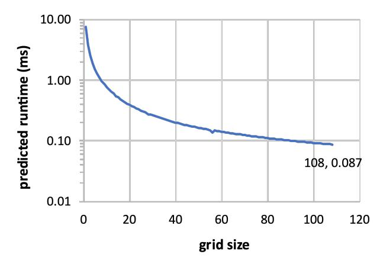
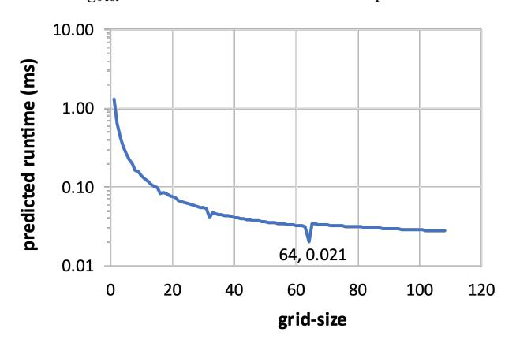
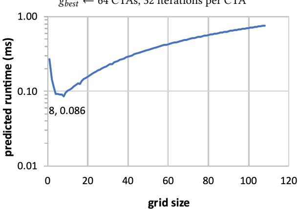
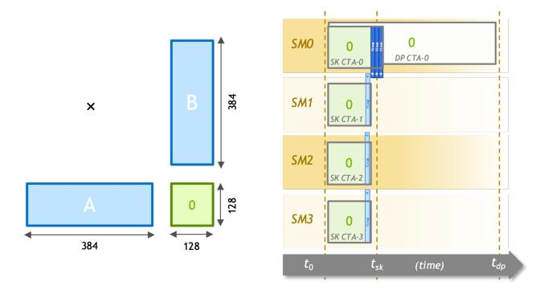

# A Supplementary Material

## A.1 Analytical Modeling for Stream-K Configuration

In practice, it is not always advantageous to invoke the *Stream-K* decomposition with as many CTAs as can be actively resident on the GPU. Because it is a tile-splitting approach, it incurs fixup costs above and beyond the simple *data-parallel* decomposition. Consequently, the fundamental proposition is one of strong scaling: how much additional parallelism can be expressed before the extra overhead causes a negative return on investment. Depending on the problem shape, the optimal splitting could be enough to fill the entire processor (i.e.,  $g \leftarrow p$ ), no splitting at all (i.e.,  $g \leftarrow t$ ), or somewhere in between.

To predict this inflection point, we present a simple approach to model the runtime of *Stream-K* as a function of grid size *g*. In the absence of other work on the GPU, the runtime of the entire *Stream-K* schedule will be the same as that of one of its tile-outputting CTAs, which we formulate as follows:

$$time_{CTA}(g) \leftarrow a + b(FixupPeers(g) > 1) + c(ItersPerCta(g)) + d(FixupPeers(g) - 1)$$

where:

$$ItersPerCta(g) \leftarrow \left\lceil \frac{\lceil \frac{m}{BLK\_M} \rceil \times \lceil \frac{n}{BLK\_N} \rceil \times \lceil \frac{k}{BLK\_K} \rceil}{g} \right\rceil$$
$$FixupPeers(g) \leftarrow \left\lceil \frac{\lceil \frac{k}{BLK\_K} \rceil}{IterationsPerCta(g)} \right\rceil$$

This CTA runtime model comprises four components. The a workload encompasses the one-time, fixed-size costs incurred by each CTA, e.g., the grid launch latency, the initial compulsory cache misses, the cost of writing the final output tile to C, etc. The second component  $\beta$  incorporates the conditional costs of outputting temporary partial sums for scenarios where the number of output tiles does not quantize perfectly across the processor. The third—the periteration workload *c*—represents the instruction and stall workload of each MAC-iteration. The final, per-collaborator workload d is the cost of reading and accumulating the partial sums from another CTA covering the same tile. The set of workload constants  $\{a, b, c, d\}$  will be unique to each combination of blocking factors, matrix data type, and GPU microarchitecture, and can be determined empirically via microbenchmarks.

Figure 8 illustrates the behavior of our grid size selection model as parameterized for fp16-precision GEMM on NVIDIA's A100 GPU using blocking factors BLK $_{\rm M}$  = 128, BLK N = 128, and BLK K = 32. Specifically, we highlight

(a) GEMM  $256 \times 3584 \times 8192$ 56 output tiles, 256 iterations per tile  $g_{best} \leftarrow 108$  CTAs, 132/133 iterations per CTA

(b) GEMM  $1024 \times 1024 \times 1024$ 64 output tiles, 32 iterations per tile  $g_{best} \leftarrow$  64 CTAs, 32 iterations per CTA

(c) GEMM 128 × 128 × 16384 1 output tile, 512 iterations per tile  $g_{best} \leftarrow 8$  CTAs, 64 iterations per CTA

**Figure 8.** Modeled *Stream-K* performance on NVIDIA A100 (108 SMs) for BLK\_M=128, BLK\_N=128, BLK\_K=32

**Figure 9.** Strong-scaling comparison of *data-parallel* and *Stream-K* execution schedules for  $128 \times 128 \times 384$  GEMM across a hypothetical four-SM GPU. *Data-parallel* causes the enormous *k*-dimension to be sequentially processed within single CTA, whereas *Stream-K* is able to take advantage of the parallelism available across the *k*-dimension.

three strong-scaling GEMM scenarios where the number

of output tiles is insufficient to produce a single full wave across the processor's 108 SM cores.

The first GEMM shape accumulates through a large-sized k-dimension to produce a short, wide output matrix. In this scenario, the reduction in MAC-loop time relative to the increasing costs of seam fixup is monotonically improving. Consequently, the optimal grid size coincides with maximal parallelism at g = 108 CTAs.

The second shape accumulates through a medium-sized k-dimension to produce a square matrix with 64 output tiles. In this case, the fixup costs of b and d outweigh any reduction in MAC-loop iteration count, as seen by the global minima "dip" at g = 64 CTAs.

The third shape produces a single output tile after accumulating through an enormous k-dimension, analogous to the execution schedule in Figure 9. Although the opportunity for strong scaling is quite large, the per-peer cost of serial reduction is entirely incurred by a single CTA. These accumulation costs begin to outweigh any further reductions in iteration count for grid sizes g > 8.