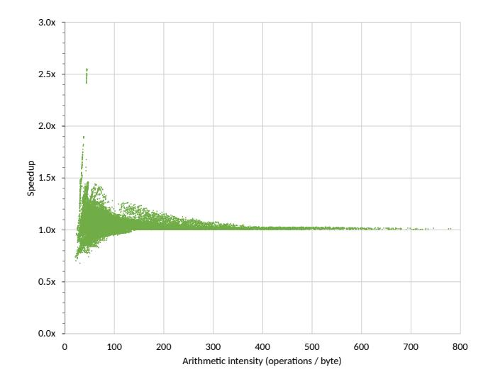
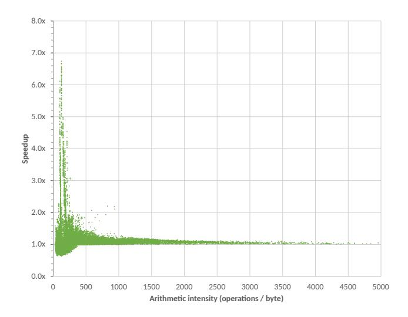

# References

[1] Ahmad Abdelfattah, David Keyes, and Hatem Ltaief. 2016. KBLAS: An Optimized Library for Dense Matrix-Vector Multiplication on GPU Accelerators. ACM Trans. Math. Software 42, 3 (June 2016), 1–31. <https://doi.org/10.1145/2818311>

- [2] Sergio Barrachina, Maribel Castillo, Francisco D. Igual, Rafael Mayo, and Enrique S. Quintana-Orti. 2008. Evaluation and tuning of the Level 3 CUBLAS for graphics processors. In 2008 IEEE International Symposium on Parallel and Distributed Processing. IEEE. [https://doi.](https://doi.org/10.1109/ipdps.2008.4536485) [org/10.1109/ipdps.2008.4536485](https://doi.org/10.1109/ipdps.2008.4536485)
- [3] Tianqi Chen, Thierry Moreau, Ziheng Jiang, Haichen Shen, Eddie Q. Yan, Leyuan Wang, Yuwei Hu, Luis Ceze, Carlos Guestrin, and Arvind Krishnamurthy. 2018. TVM: End-to-End Optimization Stack for Deep Learning. CoRR 1802.04799 (Feb. 2018). arXiv[:1802.04799](https://arxiv.org/abs/1802.04799)
- [4] Sharan Chetlur, Cliff Woolley, Philippe Vandermersch, Jonathan Cohen, John Tran, Bryan Catanzaro, and Evan Shelhamer. 2014. cuDNN: Efficient Primitives for Deep Learning. CoRR 1410.0759 (Oct. 2014). arXiv[:cs.NE/1410.0759v1](https://arxiv.org/abs/cs.NE/1410.0759v1)
- [5] Xiang Cui, Yifeng Chen, Changyou Zhang, and Hong Mei. 2010. Autotuning Dense Matrix Multiplication for GPGPU with Cache. In Proceedings of the 16th International Conference on Parallel and Distributed Systems (ICPADS 2010). 237–242. <https://doi.org/10.1109/icpads.2010.64>
- [6] Bastian Hagedorn, Archibald Samuel Elliott, Henrik Barthels, Rastislav Bodik, and Vinod Grover. 2020. Fireiron: A Data-Movement-Aware Scheduling Language for GPUs. In Proceedings of the ACM International

(a) FP64 Stream-K speedup vs. cuBLAS.

**(b)** FP16 $\rightarrow$ 32 *Stream-K* speedup vs. cuBLAS.

Figure 7. Stream-K speedup vs. cuBLAS.

- Conference on Parallel Architectures and Compilation Techniques (PACT '20). https://doi.org/10.1145/3410463.3414632
- [7] Changhao Jiang and Marc Snir. 2005. Automatic Tuning Matrix Multiplication Performance on Graphics Hardware. In Proceedings of the 14th International Conference on Parallel Architectures and Compilation Techniques (PACT '05). 185–194. https://doi.org/10.1109/pact.2005.10
- [8] Andrew Kerr, Duane Merrill, Julien Demouth, and John Tran. 2017. CUTLASS: Fast Linear Algebra in CUDA C++. (2017). https://devblogs. nvidia.com/cutlass-linear-algebra-cuda/
- [9] Jakub Kurzak, Stanimire Tomov, and Jack Dongarra. 2012. Autotuning GEMM Kernels for the Fermi GPU. *IEEE Transactions on Parallel and Distributed Systems* 23, 11 (Nov. 2012), 2045–2057. https://doi.org/10. 1109/tpds.2011.311
- [10] Monica D. Lam, Edward E. Rothberg, and Michael E. Wolf. 1991. The Cache Performance and Optimizations of Blocked Algorithms. In Proceedings of the Fourth International Conference on Architectural Support for Programming Languages and Operating Systems (ASPLOS IV). 63–74. https://doi.org/10.1145/106972.106981
- [11] E. Scott Larsen and David McAllister. 2001. Fast Matrix Multiplies using Graphics Hardware. In Proceedings of the 2001 ACM/IEEE Conference on Supercomputing (SC '01). 55:1–55:6. https://doi.org/10.1145/582034. 582089
- [12] Yinan Li, Jack Dongarra, and Stanimire Tomov. 2009. A Note on Autotuning GEMM for GPUs. In *International Conference on Computational Science (ICCS 2009)*. 884–892. https://doi.org/10.1007/978-3-642-01970-8 89
- [13] Peter Mattson, Christine Cheng, Gregory Diamos, Cody Coleman, Paulius Micikevicius, David Patterson, Hanlin Tang, Gu-Yeon Wei, Peter Bailis, Victor Bittorf, David Brooks, Dehao Chen, Debo Dutta, Udit Gupta, Kim Hazelwood, Andy Hock, Xinyuan Huang, Daniel Kang, David Kanter, Naveen Kumar, Jeffery Liao, Deepak Narayanan, Tayo Oguntebi, Gennady Pekhimenko, Lillian Pentecost, Vijay Janapa Reddi, Taylor Robie, Tom St John, Carole-Jean Wu, Lingjie Xu, Cliff Young, and Matei Zaharia. 2020. MLPerf Training Benchmark. In Proceedings of Machine Learning and Systems, I. Dhillon, D. Papailiopoulos, and V. Sze (Eds.), Vol. 2. 336–349.
- [14] Rajib Nath, Stanimire Tomov, and Jack Dongarra. 2010. An Improved Magma Gemm For Fermi Graphics Processing Units. The International Journal of High Performance Computing Applications 24, 4 (Nov. 2010),

- 511-515. https://doi.org/10.1177/1094342010385729
- [15] NVIDIA Corporation. 2020. CUDA cuBLAS Library (v9.2). (2020). http://developer.nvidia.com/cublas.
- [16] Jonathan Ragan-Kelley, Connelly Barnes, Andrew Adams, Sylvain Paris, Frédo Durand, and Saman Amarasinghe. 2013. Halide: A Language and Compiler for Optimizing Parallelism, Locality, and Recomputation in Image Processing Pipelines. In Proceedings of the 34th ACM SIGPLAN Conference on Programming Language Design and Implementation (PLDI '13). 519–530. https://doi.org/10.1145/2491956.2462176
- [17] Guangming Tan, Linchuan Li, Sean Treichle, Everett Phillips, Yungang Bao, and Ninghui Sun. 2011. Fast Implementation of DGEMM on Fermi GPU. In Proceedings of the International Conference for High Performance Computing, Networking, Storage and Analysis (SC11). Seattle, Washington, 35:1–35:11. https://doi.org/10.1145/2063384.2063431
- [18] Philippe Tillet and David Cox. 2017. Input-Aware Auto-Tuning of Compute-Bound HPC Kernels. In Proceedings of the International Conference for High Performance Computing, Networking, Storage and Analysis (SC17). Article 43, 12 pages. https://doi.org/10.1145/3126908. 3126939
- [19] Philippe Tillet, H. T. Kung, and David Cox. 2019. Triton: An Intermediate Language and Compiler for Tiled Neural Network Computations. In Proceedings of the 3rd ACM SIGPLAN International Workshop on Machine Learning and Programming Languages (MAPL 2019). 10–19. https://doi.org/10.1145/3315508.3329973

