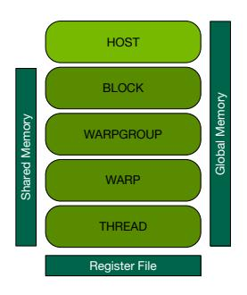
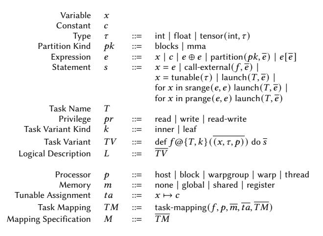
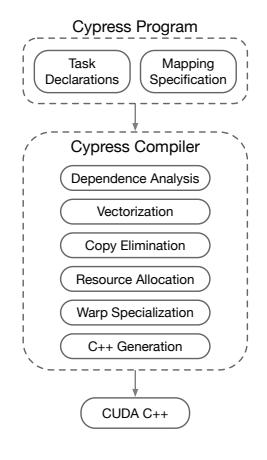
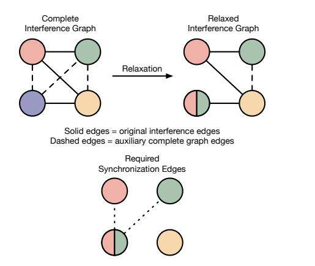
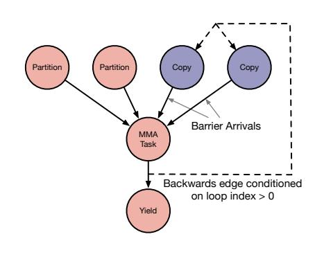
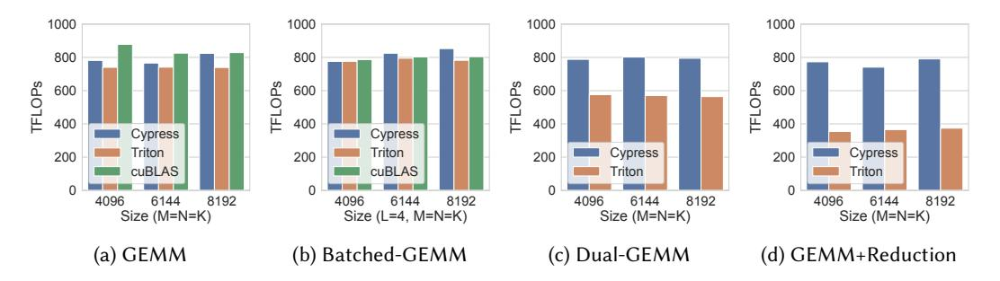
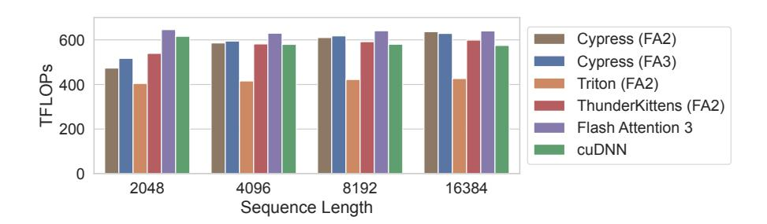

# Task-Based Tensor Computations on Modern GPUs

ROHAN YADAV<sup>∗</sup> , Stanford University, USA MICHAEL GARLAND, NVIDIA, USA ALEX AIKEN<sup>∗</sup> , Stanford University, USA MICHAEL BAUER, NVIDIA, USA

Domain-specific, fixed-function units are becoming increasingly common in modern processors. As the computational demands of applications evolve, the capabilities and programming interfaces of these fixed-function units continue to change. NVIDIA's Hopper GPU architecture contains multiple fixed-function units per compute unit, including an asynchronous data movement unit (TMA) and an asynchronous matrix multiplication unit (Tensor Core). Efficiently utilizing these units requires a fundamentally different programming style than previous architectures; programmers must now develop warp-specialized kernels that orchestrate producerconsumer pipelines between the asynchronous units. To manage the complexity of programming these new architectures, we introduce Cypress, a task-based programming model with sequential semantics. Cypress programs are a set of designated functions called tasks that operate on tensors and are free of communication and synchronization. Cypress programs are bound to the target machine through a mapping specification that describes where tasks should run and in which memories tensors should be materialized. We present a compiler architecture that lowers Cypress programs into CUDA programs that perform competitively with expert-written codes. Cypress achieves 0.88x-1.06x the performance of cuBLAS on GEMM, and between 0.80x-0.98x the performance of the currently best-known Flash Attention implementation while eliminating all aspects of explicit data movement and asynchronous computation from application code.

CCS Concepts: • Software and its engineering → Domain specific languages; Source code generation.

Additional Key Words and Phrases: GPUs, Tensor Cores, Domain Specific Languages

#### ACM Reference Format:

Rohan Yadav, Michael Garland, Alex Aiken, and Michael Bauer. 2025. Task-Based Tensor Computations on Modern GPUs. Proc. ACM Program. Lang. 9, PLDI, Article 163 (June 2025), [25](#page-24-0) pages. [https://doi.org/10.1145/](https://doi.org/10.1145/3729262) [3729262](https://doi.org/10.1145/3729262)

#### 1 Introduction

To continue delivering performance and efficiency improvements for important applications, modern computing architectures are becoming increasingly heterogeneous. Heterogeneity is now common even within a processor like a GPU. A modern GPU contains several domain-specific fixed-function units for accelerating data movement [\[29\]](#page-23-0), matrix multiplication [\[25\]](#page-23-1), texture interpolation [\[13\]](#page-22-0), and ray tracing [\[26\]](#page-23-2). As the demands of applications evolve, the characteristics of these fixed function units, their capabilities, and programming interfaces can rapidly change.

Authors' Contact Information: Rohan Yadav, Stanford University, Stanford, California, USA, rohany@cs.stanford.edu; Michael Garland, NVIDIA, Santa Clara, California, USA, mgarland@nvidia.com; Alex Aiken, Stanford University, Stanford, California, USA, aiken@cs.stanford.edu; Michael Bauer, NVIDIA, Santa Clara, California, USA, mbauer@nvidia.com.


[This work is licensed under a Creative Commons Attribution 4.0 International License.](https://creativecommons.org/licenses/by/4.0)

© 2025 Copyright held by the owner/author(s).

ACM 2475-1421/2025/6-ART163

<https://doi.org/10.1145/3729262>

<sup>∗</sup>This work was done while Rohan Yadav and Alex Aiken were at NVIDIA.

An extreme example of the rate of architectural change and its impact on programming interfaces can be seen in the explosive growth of NVIDIA's Tensor Cores [\[25\]](#page-23-1), which perform matrix-multiplyaccumulate (MMA) operations. Tensor Cores have grown dramatically in six years, from computing 8x8x4 multiplications in the Volta [\[25\]](#page-23-1) architecture to 64x256x16 multiplications in the latest Hopper architecture [\[29\]](#page-23-0). As the capabilities of Tensor Cores have increased, their programming model underwent significant revisions. On the Volta and Ampere [\[27\]](#page-23-3) architectures, groups of 8 and 32 threads dispatch matrix multiplications onto the Tensor Cores, which interact with the register file. In contrast, Hopper's single Tensor Core per streaming multiprocessor (SM) requires groups of 128 threads to collectively issue a matrix multiplication on tiles of data split across both the register file and shared memory. To keep Hopper's Tensor Cores fed with data, an asynchronous data movement unit called the Tensor Memory Accelerator [\[29\]](#page-23-0) (TMA) must be used.

Achieving peak performance using this pair of functional units requires writing complex pipelines that manage synchronization between asynchronous copies and computation [\[7,](#page-22-1) [33,](#page-23-4) [37\]](#page-23-5), a fundamentally different programming style than in prior architectures (Section [2\)](#page-2-0). Managing the asynchrony required to efficiently utilize these latest functional units adds a new level of difficulty to developing high performance GPU code. While kernel libraries can be provided by vendors, the development of new kernels and the development of the kernel libraries themselves directly face the challenges of programming with asynchronous fixed-function units. State-of-the-art programming systems that target Hopper either push the brunt of managing communication and synchronization to the programmer (such as kernels written using extensions of CUTLASS [\[30\]](#page-23-6) or ThunderKittens [\[41\]](#page-23-7)) or exclude these concepts from the programming model and rely on the compiler to infer all such details (such as Triton [\[43\]](#page-24-1)). Manual management of data movement and synchronization is error-prone even for expert programmers, leading to data races or sub-optimal performance when opportunities for overlap are not exploited. More automatic systems ease some of these burdens for the programmer, but require the compiler to make heuristic decisions about how to map the computation and data onto the physical machine. As we show in Section [5,](#page-16-0) automated systems like Triton can produce sub-optimal performance when compared to expert-written code. We believe that programming models for these emerging accelerators must evolve to meet dichotomous goals: making it easy to write correct code in the face of increasingly complex architectures while simultaneously delivering low-level control over crucial decisions for achieving peak performance.

To this end we present Cypress, a task-based programming model to manage the asynchrony and heterogeneity in emerging GPU architectures. The Cypress programming model aims to find a middle ground between prior approaches by automating difficult aspects like explicit data movement and synchronization, but gives the user control over performance-critical decisions like how a computation is decomposed and mapped onto the target machine. Cypress targets tensor algebraic computations that leverage asynchronous fixed-function units like the Tensor Core and TMA. A Cypress program is organized into two components: a logical description of the computation and a mapping specification that binds the computation to the physical machine. The logical description of a Cypress program describes the computation sequentially in terms of designated functions called tasks that operate on first-class tensors. The mapping specification of a Cypress program enables users to dictate on which groups of threads tasks should execute (e.g., thread blocks or warps), and in which memories tensors should be placed (e.g., global memory or shared memory). The Cypress compiler combines the logical computation with the mapping to infer where implicit parallelism can be exploited and where data movement must be inserted for correctness to produce an aggressive static schedule that fully leverages available functional units. We envision that a system like Cypress could be used in the development of new kernels that are not supported by existing vendor libraries, or used as a tool to develop kernels within the vendor libraries themselves.

We implement a prototype of the Cypress compiler as a source-to-source translator that combines the logical computation and mapping specification to generate CUDA C++ for the data movement and matrix multiplication accelerators available on NVIDIA Hopper GPUs. Our prototype compiler is implemented in MLIR [\[23\]](#page-23-8) and lowers away task-based abstractions into warp-specialized code [\[4\]](#page-22-2) structured similar to CUTLASS main loops. The specific contributions of this work are:

- A programming model with sequential semantics for targeting GPUs with asynchronous fixed-function units through task-based abstractions.
- A compiler architecture that lowers task-based programs to GPU code that achieves near peak performance.

To evaluate Cypress, we implement a variety of linear algebra kernels such as GEMM and Fused Multi-Headed Attention. Cypress performs competitively with hand-tuned implementations in cuBLAS, cuDNN, CUTLASS and ThunderKittens, achieving between 0.80x-1.09x of their performance. We also show that first-class asynchrony and control over mapping enables kernels developed in Cypress to outperform Triton by 0.99x-2.18x, as Triton often struggles to effectively utilize the TMA and its heuristics routinely place tensors in suboptimal locations in memory.

#### <span id="page-2-0"></span>2 Background

Modern GPUs are programmmed using a SIMT (Single Instruction, Multiple Threads) programming model: every thread executes the same sequence of instructions. Kernels are usually written in a bulk-synchronous style, where all threads in a block periodically synchronize with each other at a barrier. Linear algebra kernels, specifically, are often statically parameterized with tile sizes and software pipelining depths [\[45,](#page-24-2) [46\]](#page-24-3). With the advent of deep learning, GPU architects introduced fixed-function matrix multiplication units to continue increasing GEMM performance. These units have grown to perform asynchronous bulk computations over large tiles of data, and their evolution has dramatically affected the structure of efficient GEMM programs. An inflection point occurred between the NVIDIA Ampere [\[27\]](#page-23-3) and Hopper [\[29\]](#page-23-0) architectures, where an optimized Hopper GEMM kernel requires a substantially different structure than an optimized Ampere GEMM kernel. To motivate the need for systems like Cypress, we present psuedocode for efficient GEMM kernels on Ampere and Hopper in Figure [1,](#page-3-0) adapted from CUTLASS [\[30\]](#page-23-6) implementations. Each example shows the computation that executes on an individual streaming multi-processor (SM) of the target GPU, which is responsible for computing a tile of the output matrix = × of size T\_M by T\_N.

#### 2.1 Programming Ampere

Figure [1a](#page-3-0) presents psuedocode for a high performance GEMM implementation targeting the Ampere architecture. At a high level, the implementation allocates shared memory buffers for tiles of the and matrices, and iterates over tiles in the-reduction dimension of the computation (Line [5\)](#page-3-1). The implementation executes a multi-stage software pipeline, prefetching data from the global high-bandwidth memory into the SM's local shared memory (Line [7\)](#page-3-2), and then gathering data from the local shared memory into each thread's register file (Line [19\)](#page-3-3). A sophisticated implementation in CUTLASS [\[30\]](#page-23-6) or cuBLAS would use specialized data movement instructions [\[16\]](#page-22-3) that load matrices from shared memory into the registers, invoke the tensor core at the warp level, and ensure that instructions are interleaved in a manner that keeps all floating point and load/store units busy at the same time.

#### 2.2 Programming Hopper

While the Ampere GEMM implementation is a fairly traditional bulk-synchronous CUDA program, the Hopper implementation in Figure [1b](#page-3-0) has pervasive asynchrony, requiring a fundamentally

```
1 def mma_device ( gC , gA , gB ) :
2 # Shared memory tiles of A and B.
3 _shared_ sA [ T_M , T_K ] , sA_next [ T_M , T_K ]
4 _shared_ sB [ T_K , T_N ] , sB_next [ T_K , T_N ]
5 for k in range (0 , gA . shape [1] / T_K ) :
6 # All threads prefetch tile of global memory .
7 copy ( tile ( gA , ( blk_x () , k +1) ) , sA_next )
8 copy ( tile ( gB , ( k +1 , blk_y () ) ) , sB_next )
9 # Allocate register fragments for
10 # thread - local pieces of A and B.
11 rA , rA_next = allocFragA () , allocFragA ()
12 rB , rB_next = allocFragB () , allocFragB ()
13 copy ( tile ( sA , 0) , rA )
14 copy ( tile ( sB , 0) , rB )
15 # Block the shared memory tiles into
16 # register - sized chunks .
17 for kk in range (0 , T_K / BLK_K ) :
18 # Prefetch shared memory into registers .
19 copy ( tile ( sA , kk +1) , rA_next )
20 copy ( tile ( sB , kk +1) , rB_next )
21 # Fully unrolled thread - level gemm .
22 gemm ( accum , rA , rB )
23 # Swap rA , rB with rA_next , rB_next
24 swap ( rA , rA_next )
25 swap ( rB , rB_next )
26 # Swap sA , sB with sA_next , sB_next
27 swap ( sA , sA_next )
28 swap ( sB , sB_next )
29 # Flush the accumulator to global storage .
30 copy ( accum , tile ( gC , blk_x () , blk_y () ) )
         (a) Ampere GEMM main loop [31].
                                                         1 def mma_device ( gC , gA , gB ) :
                                                         2 # Shared memory tiles of A and B.
                                                         3 _shared_ sA [ T_M , T_K , PIPE ] , sB [ T_K , T_N , PIPE ]
                                                         4 _shared_ sC [ T_M , T_N ] # Staging buffer for C.
                                                         5 barrier prod [ PIPE ] , cons [ PIPE ] , copyout
                                                         6 if tid () >= 128:
                                                         7 # One warp (32 threads ) performs copies .
                                                         8 for k in range (0 , gA . shape [1] / T_K ) :
                                                         9 if k >= PIPE :
                                                        10 wait ( cons [ k % PIPE ]) # Wait for consumer .
                                                        11 if tid () == 128:
                                                        12 # Only 1 thread should invoke the TMA.
                                                        13 TMA_load (
                                                        14 prod [ k % PIPE ] , # Completion barrier .
                                                        15 tile ( gA , ( blk_x () , k ) ) -> sA [_ ,_ , k % PIPE ] ,
                                                        16 tile ( gB , (k , blk_y () ) ) -> sB [_ ,_ , k % PIPE ])
                                                        17 wait ( copyout )
                                                        18 if tid () == 128:
                                                        19 TMA_store ( sC -> tile ( gC , blk_x () , blk_y () ) )
                                                        20 else :
                                                        21 # Four warps (128 threads ) perform GEMMs .
                                                        22 for k in range (0 , gA . shape [1] / T_K ) :
                                                        23 wait ( prod [ k % PIPE ]) # Wait for TMA.
                                                        24 # All 128 threads concurrently call wgmma .
                                                        25 warpgroup_sync ()
                                                        26 # Invoke Tensor Core and wait for result .
                                                        27 wgmma ( accum , sA [_ ,_ , k ] , sB [_ ,_ , k ])
                                                        28 warpgroup_wait ()
                                                        29 arrive ( cons [ k % PIPE ]) # Notify DMA warp .
                                                        30 # Copy from registers to the staging buffer .
                                                        31 copy ( accum , sC )
                                                        32 syncthreads ()
                                                        33 arrive ( copyout )
                                                                  (b) Hopper GEMM main loop [32].
```

<span id="page-3-12"></span><span id="page-3-11"></span><span id="page-3-10"></span><span id="page-3-8"></span><span id="page-3-7"></span><span id="page-3-6"></span><span id="page-3-5"></span><span id="page-3-3"></span>Fig. 1. High-level GEMM computation structure on Ampere and Hopper GPUs.

different approach. Although each SM still iterates through tiles in the K-reduction dimension, for Hopper, almost all data movement is offloaded asynchronously to the TMA (Lines [13](#page-3-4) and [19\)](#page-3-5), and the bulk of the GEMM computation is offloaded asynchronously to the Tensor Core (Line [27\)](#page-3-6). The high throughput of both the TMA and the Tensor Cores mandates the use of deep pipelines (controlled by the PIPE variable) to avoid exposing latency. Meanwhile, the threads of the SM must manage the dependencies between both the fixed function units by periodically synchronizing with them while simultaneously performing their own computations (Lines [23](#page-3-7) and [28\)](#page-3-8). It is challenging to maintain a schedule that manages the competing concerns of ensuring functional correctness and avoiding unnecessary synchronization that hinders performance.

To further complicate matters, achieving peak performance mandates using warp specialization [\[4\]](#page-22-2) to decouple data loading from computation. With warp specialization for Tensor Cores, warps (groups of 32 hardware threads) are specialized so that there is a data-movement warp (DMA) that exclusively issues work to the TMA (Lines [8–](#page-3-9)[19\)](#page-3-5) and a group of four warps (henceforth referred to as a warpgroup) that exclusively issue work to the Tensor Core (Lines [22–](#page-3-10)[33\)](#page-3-11). The choice of four warps in a warpgroup is mandated by the machine–every Tensor Core operation must be cooperatively launched by exactly four warps (128 threads). The DMA warp invokes the TMA (from a single thread) to load tiles into shared memory, and then notifies the compute warpgroup via the prod barrier when tiles are available. When the prod barrier is triggered, the compute warpgroup collectively issues the matrix multiplication to the Tensor Core (Line [27\)](#page-3-6). The operands matrices of the matrix multiplication are partitioned across each of the 128 threads in the

warpgroup, split across the registers and the shared memory. Then, all of the 128 threads execute the wgmma instruction at the same time to invoke the Tensor Core. After explicitly waiting for the Tensor Core to complete, the compute warpgroup notifies the DMA warp via the cons barrier so that shared memory buffers can be reused (Line [29\)](#page-3-12). Warp specialization also improves efficiency by enabling the registers of the data movement warp to be used by the compute warps to store larger accumulators in the register file. Taken in aggregate, these differences signal that for Hopper and later GPUs, kernels can no longer be structured in the traditional bulk-synchronous style, and instead must be organized differently to cope with the significant challenges posed by new and changing functional units.

#### 3 Programming Model

If these trends become common, asynchronous fixed-function units will become increasingly powerful, and programming models will need to adapt to aid programmers in managing this level of pervasive asynchrony. The Cypress programming model aims to provide programmers with tools to grapple with these growing complexities while still enabling peak performance. Similar to other task-based programming models [\[2,](#page-22-4) [6,](#page-22-5) [9,](#page-22-6) [14,](#page-22-7) [24\]](#page-23-11), Cypress programs have sequential semantics, which simplifies reasoning about correctness and ensures that common bugs involving races and data coherence cannot manifest. However, unlike most task-based models (except Sequoia [\[14\]](#page-22-7), see Section [6\)](#page-20-0), the Cypress model is designed to be amenable to a fully static analysis so programs can be statically parallelized, scheduled, and optimized without incurring runtime overheads that would inhibit peak performance. A Cypress program consists of a logical description of the computation in terms of tasks that operate on collections of data called tensors, where all tasks appear to execute in sequential program order (Section [3.2\)](#page-5-0). Separately, the mapping specification of a Cypress program (Section [3.3\)](#page-6-0) binds the tasks and tensors onto a target machine. Cypress is designed such that choice of mapping decisions can only affect performance, not correctness. The Cypress compiler (Section [4\)](#page-9-0) is responsible for inferring parallelism, inserting all data movement required to maintain coherence, and enforcing the necessary synchronization required to maintain the sequential semantics of the source program under the mapping description. To motivate the need for many of the programming model's features we begin with a discussion of the machine model.

## 3.1 Machine Model

Cypress describes machines to the programmer using a hierarchical model that captures the locality in modern architectures. A machine is described by specifying one or more processor levels, each of which corresponds to a logical processor on the target machine, corresponding to thread groupings that have semantic meaning in the target machine. The machine also describes the available memories and which processor level(s) can access each memory. A machine description for the Hopper GPU is shown in Figure [2.](#page-4-0) The Hopper machine description has multiple processor levels,

from the host that launches GPU kernels down to the individual threads on the device. Rather than representing Tensor Cores explicitly, we introduce the warpgroup level to describe a group of threads capable of initiating work on a Tensor Core. The Hopper machine description has the usual 3 kinds of memories supported by CUDA, each visible from different processor levels. The global memory is visible to all processors, while the shared memory is only visible to an individual block and below, and the register file is thread local. We expect this framework for describing machines to be robust at capturing salient architectural details in the face of continued GPU evolution by adding new memories and processor levels. For example, the newly released

<span id="page-4-0"></span>

Fig. 2. H100 Machine Model

NVIDIA Blackwell architecture features a larger tensor core shared by pairs of SMs and a new memory kind to store tensor core output

into. Such features could be captured by additional hierarchy, new processor and new memory kinds in the Cypress machine model. A version of Cypress that targets a specific GPU architecture would provide the programmer a machine model for that GPU. The hierarchical nature of the processors in the machine model also provides a conceptual target for programmers to consider when structuring their programs and expressing mapping specifications.

#### <span id="page-5-0"></span>3.2 Logical Description

The first component of a Cypress program is the logical description, which expresses the computation in terms of tasks and tensors. Tasks and tensors are described without referencing physical memory addresses or data movement mechanisms, so the same task implementations can be potentially reused both at multiple levels within a target machine and across machines. The logical description of Cypress programs is defined in the abstract syntax in Figure [3.](#page-6-1)

Tasks. Computations in Cypress are described as tasks. A task is a designated function that may have multiple variants, which are different implementations that may target different processors or employ different algorithms. Each variant of a task must have the same function signature. Tasks are parameterized using tunable values, which are statically specialized to values provided in the mapping specification. Different variants of a task may require different tunable values to be specified. Task variants may either be inner or leaf variants. Inner task variants may launch sub-tasks to express hierarchical decomposition of the computation. Inner task variants are limited to performing only scalar computations, partitioning tensors (discussed later in this section) and launching sub-tasks — inner variants may not access the data within tensors or invoke external functions. Leaf task variants may not launch sub-tasks, but may directly access tensor data and perform arbitrary computation, such as invoking arbitrary C++ functions (using the call-external construct).

Inner task variants may launch sub-tasks in multiple ways, depending on the desired algorithmic choice. First, inner task variants may launch a sequential group of tasks over an iteration domain using the srange operation, where each task executes in order. Inner tasks may alternatively use the prange operation to launch a group of parallel tasks. As discussed shortly, the tasks launched with prange must not perform aliasing writes to the same (parts of) tensors. While tasks launched by prange execute in parallel, the sequential semantics ensure that the effects of execution are the same as if srange was used. Finally, single tasks may be launched inline. These three constructs for launching subtasks enable programmers to decompose computations differently to match the capabilities of different hardware resources. In all cases, the concrete variant to be dispatched at a task launch site is controlled by the mapping specification, allowing customization to a target machine.

Tensors. Cypress has a first-class representation of data collections astensors, or multi-dimensional arrays. Tasks operate on tensors and accept both tensors and scalars as arguments. Every task declares the effects it will have on its argument tensors by specifying the privilege with which each tensor will be used. Tasks must respect the declared privilege when accessing a tensor or launching sub-tasks. For example, a task that requests the read privilege on a tensor may not launch a sub-task that requests write privileges on the same tensor. The privileges that tasks take on their argument tensors impact the optimizations and transformations that the Cypress compiler can perform.

Tensors may be partitioned into pieces to decompose the data with the decomposed computation. Partitions of tensors are created through a set of partitioning operators (similar to Diffuse [\[48\]](#page-24-4)) that describe the mechanism of partitioning. These partitioning operators create subsets of a

<span id="page-6-1"></span>


|    | 0    | 1    | 2    | 3    | 4    | 5    | 6    | 7    |
|----|------|------|------|------|------|------|------|------|
| 0  | TO   | T0   | T1   | T1   | T2   | T2   | ТЗ   | Т3   |
| 7  | T28  | T28  | T29  | T29  | T30  | T30  | T31  | T31  |
| 8  | T0   | T0   | T1   | T1   | T2   | T2   | ТЗ   | Т3   |
| 15 | T28  | T28  | T29  | T29  | T30  | T30  | T31  | T31  |
| 16 | T32  | T32  | T33  | T33  | T34  | T34  | T35  | T35  |
| 31 | T60  | T60  | T61  | T61  | T62  | T62  | T63  | T63  |
| 32 | T64  | T64  | T65  | T65  | T66  | T66  | T67  | T67  |
| 47 | T92  | T92  | T93  | T93  | T94  | T94  | T95  | T95  |
| 48 | T96  | T96  | T97  | T97  | T98  | T98  | T99  | T99  |
| 63 | T124 | T124 | T125 | T125 | T126 | T126 | T127 | T127 |

Fig. 4. Output matrix layout in registers for M=64,N=n\*8 warp-group matrix multiplication instruction (adapted from NVIDIA PTX documentation).

tensor, each of which is also a tensor. The sub-tensors created by partitioning operators need not contain contiguous sets of elements in the original tensor as each sub-tensor is given a new compacted, origin-based coordinate system. Sub-tensors may then be extracted from partitions with the indexing operation and used as arguments to task launches, expressing the data required by each sub-computation.

There are currently two partitioning operators, both of which will be used for implementing the high performance GEMM in Section 3.4. The blocks partitioning operator performs a tiling-based partition, partitioning a tensor into blocks of a given size. The mma partitioning operator abstracts the tensor partitioning required for a Tensor Core. Figure 4 contains an example of the partitioning for the output C matrix of a Hopper Tensor Core matrix multiply (note the partition is logically non-contiguous). The Hopper Tensor Core expects the rows of the output matrix to be partitioned into groups of 16 across the four warps in the warpgroup (shown by the coloring of Figure 4), and the columns of the output to be swizzled across the threads in each warp. The swizzling pattern is repeated across each group of 8 rows (shown only for the first warp). The matrix elements that thread i in the warpgroup holds are denoted by the label Ti in Figure 4. This partitioning pattern is replicated across the number of columns available in the MMA instruction — for example, the same pattern would be used for columns 8-15 and 16-23 in the 64x24x16 MMA instruction. These partitioning strategies are mandated by the architecture to avoid resource conflicts when accessing the shared memory or register file, and will vary across accelerator instruction variants.

The partitioning strategies for a GEMM illustrate the necessity of multiple variants of a task: the desired decomposition of both computation and data can be different at each processor level to interact well with the hardware. For example, the GEMM computation (Section 3.4) will use block-based partitioning strategies to decompose the data onto each SM and warpgroup, and then architecture-specific partitioning strategies to target the Tensor Core. Even within the Tensor Core partitioning, different strategies are used at the warp and thread levels, affecting the partitioning strategies for tensors co-partitioned with tensors intended for consumption by the Tensor Core.

#### <span id="page-6-0"></span>3.3 Mapping Specification

The second component of a Cypress program is a *mapping specification* that dictates how to bind a program to a particular machine description. The mapping specification allows for control over

```
1 @task ( " gemm " , Inner , reads =[ " A " ," B " ] , writes =[ " C " ])
2 def gemm_host ( C : tensor [2 , f16 ] ,
3 A : tensor [2 , f16 ] ,
4 B : tensor [2 , f16 ]) :
5 U , V = tunable (int ) , tunable (int )
6 # Input tensor sizes are dynamic values .
7 M , N , K = C . shape [0] , C . shape [1] , A . shape [1]
8 # Partition C into UxV tiles , and describe
9 # the corresponding rows and columns of A and B.
10 Cp = partition_by_blocks (C , (U , V ) )
11 Ap = partition_by_blocks (A , (U , K ) )
12 Bp = partition_by_blocks (B , (K , V ) )
13 # Launch a parallel group of tasks over each tile .
14 for i , j in prange ( cdiv (M , U ) , cdiv (N , V ) ) :
15 launch ( " gemm " , Cp [i , j ] , Ap [i , 0] , Bp [0 , j ])
17 @task ( " gemm " , Inner , reads =[ " A " ," B " ] , writes =[ " C " ])
18 def gemm_block ( C : tensor [2 , f16 ] ,
19 A : tensor [2 , f16 ] ,
20 B : tensor [2 , f16 ]) :
21 W = tunable (int)
22 M , N , K = C . shape [0] , C . shape [1] , A . shape [1]
23 # Break A and B into tiles of width W.
24 Ap = partition_by_blocks (A , (M , W ) )
25 Bp = partition_by_blocks (B , (W , N ) )
26 Cacc : tensor [2 , f16 ] = make_tensor (M , N )
27 launch ( " clear " , Cacc )
28 # Launch a sequential group of tasks over each tile .
29 for k in srange ( cdiv (K , W ) ) :
30 launch ( " gemm " , Cacc , Ap [0 , k ] , Bp [k , 0])
31 launch ( " copy " , Cacc , C )
33 @task ( " gemm " , Inner , reads =[ " A " ," B " ," C " ] , writes [ " C " ])
34 def gemm_tile ( C : tensor [2 , f16 ] ,
35 A : tensor [2 , f16 ] ,
36 B : tensor [2 , f16 ]) :
37 WGS = tunable (int )
38 M , N , K = C . shape [0] , C . shape [1] , A . shape [1]
39 # Partition the rows for each warpgroup .
40 Cp = partition_by_blocks (C , ( M / WGS , N ) )
41 Ap = partition_by_blocks (A , ( M / WGS , K ) )
42 for i in prange ( WGS ) :
43 launch ( " gemm " , Cp [i , 0] , Ap [i , 0] , B )
44
45 @task ( " gemm " , Inner , reads =[ " A " ," B " ," C " ] , writes [ " C " ])
46 def gemm_inner ( C : tensor [2 , f16 ] ,
47 A : tensor [2 , f16 ] ,
48 B : tensor [2 , f16 ]) :
49 PIECES , PROC = tunable (int) , tunable ( processor )
50 # MMA partitioning depends on processor and operand position .
51 Cp = partition_by_mma (C , WGMMA_64x256x16 () , PROC , " C " )
52 Ap = partition_by_mma (A , WGMMA_64x256x16 () , PROC , " A " )
53 Bp = partition_by_mma (B , WGMMA_64x256x16 () , PROC , " B " )
54 for i in prange ( PIECES ) :
55 launch ( " gemm " , Cp [ i ] , Ap [ i ] , Bp [ i ])
57 @task ( " gemm " , Leaf , reads =[ " A " ," B " ," C " ] , writes [ " C " ])
58 def gemm_thread ( C : tensor [2 , f16 ] ,
59 A : tensor [2 , f16 ] ,
60 B : tensor [2 , f16 ]) :
61 # Dispatch to the PTX WGMMA instruction with CuTe .
62 CuTe_warpgroup_gemm ( WGMMA_64x256x16 () , C , A , B )
63
64 # Task trees for the `fill ` and `copy ` tasks elided .
                                                                         1 [
                                                                         2 TaskMapping (
                                                                         3 instance = " gemm_host " ,
                                                                         4 variant = " gemm_host " ,
                                                                         5 proc = HOST ,
                                                                         6 mems =[ GLOBAL , GLOBAL , GLOBAL ] ,
                                                                         7 tunables ={ " U " : 256 ,
                                                                         8 " V " : 256} ,
                                                                         9 entrypoint = True ,
                                                                        10 calls =[ " gemm_block " ]
                                                                        11 ) ,
                                                                        12 TaskMapping (
                                                                        13 instance = " gemm_block " ,
                                                                        14 variant = " gemm_block " ,
                                                                        15 proc = BLOCK ,
                                                                        16 mems =[ GLOBAL , GLOBAL , GLOBAL ] ,
                                                                        17 tunables ={ " W " : 64} ,
                                                                        18 calls =[ " clear_tile " ,
                                                                        19 " gemm_tile " ,
                                                                        20 " copy_tile " ] ,
                                                                        21 warpspecialize = True ,
                                                                        22 pipeline =3
                                                                        23 ) ,
                                                                        24 TaskMapping (
                                                                        25 instance = " gemm_tile " ,
                                                                        26 variant = " gemm_tile " ,
                                                                        27 proc = BLOCK ,
                                                                        28 mems =[ NONE , SHARED , SHARED ] ,
                                                                        29 tunables ={ " WGS " : 2} ,
                                                                        30 calls =[ " gemm_warpgroup " ]
                                                                        31 ) ,
                                                                        32 TaskMapping (
                                                                        33 instance = " gemm_warpgroup " ,
                                                                        34 variant = " gemm_inner " ,
                                                                        35 proc = WARPGROUP ,
                                                                        36 mems =[ NONE , SHARED , SHARED ] ,
                                                                        37 tunables ={ " PIECES " : 4 ,
                                                                        38 " PROC " : WARP }
                                                                        39 calls =[ " gemm_warp " ]
                                                                        40 ) ,
                                                                        41 TaskMapping (
                                                                        42 instance = " gemm_warp " ,
                                                                        43 variant = " gemm_inner " ,
                                                                        44 proc = WARP ,
                                                                        45 mems =[ NONE , SHARED , SHARED ] ,
                                                                        46 tunables ={ " PIECES " : 32 ,
                                                                        47 " PROC " : THREAD }
                                                                        48 calls =[ " gemm_thread " ]
                                                                        49 ) ,
                                                                        50 TaskMapping (
                                                                        51 instance = " gemm_thread " ,
                                                                        52 variant = " gemm_thread " ,
                                                                        53 proc = THREAD ,
                                                                        54 mems =[ REGISTER , SHARED , SHARED ] ,
                                                                        55 ) ,
                                                                        56 # Mappings for `fill ` and
                                                                        57 # `copy ` task trees elided .
                                                                        58 ]
                                                                                (b) Mapping specification.
                                         (1)
                                                                                                                    (1)
                                            (2)
                                                                                                         (2)
                                                          (3)
                                                                                                         (3)
```

#### <span id="page-7-9"></span><span id="page-7-7"></span><span id="page-7-6"></span>(a) Logical program description.

Fig. 5. H100 GEMM implementation developed in Cypress. The logical description expresses the decomposition of computation and data, and the mapping binds tasks and tensors to physical processors and memories. Numbered bracket annotations indicate components of the logical description controlled by the mapping specification. Communication and synchronization are notably absent from the logical description. Proc. ACM Program. Lang., Vol. 9, No. PLDI, Article 163. Publication date: June 2025.

performance sensitive decisions, and the Cypress compiler ensures that mapping decisions do not affect correctness. The mapping specification statically instantiates a tree of tasks by determining which task variants are used at each processor level and in which memories the tensors used by each task will be placed. A mapping specification is defined by a set of task-mapping objects, defined in Figure 3. Each task-mapping object (called an instance) corresponds to an instantiation of a specific task. Each instance is identified with a name, which may be referenced by other instances. A instance declares several attributes: 1) the task variant the instance will use for execution, 2) the processor the task variant should execute on, 3) the memory where each tensor argument of the task should be placed (each tensor can be placed in a different memory), 4) the concrete values that should be bound to tunable values in the task variant, and 5) the task-mapping instance to dispatch each launched child task to. The mapping specification can also control processor-specific behavior, such as whether to warp-specialize or pipeline the execution of a particular task instance. We provide examples of each of these additional controls in Section 3.4. While not shown in Figure 3, the mapping specification can control other performance-sensitive attributes like the data layouts of tensors. Control over these data layouts can mitigate the impacts of hardware effects like bank conflicts in the shared memory.

Programmers often want to guarantee in a mapping specification that, for either performance or capacity reasons, some tensors are never materialized in a particular memory but instead share a mapping with task instances further down the task tree. For example, in a Hopper GEMM implementation, the output accumulator matrix held by each thread block should never be materialized in its entirety. Instead, the accumulator should only be materialized in a partitioned form among the registers of each thread involved in the GEMM. Such a constraint can be expressed using the none memory option when mapping a tensor. The Cypress compiler will report if any tensors mapped to the none memory were unable to satisfy this constraint during compilation, indicating that the user needs to change their partitioning or mapping strategy to achieve the desired outcome.

#### <span id="page-8-0"></span>3.4 Case Study: Hopper GEMM

Having presented the logical description and mapping specification components of the Cypress language, we now walk through a high performance Hopper GEMM implementation developed in Cypress. Figure 5 contains the GEMM implementation, where the previously presented abstract syntax has been concretized in a Python embedded DSL. The program describes the data and computation decompositions for a GEMM that is hierarchically blocked for each processor level, where a different task variant is used for each processor level. The entrypoint of the computation is the gemm\_host root task instance which uses the task variant of the same name to execute on the HOST processor level. gemm\_host breaks the output tensor C into a set of tiles using the U and V tunables, and defines the panels of A and B needed to compute each output tile (Figure 5a, Line 10). It then uses the prange construct to launch a group of parallel tasks, where each sub-task is dispatched to a gemm\_block instance and is responsible for computing a separate output tile of C.

The gemm\_block instances use a different task variant and therefore a different algorithm for GEMM than gemm\_host. Inside a block (or SM), taking advantage of locality using the shared memory and register file is important for GEMM performance. To do so, gemm\_block creates an accumulator tensor that will eventually be mapped into the registers. gemm\_block launches a task to zero-initialize the accumulator, then uses srange to iterate over tiles of the *K*-reduction dimension and recursively perform GEMMs into the accumulator (Figure 5a, Line 30). After processing all tiles, gemm\_block launches a task to copy the accumulator to the output. We elide the sub-trees for clear and copy, which are invoked by gemm\_block. The implementations and instantiations of these task variants share a similar structure to the remainder of the GEMM computation we will

describe. The mapping of gemm\_block also requests for warp specialization of the task body, and for a 3-deep pipeline to execute the loop over tiles (Figure [5b,](#page-7-0) Lines [21](#page-7-3) and [22\)](#page-7-4).

The GEMM is then decomposed onto the resources within an SM — the warpgroups, warps and threads. gemm\_block dispatches to the gemm\_tile variant (Figure [5b,](#page-7-0) Line [19\)](#page-7-5), which partitions the GEMM row-wise between two warpgroups. This is an optimization for large tile sizes that splits the accumulator across multiple warpgroups to lower the per-thread register usage, as each CUDA thread is limited to 255 registers. The mapping creates two task instances for the warpand thread-level partitioning of operands for the Tensor Core (Figure [5b,](#page-7-0) Lines [32](#page-7-6) and [41\)](#page-7-7). Both task instances use the gemm\_inner variant, but instantiated with different values for the tunable variables. Figure [5b](#page-7-0) finishes instantiating the task tree with the leaf task gemm\_thread, which executes on individual GPU threads. Each GEMM invocation in Line [30](#page-7-2) of Figure [5a](#page-7-0) is decomposed into two groups of 128 leaf task invocations of gemm\_thread. Cypress does not perform analysis or optimization of the contents of leaf tasks, so users may invoke arbitrary CUDA C++ functions within a leaf task's body. gemm\_thread uses CuTe [\[28\]](#page-23-12) to dispatch to the desired assembly instruction to invoke the Tensor Core.

#### 3.5 Discussion

The separation of the logical description and the mapping specification enables the programmer to specify performance-sensitive decisions without making invasive modifications to the application code. One example of this flexibility is the control over data movement through mapping decisions. The change in mapping from GLOBAL to SHARED between the gemm\_block and gemm\_tile instances (Figure [5b,](#page-7-0) Lines [16](#page-7-8) and [28\)](#page-7-9) implies communication of tiles needed by gemm\_tile from global memory to shared memory, for which Cypress automatically uses the TMA (if available on the target GPU). Another example is adding a level of hierarchy, which a user might do when transitioning a program to use multiple warpgroups. To perform this transition, a program that doesn't utilize the warpgroup level of the processor hierarchy would add additional task variants that target the warpgroup level, and adjust the mapping specification to dispatch to these variants. The existing task variants and mapping specifications would not need to be modified.

The separation provided by Cypress's programming model also allows for the algorithmic description of the problem to be separated from the implementation details required to realize the algorithm on a physical device. This aspect of the Cypress programming model places it in a middle ground between systems like CUTLASS that require users to manually manage low-level functional details and systems like Triton that hide most performance-sensitive mapping decisions from users. Cypress offers the programmer low-level control over the algorithm and mapping decisions, but automates the implementation of the strategy for performance and guaranteed correctness. As we show in Section [5,](#page-16-0) this ability for the programmer to influence the compiler's decisions can be important to achieving peak performance. Finally, the Cypress programming model makes the partitions of data and their usages explicit in the source program. As code is modified or new functionality is introduced, it is the responsibility of the compiler to continue to maintain an execution consistent with the sequential semantics of the program. In contrast, program modification in a lower-level programming model can inadvertently result in bugs due to missing synchronization or communication between different uses of partitioned data.

#### <span id="page-9-0"></span>4 Compilation

The Cypress compiler lowers a logical program description and a mapping specification to warpspecialized CUDA C++ with explicit communication and synchronization. We chose to generate CUDA C++ as a simplifying decision for the prototype compiler; a lower-level target like NVVM could be used in a production implementation. At the fine-grained scale of code running in the

<span id="page-10-0"></span>

```
Processor
                       p
                       m
     Memory
      Variable
                                          (int list, m)
         Tensor
   EventType
                       et
                                ::=
                                         () \mid (\mathbb{N}, p) \text{ list}
  EventIndex
                       ei
                                ::=
         Event
                       ev
                                ::=
                                         x \mid ev[ei]
Precondition
                       br
                                         ev set
                                        x \mid t \mid \mathbb{Z} \mid e \oplus e \mid
   Expression
                       е
                                ::=
                                         partition(\overline{e}) | e[\overline{e}]
   Operation
                                         x = e
                                         ev: et = copy(e, e), pr \mid
                                         ev : et = call(f, \overline{e}), pr \mid
                                         ev : et = \text{for } x \text{ in } [e, e), pr \text{ do } b
                                         ev: et = \mathsf{pfor} \ x \ \mathsf{in} \ [\, e, e\,), pr \ \mathsf{do} \ b
                      b
          Block
                                        \overline{o}; yield ev
```

Fig. 6. Cypress compiler architecture overview.

Fig. 7. Cypress's event-based intermediate representation.

SM, there is no room for the overhead of a dynamic runtime system that schedules tasks and copies. Instead, the Cypress compiler leverages and then eliminates all task-based abstractions to generate statically scheduled loops. The architecture of the Cypress compiler is shown in Figure 6. We discuss the intermediate representation (IR) used by the Cypress compiler and then discuss each of the passes involved in lowering Cypress programs to CUDA C++.

#### <span id="page-10-1"></span>4.1 Intermediate Representation

A grammar for a simplified form of Cypress's intermediate representation is shown in Figure 7. The IR contains operations like explicit copies between tensors and task invocations, as well as sequential and parallel for loops. Any potentially asynchronous operation in the IR (such as a copy or an invocation of a leaf task via the call operation) produces an *event* that represents the completion of the operation. Each asynchronous operation accepts a set of precondition events that must complete before it can start. Consequently, the IR encodes a dependence graph through the event connections between operations. The for and pfor operators have a Block which is the loop body; this block has its own completion event to signal the end of an iteration. Scalar computations, such as index arithmetic or creating and accessing a partition, use a standard representation without events. While not shown, the IR contains standard control-flow constructs like branches, which are adapted to yield events in each divergent path. The IR is in a single-static-assignment (SSA) form to ensure that any valid ordering of operations forms an ordering that satisfies all event dependencies.

The most interesting component of Cypress's IR is the representation of events. An event type is either unit or an array of events, where each dimension in the array is annotated with a processor kind. Event arrays are created by parallel loops, where each element of the array corresponds to the completion event of an iteration on a particular processor. An event array can be indexed to extract the particular event that a future operation should depend on. Indexing can be done with an integer value or the broadcast operator [:] (inspired by NumPy broadcasting [18]), which returns an event representing all events along the indexed dimension completing. Indexing an event array represents synchronizing processors of the indexed dimension. We leverage this representation of events in Section 4.2.2 and Section 4.2.3 to track synchronization of parallel loop iterations. We emphasize that events in Cypress's IR are an intermediate construct only, and are not realized in generated code; there is no dynamic dependence tracking performed at run time.

```
1 @task ( " gemm " , Inner , reads =[ " A " ," B " ] , writes =[ " C " ])
2 def gemm_block ( C : tensor [2 , f16 ] ,
3 A : tensor [2 , f16 ] ,
4 B : tensor [2 , f16 ]) :
5 W = tunable (int)
6 M , N , K = C . shape [0] , C . shape [1] , A . shape [1]
7 # Break A and B into tiles of width W.
8 Ap = partition_by_blocks (A , (M , W ) )
9 Bp = partition_by_blocks (B , (W , N ) )
10 Cacc : tensor [2 , f16 ] = make_tensor (M , N )
11 launch ( " clear " , Cacc )
12 for k in srange ( cdiv (K , W ) ) :
13 launch ( " gemm " , Cacc , Ap [0 , k ] , Bp [k , 0])
14 launch ( " copy " , Cacc , C )
16 @task ( " clear " , Inner , writes =[ " C " ])
17 def clear_inner ( C : tensor [2 , f16 ]) :
18 PIECES = tunable ( int)
19 PROC = tunable ( processor )
20 Cp = partition_by_mma (
21 C , WGMMA_SM90_64x256x16 () , PROC , " C " )
22 for i in prange ( PIECES ) :
23 launch ( " clear " , Cp [ i ])
      (a) Candidate GEMM tasks for lowering.
                                                                  1 Ap , Bp = partition ( A ) , partition ( B )
                                                                  2 C = tensor ([ M , N ] , NONE )
                                                                  3 C1 = tensor ([ M , N ] , NONE )
                                                                  4 C1p = partition ( C1 )
                                                                  5 e1 : [(4 , WARP ) ] = pfor i in [0 , 4) , {} do
                                                                  6 CW = tensor ([ M /4 , N ] , NONE )
                                                                  7 CWp = partition ( CW )
                                                                  8 e2 : [(32 , THREAD ) ] = pfor j in [0 , 32] , {} do
                                                                  9 # Concrete shape of register fragment elided .
                                                                 10 CR = tensor ([...] , RMEM )
                                                                 11 e3 : () = call ( clear_thread , CR ) , {}
                                                                 12 e4 : () = copy ( CR , CWp [ j ]) , { e3 }
                                                                 13 yield e4
                                                                 14 e5 : () = copy ( CW , C1p [ i ]) , { e2 [:]}
                                                                 15 yield e5
                                                                 16 e6 : () = copy ( C1 , C ) , { e1 [:]}
                                                                 17 e7 : () = for k in [0 , cdiv (K , W ) ) , { e6 } do
                                                                 18 C2 = tensor ([ M , N ] , NONE )
                                                                 19 Ak = tensor ([ M , W ] , SMEM )
                                                                 20 Bk = tensor ([ W , N ] , SMEM )
                                                                 21 e8 : () = copy (C , C1 ) , {}
                                                                 22 e9 : () = copy ( Ap [0 , k ] , Ak ) , {}
                                                                 23 e10 : () = copy ( Bp [k , 0] , Bk ) , {}
                                                                 24 # Recursive lowering of gemm elided .
                                                                 25 e11 : () = gemm ( C2 , Ak , Bk ) , { e8 , e9 , e10 }
                                                                 26 e12 : () = copy ( C2 , C ) , { e11 }
                                                                 27 yield e12
                                                                 28 # Lowering of " copy " task elided .
```

<span id="page-11-4"></span><span id="page-11-3"></span><span id="page-11-2"></span><span id="page-11-1"></span>(b) Partial dependence analysis result IR.

Fig. 8. Cypress's dependence analysis lowers the task-based logical description into a dependence graph.

#### 4.2 Compiler Architecture

The Cypress compiler consumes a program in the form of a logical description and mapping specification and transforms it into a CUDA C++ program. The Cypress compiler performs this transformation through a series of passes over the IR, shown in Figure [6.](#page-10-0) The first three passes (dependence analysis, vectorization and copy elimination) capture important information from the task-based representation of the program and then lower away the tasking abstractions, while the next two (resource allocation and warp specialization) perform optimizations. The final stage (lowering to C++) replaces events by system-specific synchronization and performs other mechanical translations required to construct valid CUDA programs. We discuss each pass in turn.

<span id="page-11-5"></span>4.2.1 Dependence Analysis. The first stage is dependence analysis, which consumes the taskbased logical description and the mapping specification (Figure [3\)](#page-6-1) to perform a syntax-directed translation to the Cypress IR (Section [4.1\)](#page-10-1). The dependence analysis inserts event dependencies to enforce ordering between tasks using the same data with true or anti-dependencies [\[1\]](#page-22-9), while tasks operating on independent data or with non-interfering privileges (e.g., both reading) may execute in parallel. Additionally, the analysis must also insert data movement to maintain coherence when the same logical tensor is mapped to different memories by distinct tasks. Once the dependence analysis has inserted all dependencies required to enforce the sequential semantics of the source program, later passes must preserve these dependencies throughout applied transformations.

The dependence analysis is an in-order traversal of the instantiated task tree, starting at the task variant denoted as the entrypoint of the computation in the mapping specification. The traversal maintains an event for each tensor in the context of the task variant. At each task launch site, the privilege annotations of the launched task are used to register the appropriate events as preconditions for the task and to update the set of events with the completion event of the task launch. For example, if a task writes to a tensor, then later readers of the tensor record an event dependence on the writing task's completion. Dependencies are enforced between task invocations through chaining events in the IR. To lower a task launch, the compiler consults the mapping specification to determine the invoked task variant and the memory where each tensor argument should be placed. For all tensor arguments to the callee task, the dependence analysis employs a copy-in/copy-out discipline. Lowering a task launch into the Cypress IR consists of four steps:

- (1) Create a fresh allocation for each tensor argument to the callee task, in the memory specified by the mapping,
- (2) For each tensor argument read by the callee task, emit a copy from the existing tensor allocation into the fresh allocation and record any event preconditions for the copy,
- (3) Record all copy completion events as preconditions for the callee task and then recursively traverse the selected task variant of the callee to generate its IR, and
- (4) For each tensor argument written by the callee task, emit a copy from the fresh allocation into the existing allocation of the caller task with the callee completion event as a precondition.

When lowering a parallel group of tasks, the broadcast indexing operator is used to condition future operations on the completion of all parallel iterations. The copy-in/copy-out discipline ensures dependence analysis is always local to the task variant being traversed, which minimizes the complexity of the compiler. This approach does introduce some unnecessary copies, but a robust copy elimination pass (Section [4.2.3\)](#page-13-0) ensures that such copies are removed.

An example of the dependence analysis on a subset of the GEMM program (Figure [5\)](#page-7-0) is in Figure [8,](#page-11-0) which includes a portion of the previously omitted clear task tree. For simplicity, we consider a version that does not target the warpgroup level, so tasks running at the block level launch sub-tasks targeting the warp level. The example starts the dependence analysis procedure to lower the gemm\_block task variant. gemm\_block launches the clear task, which we assume is mapped to the clear\_inner variant. The analysis creates a fresh tensor (C1) for the argument, and uses C1 for the recursive lowering of clear\_inner. The prange is lowered into a pfor loop with a fresh allocation (CW) for the recursive launch of clear (Figure [8b,](#page-11-0) Line [5\)](#page-11-1). clear\_inner is instantiated again for the THREAD processor level, so CW is partitioned and another pfor with a fresh allocation CR is emitted (Figure [8b,](#page-11-0) Line [8\)](#page-11-2). As clear\_inner writes to CR, a copy-out is emitted from CR to the corresponding slice of CW (Figure [8b,](#page-11-0) Line [12\)](#page-11-3). The loop body yields the completion event of the final operation in the loop. A similar copy-out is emitted from CW to C1, but this copy depends on e2[:], indicating that all threads must complete their iteration before the copy starts, as each thread writes to a slice of CW (Figure [8b,](#page-11-0) Line [14\)](#page-11-4). Finally, a copy-out for the inline launch of clear in gemm\_block is emitted between C1 and C, also with a broadcasted precondition. The resulting event e6 is registered as the "current" event for readers of C.

Next, the srange over gemm tasks is lowered. The emitted for loop depends on e6, since the gemm task reads from C. Within the body of the loop, the analysis creates fresh tensors for gemm's arguments, and issues copy-ins for each of the tensors. After the similarly elided recursive lowering of gemm, a copy-out for the only written-to tensor (C2) is performed. We elide the resulting IR for lowering the launch of the final copy task, which is similar to the clear task. The result of the dependence analysis is a graph of asynchronous tasks and copies linked by events.

<span id="page-12-0"></span>4.2.2 Vectorization. Next, Cypress performs a vectorization process that flattens the nested loop structure of programs created by the dependence analysis. This pass removes nested loops that are implicit in the GPU programming model, such as pfor loops over the warpgroups, warps and threads. The vectorization process leverages the IR's indexable event arrays to preserve the dependencies between parallel iterations after the parallel loops are flattened. The mechanics of the vectorization are straightforward: starting from the deepest nesting, each implicit parallel loop is

```
1 C = tensor ([ M , N ] , NONE )
2 C1 = tensor ([ M , N ] , NONE )
3 C1p = partition ( C1 )
4 e1 : [(4 , WARP ) ] =
5 pfor i in [0 , 4) , {} do
6 CW = tensor ([ M /4 , N ] , NONE )
7 CWp = partition ( CW )
8 e2 : [(32 , THREAD ) ] =
9 pfor j in [0 , 32] , {} do
10 CR = tensor ([...] , RMEM )
11 e3 : () =
12 call ( clear_thread , CR ) , {}
13 e4 : () =
14 copy ( CR , CWp [ j ]) , { e3 }
15 yield e4
16 e5 : () =
17 copy ( CW , C1p [ i ]) , { e2 [:]}
18 yield e5
19 e6 : () = copy ( C1 , C ) , { e1 [:]}
                                             1 C = tensor ([ M , N ] , NONE )
                                             2 C1 = tensor ([ M , N ] , NONE )
                                             3 C1p = partition ( C1 )
                                             4 e1 : [(4 , WARP ) ] =
                                             5 pfor i in [0 , 4) , {} do
                                             6 CW = tensor ([ M /4 , N ] , NONE )
                                             7 CWp = partition ( CW )
                                             8 j = thread_id ()
                                             9 CR = tensor ([...] , RMEM )
                                            10 e3 : [(32 , THREAD ) ] =
                                            11 call ( clear_thread , CR ) , {}
                                            12 e4 : [(32 , THREAD ) ] =
                                            13 copy ( CR , CWp [ j ]) , { e3 [ j ]}
                                            14 e5 : () =
                                            15 copy ( CW , C1p [ i ]) , { e4 [:]}
                                            16 yield e5
                                            17 e6 : () = copy ( C1 , C ) , { e1 [:]}
                                                                                         1 C = tensor ([ M , N ] , NONE )
                                                                                         2 C1 = tensor ([ M , N ] , NONE )
                                                                                         3 C1p = partition ( C1 )
                                                                                         4 i = warp_id ()
                                                                                         5 CW = tensor ([ M /4 , N ] , NONE )
                                                                                         6 CWp = partition ( CW )
                                                                                         7 j = thread_id ()
                                                                                         8 CR = tensor ([...] , RMEM )
                                                                                         9 e3 : [(4 , WARP ) ,(32 , THREAD ) ] =
                                                                                        10 call ( clear_thread , CR ) , {}
                                                                                        11 e4 : [(4 , WARP ) ,(32 , THREAD ) ] =
                                                                                        12 copy ( CR , CWp [ j ]) , { e3 [i , j ]}
                                                                                        13 e5 : [(4 , WARP ) ] =
                                                                                        14 copy ( CW , C1p [ i ]) , { e4 [i , :]}
                                                                                        15 e6 : () = copy ( C1 , C ) , { e5 [:]}
      (a) Original IR (Figure 8). (b) Vectorized inner loop. (c) Both loops vectorized.
```

<span id="page-13-3"></span><span id="page-13-2"></span>Fig. 9. Example of Cypress's vectorization pass flattening implicit loops. Event arrays capture dependencies.

flattened, and the iteration variable is substituted with an expression that evaluates to the processor index (such as the warp or thread index). All event arrays created within a flattened implicit loop are promoted by adding an additional dimension with size equal to the extent of the flattened loop. Then, any consumers of events within the implicit loop are rewritten to index each event array with the processor index. Point-wise dependencies are preserved between the independent iterations of a parallel loop, while synchronization needed before copies and dependent tasks are encoded with broadcasted indexing of events. The vectorization process is shown in Figure [9,](#page-13-1) where the loops over the warps and threads in the program from Figure [8](#page-11-0) are flattened away. Both the point-wise dependencies between the parallel iterations (Figure [9c,](#page-13-1) Line [12\)](#page-13-2) and the post loop synchronizations are preserved (Figure [9c,](#page-13-1) Line [14\)](#page-13-3).

<span id="page-13-0"></span>4.2.3 Copy Elimination. The third stage is a copy elimination pass, which is critical to remove unnecessary copies introduced by the copy-in/copy-out discipline in the dependence analysis (Section [4.2.1\)](#page-11-5). The pass consists of a set of rewrite patterns that remove or move copies, which are similar to patterns in the Sequoia compiler [\[22\]](#page-23-13). A subset of patterns is shown in Figure [10.](#page-14-0) These patterns include straightforward optimizations like eliminating copies between the same tensor allocation and duplicate copies into the same tensor allocation. The spill elimination and spill hoisting patterns leverage the structure of the machine and data model. The spill elimination pattern (Figure [10a\)](#page-14-0) erases copies where a tensor is copied into a slice of its parent, and then the parent slice is copied back into the tensor. The spill hoisting pattern (Figure [10b\)](#page-14-0) identifies when a copy is performed from a parent tensor into a child tensor, and then back from the child into the parent within a loop. These copies can be hoisted into the preamble and postamble of the loop.

The pass leverages the structure of eliminated copies to elide or preserve synchronization. Consider Figure [10a](#page-14-0) in which two parallel blocks each use the same partition and there is a copy-out followed by a copy-in using the same partition between the blocks. The second copy collapses the event array e2 prior to copying from the temporary allocation t because the dependence analysis needed to ensure that all the data in t was ready before any copy-in operations could begin. In general this is necessary for correctness, especially in the cases where the copy-out and copy-in operations could be using different partitions. However, in the case where the same partition is used, then we can safely elide both the copies as well as the synchronization implied by the collapsing

```
1 b1
2 e2 : [( N , PROC ) ] =
3 copy (t , P [ i ]) , { e1 }
4 e3 : [( N , PROC ) ] =
5 copy ( P [ i ] , t ) , { e2 [:]}
6 b2
                             1 e2 : () = for i , { e1 } do
                             2 e3 : et1 = copy ( P [ j ] , t )
                             3 b
                             4 e5 : et1 =
                             5 copy (t , P [ j ]) , { e4 }
                             6 yield e5
                                                          1 e1 : et = copy ( P [ i ] , t )
                                                          2 b1
                                                          3 e2 : et = copy ( P [ i ] , t )
                                                          4 b2
                                                                                        1 b1
                                                                                        2 e2 : et =
                                                                                        3 copy (t , t ) , { e1 }
                                                                                        4 b2
            ↓ ↓ ↓ ↓
1 b1
2 b2 [ e3 / e1 ]
                             1 e3 = copy ( P [ j ] , t ) , { e1 }
                             2 e2 = for i , { e3 } do
                             3 b
                             4 yield e4
                             5 e5 = copy (t , P [ j ]) , { e2 }
                                                          1 e1 = copy ( P [ i ] , t )
                                                          2 b1
                                                          3 b2 [ e2 / e1 ]
                                                                                        1 b1
                                                                                        2 b2 [ e2 / e1 ]
   (a) Spill elimination (b) Spill Hoisting (c) Duplicate Elimination (d) Self Copy Elimination
```

Fig. 10. Selected set of copy elimination patterns. We let b\* refer to blocks of operations. The b[e2 / e1] syntax indicates that we substitute e2 with e1 inside of the block.

of the e2 event array between the copies. This recovers the expected behavior that there are only point-wise dependencies between the iterations of b1 and b2 after the copies are removed.

In contrast, copies removed by patterns like the self copy elimination pattern (Figure [10d\)](#page-14-0) forward their event array dependencies directly. In these patterns, any cases where event arrays are collapsed cannot be removed as the resulting tensor is valid only when all parallel copies complete. An example of this case is when an entire warpgroup copies the accumulator tensor from the register memory into the shared memory for the TMA to consume. Copies between the thread-local and warp-local partitions of the shared memory tensor are removed, but the synchronization of the warpgroup must remain before notifying the TMA that the shared memory buffer is ready to be consumed.

In order to eliminate as much synchronization as possible during the copy elimination pass, the order that rewrite patterns is applied can be important. In particular, we order patterns that can eliminate events (spill-related patterns) ahead of patterns that must preserve existing dependencies. While not currently supported in MLIR, utilizing an equality saturation framework like an egraph [\[47\]](#page-24-5) could avoid the need for these ordering heuristics.

4.2.4 Resource Allocation. After the copy elimination pass removes copies and intermediate tensors, remaining tensors must be bound to physical allocations within the memory they have been mapped to. We focus on the allocation of tensors within each SM's shared memory as it is often the most constrained memory on-chip. While other compilers [\[22,](#page-23-13) [43\]](#page-24-1) have studied statically allocating tensors in shared memory, the asynchronous environment requires a different strategy.

The main decision to make when allocating within a fixed size memory is how to trade-off memory pressure with parallelism. For Cypress this trade-off requires deciding which logical tensors should be placed in the same or overlapping physical addresses at different times—i.e., which tensors should be aliased onto the same physical memory. Some aliasing of logical tensors is nearly always required as the minimum size of tensors required by the Tensor Cores is a significant fraction of shared memory, which limits the number of logical tensors that can be live at a time. Additionally, better performance can arise from executing multiple thread blocks simultaneously on an SM, requiring a partitioning of the shared memory that further limits the capacity available to a single thread block and mandates more aliasing. However, too much aliasing decreases the degree of parallelism, exposing latency and degrading performance. Cypress's approach has users specify an upper bound on shared memory usage for each thread block in the mapping specification; the compiler then allocates tensors with as little aliasing as possible to maximize parallelism. This

<span id="page-15-0"></span>



Fig. 11. Resource allocation in Cypress. Nodes and colors indicate tensors and allocated buffers.

Fig. 12. Warp specialization of the GEMM main loop dependence graph. Colors indicate warp assignment.

policy allows users to make the footprint-occupancy trade-off for thread blocks while maximizing performance within the given constraints.

Cypress constructs an interference graph out of all shared memory tensors, and then adds auxiliary edges to complete the interference graph to force all tensors into independent allocations. Cypress then iteratively attempts to construct an allocation assignment that fits within the user provided limit using the strategy described by Knight et al. [\[22\]](#page-23-13). Starting with the complete interference graph, Cypress removes auxiliary edges from the interference graph until an allocation assignment is feasible. If allocation is impossible on the original interference graph, then an out-ofmemory error is reported to the user, who must adjust their mapping specification to place fewer tensors in shared memory or increase the shared memory for each thread block. By starting with the complete interference graph and removing edges, Cypress ensures that a selected assignment performs a minimal amount of aliasing. This allocation strategy is visualized in Figure [11.](#page-15-0)

Once an allocation strategy has been found, the compiler must insert additional dependencies to ensure that the live ranges of logical tensors assigned to the same physical allocation do not overlap. Starting from the relaxed interference graph that resulted in a successful allocation strategy, Cypress identifies the necessary dependencies to insert by collecting all tensors that do not share an interference edge. Since these tensors will be assigned to the same allocation, Cypress inserts event dependence edges between the last readers of one logical tensor and the first writer of the next logical tensor using the allocation to avoid write-after-read hazards.

4.2.5 Warp Specialization. Warp specialization [\[4,](#page-22-2) [5\]](#page-22-10) is a GPU programming technique that partitions the computation across multiple warps within a thread block, exposing concurrency between the warps and allowing for resources to be distributed across the warps. Warp specialization has become an effective technique to target the Hopper architecture, at the cost of increased software complexity. When warp specialization is requested by a mapping specification, Cypress separates the computation into multiple compute warps and a data movement (DMA) warp to prevent interference when interacting with different fixed function units (e.g., the TMA and Tensor Core), and to allow for a larger fraction of the register file to be used by the compute warps. Cypress treats warp specialization as a graph partitioning problem [\[5\]](#page-22-10), where the dependence graph encoded in the IR must be partitioned between the DMA and compute warps. The compiler constructs a partition where all global-to-shared copies are assigned to the DMA warp, and all other operations are

assigned to the compute warps. Additional warp specialization strategies could be implemented in the Cypress compiler by changing the chosen partitions of the dependence graph. Any dependence edges that cross between the two partitions of the graph indicate synchronization that must be performed between the warps using barriers. Cypress handles the warp specialization of loops separately, both to manage correctness and to perform additional optimizations. An example of the graph partitioning and crossing dependence edges is shown in Figure [12.](#page-15-0)

To optimize warp-specialized loops, the compiler supports a pipelining transformation to prefetch data and avoid exposed global memory access latency. Cypress pipelines a loop's dependence graph by unrolling it to the pipeline depth specified by the mapping, and then compacting the loop back into a single iteration. Pipelined tensors and events in the compacted body are indexed by the loop variable modulo the pipeline depth. The desired result of pipelining can be seen in Figure [1b,](#page-3-0) where the shared memory tiles of and have an extra dimension with size equal to the pipeline depth PIPE, and are correspondingly indexed in their uses. When using warp-specialization, the data movement warp runs PIPE iterations ahead of the compute warps, pre-fetching data with the TMA to hide global memory access latency. We found this pipelining transformation to generate better code than explicit loop unrolling due to lower register pressure and instruction cache footprint.

When pipelining, backwards dependencies are inserted into the dependence graph to enforce write-after-read anti-dependencies. In particular, asynchronous copies with no preconditions, such as those that would be inserted for tiles of and inside the main -reduction loop of matrix multiplication, must only begin once the consumers of the copies' destination buffers from prior iterations have completed. These backwards dependencies can be seen in the hand-written GEMM sketch in Figure [1b,](#page-3-0) and are denoted with a dashed line in Figure [12.](#page-15-0)

4.2.6 CUDA C++ Generation. The code generation phase handles the low-level details of generating valid CUDA, such as outlining device functions and launching kernels. The most important component is lowering events in the IR onto hardware-specific synchronization primitives on the GPU. Events produced by copies and tasks are lowered to the corresponding synchronization mechanism of the producing operation. For example, events produced by TMA copies are lowered into shared memory barrier arrivals that the TMA triggers, and events produced application tasks using the Tensor Core are lowered onto the Tensor Core synchronization assembly instruction. Events that cross warp boundaries as a result of warp specialization are lowered onto shared memory barriers. [1](#page-16-1) Event arrays are lowered by specializing on the array's indexing pattern. Event arrays indexed only with processor indexes can be removed, as the implied point-wise dependence is satisfied by a valid SSA ordering of the IR operations. Event arrays indexed in a broadcasted manner are lowered into different synchronization primitives depending on the processor annotation of the broadcasted dimensions. A broadcast at the thread level is lowered to a \_\_syncwarp function, while a broadcast at the warp or warpgroup level is lowered to a named barrier arrival and wait [\[4\]](#page-22-2).

#### <span id="page-16-0"></span>5 Evaluation

We evaluate Cypress on a variety of compute-limited linear algebra kernels that utilize the TMA and Tensor Core on Hopper. We show that kernels developed using Cypress can achieve performance competitive to expert-written kernels in cuBLAS and cuDNN, as well as reference kernels developed by experts using CUTLASS [\[30\]](#page-23-6) and ThunderKittens [\[41\]](#page-23-7). These expert-written kernels contain explicit data movement, synchronization and warp specialization in order to achieve high performance. We also show that when compared to a higher-level language like Triton [\[43\]](#page-24-1), the mapping control and first-class asynchrony of Cypress enables programs to achieve higher performance. Our

<span id="page-16-1"></span><sup>1</sup>While prior work on warp specialization used named barriers for synchronization [\[4,](#page-22-2) [5\]](#page-22-10), shared memory barriers are required to synchronize warps across multiple CTAs when the Hopper TMA multi-casting feature is used.

results show that the Cypress compiler is able to generate high performance GPU computations while automating data movement and synchronization for the programmer.

#### 5.1 Experimental Setup

We evaluate Cypress on an NVIDIA H100 80GB SXM5 GPU. We used CUDA 12.5.1 for most experiments except for the Flash Attention experiments, where we found that different systems (including Cypress) were sensitive to the version of CUDA. For each system, we chose the CUDA version that delivered the best performance. Flash Attention 3 [37] and cuDNN achieved the best performance on CUDA 12.3.1. We benchmarked Cypress's Flash Attention 3 with the most recent build of the NVCC compiler. We compare against Triton nightly 3.0.0.post20240716052845, and directly use (or adapt) the publicly available Triton example programs for our benchmarks. All results are the average of 100 iterations with 5 warmup iterations. For GEMM-like computations that approach the peak throughput of the device, we benchmark with values drawn from the same random distribution of matrix elements across systems to normalize the effects of power throttling, which we observed to have a significant performance impact. The mapping for each Cypress program were developed by us and manually tuned; the individual mapping strategies chosen were informed by existing algorithms and implementations.

#### 5.2 **GEMM Kernel Variants**

GEMM and Batched-GEMM. We first evaluate Cypress on a standard FP16 GEMM (as seen in Figure 5), and compare with cuBLAS and Triton. Figure 13a shows that Cypress can generate code that achieves 0.88x-1.06x the performance of cuBLAS and slightly outperforms Triton (1.05-1.11x). Cypress's implementation hierarchically decomposes the GEMM within each thread block across multiple warpgroups to fit larger tiles in shared memory and fill the Tensor Core from independent pipelines. We also evaluate Cypress on a Batched-GEMM program, where L independent GEMMs are performed in a single pass, shown in Figure 13b. Similarly to the standard GEMM computation, Cypress performs competitively with cuBLAS and Triton, even slightly outperforming cuBLAS on the largest problem size. GEMM and Batched-GEMM are important and heavily optimized computations, and Cypress is able to generate code that is competitive with both hand-tuned and popular compiled implementations.

Dual-GEMM. We now turn to fused computations that are not part of standard BLAS libraries. We consider Dual-GEMM, which computes  $A \cdot B_1 + A \cdot B_2$  in a single kernel, avoiding storing temporaries in global memory. Dual-GEMM is a core computation in Gated Linear Units [12, 38], a neural network layer used in Transformer networks. A Dual-GEMM should achieve similar performance to a GEMM by overlapping the independent GEMMs within the main loop and overlapping the asynchronous copies of  $B_1$  and  $B_2$ . Cypress performs these optimizations automatically, only inserting synchronization when required to maintain sequential semantics, and achieves similar throughput as GEMM (Figure 13c). In contrast, Triton experiences a degradation in performance issuing an additional GEMM inside the main loop. Cypress achieves 1.36x-1.40x the performance of Triton. We investigated the generated Triton IR and saw that Triton does not partially overlap loads of  $B_2$  while computing  $A \cdot B_1$ . Also, Triton does not use the TMA by default, requiring modification of the kernel and launching code to explicitly use an experimental TMA operation.

*GEMM+Reduction*. Next, we consider a fused GEMM+Reduction kernel that computes  $C = A \cdot B$  and  $y(i) = \sum_k A(i,k)$  in a single kernel. The reduction of A can be overlapped on the SIMT threads while the Tensor Core is asynchronously computing  $A \cdot B$ . Cypress exploits asynchrony to perform the GEMM+Reduction kernel at a similar throughput to a standard GEMM, achieving a 2.02-2.18x speedup over Triton (Figure 13d). We find that Triton does not overlap the GEMM computation with

<span id="page-18-0"></span>

Fig. 13. Throughput on FP16 GEMM Kernel Variants.

the reduction, explicitly waiting on the Tensor Core before issuing the reduction. Second, we find that Triton heuristically places the reduction accumulator in the shared memory of the SM, while our implementation with Cypress uses the mapping specification to place the accumulator inside the register file. We were able to adjust the Cypress mapping and modify the Cypress generated code to reproduce the performance achieved by Triton. This benchmark highlights the importance of first-class asynchrony and control over mapping decisions in Cypress.

#### 5.3 Flash Attention

The most complex Cypress programs we have developed are variants of the forward attention kernel widely used in transformer models. We implement the Flash Attention 2 [11] and Flash Attention 3 [37] algorithms. We compare against several expert-written reference implementations: Triton, cuDNN, ThunderKittens [41] and the original Flash Attention 3 implementation and show that Cypress is competitive with the best-known implementations (Figure 14).

An implementation of Flash Attention 2 that targets Hopper must leverage the TMA and Tensor Cores available on Hopper to overlap communication and computation when possible to achieve reasonable performance [7]. Cypress assists with these goals, automatically leveraging the TMA and performing overlap of the matrix multiplications with reduction initialization when possible. Unlike the Flash Attention 2 implementation using ThunderKittens [41], the Cypress program abstracts implementation details such as warp specialization, asynchronous copies, barriers and Tensor Core synchronizations, while still delivering comparable performance (between 0.87x-1.06x). We discuss the Flash Attention 2 performance in more depth after discussing Flash Attention 3.

Flash Attention 3 [37] extracts more parallelism by restructuring Flash Attention 2. In particular, the Flash Attention 2 main loop contains (at a high level) a GEMM, whose results are used in a row-wise reduction, which is then used in a second GEMM. This sequential dependency limits the amount of work that can be done in parallel with matrix multiplications on the Tensor Core. To improve performance, Flash Attention 3 creates a copy of the results of the first GEMM, and performs a manual software-pipelining transformation to allow for the reduction of iteration k to be overlapped with the first GEMM of iteration k+1. To overlap operations correctly, the algorithm description in Flash Attention 3 is presented with specific locations that communication and synchronization of the TMA and Tensor Core should be placed. When implemented in Cypress, once the main loop has been rewritten in the desired pipelined manner, the Cypress compiler *infers all* of the interleaved communication and synchronization described manually in the Flash Attention 3 work. The Cypress implementation of Flash Attention 3 performs competitively with the reference Flash Attention 3 implementation, achieving between 0.80x-0.98x the performance.

<span id="page-19-0"></span>

Fig. 14. FP16 Flash Attention Throughput (HeadDim = 128).

Cypress's Flash Attention implementations are competitive with hand-tuned implementations (ThunderKittens, Flash Attention 3 and cuDNN), and outperform the high-level Triton implementation. Control over mapping and partitioning allows Cypress to implement the strategies used in hand-tuned implementations, while automating communication and synchronization like Triton. An interesting result was the similar performance between Flash Attention 2 and Flash Attention 3. We used a similar set of tuning parameters as ThunderKittens, which differ from prior published Flash Attention 2 implementations for Hopper [7]. In particular, we adjusted the mapping specification to use three consumer warpgroups rather than two, and let the warp scheduler interleave the Tensor Core and SIMT work of the three warpgroups. We found that with an extra consumer warp group and less register pressure from no longer storing a copy of the first GEMM's accumulator, we could achieve competitive performance with the Flash Attention 3 implementation, indicating the difficulty of discovering the fastest kernels in a jagged performance landscape. The performance gap between Cypress and the reference Flash Attention 3 implementation at small sequence lengths comes from Cypress not yet implementing the persistent kernel optimization. The persistent kernel optimization launches a single CTA per SM on the target GPU and schedules logical blocks of work onto these persistent CTAs, which lowers scheduling and initialization overheads for small problems. Such an optimization could be performed by Cypress, as prange loops mapped into the BLOCK level of the machine could be lowered onto a persistent group of CTAs.

#### 5.4 Programming Experience

Having written a number of interesting programs in Cypress, we now qualitatively contrast our experience with developing in peer systems. Unlike low-level systems like CUTLASS, Cypress programs do not contain communication and synchronization, which simplified many aspects of development. For example, we could easily modify Cypress programs to add functionality without worrying about how the partitioning (and therefore parallelization) of a new block interacted with existing code as the compiler guaranteed sequential semantics. Additionally, extending a Cypress program with additional levels of hierarchy was possible with minimal code modifications. For example, our original GEMM implementation used a single warpgroup. Modification to the final version with multiple warpgroups involved adding new task variants for the warpgroup level of the processor hierarchy, and modifying the mapping specification to dispatch to the new variant.

A downside to the Cypress programming model is a tendency to require similar but slightly different boilerplate in the logical description and mapping specifications. In CUTLASS, once data has been partitioned by the programmer, it can be reused in its partitioned manner easily, but subtle bugs can occur if new code is introduced that assumes a different partition. In contrast, a Cypress program expresses the desired partitioning each time a tensor is accessed, which can lead to repetitive partitioning logic, but guarantees the safety of the program. Similarly, the mapping

specification can contain redundancy when multiple task trees are mapped onto the machine the same way. While the logical description and mapping specification can be verbose when initially developing the target application, we have found that the explicit specification of these aspects of the program makes it easier to modify and communicates the author's intent for future developers.

Finally, we found that the separate mapping specifications in Cypress simplified aspects of exploring the performance landscape. Tuning mapping specification parameters to generate kernels with different combinations of task variants, warp specialization, pipeline depth, and placement of data was possible with small modifications to the mapping. While some tuning parameters are expressible with template parameters in CUTLASS, other parameters like data placement control require non-trivial code changes to explore. With Triton, exploring the space is not even possible as many of the knobs we would want to manipulate are hard-coded as heuristics in the compiler.

#### <span id="page-20-0"></span>6 Related Work

Task-Based Parallel Programming. The most similar work to Cypress is Sequoia [\[14,](#page-22-7) [19,](#page-22-13) [22\]](#page-23-13), a task-based parallel programming system that targeted machines with deep memory hierarchies. Sequoia also compiled a task-based program representation onto a hierarchical machine model. However, the machine model of Sequoia was more restrictive than Cypress, and wouldn't have been capable of targeting modern GPUs. In particular, Sequoia's machine model was strictly hierarchical: a processor at level in the hierarchy may only access an attached memory at level , which wouldn't have been capable of describing a modern GPU where multiple levels of the processor hierarchy can access multiple memories. Consequently, Sequoia would have struggled to achieve comparable performance to Cypress because it couldn't explore many of the essential mapping strategies. The DPJ compiler [\[8\]](#page-22-14) also supported static parallelization of task trees using partitioned data, but did so for shared memory without considering a deep memory hierarchy or GPUs. There are many other task-based systems [\[2,](#page-22-4) [6,](#page-22-5) [9,](#page-22-6) [24,](#page-23-11) [36,](#page-23-15) [40\]](#page-23-16) but all of them rely, at least in part, if not entirely, on dynamic runtimes to schedule and execute programs. At the instruction level, where we are focused, the overheads associated with any dynamic runtime system are prohibitively expensive. Cypress's partitioning system is inspired by the task-based Regent [\[40,](#page-23-16) [44\]](#page-24-6) language.

Hopper Programming Libraries. NVIDIA's CUTLASS [\[30\]](#page-23-6) is a template-based library that allows users to mix-and-match strategies for developing high-performance linear algebra algorithms on GPUs. When a user's program can be expressed with CUTLASS templates, the library allows for very little code to be modified. However, when the user's computation departs from a GEMM-like loop (such as Flash Attention), the user is responsible for details like explicit communication, synchronization and warp specialization. CuTe [\[28\]](#page-23-12) is a subsystem of CUTLASS that provides sophisticated infrastructure to model complex data layouts and dispatch to specialized assembly instruction variants. Cypress's partitioning operators encapsulate common partitioning patterns used within CuTe, and leverage CuTe's layout algebra to model data layout transformations internally. CuTe is also used in Cypress's generated code, simplifying the mechanism of generating architecture specific code. The Graphene [\[16\]](#page-22-3) DSL allows for representing complex data-to-thread mappings for matrix assembly instructions, but does not have support for asynchrony, a core concept in Hopper programming. ThunderKittens [\[41\]](#page-23-7) is a new library for Hopper programming that provides a concise API to target the Tensor Core and TMA. Like CUTLASS, ThunderKittens places the burden of managing synchronization and communication on the programmer.

Tile-Based Programming Models. Tile-based programming models like Triton [\[43\]](#page-24-1) and Pallas [\[3\]](#page-22-15) have been enormously successful in simplifying the development of high-performance linear algebra. These models ask the programmer to express how the computation should be decomposed onto individual thread blocks of the GPU, and then let the compiler handle the further decomposition of

the block-level program onto the threads. Our evaluation (Section [5\)](#page-16-0) shows that as the underlying architecture becomes more complex and as programs diversify, relying on the compiler to make all the decisions about lowering the block-level program can yield sub-optimal performance. Cypress recursively applies this key idea of Triton to allow the programmer to express compute and data decomposition at each level of the machine hierarchy. Cypress's separate mapping specification then gives the programmer control over performance, avoiding heuristics. At the same time, Cypress provides automation of data movement and synchronization, allowing the programming model to remain at a high level.

Functional GPU Programming Models. Functional approaches to GPU programming have explored using rewrite rules to capture the hierarchy in efficient GPU programming. Rasch uses multi-dimensional homomorphisms to express hierarchical decompositions of data parallel programs targeting the GPU [\[35\]](#page-23-17). The RISE/ELEVATE [\[17,](#page-22-16) [42\]](#page-23-18) line of work defines GPU programs as functional compositions of data parallel operators, and uses a functional rewrite language to lower the high-level programs into low-level code. The RISE compiler was also extended to support Turing generation Tensor Cores [\[39\]](#page-23-19) by exposing the Tensor Core APIs to the functional rewrite primitives. While these approaches have been shown to achieve high performance, they have not yet demonstrated the use of asynchronous accelerators like the TMA and Hopper Tensor Core.

Scheduling-Based DSL Compilers. Domain specific languages for image processing [\[34\]](#page-23-20) and tensor algebra [\[10,](#page-22-17) [21\]](#page-23-21) separate the description of the computation from the optimization strategy, called a schedule. Languages like FireIron [\[15\]](#page-22-18) have described how to represent optimizations like swizzling and specialized instruction dispatch in scheduling languages. The Exo [\[20\]](#page-23-22) language allows for the programmer to define custom instructions and memories, and exposes compositional scheduling primitives to map computation and data onto the target processors. Scheduling languages tend to focus on loop transformations for nested loop programs. Cypress targets a lower-level representation and automates the management of asynchronous fixed-function units. DSL compilers could conceivably target Cypress to simplify the analysis required to target Hopper.

## 7 Conclusion

To meet demands for increased performance across different application domains, processors have and will continue to exploit heterogeneity. As asynchronous fixed function units are developed and deployed within processors—NVIDIA's Tensor Cores are a notable example—the familiar bulk-synchronous idioms used to program these processors are insufficient for some kernels. In order to maintain control of the complexity in programming processors with asynchronous fixed function units, we have proposed the Cypress programming model and compiler. Cypress's programming model allows for programmers to describe their logical computation in a sequential model, and Cypress's compiler automates the management of asynchronous data movement and matrix-multiplication units. We demonstrated that kernels generated with Cypress can achieve competitive performance with hand-tuned implementations while also automating the tedious aspects of achieving high performance.

#### 8 Acknowledgements

We thank Vijay Thakkar, Cris Cecka, Pradeep Ramani, Balaji Atukuri, Jun Lim for their help with CuTe, CUTLASS and Hopper programming in general. We thank Benjamin Driscoll for help with developing the formalism in this work. We thank Sean Treichler, Wonchan Lee, Maryam Dehnavi and Fredrik Kjolstad for helpful discussions about the work. We thank Chris Gyurgyik, AJ Root, Marco Siracusa, Olivia Hsu, Bobby Yan, Bala Vinaithirthan, James Dong, and Shiv Sundram for feedback on this manuscript.

### References

- <span id="page-22-9"></span>[1] Alfred V. Aho, Monica S. Lam, Ravi Sethi, and Jeffrey D. Ullman. 2006. Compilers: Principles, Techniques, and Tools (2nd Edition). Addison-Wesley Longman Publishing Co., Inc., USA.
- <span id="page-22-4"></span>[2] Cédric Augonnet, Samuel Thibault, Raymond Namyst, and Pierre-André Wacrenier. 2011. StarPU: a unified platform for task scheduling on heterogeneous multicore architectures. Concurr. Comput. : Pract. Exper. 23, 2 (Feb. 2011), 187–198. [doi:10.1002/cpe.1631](https://doi.org/10.1002/cpe.1631)
- <span id="page-22-15"></span>[3] JAX Authors. 2024. Pallas Documentation. <https://jax.readthedocs.io/en/latest/pallas/index.html>
- <span id="page-22-2"></span>[4] Michael Bauer, Henry Cook, and Brucek Khailany. 2011. CudaDMA: optimizing GPU memory bandwidth via warp specialization. In Proceedings of 2011 International Conference for High Performance Computing, Networking, Storage and Analysis (Seattle, Washington) (SC '11). Association for Computing Machinery, New York, NY, USA, Article 12, 11 pages. [doi:10.1145/2063384.2063400](https://doi.org/10.1145/2063384.2063400)
- <span id="page-22-10"></span>[5] Michael Bauer, Sean Treichler, and Alex Aiken. 2014. Singe: leveraging warp specialization for high performance on GPUs. In Proceedings of the 19th ACM SIGPLAN Symposium on Principles and Practice of Parallel Programming (Orlando, Florida, USA) (PPoPP '14). Association for Computing Machinery, New York, NY, USA, 119–130. [doi:10.1145/2555243.](https://doi.org/10.1145/2555243.2555258) [2555258](https://doi.org/10.1145/2555243.2555258)
- <span id="page-22-5"></span>[6] Michael Bauer, Sean Treichler, Elliott Slaughter, and Alex Aiken. 2012. Legion: Expressing locality and independence with logical regions. In SC '12: Proceedings of the International Conference on High Performance Computing, Networking, Storage and Analysis. 1–11. [doi:10.1109/SC.2012.71](https://doi.org/10.1109/SC.2012.71)
- <span id="page-22-1"></span>[7] Ganesh Bikshandi and Jay Shah. 2023. A Case Study in CUDA Kernel Fusion: Implementing FlashAttention-2 on NVIDIA Hopper Architecture using the CUTLASS Library. arXiv[:2312.11918](https://arxiv.org/abs/2312.11918) [cs.LG] <https://arxiv.org/abs/2312.11918>
- <span id="page-22-14"></span>[8] Robert L. Bocchino, Vikram S. Adve, Danny Dig, Sarita V. Adve, Stephen Heumann, Rakesh Komuravelli, Jeffrey Overbey, Patrick Simmons, Hyojin Sung, and Mohsen Vakilian. 2009. A type and effect system for deterministic parallel Java. In Proceedings of the 24th ACM SIGPLAN Conference on Object Oriented Programming Systems Languages and Applications (Orlando, Florida, USA) (OOPSLA '09). Association for Computing Machinery, New York, NY, USA, 97–116. [doi:10.1145/1640089.1640097](https://doi.org/10.1145/1640089.1640097)
- <span id="page-22-6"></span>[9] George Bosilca, Aurelien Bouteiller, Anthony Danalis, Thomas Herault, Pierre Lemarinier, and Jack Dongarra. 2011. DAGuE: A Generic Distributed DAG Engine for High Performance Computing. In 2011 IEEE International Symposium on Parallel and Distributed Processing Workshops and Phd Forum. 1151–1158. [doi:10.1109/IPDPS.2011.281](https://doi.org/10.1109/IPDPS.2011.281)
- <span id="page-22-17"></span>[10] Tianqi Chen, Thierry Moreau, Ziheng Jiang, Haichen Shen, Eddie Q. Yan, Leyuan Wang, Yuwei Hu, Luis Ceze, Carlos Guestrin, and Arvind Krishnamurthy. 2018. TVM: End-to-End Optimization Stack for Deep Learning. CoRR abs/1802.04799 (2018). arXiv[:1802.04799](https://arxiv.org/abs/1802.04799) <http://arxiv.org/abs/1802.04799>
- <span id="page-22-12"></span>[11] Tri Dao. 2023. FlashAttention-2: Faster Attention with Better Parallelism and Work Partitioning. arXiv[:2307.08691](https://arxiv.org/abs/2307.08691) [cs.LG] <https://arxiv.org/abs/2307.08691>
- <span id="page-22-11"></span>[12] Yann N. Dauphin, Angela Fan, Michael Auli, and David Grangier. 2016. Language Modeling with Gated Convolutional Networks. CoRR abs/1612.08083 (2016). arXiv[:1612.08083](https://arxiv.org/abs/1612.08083) <http://arxiv.org/abs/1612.08083>
- <span id="page-22-7"></span><span id="page-22-0"></span>[13] Michael Doggett. 2012. Texture Caches. IEEE Micro 32, 3 (2012), 136–141. [doi:10.1109/MM.2012.44](https://doi.org/10.1109/MM.2012.44)
- [14] Kayvon Fatahalian, Timothy J. Knight, Mike Houston, Mattan Erez, Daniel Reiter Horn, Larkhoon Leem, Ji Young Park, Manman Ren, Alex Aiken, William J. Dally, and Pat Hanrahan. 2006. Sequoia: Programming the Memory Hierarchy. In SC '06: Proceedings of the 2006 ACM/IEEE Conference on Supercomputing. 4–4. [doi:10.1109/SC.2006.55](https://doi.org/10.1109/SC.2006.55)
- <span id="page-22-18"></span>[15] Bastian Hagedorn, Archibald Samuel Elliott, Henrik Barthels, Rastislav Bodík, and Vinod Grover. 2020. Fireiron: A Scheduling Language for High-Performance Linear Algebra on GPUs. CoRR abs/2003.06324 (2020). arXiv[:2003.06324](https://arxiv.org/abs/2003.06324) <https://arxiv.org/abs/2003.06324>
- <span id="page-22-3"></span>[16] Bastian Hagedorn, Bin Fan, Hanfeng Chen, Cris Cecka, Michael Garland, and Vinod Grover. 2023. Graphene: An IR for Optimized Tensor Computations on GPUs. In Proceedings of the 28th ACM International Conference on Architectural Support for Programming Languages and Operating Systems, Volume 3 (Vancouver, BC, Canada) (ASPLOS 2023). Association for Computing Machinery, New York, NY, USA, 302–313. [doi:10.1145/3582016.3582018](https://doi.org/10.1145/3582016.3582018)
- <span id="page-22-16"></span>[17] Bastian Hagedorn, Johannes Lenfers, Thomas Kundefinedhler, Xueying Qin, Sergei Gorlatch, and Michel Steuwer. 2020. Achieving high-performance the functional way: a functional pearl on expressing high-performance optimizations as rewrite strategies. Proc. ACM Program. Lang. 4, ICFP, Article 92 (Aug. 2020), 29 pages. [doi:10.1145/3408974](https://doi.org/10.1145/3408974)
- <span id="page-22-8"></span>[18] Charles R. Harris, K. Jarrod Millman, Stéfan J. van der Walt, Ralf Gommers, Pauli Virtanen, David Cournapeau, Eric Wieser, Julian Taylor, Sebastian Berg, Nathaniel J. Smith, Robert Kern, Matti Picus, Stephan Hoyer, Marten H. van Kerkwijk, Matthew Brett, Allan Haldane, Jaime Fernández del Río, Mark Wiebe, Pearu Peterson, Pierre Gérard-Marchant, Kevin Sheppard, Tyler Reddy, Warren Weckesser, Hameer Abbasi, Christoph Gohlke, and Travis E. Oliphant. 2020. Array programming with NumPy. Nature 585, 7825 (Sept. 2020), 357–362. [doi:10.1038/s41586-020-2649-2](https://doi.org/10.1038/s41586-020-2649-2)
- <span id="page-22-13"></span>[19] Mike Houston, Ji-Young Park, Manman Ren, Timothy Knight, Kayvon Fatahalian, Alex Aiken, William Dally, and Pat Hanrahan. 2008. A portable runtime interface for multi-level memory hierarchies. In Proceedings of the 13th ACM SIGPLAN Symposium on Principles and Practice of Parallel Programming (Salt Lake City, UT, USA) (PPoPP '08).

- Association for Computing Machinery, New York, NY, USA, 143–152. [doi:10.1145/1345206.1345229](https://doi.org/10.1145/1345206.1345229)
- <span id="page-23-22"></span>[20] Yuka Ikarashi, Gilbert Louis Bernstein, Alex Reinking, Hasan Genc, and Jonathan Ragan-Kelley. 2022. Exocompilation for productive programming of hardware accelerators. In Proceedings of the 43rd ACM SIGPLAN International Conference on Programming Language Design and Implementation (San Diego, CA, USA) (PLDI 2022). Association for Computing Machinery, New York, NY, USA, 703–718. [doi:10.1145/3519939.3523446](https://doi.org/10.1145/3519939.3523446)
- <span id="page-23-21"></span>[21] Fredrik Kjolstad, Shoaib Kamil, Stephen Chou, David Lugato, and Saman Amarasinghe. 2017. The tensor algebra compiler. Proc. ACM Program. Lang. 1, OOPSLA, Article 77 (Oct. 2017), 29 pages. [doi:10.1145/3133901](https://doi.org/10.1145/3133901)
- <span id="page-23-13"></span>[22] Timothy J. Knight, Ji Young Park, Manman Ren, Mike Houston, Mattan Erez, Kayvon Fatahalian, Alex Aiken, William J. Dally, and Pat Hanrahan. 2007. Compilation for explicitly managed memory hierarchies. In Proceedings of the 12th ACM SIGPLAN Symposium on Principles and Practice of Parallel Programming (San Jose, California, USA) (PPoPP '07). Association for Computing Machinery, New York, NY, USA, 226–236. [doi:10.1145/1229428.1229477](https://doi.org/10.1145/1229428.1229477)
- <span id="page-23-8"></span>[23] Chris Lattner, Mehdi Amini, Uday Bondhugula, Albert Cohen, Andy Davis, Jacques Pienaar, River Riddle, Tatiana Shpeisman, Nicolas Vasilache, and Oleksandr Zinenko. 2021. MLIR: scaling compiler infrastructure for domain specific computation. In Proceedings of the 2021 IEEE/ACM International Symposium on Code Generation and Optimization (Virtual Event, Republic of Korea) (CGO '21). IEEE Press, 2–14. [doi:10.1109/CGO51591.2021.9370308](https://doi.org/10.1109/CGO51591.2021.9370308)
- <span id="page-23-11"></span>[24] Philipp Moritz, Robert Nishihara, Stephanie Wang, Alexey Tumanov, Richard Liaw, Eric Liang, William Paul, Michael I. Jordan, and Ion Stoica. 2017. Ray: A Distributed Framework for Emerging AI Applications. CoRR abs/1712.05889 (2017). arXiv[:1712.05889](https://arxiv.org/abs/1712.05889) <http://arxiv.org/abs/1712.05889>
- <span id="page-23-1"></span>[25] NVIDIA. 2017. Volta Architecture Whitepaper. [https://images.nvidia.com/content/volta-architecture/pdf/volta](https://images.nvidia.com/content/volta-architecture/pdf/volta-architecture-whitepaper.pdf)[architecture-whitepaper.pdf](https://images.nvidia.com/content/volta-architecture/pdf/volta-architecture-whitepaper.pdf)
- <span id="page-23-2"></span>[26] NVIDIA. 2018. Turing Architecture Whitepaper. [https://images.nvidia.com/aem-dam/en-zz/Solutions/design](https://images.nvidia.com/aem-dam/en-zz/Solutions/design-visualization/technologies/turing-architecture/NVIDIA-Turing-Architecture-Whitepaper.pdf)[visualization/technologies/turing-architecture/NVIDIA-Turing-Architecture-Whitepaper.pdf](https://images.nvidia.com/aem-dam/en-zz/Solutions/design-visualization/technologies/turing-architecture/NVIDIA-Turing-Architecture-Whitepaper.pdf)
- <span id="page-23-3"></span>[27] NVIDIA. 2021. Ampere Architecture Whitepaper. [https://images.nvidia.com/aem-dam/en-zz/Solutions/data-center/](https://images.nvidia.com/aem-dam/en-zz/Solutions/data-center/nvidia-ampere-architecture-whitepaper.pdf) [nvidia-ampere-architecture-whitepaper.pdf](https://images.nvidia.com/aem-dam/en-zz/Solutions/data-center/nvidia-ampere-architecture-whitepaper.pdf)
- <span id="page-23-12"></span>[28] NVIDIA. 2022. CUTLASS - CuTe Documentation. <https://github.com/NVIDIA/cutlass/tree/main/media/docs/cute>
- <span id="page-23-0"></span>[29] NVIDIA. 2023. Hopper Architecture Whitepaper. [https://resources.nvidia.com/en-us-tensor-core/gtc22-whitepaper](https://resources.nvidia.com/en-us-tensor-core/gtc22-whitepaper-hopper)[hopper](https://resources.nvidia.com/en-us-tensor-core/gtc22-whitepaper-hopper)
- <span id="page-23-6"></span>[30] NVIDIA. 2023. NVIDIA CUTLASS. <https://github.com/NVIDIA/cutlass>
- <span id="page-23-9"></span>[31] NVIDIA. 2024. CUTLASS Ampere GEMM. [https://github.com/NVIDIA/cutlass/blob/](https://github.com/NVIDIA/cutlass/blob/53668799b2e38d3bb4d8245e949301476344fc2c/include/cutlass/gemm/collective/sm80_mma_multistage.hpp) [53668799b2e38d3bb4d8245e949301476344fc2c/include/cutlass/gemm/collective/sm80\\_mma\\_multistage.hpp](https://github.com/NVIDIA/cutlass/blob/53668799b2e38d3bb4d8245e949301476344fc2c/include/cutlass/gemm/collective/sm80_mma_multistage.hpp)
- <span id="page-23-10"></span>[32] NVIDIA. 2024. CUTLASS Hopper GEMM. [https://github.com/NVIDIA/cutlass/blob/](https://github.com/NVIDIA/cutlass/blob/53668799b2e38d3bb4d8245e949301476344fc2c/include/cutlass/gemm/collective/sm90_mma_tma_gmma_rs_warpspecialized.hpp) [53668799b2e38d3bb4d8245e949301476344fc2c/include/cutlass/gemm/collective/sm90\\_mma\\_tma\\_gmma\\_rs\\_](https://github.com/NVIDIA/cutlass/blob/53668799b2e38d3bb4d8245e949301476344fc2c/include/cutlass/gemm/collective/sm90_mma_tma_gmma_rs_warpspecialized.hpp) [warpspecialized.hpp](https://github.com/NVIDIA/cutlass/blob/53668799b2e38d3bb4d8245e949301476344fc2c/include/cutlass/gemm/collective/sm90_mma_tma_gmma_rs_warpspecialized.hpp)
- <span id="page-23-4"></span>[33] NVIDIA. 2024. Efficient GEMM In CUDA. [https://github.com/NVIDIA/cutlass/blob/main/media/docs/efficient\\_gemm.](https://github.com/NVIDIA/cutlass/blob/main/media/docs/efficient_gemm.md) [md](https://github.com/NVIDIA/cutlass/blob/main/media/docs/efficient_gemm.md)
- <span id="page-23-20"></span>[34] Jonathan Ragan-Kelley, Connelly Barnes, Andrew Adams, Sylvain Paris, Frédo Durand, and Saman Amarasinghe. 2013. Halide: a language and compiler for optimizing parallelism, locality, and recomputation in image processing pipelines. SIGPLAN Not. 48, 6 (June 2013), 519–530. [doi:10.1145/2499370.2462176](https://doi.org/10.1145/2499370.2462176)
- <span id="page-23-17"></span>[35] Ari Rasch. 2024. (De/Re)-Composition of Data-Parallel Computations via Multi-Dimensional Homomorphisms. ACM Trans. Program. Lang. Syst. 46, 3, Article 10 (Oct. 2024), 74 pages. [doi:10.1145/3665643](https://doi.org/10.1145/3665643)
- <span id="page-23-15"></span>[36] Matthew Rocklin. 2015. Dask: Parallel Computation with Blocked algorithms and Task Scheduling.. In SciPy, Kathryn Huff and James Bergstra (Eds.). scipy.org, 126–132. <http://dblp.uni-trier.de/db/conf/scipy/scipy2015.html#Rocklin15>
- <span id="page-23-5"></span>[37] Jay Shah, Ganesh Bikshandi, Ying Zhang, Vijay Thakkar, Pradeep Ramani, and Tri Dao. 2024. FlashAttention-3: Fast and Accurate Attention with Asynchrony and Low-precision. arXiv[:2407.08608](https://arxiv.org/abs/2407.08608) [cs.LG] <https://arxiv.org/abs/2407.08608>
- <span id="page-23-14"></span>[38] Noam Shazeer. 2020. GLU Variants Improve Transformer. arXiv[:2002.05202](https://arxiv.org/abs/2002.05202) [cs.LG] <https://arxiv.org/abs/2002.05202>
- <span id="page-23-19"></span>[39] Lukas Siefke, Bastian Köpcke, Sergei Gorlatch, and Michel Steuwer. 2022. Systematically extending a high-level code generator with support for tensor cores. In Proceedings of the 14th Workshop on General Purpose Processing Using GPU (Seoul, Republic of Korea) (GPGPU '22). Association for Computing Machinery, New York, NY, USA, Article 3, 6 pages. [doi:10.1145/3530390.3532733](https://doi.org/10.1145/3530390.3532733)
- <span id="page-23-16"></span>[40] Elliott Slaughter, Wonchan Lee, Sean Treichler, Michael Bauer, and Alex Aiken. 2015. Regent: a high-productivity programming language for HPC with logical regions. In Proceedings of the International Conference for High Performance Computing, Networking, Storage and Analysis (Austin, Texas) (SC '15). Association for Computing Machinery, New York, NY, USA, Article 81, 12 pages. [doi:10.1145/2807591.2807629](https://doi.org/10.1145/2807591.2807629)
- <span id="page-23-7"></span>[41] Benjamin F. Spector, Simran Arora, Aaryan Singhal, Daniel Y. Fu, and Christopher Ré. 2024. ThunderKittens: Simple, Fast, and Adorable AI Kernels. arXiv[:2410.20399](https://arxiv.org/abs/2410.20399) [cs.LG] <https://arxiv.org/abs/2410.20399>
- <span id="page-23-18"></span>[42] Michel Steuwer, Toomas Remmelg, and Christophe Dubach. 2017. LIFT: A functional data-parallel IR for highperformance GPU code generation. In 2017 IEEE/ACM International Symposium on Code Generation and Optimization

- <span id="page-24-0"></span>(CGO). 74–85. [doi:10.1109/CGO.2017.7863730](https://doi.org/10.1109/CGO.2017.7863730)
- <span id="page-24-1"></span>[43] Philippe Tillet, H. T. Kung, and David Cox. 2019. Triton: an intermediate language and compiler for tiled neural network computations. In Proceedings of the 3rd ACM SIGPLAN International Workshop on Machine Learning and Programming Languages (Phoenix, AZ, USA) (MAPL 2019). Association for Computing Machinery, New York, NY, USA, 10–19. [doi:10.1145/3315508.3329973](https://doi.org/10.1145/3315508.3329973)
- <span id="page-24-6"></span>[44] Sean Treichler, Michael Bauer, Rahul Sharma, Elliott Slaughter, and Alex Aiken. 2016. Dependent partitioning. SIGPLAN Not. 51, 10 (Oct. 2016), 344–358. [doi:10.1145/3022671.2984016](https://doi.org/10.1145/3022671.2984016)
- <span id="page-24-2"></span>[45] Field G. Van Zee and Robert A. van de Geijn. 2015. BLIS: A Framework for Rapidly Instantiating BLAS Functionality. ACM Trans. Math. Softw. 41, 3, Article 14 (June 2015), 33 pages. [doi:10.1145/2764454](https://doi.org/10.1145/2764454)
- <span id="page-24-3"></span>[46] R.C. Whaley and J.J. Dongarra. 1998. Automatically Tuned Linear Algebra Software. In SC '98: Proceedings of the 1998 ACM/IEEE Conference on Supercomputing. 38–38. [doi:10.1109/SC.1998.10004](https://doi.org/10.1109/SC.1998.10004)
- <span id="page-24-5"></span>[47] Max Willsey, Chandrakana Nandi, Yisu Remy Wang, Oliver Flatt, Zachary Tatlock, and Pavel Panchekha. 2021. egg: Fast and extensible equality saturation. Proc. ACM Program. Lang. 5, POPL, Article 23 (Jan. 2021), 29 pages. [doi:10.1145/3434304](https://doi.org/10.1145/3434304)
- <span id="page-24-4"></span>[48] Rohan Yadav, Shiv Sundram, Wonchan Lee, Michael Garland, Michael Bauer, Alex Aiken, and Fredrik Kjolstad. 2024. Composing Distributed Computations Through Task and Kernel Fusion. arXiv[:2406.18109](https://arxiv.org/abs/2406.18109) [cs.DC] [https:](https://arxiv.org/abs/2406.18109) [//arxiv.org/abs/2406.18109](https://arxiv.org/abs/2406.18109)

Received 2024-11-12; accepted 2025-03-06