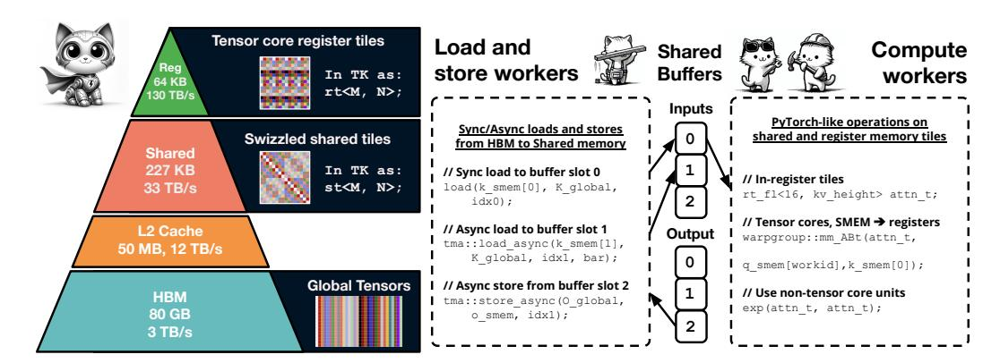

# 1 INTRODUCTION

AI is bottlenecked by the problem of efficiently mapping AI architectures onto accelerated GPU hardware. There has been a Cambrian explosion of ML architectures [\(Ho et al., 2020;](#page-11-0) [Gu & Dao,](#page-11-1) [2023\)](#page-11-1); however, the performance of these architectures remains substantially below their theoretical potential, despite substantial effort to develop *kernels*, or GPU implementations. Notably, kernel support has been poor even for softmax attention, which is used throughout industry. FlashAttention-2 [\(Dao, 2024\)](#page-11-2) suffered a 47% performance degradation when translated to the H100 GPU, and it took over two years from the release of the H100 to develop FlashAttention-3 [\(Shah et al., 2024\)](#page-12-0).

We are inspired by several approaches to supporting the development of AI kernels. Ideally, we would have a framework that supports high performance for a breadth of primitives, while being easy to use, learn from, and maintain. High performance C++ embedded libraries like NVIDIA CUTLASS/CuTe [\(NVIDIA, 2017\)](#page-12-1) contain a myriad of nested templates, while compiler based approaches like Triton [\(Tillet et al., 2019\)](#page-12-2) provide users with simpler interfaces, but fewer optimizations. We ask how broad and fast we can go by choosing a small and opinionated set of abstractions.

The main vector of growth for accelerated compute is in specialized matrix multiply units. On the NVIDIA H100 and NVIDIA A100 GPUs, BF16 tensor cores represent 15 − 16× the FLOPs available relative to general-purpose BF16 / FP32 compute. Consequently, any high performance framework must prioritize keeping tensor cores at high utilization whenever possible. However, all kernels have non-tensor operations, too (like memory loads or the softmax in attention), and it is crucial to minimize their overhead. This proposition is at the heart of our approach.

To understand the complexities and opportunities in building a simple, yet high performance framework, we examine a simplified model of GPU parallelism, further detailed in section 2.[1](#page-0-0)

1. Warp-level parallelism: Modern GPUs consist of tens of thousands of hardware threads which execute in parallel. Threads are organized into small groups, "warps", which execute instructions

<span id="page-0-0"></span><sup>1</sup>We discuss primarily NVIDIA, but the parallelism types hold across architectures, including AMD and Apple GPUs; we provide experiments on an Apple M2 Pro in Appendix [B.](#page-14-0)



Figure 1: THUNDERKITTENS explores whether a small set of abstractions can enable performant AI kernels. Inspired by PyTorch, we first provide tiles with managed layouts and operations over these tiles. Second, we provide program templates for coordinating asynchronous workers – e.g., workers that load and store data, while other workers perform computations in fast memory.

<span id="page-1-0"></span>together. Memory *layouts* determine how the logical data elements are mapped to physical thread ownership. If multiple threads try to access the same region ("bank") of memory, this can create expensive serializations between the threads (called "bank conflicts").

- 2. Block-level parallelism: Warps are grouped into "blocks" of threads, which can quickly share data. Warps execute their instructions on physical execution units, and having more warps in a block (called *occupancy*) can help run more instructions at the same time, reducing runtime. For example, one warp can run tensor cores for matmul, while another uses the ALU for max.
- 3. Grid-level parallelism. GPUs run many blocks of threads at once, which communicate through large but slow global memory (HBM). An on-chip shared L2 cache helps reduce memory latencies and increase bandwidth if thread blocks reuse the same data. Thread blocks also face setup and tear-down overheads, which can introduce "pipeline bubbles" that hurt performance.

Despite the apparent need for a myriad of techniques to leverage all these hardware capabilities, our central technical finding is that indeed, for many AI kernels, *a small number of key abstractions exist that can simplify the process of writing high-performance kernels*. Our exploration led us to develop THUNDERKITTENS (TK), an AI kernel framework built around three key principles:

- 1. Tile data structures with managed layouts: Our interface is inspired by familiar ML frameworks like PyTorch and NumPy [\(Paszke et al., 2019\)](#page-12-3), as highlighted in Figure [2.](#page-2-0) At the warp level, we use a 16×16 matrix tile as our basic data structure, maximizing compatibility with and encouraging the use of tensor cores. TK automatically picks the optimal memory layouts for the tiles to minimize bank conflicts while remaining compatible with specialized hardware instructions, avoiding user effort. We provide a set of parallel compute primitives over tiles, based on the suite of operations in PyTorch (e.g., pointwise multiply, mma, exp, and cumsum over tiles).
- 2. Program template for asynchronous work: At the block level, TK provides a general kernel template for coordinating asynchronous execution across warps in a thread block, built on the producer-consumer paradigm [\(Dijkstra, 1968\)](#page-11-3). The developer's effort reduces to populating a few boilerplate functions within this model, using our PyTorch-like operands, and the template internally hides latencies through memory pipelines and synchronization primitives (Figure [1\)](#page-1-0).
- 3. Grid scheduling for pipelining thread-blocks. At the grid level, we show TK can help developers reduce pipeline bubbles and improve L2 cache hit rates. Our template supports a *persistent grid*, where we overlap memory loads across thread block boundaries.

We highlight the value of these abstractions for developers in two ways:

- Through our exploration, we identify a few fundamental tradeoffs between achieving different types of parallelism including in setting the tile layouts (warp-level), occupancy (block level), and block launch order (grid level). Through our ablation studies (Section [3\)](#page-4-0), we show how the simplified interface in TK gives users the control to navigate the tradeoffs.
- We validate the TK abstractions by providing kernels that match or outperform prior kernels for a range of AI operations. We match CuBLAS GEMMs and FlashAttention-3 attention inference,

### PyTorch attention:

### <span id="page-2-0"></span>THUNDERKITTENS attention:

```
1 # imports
2 import torch
3 import torch.nn.functional as F
4
6 # compute Q@K.T
7 att = torch.matmul(
8 q, k.transpose(2, 3))
9
10 # compute softmax
11 att = F.softmax(
12 att, dim=-1,
13 dtype=torch.float32)
14
15 # convert back to bf16
16 att = att.to(q.dtype)
18 # mma att@V
19 output = torch.matmul(att, v)
                                              1 // imports
                                              2 using namespace kittens;
                                              3 rt_bf<16, 64> k_reg, v_reg;
                                              4 // load k from shared memory to register
                                              5 load(k_reg, k_smem[subtile]);
                                              6 // compute Q@K.T
                                              7 zero(att);
                                              8 mma_ABt(att, q_reg, k_reg, att);
                                              9 // compute softmax
                                             10 sub_row(att, att, max_vec);
                                             11 exp(att, att);
                                             12 div_row(att, att, norm_vec);
                                             13 // convert to bf16 for mma_AB
                                             14 copy(att_mma, att);
                                             15 // load v from shared memory to register
                                             16 load(v_reg, v_smem[subtile]);
                                             17 auto &v_reg_c = swap_layout_inplace(v_reg);
                                             18 // mma att@V onto o_reg
                                             19 mma_AB(o_reg, att_mma, v_reg_c, o_reg);
```

Figure 2: A snippet of our attention kernel to show the PyTorch-like operations on tiles.

and outperform the strongest baselines by 10 − 40% on attention backwards, up to 8× on state space models, and up to 14× on linear attention.

Our contributions are (1) showing a small and opinionated set of abstractions in TK that goes surprisingly far for writing simple and performant kernels; and (2) providing a collection of performant AI kernels. We hope that TK and its insights help improve the accessibility of AI kernels.

