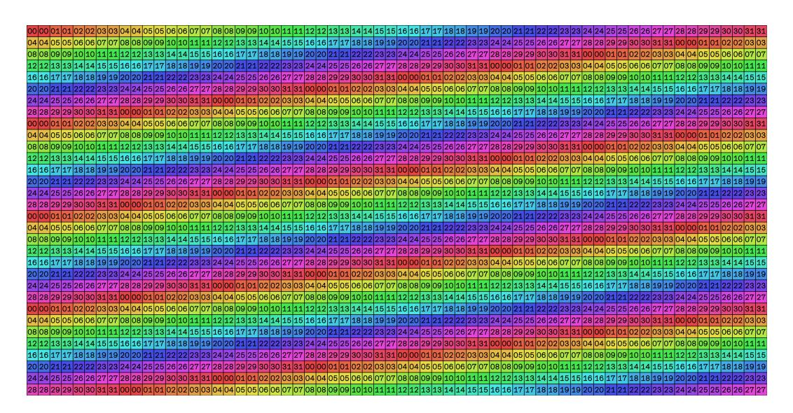
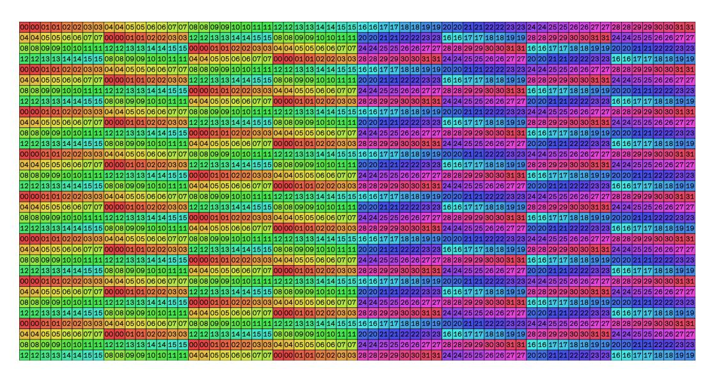

# D.3 NAIVE LAYOUT

A row-major layout, illustrated in figure [19,](#page-29-0) is among the simplest layouts. It has the benefit of accurately reflecting tensor layouts in HBM. Furthermore, for access patterns that access row-wise, it has no bank conflicts. But when loading or storing tensor core register layouts, it suffers 8-way bank conflicts, and is thus extremely slow.

<span id="page-28-1"></span><sup>3</sup>[https://docs.nvidia.com/cuda/parallel-thread-execution/](https://docs.nvidia.com/cuda/parallel-thread-execution/#asynchronous-warpgroup-level-matrix-instructions) [#asynchronous-warpgroup-level-matrix-instructions](https://docs.nvidia.com/cuda/parallel-thread-execution/#asynchronous-warpgroup-level-matrix-instructions)


<span id="page-29-0"></span>Figure 19: Row-major shared memory layout.

```
bf16* naive_layout(bf16 *data, int r, int c) {
    return &data[r * columns + c];
}
```

#### D.3.1 PADDED LAYOUT



Figure 20: Padded shared memory layout.

A common solution to these bank conflicts is to "pad" each row by one memory bank, thereby introducing an offset to shift consecutive elements of a column into different memory banks. This eliminates bank conflicts, but creates misaligned addresses which interferes with fast instructions that require aligned addresses. For example, it wouldn't be possible to use TMA to store the second row of this layout due to it only having a 16-byte alignment, whereas TMA requires 128-byte alignments.

```
bf16* padded_layout(bf16 *data, int r, int c) {
    return &data[r * (columns+1) + c];
}
```

#### D.3.2 NAIVE SWIZZLED LAYOUT


Figure 21: Naive swizzled shared memory layout.

A third option is to "swizzle" the memory, in which progressive rows are reshuffled to alter their banking. This layout accomplishes this by xor'ing the index with the row, which reduces bank conflicts. However, this layout lacks hardware support for HGMMA and UTMA instructions, which are particularly important on H100 GPUs for achieving high performance. Additionally, the granularity of the swizzling must be large enough to totally prevent bank conflicts when loading into registers. We illustrate a simple, naive swizzling pattern here, which used to be recommended for preventing bank conflicts before the advent of tensor cores:

```
bf16* row_swizzled_layout(bf16 *data, int r, int c) {
    uint64_t addr = (uint64_t)&data[r * columns + c];
    return (bf16*)(addr ^ (r << 2));
}</pre>
```

#### D.3.3 32 BYTE SWIZZLING


Figure 22: 32 byte swizzled shared memory layout.

32 byte swizzling is the first of a family of layouts (of which we will examine three), where instead of swizzling the index with the row, the memory address is instead swizzled directly with itself. This layout is defined by the following C code:

```
1 bf16* swizzled_layout_32B(bf16 *data, int r, int c) {
2     uint64_t addr = (uint64_t)&data[r * columns + c];
3     return (bf16*)(addr ^ (((addr % (32*8)) >> 7) << 4));
4 }</pre>
```

This layout here suffers from 4-way bank conflicts, but is valid for all tiles whose width is a multiple of 16. However, importantly, it has (as do its siblings below) hardware support from both HGMMA and UTMA instructions.

### D.3.4 64 BYTE SWIZZLING



Figure 23: 64 byte swizzled shared memory layout.

64 byte swizzling is a layout similar to 32 byte swizzling with a more aggressive pattern:

```
bf16* swizzled_layout_64B(bf16 *data, int r, int c) {
    uint64_t addr = (uint64_t)&data[r * columns + c];
    return (bf16*)(addr ^ (((addr % (64*8)) >> 7) << 4));
}
</pre>
```

64 byte swizzling suffers from just 2-way bank conflicts, but is only valid for tiles whose width is a multiple of 32 (for half-precision types, or 16 for full-precision).

### D.3.5 128 BYTE SWIZZLING.


Figure 24: 128 byte swizzled shared memory layout.

128 byte swizzling is a further extension of its kin:

```
bf16* swizzled_layout_128B(bf16 *data, int r, int c) {
    uint64_t addr = (uint64_t)&data[r * columns + c];
    return (bf16*)(addr ^ (((addr % (128*8)) >> 7) << 4));
}</pre>
```

Finally, 128 byte swizzling has no bank conflicts, but is only valid for half-precision tiles whose width is a multiple of 64.

#### D.3.6 THUNDERKITTENS APPROACH

After substantial evaluation of these layouts, we concluded that the three final layouts were the three most important, because HGMMA and UTMA instructions are critical to high performance, and furthermore that they are good enough to yield high performance across many kernels. Correspondingly, depending on the width of the tile at compile time we select the highest level of swizzling possible to minimize bank conflicts.