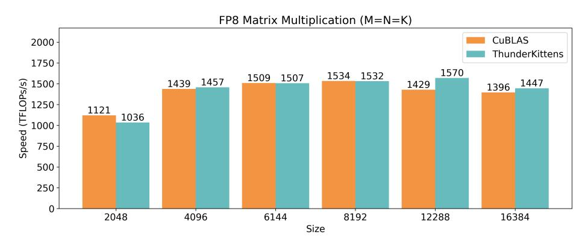
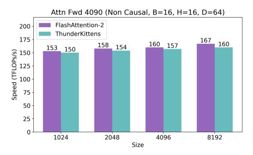

# <span id="page-14-0"></span>B EXTENDED RESULTS

In Section [4,](#page-7-0) we show that THUNDERKITTENS results in state of the art kernels across a broad range of AI workloads on NVIDIA H100 GPUs. This section provides extended details of our experimental protocol, additional results to analyze the extensibility and simplicity of TK kernels, and additional results to further highlight the breadth of features.

### B.1 EXTENDED DETAILS OF EXPERIMENTAL PROTOCOL

- Benchmarking kernels In order to ensure fair performance comparisons between TK kernels and others, we run 10 warm-up iterations then use cudaEvents to measure total kernel execution time over 10 benchmarking iterations. Reported performance is the average of the 10 benchmarking iterations.
- Benchmarking PyTorch We measure baseline PyTorch algorithm-implementations with and without torch.compile - a new compile is run any time the input configurations (sequence length, batch size, etc.) change. We report the maximum TFLOPS with torch.compile across settings.
- Tuning kernels Baseline GEMM kernels are tuned via a grid-search over the default execution parameters exposed (if any) and through auto-tuning methods (exposed via CuBLASLt) - for baselines, the maximum performance achieved is reported. Furthermore, for Triton kernels, we run triton.autotune over the default parameter configurations provided in baselines we compare TK kernels to. In order to avoid impacting performance measurements, kernel tuning is done in separate iterations prior to warmup and benchmarking.

We use the following software versions for benchmarking: CUDA 12.6, Triton version 3.00, and PyTorch version 2.4.

## B.2 ANALYZING THE EXTENSIBILITY OF TK ACROSS WORKLOADS

We include additional kernels to demonstrate two additional TK features:

- 1. FP8 precision: We provide an FP8 GEMM kernel in TK and compare this to CuBLAS in Figure [10.](#page-15-0) The inputs and outputs are both in FP8 precision, and the accumulate is in FP32.
- 2. Padded tiles While TK uses 16 × 16 tiles by default, to encourage users to utilize tensor cores and coalesced loads, it is important to support un-aligned workloads. TK handles this by padding the tiles (discussed in Appendix [D\)](#page-28-0). We implement attention with nonaligned dimensions on the NVIDIA 4090 and H100 GPUs and find that the performance characteristics remain the same as our aligned kernels.



<span id="page-15-0"></span>Figure 10: GEMM kernel using FP8 precision on the NVIDIA Hopper GPU.

### B.3 ANALYZING THE EXTENSIBILITY OF TK ACROSS HARDWARE PLATFORMS

We find that TK is extensible across hardware platforms. While we focused on the top-of-line *data center hardware*, NVIDIA H100, in Section [4,](#page-7-0) here we additionally consider the top-of-line *consumer hardware*, NVIDIA 4090, and *personal hardware*, Apple M2 chips.

Consumer hardware: NVIDIA 4090 GPU We implement non causal attention at head dimensions 64 and 128 using TK. We compare to FlashAttention-2 [Dao](#page-11-2) [\(2024\)](#page-11-2), a popular reference kernel, and find that the TK kernel is competitive across settings.




Figure 11: Attention non causal inference at head dimensions 64 and 128 and Based kernels, on NVIDIA 4090 chips using TK and the reference baselines.

Personal hardware: Apple M2 chip We implement non causal attention at head dimensions 64 and 128, and GEMMs on the M2 chip. We compare to the Apple MLX framework example kernels and find that the TK kernel is competitive across settings.


Figure 12: Attention non causal inference at head dimensions 64 and 128 and GEMM kernels, on Apple M2 chips using TK and the Apple MLX reference baselines.

We next include code listings for the attention kernel on NVIDIA 4090 fig. [13](#page-17-0) and Apple M2 Figure [14,](#page-18-0) highlighting the close resemblance between the implementations.

#### NVIDIA 4090 attention:

```
template<int D> constexpr size_t ROWS = 16*(128/D); // height of each worker tile (rows)
template<int D, typename T=bf16, typename L=row_l> using qkvo_tile = rt<T, ROWS<D>, D, L>;
template<int D, typename T=float> using attn_tile = rt<T, ROWS<D>, ROWS<D>>;
      template<int D> using shared_tile = st_bf<ROWS<D>, D>;
template<int D> using global_layout = gl<bf16, -1, -1, -1, D>; // B, N, H, at runtime, D at compile time
       template<int D> struct globals { global_layout<D> Qg, Kg, Vg, Og; };
      template<int D> __launch_bounds__(NUM_WORKERS*WARP_THREADS, 1)
                      void attend_ker(const __grid_constant__ globals<D> g)
10
           using load_group = kittens::group<2>; // pairs of workers collaboratively load k, v tiles\nint loadid = load_group::groupid(), workerid = kittens::warpid(); // which worker am I?
constexpr int LOAD_BLOCKS = NUM_WORKERS / load_group::GROUP_WARPS;
const int batch = blockIdx.z, head = blockIdx.y, q_seq = blockIdx.x * NUM_WORKERS + workerid;
13
14
15
16
                        shared alignment dummy
                                                              shm[]:
17
            shared_allocator al((int*)&__shm[0]);
            shared_tile<D>(&k_smem) [LOAD_BLOCKS] [PIPE_STAGES] = al.allocate<shared_tile<D>,LOAD_BLOCKS,PIPE_STAGES>();
shared_tile<D>(&v_smem) [LOAD_BLOCKS] [PIPE_STAGES] = al.allocate<shared_tile<D>,LOAD_BLOCKS,PIPE_STAGES>();
18
19
            shared_tile<D> (&qo_smem) [NUM_WORKERS] = reinterpret_cast<shared_tile<D>(&) [NUM_WORKERS]>(k_smem);
20
           // Initialize all of the register tiles. qkvo_tile<D, bfl6> q_reg, k_reg; // Q and K are both row layout, as we use mma_ABt. qkvo_tile<D, bfl6, col_l> v_reg; // V is column layout, as we use mma_AB. qkvo_tile<D, float> o_reg; // Output tile.
23
24
            attn_tile<D, float> att_block; // attention tile, in float.
           attm_tile<D, bf16> att_block_mma; // bf16 attention tile for second mma_AB. We cast right before. typename attm_tile<D, float>::col_vec max_vec_last, max_vec, norm_vec; // these are column vectors.
26
                each warp loads its own Q tile of 16x64
           if (q_seq*ROWS<D> < g.Qg.depth) {
    load<1, false>(qo_smem[workerid], g.Qg, {batch, q_seq, head, 0}); // going through shared memory
29
30
                    syncwarp();
32
                 load(q_reg, qo_smem[workerid]);
33
34
             __syncthreads();
35
            if constexpr(D == 64) mul(q_reg, q_reg, __float2bfloat16(0.125f * 1.44269504089));
            else if constexpr(D == 128) mul(q_reg, q_reg, __float2bfloat16(0.08838834764f * 1.44269504089));
38
            neg_infty(max_vec);
            zero(norm_vec);
40
41
            // launch the load of the first k, v tiles
42
            int kv_blocks = (g.Kg.depth + LOAD_BLOCKS*ROWS<D>-1) / (LOAD_BLOCKS*ROWS<D>), tic = 0;
            load_group::load_async<1, false>(k_smem[loadid][0], g.Kg, {batch, loadid, head, 0}));
load_group::load_async<1, false>(v_smem[loadid][0], g.Vg, {batch, loadid, head, 0}));
43
            f/dictate over k, v for these q's that have been loaded
for(auto kv_idx = 0; kv_idx < kv_blocks; kv_idx++, tic=(tic+1)%3) {
   int next_load_idx = (kv_idx+1)*LOAD_BLOCKS + loadid;</pre>
45
46
                 if(next_load_idx*ROWS<D> < g.Kg.depth) {</pre>
48
49
                        int next_tic = (tic+1)%3;
                        load_group::load_async<1, false>(k_smem[loadid][next_tic], g.Kg, {batch, next_load_idx, head, 0});
51
                       load\_group::load\_async<1, \  \, \textbf{false}>(v\_smem[loadid][next\_tic], \  \, g.Vg, \  \, \{batch, \ next\_load\_idx, \ head, \ 0\});
52
                       load_async_wait<1>(); // next k, v can stay in flight.
54
                 else load_async_wait();
55
                  __syncthreads();
                 for (int subtile = 0; subtile < LOAD_BLOCKS && (kv_idx*LOAD_BLOCKS + subtile)*ROWS<D> < q.Kq.depth;
57
                         → subtile++) {
                       load(k_reg, k_smem[subtile][tic]); // load k from shared into registers
58
59
                       zero(att_block); // zero 16x16 attention tile
60
                       mma_ABt(att_block, q_reg, k_reg, att_block); // Q@K.T
61
                        int first_index = (kv_idx*LOAD_BLOCKS + subtile)*ROWS<D>; // one past last KV index of tile
                       int start_fill = g.Kg.depth-first_index < ROWS<D>? g.Kg.depth-first_index : ROWS<D>;
right_fill(att_block, att_block, start_fill, base_types::constants<float>::neg_infty());
62
63
64
                       copy(max_vec_last, max_vec);
65
                       row_max(max_vec, att_block, max_vec);
sub_row(att_block, att_block, max_vec);
66
67
68
                       exp2(att_block, att_block);
                       sub(max_vec_last, max_vec_last, max_vec);\nexp2(max_vec_last, max_vec_last);
69
70
                       mul(norm_vec, norm_vec, max_vec_last);
                       row_sum(norm_vec, att_block, norm_vec);
72
73
                       copy(att_block_mma, att_block);
                       load(v_reg, v_smem[subtile][tic]);
                       mul_row(o_reg, o_reg, max_vec_last);
75
76
                       mma_AB(o_reg, att_block_mma, v_reg, o_reg);
78
79
            div_row(o_reg, o_reg, norm_vec);
               syncthreads():
80
            if (q_seq*ROWS<D> < g.Og.depth) { // write out o.
81
                  \verb|store| (qo\_smem[workerid], o\_reg); // \verb|going| through shared memory improves coalescing of dram writes. \\
82
                    _syncwarp();
83
                  store<1, false>(g.Og, qo_smem[workerid], {batch, q_seq, head, 0});
84
```

<span id="page-17-0"></span>Figure 13: Attention implemented in TK on NVIDIA 4090 chips.

### Apple M2 attention:

```
1 namespace custom_ops {
2 struct subexp2 {;
3 template<typename T> static METAL_FUNC T op(thread const T &a, thread const T &b) { return metal::exp2(a-
            ,→ b); }
4 };
5 }
6
7 template<typename RT, typename RV>
8 static METAL_FUNC typename metal::enable_if<ducks::is_register_tile<RT>() && ducks::is_register_vector<RV>(), void
        ,→ >::type
9 subexp2(thread RT &dst, thread const RT &src, thread const RV &row_values) {
10 row_map<custom_ops::subexp2, RT, RV>(dst, src, row_values);
11 }
12 template<typename RV, typename U>
13 static METAL_FUNC typename metal::enable_if<ducks::is_register_vector<RV>(), void>::type
14 subexp2(thread RV &dst, thread const RV &lhs, thread const U &rhs) {
15 bin_op<custom_ops::subexp2, RV>(dst, lhs, rhs);
16 }
17 //constant constexpr const int D = 128;
18 #define NUM_WORKERS 1
19 template<int D>
20 kernel void attend_ker(ATTEND_KER_PARAMS) {
21 static_assert(D == 64 || D == 128, "D must be 64 or 128");
22 using global_layout = kittens::ore::gl<bfloat, 1, -1, -1, D>;
23 global_layout gl_q(__q__, nullptr, H, N, nullptr);
24 global_layout gl_k(__k__, nullptr, H, N, nullptr);
25 global_layout gl_v(__v__, nullptr, H, N, nullptr);
26 global_layout gl_o(__o__, nullptr, H, N, nullptr);
27 using st_qkv = st_bf<8, D>;
29 using rt_qv = rt_bf<8, D>;
30 using rt_k_t = rt_bf<8, D, ducks::rt_layout::col>;
31 using rt_att = rt_fl<8, 8>;
32 using rt_o = rt_fl<8, D>;
33 using rv_att = rt_fl<8, 8>::col_vec;
34
35 const int block = blockIdx.z;
36 const int head = blockIdx.y;
37 const int q_seq = (blockIdx.x * NUM_WORKERS) + warpId;
38 const int kv_blocks = N / st_qkv::rows;
39 rt_qv q_reg;
40 rt_k_t k_reg;
41 rt_qv v_reg;
42 rt_att att_block;
43 rt_o o_reg;
44 rv_att max_vec_last;
45 rv_att max_vec;
46 rv_att norm_vec;
47 load(q_reg, gl_q, {block, head, q_seq, 0}, laneId);
48 neg_infty(max_vec);
49 zero(norm_vec);
50 zero(o_reg);
51 constexpr const bf16 q_mul = ((D == 128) ? 0.08838834764bf : 0.125bf) * 1.44269504089bf;
52 mul(q_reg, q_reg, q_mul);
53 #pragma clang loop unroll(full)
54 for(auto kv_idx = 0; kv_idx < kv_blocks; kv_idx++) {
55 load(k_reg, gl_k, {block, head, kv_idx, 0}, laneId);
56 zero(att_block);
57 mma_ABt(att_block, q_reg, k_reg, att_block);
58 copy(max_vec_last, max_vec, laneId);
59 row_max(max_vec, att_block, max_vec, laneId);
60 subexp2(max_vec_last, max_vec_last, max_vec);
61 subexp2(att_block, att_block, max_vec);
62 mul(norm_vec, norm_vec, max_vec_last);
63 row_sum(norm_vec, att_block, norm_vec, laneId);
64 mul_row(o_reg, o_reg, max_vec_last);
65 load(v_reg, gl_v, {block, head, kv_idx, 0}, laneId);
66 mma_AB(o_reg, att_block, v_reg, o_reg);
67 }
68 div_row(o_reg, o_reg, norm_vec);
69 store(gl_o, o_reg, {block, head, q_seq, 0}, laneId);
70 }
```

<span id="page-18-0"></span>Figure 14: Attention implemented in TK on Apple M2 chips.

### B.4 ANALYZING THE SIMPLICITY OF TK

As a proxies for understanding the simplicity of the TK library, we measure (1) the size of various popular frameworks in bytes and (2) the lines of code across our kernels.

The library sizes are shown in Table [5.](#page-19-0) For CUTLASS and TK we report the size of the "include/" directory, and for Triton we report the combined size of the "include/" directories in Triton plus the "include/" in the core MLIR compiler dependency.

| Library | Size (Bytes) | Date / Version |
|---------|--------------|----------------|
| CUTLASS | 22 MB        | 10/22/2024     |
| Triton  | 12.6 MB      | 10/22/2024     |
| TK      | <1.0 MB      | 10/22/2024     |

<span id="page-19-0"></span>Table 5: Sizes of various CUDA libraries.

We find that the TK kernels in Table [6](#page-19-1) average at < 200 lines of code. We compare to the lines of code in the corresponding state of the art baseline kernels, and the TK speed ups over these baselines. While measuring lines of code may be difficult, we provide links in the table indicate our approach. For TK, we include many comments, all the global data descriptor, and custom functions. We exclude the python bindings and other wrapper functions for all baselines. We generally observe that TK kernels use fewer lines of code and provide speed ups.

| Workload                  | TK kernel (LoC) | Reference kernel (LoC)  | Speed up (min-max) |
|---------------------------|-----------------|-------------------------|--------------------|
| Attention forwards        | 217             | 2325 (CUTLASS FA3)      | 0.87-1.14×         |
| GEMM                      | 84              | 463 (CUTLASS)           | 0.98-2.05×         |
| Convolution (N = 4096)    | 131             | 624 (CUDA FlashFFTConv) | 4.7×               |
| Based linear attention    | 282             | 89 (Triton)             | 3.7-14.5×          |
| Hedgehog linear attention | 316             | 104 (Triton)            | 4.0-6.5×           |
| Mamba-2                   | 192             | 532 (Triton)            | 3.0-3.7×           |
| Rotary                    | 101             | 119 (Triton)            | 1.1-2.3×           |
| Fused layernorm           | 146             | 124 (Triton)            | 1.0-2.2×           |

<span id="page-19-1"></span>Table 6: Lines of code (LoC) across TK H100 kernels, state of the art non TK kernels, and the TK speed up over the reference across the evaluated input dimensions in Section [4.](#page-7-0)

### <span id="page-20-0"></span>C THUNDERKITTENS KERNEL LISTINGS

This section first recaps our benchmarking methodology for the results and provides a set of kernels written in the TK LCSF template and tile abstractions:

- 1. Appendix C.1 GEMM kernel
- 2. Appendix C.2 Long convolution kernel
- 3. Appendix C.3 Attention kernel
- 4. Appendix C.4 Rotary kernel

To introduce the template components, we describe the GEMM kernel in detail in Appendix C.1.

**Benchmarking approach** Our kernels in Section 4 are benchmarked on an NVIDIA H100 80GB SXM GPU with 10 warmup and 10 timed iterations using timings measured in C++. We also provide Python-bound kernels and benchmarking infrastructure in our repository for reference.

#### <span id="page-20-1"></span>C.1 MATRIX MULTIPLY

First we show and describe a TK GEMM kernel in the LCSF template.

Each compute warpgroup is responsible for computing 64M-row, 64N-column chunk of the resulting output matrix. Each compute worker identifies the coordinates for its chunk, zeros its accumulator registers, repeatedly runs large asynchronous matrix multiplies (compute), and finally stores out its tile in the end (finish). The load workers also compute their coordinates, and then repeatedly load chunks of the input matrices (load). Store workers perform asynchronous stores when the compute workers are finished with the chunks (stores).

**Tuning the number of workers and pipeline stages** The computation is divided into stages, with each stage processing 64 elements along the reduction dimensions of the input matrices. The input pipeline is automatically sized by THUNDERKITTENS if the user does not specify a value. For common configurations of either a (2 compute warpgroup)  $128 \times 256$  or (3 compute warpgroups)  $192 \times 192$  output tile per block, it generates a 4-stage pipeline.

**Tuning the grid order** The greatest complexity of this kernel is in setting the grid parameters. This kernel adopts a 3D stride over the input matrices, which has a significant effect for large matrices which do not fit in L2 cache. The order in which blocks execute strongly influences cache locality and thus available memory bandwidth. To illustrate the magnitude of the effect, comparing the presented scheme versus a naive grid (in which blocks are executed in row-major order) a  $4096 \times 4096 \times 4096$  matrix multiply only drops from 767 TFLOPs to 735 TFLOPs, but a  $16384 \times 16384 \times 16384$  matrix multiply drops from 797 TFLOPs to 387 TFLOPs, a > 50% performance degradation.

```
using namespace kittens;
   using namespace kittens::prototype;
    using namespace kittens::prototype::lcf;
   template<int M_BLOCK, int N_BLOCK>
    struct matmul_layout {
     using base_tile
                           = st_bf<64, 64>;
     using global_layout = gl<bf16, 1, 1, -1, -1, base_tile>;
     struct globals { global_layout A, B, C; };
                           { base_tile a[M_BLOCK], b[N_BLOCK]; };
     struct input_block
     struct finish_block { base_tile c[M_BLOCK][N_BLOCK]; };
     struct common_state
                           { int2 coord; };
     struct consumer_state { rt_fl<16, N_BLOCK*base_tile::cols> accum; };
13
   template<int _M_BLOCK=2, int _N_BLOCK=4, int _SUPER_M=12>
14
   struct matmul_template {
     static constexpr int M_BLOCK = _M_BLOCK, N_BLOCK = _N_BLOCK, SUPER_M = _SUPER_M;
16
                    = matmul_layout<M_BLOCK, N_BLOCK>;
     using layout
     using wide_tile = st_bf<64, 64*N_BLOCK>;
18
     static constexpr int NUM_CONSUMER_WARPS=M_BLOCK*4, INPUT_PIPE_STAGES=4,
          → PRODUCER BARRIER ARRIVALS=1;
```

```
// Helper functions
      template<bool PERISISTENT_GRID=true> _
                                               _host_
                                                      _ static inline dim3 grid(int M, int N, int K)
        return dim3(PERISISTENT_GRID ? 132 : M*N/(M_BLOCK*N_BLOCK*layout::base_tile::num_elements)
        // ThunderKittens template functions
        _device__ static inline void common_setup(common_setup_args<layout> args) {
        int Rblocks = args.globals.C.rows / (M_BLOCK*64), Cblocks = args.globals.C.cols / (N_BLOCK
             → *64);
        int super_rows = (Rblocks/SUPER_M) *SUPER_M,
8
         final_rows = Rblocks - super_rows,
10
          super_repeat = SUPER_M*Cblocks;
        int task_id = args.task_iter*gridDim.x + blockIdx.x;
        if (task_id < super_rows * Cblocks)</pre>
          args.common.coord = { SUPER_M*(task_id/super_repeat) + task_id%SUPER_M,
                                  (task_id%super_repeat)/SUPER_M };
14
        else if (task_id < Rblocks*Cblocks) {</pre>
15
          int remainder_id = task_id - super_rows*Cblocks;
args.common.coord = { super_rows + (remainder_id%final_rows), remainder_id/final_rows };
16
18
        else { // Id is too high, no more work to do
19
20
          args.num\_iters = -1;
          return;
        args.num_iters = args.globals.A.cols/64;
24
        int id = warpgroup::groupid() == NUM_CONSUMER_WARPS/4 ? 0 : warpgroup::groupid(); //
             → producer sets as 0
25
        args.common.coord = { args.common.coord.x*M_BLOCK + id, args.common.coord.y*N_BLOCK };
26
      struct producer {
28
        __device__ static void setup(producer_setup_args<layout> args) {
29
          warpgroup::decrease_registers<40>(); // decrease registers for producers
30
        __device__ static void load(producer_load_args<layout> args) {
32
          if(warpgroup::warpid() == 0) {
            tma::expect(args.inputs_arrived, args.input);
34
            for(int i = 0; i < M BLOCK; i++)</pre>
35
              tma::load_async(args.input.a[i], args.globals.A,
36
                                {args.common.coord.x+i, args.iter}, args.inputs_arrived);
            for(int i = 0; i < N_BLOCK; i++)</pre>
37
38
              tma::load_async(args.input.b[i], args.globals.B,
39
                               {args.iter, args.common.coord.y+i}, args.inputs_arrived);
40
41
42
      };
43
        __device__ static void setup(consumer_setup_args<layout> args) {
44
45
          warpgroup::increase_registers<232>(); // increase registers for consumers
46
          zero(args.state.accum);
48
        __device__ static void compute(consumer_compute_args<layout> args) {
          warpgroup::mma_AB(
50
            args.state.accum, // dest registers
            args.input.a[warpgroup::groupid()], // A matrix
51
            reinterpret_cast<wide_tile&>(args.input.b) // B matrix
53
          warpgroup::mma_async_wait();
55
          if(laneid() == 0) arrive(args.inputs_finished);
                   _ static void finish(consumer_finish_args<layout> args) {
          warpgroup::store(reinterpret_cast<wide_tile&>(args.finish.c[warpgroup::groupid()]), args
               → .state.accum);
59
          warpgroup::sync();
          if(warpgroup::warpid() == 0) for(int i = 0; i < N_BLOCK; i++) {</pre>
60
            tma::store_async(args.globals.C, args.finish.c[warpgroup::groupid()][i],
61
             \{ args.common.coord.x, \ args.common.coord.y+i \} ); \\ tma::store\_async\_read\_wait(); \ // \ wait \ that \ store \ is \ finished \ before \ reusing \ finish 
62
63
                 → memory
64
65
          zero(args.state.accum);
          if(laneid() == 0) arrive(args.finish_finished);
66
67
68
      };
69
    };
```

Figure 15: Templated matrix multiply kernel which is reasonably competitive with CuBLAS.

### C.2 LONG CONVOLUTION

This section shows the long convolution kernel for sequence length 4096, written in the TK abstractions. We use the FFT convolution algorithm, computed via Monarch Matrices, for our long convolution kernel [\(Cooley & Tukey, 1965;](#page-11-9) [Fu et al., 2023a;](#page-11-15) [Dao et al., 2022a\)](#page-11-16).

```
1 struct consumer {
2 __device__ static void setup(consumer_setup_args<layout> args) {
3 warpgroup::consumer_registers<NUM_CONSUMER_WARPS/4>();
4 int iters_per_head = (args.globals.x.batch + NUM_CONSUMER_WARPGROUPS-1) /
             ,→ NUM_CONSUMER_WARPGROUPS;
5 args.state.current_head = (0 / iters_per_head)*132 + blockIdx.x; // start for iter 0
6 using consumers = group<NUM_CONSUMER_WARPS>;
7 consumers::load(args.scratch.f, args.globals.f, {0, 0, 0, 0});
8 consumers::load(args.scratch.finv, args.globals.finv, {0, 0, 0, 0});
9 consumers::load(args.scratch.tw, args.globals.tw, {0, 0, 0, 0});
10 consumers::load(args.scratch.twinv_t, args.globals.twinv_t, {0, 0, 0, 0});
11 load_head_data(args.scratch, args.globals, args.state.current_head);
12 }
13 __device__ static void compute(consumer_compute_args<layout> args) {
14
15 int warpgroupid = warpgroup::warpid()/kittens::WARPGROUP_WARPS;
16 int default_barrer_id = warpgroupid + 4;
17 // X = FˆT X
18 crt_fl<16, 64> mma_reg; // 64 registers
19 crt_bf<16, 64> accum, tmp; // 32 registers each
20 warpgroup::mm_AB(mma_reg.real, args.scratch.f.real, args.input.x[warpgroup::groupid()]);
21 warpgroup::mm_AB(mma_reg.imag, args.scratch.f.imag, args.input.x[warpgroup::groupid()]);
22 warpgroup::mma_async_wait();
23 copy(accum, mma_reg);
24 warpgroup::load(tmp, args.scratch.tw); // for twiddle first
25 mul(accum, accum, tmp);
26 group<NUM_CONSUMER_WARPS>::sync(2);
27 warpgroup::mm_AB(mma_reg, accum, args.scratch.f);
28 warpgroup::mma_async_wait();
29 copy(accum, mma_reg);
30 warpgroup::load(tmp, args.scratch.kf); // for filter second
31 mul(accum, accum, tmp);
32 warpgroup::mm_AB(mma_reg, accum, args.scratch.finv);
33 warpgroup::mma_async_wait();
34 copy(accum, mma_reg);
35 warpgroup::load(tmp, args.scratch.twinv_t); // twiddle inverse is pre-transposed
36 mul(accum, accum, tmp);
37 warpgroup::store(args.scratch.tmp[warpgroup::groupid()], accum); // must store for AtB
38 warpgroup::sync(default_barrer_id);
39 warpgroup::mm_AB(mma_reg, args.scratch.finv, args.scratch.tmp[warpgroup::groupid()]);
40 warpgroup::mma_async_wait();
41 warpgroup::store(args.output.o[warpgroup::groupid()], mma_reg.real);
42 warpgroup::sync(default_barrer_id);
43
44 if(laneid() == 0) {
45 arrive(args.inputs_finished);
46 arrive(args.outputs_arrived);
47 }
48 __syncwarp();
49 int iters_per_head = (args.globals.x.batch + NUM_CONSUMER_WARPGROUPS-1) /
             ,→ NUM_CONSUMER_WARPGROUPS;
50 int next_head = ((args.iter+1) / iters_per_head)*132 + blockIdx.x;
51 if(next_head != args.state.current_head) {
52 load_head_data(args.scratch, args.globals, next_head);
53 args.state.current_head = next_head;
54 }
55 }
56 __device__ static void finish(consumer_finish_args<layout> args) { if(laneid() == 0)
           ,→ arrive(args.finish_finished); }
57 };
58 };
```

<span id="page-22-0"></span>Figure 16: A convolution kernel for context length 4096, written in the TK LCSF template, which outperforms FlashFFTConv [\(Fu et al., 2023c\)](#page-11-6).

```
using namespace kittens;
    using namespace kittens::prototype;
    using namespace kittens::prototype::lcsf;
    template<int _wg> struct fftconv_4096_layout { // 4096
      static constexpr int wg = _wg;
                       = st_bf<64, 64>;
= gl<bf16, -
      using seq_tile
      using seq_layout = gl<bf16, -1, -1, 64, 64, seq_tile>;\nusing filter_layout = cgl<gl<bf16, 1, -1, 64, 64, seq_tile>>;\nusing fft_layout = cgl<gl<bf16, 1, 1, 64, 64>>;
      struct globals {
10
       seq_layout o, x;
        filter_layout kf;
       fft_layout f, finv, tw, twinv_t;
14
      struct input_block
                              { seq_tile x[wg]; };
      struct output_block
                             { seq_tile o[wg]; };
      struct scratch_block {
       cst_bf<64, 64> kf, f, finv, tw, twinv_t, tmp[2];
18
19
20
      struct consumer_state { int current_head; };
    struct fft_4096_template {
     static constexpr int NUM_CONSUMER_WARPS=8, NUM_CONSUMER_WARPGROUPS=NUM_CONSUMER_WARPS/4,
           → NUM_BLOCKS=1, OUTPUT_PIPE_STAGES=2, INPUT_PIPE_STAGES=4;
      using layout = fftconv_4096_layout < NUM_CONSUMER_WARPGROUPS >;
25
26
                _ static inline void load_head_data(typename layout::scratch_block &scratch, const
      __device
           → layout::globals &g, int head)
        using consumers = group<NUM_CONSUMER_WARPS>;
28
        consumers::sync(3);
29
        consumers::load(scratch.kf, g.kf, {0, head, 0, 0}); // next chunk
30
       consumers::sync(3);
32
      // tk
       __device__ static void common_setup(common_setup_args<layout> args) {
34
       int heads_handled = (args.globals.x.depth+131-blockIdx.x) / 132; // I am guaranteeing
             → batch is handled by just one block.
        int iters_per_head = (args.globals.x.batch + NUM_CONSUMER_WARPGROUPS-1) /
35
             → NUM CONSUMER WARPGROUPS;
       args.num_iters = args.task_iter == 0 ? heads_handled * iters_per_head : -1;
36
37
38
      struct producer {
         _device__ static void setup(producer_setup_args<layout> args) {
39
40
          warpgroup::producer_registers();
41
42
        __device__ static void load(producer_load_args<layout> args) {
43
          int iters_per_head = (args.globals.x.batch + NUM_CONSUMER_WARPGROUPS-1) /
               → NUM CONSUMER WARPGROUPS:
          int head = (args.iter / iters_per_head)*132 + blockIdx.x;\nint batch = (args.iter % iters_per_head) * NUM_CONSUMER_WARPGROUPS;
44
45
46
          if(warpgroup::warpid() == args.iter%4) {
47
            tma::expect_bytes(args.inputs_arrived, sizeof(args.input.x[0]) * min((int)
                 → NUM_CONSUMER_WARPGROUPS, (int)(args.globals.x.batch - batch)));
48
            for(int b = batch; b < batch+NUM_CONSUMER_WARPGROUPS && b < args.globals.x.batch; b++)</pre>
49
              tma::load_async(args.input.x[b-batch], args.globals.x, { b, head, 0, 0 }, args.
                    → inputs_arrived);
50
51
            if(laneid() == 0) arrive(args.inputs_arrived, 3); // extra arrivals needed
52
            __syncwarp();
53
54
55
                   _ static void store(producer_store_args<layout> args)
56
          int iters_per_head = (args.globals.x.batch + NUM_CONSUMER_WARPGROUPS-1) /
                → NUM_CONSUMER_WARPGROUPS;
57
          int head = (args.iter / iters_per_head)*132 + blockIdx.x;
          int batch = (args.iter % iters_per_head) * NUM_CONSUMER_WARPGROUPS;
58
          if(warpgroup::warpid() == args.iter%4)
            for(int b = batch; b < batch+NUM_CONSUMER_WARPGROUPS && b < args.globals.x.batch; b++)</pre>
60
61
              tma::store_async(args.globals.o, args.output.o[b-batch], { b, head, 0, 0 });
63
            tma::store_async_read_wait();
            if(laneid() == 0) arrive(args.outputs_finished, 4);
64
65
             __syncwarp();
66
      };
```

### C.3 ATTENTION

This section shows non-causal attention at head dimensions 64, 128, in the TK abstractions.

```
1 exp2(args.state.max_vec_last_scaled, args.state.max_vec_last_scaled);
2 mul(args.state.norm_vec, args.state.norm_vec, args.state.max_vec_last_scaled);
3 row_sum(args.state.norm_vec, args.state.att_block, args.state.norm_vec); // accumulate
             ,→ onto the norm_vec
4 mul_row(args.state.o_reg, args.state.o_reg, args.state.max_vec_last_scaled); //
             ,→ normalize o_reg before mma
5 copy(args.state.att_block_mma, args.state.att_block); // convert to bf16 for mma
6 // O += A @ V
7 warpgroup::mma_AB(args.state.o_reg, args.state.att_block_mma, args.input.v);
8 warpgroup::mma_async_wait();
9 if(laneid() == 0) arrive(args.inputs_finished); // done!
10 }
11 __device__ static inline void finish(consumer_finish_args<layout> args) {
12 if((args.common.seq*NUM_WORKERS+warpgroup::groupid())*64 >= args.globals.Q.rows) return;
             ,→ // out of bounds?
13 div_row(args.state.o_reg, args.state.o_reg, args.state.norm_vec);
14 auto &o_smem = reinterpret_cast<typename layout::qo_tile&>(args.scratch.q[warpgroup::
             ,→ groupid()]);
15 warpgroup::store(o_smem, args.state.o_reg);
16 warpgroup::sync(warpgroup::groupid());
17 if(warpgroup::warpid() == 0)
18 tma::store_async(args.globals.O, o_smem, {args.common.batch, args.common.head, args.
               ,→ common.seq*NUM_WORKERS+warpgroup::groupid(), 0});
19 }
20 };
21 };
22 // kernel is kittens::prototype::lcf::kernel<attn_fwd_template<HEAD_DIM>>;
```

Figure 17: A templated non-causal attention kernel for head dims. 64 and 128 that competes with FlashAttention-3.

```
using namespace kittens;
       using namespace kittens::prototype;
      using namespace kittens::prototype::lcf;
      template<int D, int NUM_WORKERS> struct attn_fwd_layout {
         using qo_tile = st_bf<64, D>;
         using kv_tile
                                   = st_bf<D==64?192:128, D>;
         using qo_global = kittens::gl<bf16, -1, -1, -1, D, qo_tile>;\nusing kv_global = kittens::gl<bf16, -1, -1, -1, D, kv_tile>;
         struct globals { qo_global 0, Q; kv_global K, V; };
         struct input block
                                              { kv_tile k, v; };
         struct scratch_block { qo_tile q[NUM_WORKERS]; };
                                              { int batch, head, seq; };
         struct common_state
13
         struct consumer_state {
            rt_fl<16, qo_tile::cols> o_reg;
            col_vec<rt_fl<16, kv_tile::rows>> max_vec, norm_vec;
             col_vec<rt_fl<16, kv_tile::rows>> max_vec_last_scaled, max_vec_scaled;
            rt_fl<16, kv_tile::rows> att_block;
18
            rt_bf<16, kv_tile::rows> att_block_mma;
19
20
      };
      template<int D> struct attn_fwd_template {
         static constexpr int NUM_CONSUMER_WARPS = 12, NUM_WORKERS = NUM_CONSUMER_WARPS/4,
                 → INPUT_PIPE_STAGES = 2;
         using layout = attn_fwd_layout<D, NUM_WORKERS>;
24
          __device__ static inline void common_setup(common_setup_args<layout> args) {
25
            args.common.batch = blockIdx.z; args.common.head = blockIdx.y; args.common.seq = blockIdx.
26
            args.num iters = args.task iter == 0 ? args.globals.K.rows/lavout::ky tile::rows : -1;
28
         struct producer {
              _device__ static inline void setup(producer_setup_args<layout> args) {
29
30
                warpgroup::producer registers();
31
             __device__ static inline void load(producer_load_args<layout> args) {
  if(warpgroup::warpid() == 0) {
33
34
                   tma::expect(args.inputs_arrived, args.input);
35
                   \verb|tma::load_async|| args.input.k|, args.globals.K|, \{args.common.batch|, args.common.head|, args.common.batch|, args.common.head|, args.common.batch|, args.common.head|, args.common.batch|, args.common.head|, args.common.batch|, args.common.head|, args.common.batch|, args.common.head|, args.common.batch|, args.common.head|, args.common.batch|, args.common.head|, args.common.head|, args.common.head|, args.common.head|, args.common.head|, args.common.head|, args.common.head|, args.common.head|, args.common.head|, args.common.head|, args.common.head|, args.common.head|, args.common.head|, args.common.head|, args.common.head|, args.common.head|, args.common.head|, args.common.head|, args.common.head|, args.common.head|, args.common.head|, args.common.head|, args.common.head|, args.common.head|, args.common.head|, args.common.head|, args.common.head|, args.common.head|, args.common.head|, args.common.head|, args.common.head|, args.common.head|, args.common.head|, args.common.head|, args.common.head|, args.common.head|, args.common.head|, args.common.head|, args.common.head|, args.common.head|, args.common.head|, args.common.head|, args.common.head|, args.common.head|, args.common.head|, args.common.head|, args.common.head|, args.common.head|, args.common.head|, args.common.head|, args.common.head|, args.common.head|, args.common.head|, args.common.head|, args.common.head|, args.common.head|, args.common.head|, args.common.head|, args.common.head|, args.common.head|, args.common.head|, args.common.head|, args.common.head|, args.common.head|, args.common.head|, args.common.head|, args.common.head|, args.common.head|, args.common.head|, args.common.head|, args.common.head|, args.common.head|, args.common.head|, args.common.head|, args.common.head|, args.common.head|, args.common.head|, args.common.head|, args.common.head|, args.common.head|, args.common.head|, args.common.head|, args.common.head|, args.common.head|, args.common.head|, args.common.head|, args.common.head|, args.common.head|, args.common.head|, args.co
                            → args.iter, 0}, args.inputs_arrived);
                   tma::load_async(args.input.v, args.globals.V, {args.common.batch, args.common.head,
36
                            → args.iter, 0}, args.inputs_arrived);
37
38
                else if(laneid() == 0) arrive(args.inputs_arrived);
39
40
         };
41
          struct consumer {
42
             __device__ static inline void setup(consumer_setup_args<layout> args) {
43
                warpgroup::consumer_registers<NUM_WORKERS>();
44
                if((args.common.seq*NUM_WORKERS + warpgroup::groupid())*layout::qo_tile::rows < args.</pre>
                       \hookrightarrow globals.Q.rows) // out of bounds?
45
                   warpgroup::load(args.scratch.q[warpgroup::groupid()], args.globals.Q,
46
                                             {args.common.batch, args.common.head, args.common.seq*NUM_WORKERS+
                                                     → warpgroup::groupid(), 0});
47
                zero(args.state.o_reg);
48
                zero(args.state.norm_vec);
49
                neg_infty(args.state.max_vec);
50
                warpgroup::sync(warpgroup::groupid());
51
                              static inline void compute(consumer_compute_args<layout> args) {
             device
                \texttt{constexpr} \ \ \textbf{float} \ \ \texttt{TEMPERATURE\_SCALE} \ = \ (\texttt{D} \ == \ 128) \ \ ? \ \ 0.08838834764f *1.44269504089f \ : \ \ 0.125f \ \ \ )
53

→ *1.44269504089f;

54
                warpgroup::mm_ABt(args.state.att_block,args.scratch.q[warpgroup::groupid()],args.input.k
                mul(args.state.max_vec_last_scaled,args.state.max_vec,TEMPERATURE_SCALE);
56
                warpgroup::mma_async_wait();
57
59
                row_max(args.state.max_vec, args.state.att_block, args.state.max_vec); // accumulate
                          onto the max vec
60
                mul(args.state.max_vec_scaled, args.state.max_vec, TEMPERATURE_SCALE);
61
                mul(args.state.att_block, args.state.att_block, TEMPERATURE_SCALE);
62
                sub_row(args.state.att_block, args.state.att_block, args.state.max_vec_scaled);
                exp2(args.state.att_block, args.state.att_block);
63
                sub(args.state.max_vec_last_scaled, args.state.max_vec_last_scaled, args.state.

    max_vec_scaled);
```

### C.4 ROTARY POSITIONAL ENCODINGS

This section shows the rotary kernel for head dimension 128, written in the TK abstractions.

```
1 load(args.state.cos, args.globals.cos, idx);
2 }
3 __device__ static void compute(consumer_compute_args<layout> args) {
4 rt_fl<16, headdim> x;
5 rt_fl<16, headdim/2> x1, x2, temp1, temp2;
6 load(x, args.input.x[warpid()]);
7 if(laneid() == 0) arrive(args.inputs_finished);
8 __syncwarp();
9 for(int i = 0; i < headdim/32; i++) {
10 #pragma unroll
11 for(int j = 0; j < 4; j++) {
12 x1.tiles[0][i].data[j] = x.tiles[0][i].data[j];
13 x2.tiles[0][i].data[j] = x.tiles[0][i+headdim/32].data[j];
14 }
15 }
16 mul(temp1, x1, args.state.cos);
17 mul(temp2, x2, args.state.cos);
18 mul(x2, x2, -1.f);
19 mul(x1, x1, args.state.sin);
20 mul(x2, x2, args.state.sin);
21 add(temp1, temp1, x2);
22 add(temp2, temp2, x1);
23 for(int i = 0; i < headdim/32; i++) {
24 #pragma unroll
25 for(int j = 0; j < 4; j++) {
26 x.tiles[0][i].data[j] = temp1.tiles[0][i].data[j];
27 x.tiles[0][i+headdim/32].data[j] = temp2.tiles[0][i].data[j];
28 }
29 }
30 store(args.output.o[warpid()], x);
31 __syncwarp();
32 if(laneid() == 0) arrive(args.outputs_arrived);
33 }
34 __device__ static void finish(consumer_finish_args<layout> args) {
35 if(laneid() == 0) arrive(args.finish_finished); // nothing to do here
36 }
37 };
38 };
```

<span id="page-26-0"></span>Figure 18: A templated rotary kernel for head dim. 128 that outperforms popular Triton baselines.

```
1 using namespace kittens;
2 using namespace kittens::prototype;
3 using namespace kittens::prototype::lcsf;
4 template<int _headdim, int _warps> struct rotary_layout {
5 static constexpr int headdim = _headdim, warps = _warps;
6 using seq_tile = st_bf<16, headdim>;
7 using seq_global = gl<bf16, -1, -1, -1, headdim, seq_tile>;
8 using rope_global = gl<bf16, 1, 1, -1, headdim/2>;
9 struct globals {
10 seq_global o, x;
11 rope_global sin, cos;
12 int batches; // how many batches per block, for sizing grid
13 };
14 struct input_block { seq_tile x[warps]; };
15 struct output_block { seq_tile o[warps]; };
16 struct producer_state { int active_warps; };
17 struct consumer_state { rt_fl<16, headdim/2> sin, cos; }; // long-resident tiles
18 };
19 template<int _headdim> struct rotary_template {
20 static constexpr int headdim=_headdim, NUM_CONSUMER_WARPS=8, NUM_BLOCKS=1,
         ,→ OUTPUT_PIPE_STAGES=3, INPUT_PIPE_STAGES=3;
21 using layout = rotary_layout<headdim, NUM_CONSUMER_WARPS>;
22 __device__ static inline void common_setup(common_setup_args<layout> args) {
23 if(args.task_iter == 0) {
24 args.num_iters = min(args.globals.batches, (int)(args.globals.x.batch-blockIdx.y*args.
            ,→ globals.batches)) * args.globals.x.depth; // batches*heads handled by block
25 }
26 else args.num_iters = -1;
27 }
28 struct producer {
29 __device__ static void setup(producer_setup_args<layout> args) {
30 warpgroup::producer_registers();
31 args.state.active_warps = min((int)NUM_CONSUMER_WARPS,
32 (int)(args.globals.x.rows/16 - blockIdx.x*
                                      ,→ NUM_CONSUMER_WARPS));
33 }
34 __device__ static void load(producer_load_args<layout> args) {
35 if(warpgroup::warpid() == args.iter%4) {
36 kittens::coord idx = { blockIdx.y*args.globals.batches+args.iter/args.globals.x.
               ,→ depth,
37 args.iter%args.globals.x.depth,
38 blockIdx.x*NUM_CONSUMER_WARPS,
39 0 };
40 tma::expect_bytes(args.inputs_arrived, sizeof(layout::seq_tile)*args.state.
               ,→ active_warps);
41 for(int i = 0; i < args.state.active_warps; i++) {
42 tma::load_async(args.input.x[i], args.globals.x, {idx.b,idx.d,idx.r+i,idx.c},
                   ,→ args.inputs_arrived);
43 }
44 if(laneid() == 0) arrive(args.inputs_arrived, 3);
45 __syncwarp();
46 }
47 }
48 __device__ static void store(producer_store_args<layout> args) {
49 if(warpgroup::warpid() == args.iter%4) {
50 kittens::coord idx = { blockIdx.y*args.globals.batches+args.iter/args.globals.x.
               ,→ depth,
51 args.iter%args.globals.x.depth,
52 blockIdx.x*NUM_CONSUMER_WARPS,
53 0 };
54 for(int i = 0; i < args.state.active_warps; i++) {
55 tma::store_async(args.globals.o, args.output.o[i], {idx.b,idx.d,idx.r+i,idx.c});
56 }
57 tma::store_async_read_wait();
58 if(laneid() == 0) arrive(args.outputs_finished, 4);
59 __syncwarp();
60 }
61 }
62 };
63 struct consumer {
64 __device__ static void setup(consumer_setup_args<layout> args) {
65 warpgroup::consumer_registers<NUM_CONSUMER_WARPS/4>();
66 kittens::coord idx = { blockIdx.x*NUM_CONSUMER_WARPS + warpid(), 0 };
67 load(args.state.sin, args.globals.sin, idx); // could be better coalesced but doing just
            ,→ once
```

