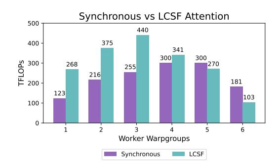

# <span id="page-4-0"></span>3 THUNDERKITTENS

We present THUNDERKITTENS (TK), a framework designed to simplify the development of highperformance AI kernels while leveraging the full capabilities of modern GPUs. This section (1) introduces our key programming abstractions and (2) shows how they can help developers navigate the tradeoffs between different types of parallelism. Section [3.1](#page-4-1) focuses on warp level, Section [3.2](#page-5-0) on thread block level, and Section [3.3](#page-6-0) on grid level parallelism.

As running examples in this section, we show how TK helps optimize attention [\(Vaswani et al.,](#page-13-2) [2017\)](#page-13-2) and GEMM kernels. Section [4](#page-7-0) demonstrates how the principles yield performant kernels for a breadth of AI operations (*e.g.*, attention variants, convolution, SSM, rotary).

### <span id="page-4-1"></span>3.1 WARP PARALLELISM WITH FAMILIAR DATA STRUCTURES AND OPERATIONS

At its core, THUNDERKITTENS is built on two fundamental abstractions – tile data structures at each level of the memory hierarchy and bulk operands on tiles akin to the familiar suite of operations in PyTorch and NumPy. We first define the abstractions, and then show they can help developers navigate tradeoffs between the tile *sizes* and compute efficiency.

Programming abstractions TK is heavily inspired by PyTorch and NumPy, given their familiarity to ML audiences [\(Paszke et al., 2019\)](#page-12-3). We provide a concise set of parallel compute operations, based on the suite of operations in PyTorch (e.g., in Figure [2\)](#page-2-0). The operations are executed by a "worker" abstraction, or a warp or warpgroup (4 warps) of threads that collaboratively own and operate on a piece of data. TK uses a 16 × 16 matrix tile as its basic data structure, designed to maximize compatibility with tensor cores. We provide tiles for each level of the memory hierarchy:

- 1. Register tiles and vectors, which are templated by type, shape, and layout. In Figure [2](#page-2-0) we initialize a bfloat16 type tile with a column-major layout, height 16, width 64. The explicit control of register memory can help users reducing CMemory in Section [2.](#page-2-2)
- 2. Shared tiles and vectors, which are templated by type and shape.
- 3. Global layout descriptors: We set up HBM loads and stores as indexing into 4D tensors, where the dimensions can be known at runtime or compile-time (saving valuable registers).

An advantage of these tile-based abstractions is that they enable TK to statically check layouts and operations, which is important because GPU kernels are often difficult to debug. For example, an in-register tensor core multiply mma AB requires A to be in a row-major layout, and B to be in a column-major layout, and TK can raise compile-time errors if these conditions are not met.


<span id="page-4-2"></span>Figure 4: Shared memory bank layouts, illustrated for a 16x64 16-bit tile; each memory bank has its own color. Top left: A naive, row-major layout. Although loading rows is efficient, loading into a tensor core register layout suffers 8-way bank conflicts. Top right: A padded layout, which has no bank conflicts but consumes additional memory. Bottom: Two of TK's selected layouts, with compile-time selection based on width. (Bank conflicts are unavoidable for some tile sizes while maintaining good hardware support.) These layouts have 2-way and no bank conflicts, respectively.

Choosing a memory layout Layouts specify how logical data elements are mapped to physical thread ownership. Different tile sizes, types, and hardware-accelerated instructions benefit from different layouts, and some layouts lead to bank conflicts Our goals are:

• We want our register tiles (the fastest memory) to keep memory in the layouts used by tensor cores (the fastest compute). Shown in Figure [1](#page-1-0) (Left); each color represents a different thread's ownership over the data. These formats are difficult to use, further highlighted in Figure [4.](#page-4-2)

• We want to support the use of hardware-accelerated instructions (*e.g.*, asynchronous matrix multiply and bulk copy instructions), which also require specific shared memory layouts.

In TK, we simplify to 3 layouts – swizzled on 32, 64, and 128 byte boundaries – and automatically assign shared tiles with layouts that minimize bank conflicts for their size and type. Seen in Section [4.2,](#page-8-0) even the FlashAttention-3 kernels written with CUTLASS templates can face bank conflicts, hurting performance. Our approach helps minimize conflicts, reducing CShared in Section [2.](#page-2-2)

### <span id="page-5-0"></span>3.2 BLOCK PARALLELISM WITH A GENERALIZED ASYNCHRONOUS TEMPLATE

THUNDERKITTENS helps developers reduce overheads by coordinating how workers in a thread block asynchronously overlap execution. Though the GPU hierarchy might suggest that we need a wide variety of techniques, we propose a *single* concise template that we find enables high performance on a surprisingly broad range of AI workloads. We first define the template, which has four steps – load-compute-store-finish (LCSF for short) – and builds on the classical producer-consumer paradigm [\(Dijkstra, 1968;](#page-11-3) [Bauer et al., 2011\)](#page-10-3). We show how the LCSF template can help navigate the tradeoffs between occupancy and efficiency (reducing CHBM, CCompute in Section [2\)](#page-2-2).

### Load function:

```
1 if(warpgroup::warpid() == 0) {
2 tma::expect(inputs_arrived,
3 block.k, block.v);
4 tma::load_async(
5 block.k, globals.k,
6 {batch, head, iter, 0},
7 inputs_arrived);
8 tma::load_async(
9 block.v, globals.v,
10 {batch, head, iter, 0},
11 inputs_arrived);
12 }
13 else arrive(inputs_arrived);
```

### <span id="page-5-2"></span>Compute function:

```
1 warpgroup::mm_ABt(att, scratch.q[state.id], block.k);
2 warpgroup::mma_async_wait();
4 // softmax (simplified)
5 sub_row(att, att, max_vec);
6 exp(att, att);
7 div_row(att, att, norm_vec);
8
9 copy(att_bf16, att);
11 warpgroup::mma_AB(state.o, att_bf16, block.v);
12 warpgroup::mma_async_wait();
13 arrive(inputs_finished);
```

Figure 5: A simplified depiction of attention in the LCSF template to highlight the role of different specialized workers. Left is executed by workers that manage HBM to SRAM memory movement, and right by parallel compute workers, which operate in fast memory, registers and SRAM.

Programming abstractions As per Section [2,](#page-2-2) AI kernel usually load tiles of large tensors from HBM to SRAM, perform computation in fast memory, store the result for the tile back to HBM, and repeat this for the next tiles. To use the LCSF template, the developer writes four functions:

- 1. Load function. Specifies the data that load workers should load from HBM to shared memory, and when to signal to compute workers that this memory is ready for use.
- 2. Compute function. Specifies the kernel instructions that compute workers should execute, using the tile data structure and operation primitives from Section [3.1.](#page-4-1)
- 3. Store function. Specifies what data workers need to store to HBM.
- <span id="page-5-1"></span>4. Finish function. At the end of the kernel, the workers store any final state and exit.

TK provides abstractions to help the developer manage worker overlapping and synchronization.

1. Multi-stage buffer: The template maintains N-stage *pipelined buffers* in shared memory, which are used for loads and stores from HBM. Load/store workers add/remove tiles of data from the buffers, based on the status of compute workers. With a single stage, load workers would need to wait for all compute workers to finish executing before replacing the input tile. A 2-stage buffer can hide the HBM load (store) latency since the next tile can asynchronously load, while the compute work-

| M = N = K | Stages | TFLOPS |
|-----------|--------|--------|
| 4096      | 1      | 260    |
| 4096      | 2      | 484    |
| 4096      | 3      | 683    |
| 4096      | 4      | 760    |

Table 1: Pipeline buffer stages We measure efficiency in TFLOPS for our GEMM kernels as we vary the number of pipeline buffer stages in the TK template.

ers execute on the current tile. Deep buffers can reduce the synchronization required across compute workers, allowing them to operate on multiple tiles concurrently. TK lets the user set a single number to specify the number of stages, and manages the setup and use of these buffers for the user. In Section [3.2,](#page-5-1) we vary the number of stages N ∈ {1, 2, 3, 4} for our GEMM kernel.

- 2. Synchronization barriers: Load/store workers need to alert compute workers when new memory is written to the input buffer. Compute workers need to alert load/store workers when tiles are written to the output buffer, or when input tiles can be evicted from the input buffer. Within the TK template, we provide an arrive function for workers to signal that they have finished their stage.
- 3. Asynchronous I/O: We wrap synchronous and asynchronous load and store instructions, including cp.async and TMA, in the same interface. We automate tensor map descriptor creation for TMA hardware-accelerated address generation for our global layout descriptors (g1).

#### Tradeoffs between occupancy and efficiency

TK parametrizes the *number* of load/store and compute workers (or occupancy) providing a simple way for developers tune their kernels. As discussed in Section 2, higher occupancy increases overlapping, but creates contention over limited hardware resources (e.g., registers). With fewer registers, workers need to operate on smaller tiles of data, resulting in more instruction issues, SRAM to register I/O, and potentially higher synchronization costs due to the increased data partitioning across workers.

Figure 6 shows the occupancy tradeoffs for attention kernels. We consider (1) a simple kernel that only uses warp level parallelism (Listing 2) and (2) a kernel written in the LCSF template



<span id="page-6-1"></span>Figure 6: Occupancy tradeoff: (Left) Attention TFLOPs as a function of occupancy, benchmarked with head dimension 64 and context length 4096. We compare synchronous and LCSF kernels.

(Listing 5). Although with both kernels, performance increases with occupancy until resource contention dominates, LCSF expands the Pareto frontier beyond the naive kernel.

We find the general LCSF template to be effective across a range of AI workloads. We keep the template lightweight and simple by making opinionated design choices. However, we don't want TK to get in the way of achieving peak GPU performance – TK is *embedded*, meaning developers can use the full power of CUDA to extend the library as warranted.

### <span id="page-6-0"></span>3.3 GRID PARALLELISM WITH BLOCK LAUNCH SCHEDULING

TK makes it easier for users to quickly try varied grid layouts and coordinate thread block launches. This can help reduce the setup and tear-down costs for each thread block ( $C_{Setup}$  in Section 2), and encourage memory reuse between thread blocks, to avoid slow HBM accesses ( $C_{HBM}$  in Section 2).

**Block launch costs** We provide optimizations to minimize launch costs, centered around a *persistent grid*, where we launch thread blocks on the full set of SMs upfront, and simply load the next task for the kernel within the existing block. We further eliminate pipeline bubbles by having load/store workers anticipate the next task and pre-load memory to prepare for future work, while the compute workers run the finish stage for the prior task. Table 2 shows these optimizations for matrix multiplies.

| M=N  | K    | TK-No | TK-Yes | CuBLAS |
|------|------|-------|--------|--------|
| 4096 | 64   | 93    | 108    | 69     |
| 4096 | 128  | 161   | 184    | 133    |
| 4096 | 256  | 271   | 309    | 242    |
| 4096 | 512  | 414   | 450    | 407    |
| 4096 | 1024 | 565   | 600    | 633    |

<span id="page-6-2"></span>Table 2: **Persistent block launch** TFLOPS for TK GEMM kernels with (**yes**) persistent and without (**no**) persistent launch as we vary matrix dimension K.

**L2 reuse and block launch order** Recall that thread blocks need to communicate via HBM. As introduced in Section 2, when thread blocks reuse memory, the data is often available in L2 cache, which is significantly faster than HBM. However, cache eviction means that these reuse qualities depend on the order in which blocks get launched. For our attention and GEMM kernels, we measure efficiency as we vary block order, summarized in Table 3. Block order substantially affects L2 reuse (measured through HBM bandwidth), which in turn can control kernel performance.

| Matrix Multiply (M=N=K=16384) |          |        |  |  |
|-------------------------------|----------|--------|--|--|
| Block Order                   | HBM GB/s | TFLOPS |  |  |
| {8, N, M/8}                   | 982      | 805    |  |  |
| {N, M}                        | 3,070    | 392    |  |  |

<span id="page-7-1"></span>

| Attention Forward (D=128) |          |        |  |  |
|---------------------------|----------|--------|--|--|
| Block Order               | HBM GB/s | TFLOPS |  |  |
| {N, H, B}                 | 213      | 600    |  |  |
| {B, H, N}                 | 2,390    | 494    |  |  |

Table 3: L2 reuse: We vary the block orders and measure both consumed bandwidth from HBM (GB/s) and efficiency (TFLOPS). For attention, we consider an optimized kernel, with an internal tiling of 8 rows of blocks, versus a naive kernel that schedules blocks in row-major order. For attention, we compare block order (1) sequence length N, heads H, and outermost batch B vs. (2) innermost B, H, then outermost N. Block order has significant performance implications.

