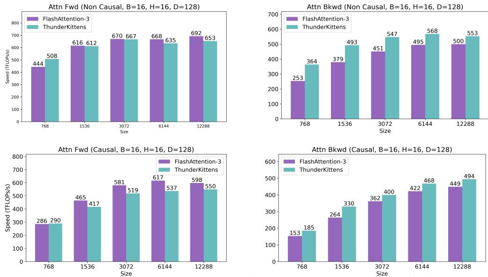

# 4 EXPERIMENTS

In experiments, we validate that THUNDERKITTENS speeds up a broad range of ML primitives. We compare to well-optimized kernels from prior work, written in alternate frameworks such as CUTLASS, CuBLAS, general CUDA, and Triton. We compare our kernels for the "workhorse" operations in AI, GEMM and attention, as well as kernels for emerging AI architectures, such as linear attention and state space models (Section [4.1\)](#page-7-2). We profile the kernels to understand TK's role in achieving high performance in Section [4.2.](#page-8-0) Kernel listings, in the TK template, are in Appendix [C.](#page-20-0)

### 4.1 TK ENABLES SIMPLE AND PERFORMANT AI KERNELS

We evaluate a suite of TK kernels. We benchmark on an NVIDIA H100 80GB SXM GPUs using CUDA 12.6 and report average TFLOPS. We provide experiments on an NVIDIA RTX 4090 and an Apple M2 Pro in Appendix [B.](#page-14-0)

Workhorse kernels for AI Industry teams and researchers have made significant investments into optimizing GEMMs and attention over the past several years [\(NVIDIA, 2023;](#page-12-4) [Dao et al., 2022b;](#page-11-8) [Bikshandi & Shah, 2023a;](#page-10-0) [Shah et al., 2024,](#page-12-0) inter alia.), two workhorse

strong, TK kernels match or outperform:

Figure 7: GEMM kernel from CuBLAS and TK. operations that power the Transformer architecture [\(Vaswani et al., 2017\)](#page-13-2). While the baselines are

- GEMM: We compare to the strongest baselines: CuBLAS[\(NVIDIA, 2023\)](#page-12-4), CUTLASS [NVIDIA](#page-12-1) [\(2017\)](#page-12-1). A single TK matrix multiply kernel, with just 40 lines of device code, is competitive.
- Attention: We support multiple variants of attention: causal, non-causal, and grouped query attention [\(Ainslie et al., 2023\)](#page-10-4) at head dimensions 64 and 128. We compare to the strongest baseline, which is concurrent to our work: FlashAttention-3 (FA3) [\(Shah et al., 2024\)](#page-12-0). TK competes with FA3 across sequence lengths on the non-causal forwards pass, and outperforms FA3 on the causal and non-causal backwards pass by over 40% at shorter and 10% at longer sequences.

We find that TK makes it easy to use the GPU effectively by simplifying the choice of memory layouts, exploration of grid patterns for L2 reuse, and selection of occupancy and pipeline depth. The baseline kernels successfully use specialized H100 instructions and manage memory. However, the existing kernels are relatively complex: FlashAttention-3 proposes a "ping-pong scheduler" for workers, and the CuBLAS library is >600MB in CUDA 12.6 (Table [5\)](#page-19-0), containing many tuned GEMM variants and logic to select the best option at runtime [\(Schuetze, 2024\)](#page-12-5). With TK, we remove the ping-pong and maintain FA3-level efficiency, and we compete with CuBLAS on the demonstrated matrix sizes, using a single GEMM kernel (entirely in Appendix [C.1\)](#page-20-1).

Kernels for emerging AI architectures In addition to supporting peak performance on popular operations like GEMMs and attention, TK is also designed to be extensible to emerging AI workloads. We release kernels across recent ML primitives, including linear attention [\(Katharopoulos](#page-12-6) [et al., 2020\)](#page-12-6), FFT convolutions [\(Cooley & Tukey, 1965\)](#page-11-9), and state space models [\(Gu et al., 2021\)](#page-11-10).

Figure 8: Attention causal and non causal inference and backwards pass efficiency.

- Linear attention We optimize two different classes of linear attention architectures, polynomialbased feature maps as in [\(Arora et al., 2024;](#page-10-5) [Aksenov et al., 2024;](#page-10-6) [Keles et al., 2023;](#page-12-7) [Kacham](#page-12-8) [et al., 2024\)](#page-12-8) and *learned* feature maps as in [\(Zhang et al., 2024b](#page-13-3)[;a\)](#page-13-4). In Figure [9,](#page-9-0) we compare to the strongest available baselines: the popular Flash Linear Attention (FLA) CUDA kernels [\(Yang](#page-13-1) [& Zhang, 2024\)](#page-13-1), which are written in Triton. We show TK outperforms FLA's polynomial-based linear attention by 14×. TK outperforms FLA's learned map linear attention by 6.5×.
- State space models The long convolution, implemented with Fourier transforms using the convolution theorem, is the key primitive in popular state space modeling architectures such as S4, H3, and Hyena [\(Gu et al., 2021;](#page-11-10) [Poli et al., 2023;](#page-12-9) [Fu et al., 2023b;](#page-11-11) [Hasani et al., 2022;](#page-11-12) [Agarwal et al.,](#page-10-7) [2024,](#page-10-7) inter alia.). In Figure [9,](#page-9-0) we compare to the strongest available baseline: the FlashFFTConv CUDA kernels in [Fu et al.](#page-11-6) [\(2023c\)](#page-11-6) and show TK outperforms the prior work by 4.7× at sequence length 4096 and 7.9× at 1024. TK outperforms PyTorch's FFT operations by up to 8.7×.

We also optimize the recent Mamba-2 state space model [\(Dao & Gu, 2024\)](#page-11-5). We provide a TK kernel that outperforms the Triton kernels in prior work [Dao & Gu](#page-11-5) [\(2024\)](#page-11-5) by > 3× (Figure [9\)](#page-9-0). This gap is primarily due to the ease of fusing complex operations in TK.

We also develop kernels for common memory-intensive AI operations – fused dropout-residuallayernorm [\(Ba et al., 2016\)](#page-10-8), and rotary [\(Su et al., 2023\)](#page-12-10) – and show TK is effective. We compare to popular Triton kernels for these operations. [2](#page-8-1)

TK's programming model is extensible. In Appendix [B,](#page-14-0) we demonstrate that TK extends across (1) hardware platforms by providing competitive NVIDIA 4090 and Apple M2 kernels, (2) precisions by providing a competitive FP8 GEMM kernel, and (3) tile shapes by providing an attention kernel for arbitrary shapes.

