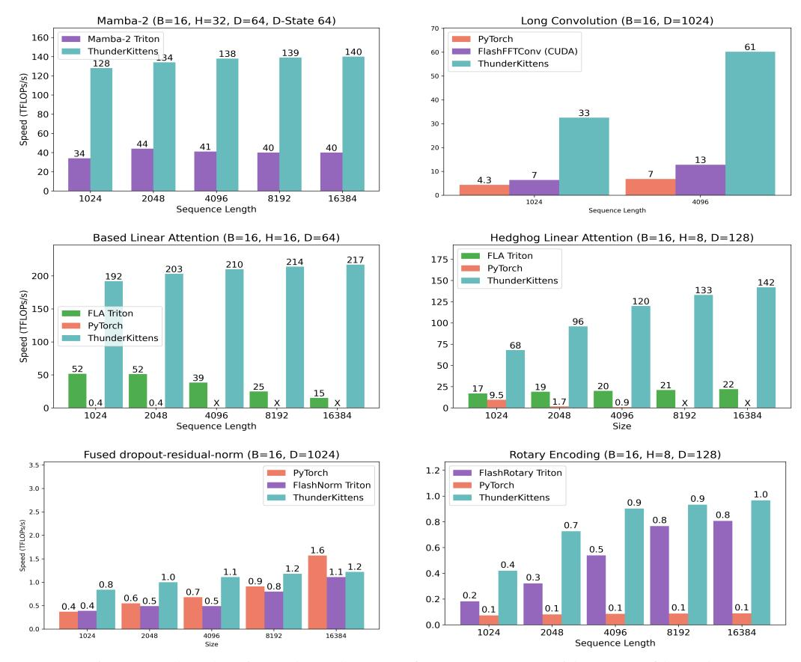

# 4.2 COMPARING KERNEL IMPLEMENTATIONS

To understand TK's improvements, we profile the kernels using NVIDIA's NSight Compute (NCU) tool. In Table [4,](#page-9-1) we give NCU profiles for both the emerging long convolution primitive and the well-optimized attention backwards pass, comparing to the strongest respective baselines.

• Long convolution: We profile FlashFFTConv (FC) and TK convolution kernels at B, D, N = 16, 1024, 4096 in NCU. We find TK helps both with overlapping the workers (indicated by higher issue slots and fewer memory stalls) and in tensor core utilization (4.1× increase). This is enabled by our TK template, and use of TK warpgroup operations (which saves registers and establishes a SMEM to register memory pipeline through warpgroup matrix-multiply-add operations).

2Reference Triton kernels are from: <https://github.com/Dao-AILab/flash-attention>.

Figure 9: ThunderKittens kernels are performant across a wide range of kernels.

|          | Occupancy utilizations (%) |             |            | HBM             | Shared          |
|----------|----------------------------|-------------|------------|-----------------|-----------------|
| Impl.    | Tensor core                | Issue slots | TPS (GB/s) | Stalls (Cycles) | Stalls (Cycles) |
| FA3 Bkwd | 61.2                       | 25.1        | 328        | 1.83            | 0.92            |
| TK Bkwd  | 58.2                       | 34.8        | 490        | 1.63            | 0.14            |
| FlashFFT | 13.4                       | 25.5        | 14.8       | 2.5             | 1.6             |
| TK       | 54.8                       | 40.0        | 31.4       | 0.6             | 0.3             |

Table 4: NCU profiles for 1) attention backwards pass kernels from FlashAttention-3 [\(Shah et al.,](#page-12-0) [2024\)](#page-12-0) vs. TK and 2) long convolution kernels from FlashFFTConv [\(Fu et al., 2023c\)](#page-11-6) vs. TK.

• Attention backwards: We consider FA3 and TK at B, H, N, D = 16, 16, 3072, 128. The methods match in tensor core utilization, but TK gives higher issue slot utilization, suggesting the occupancy may be better-tuned. TK gives higher HBM memory throughput and incurs 10% fewer stalled cycles on HBM waits. For shared memory, TK incurs 85% fewer stalled cycles – we find TK has *no bank conflicts*, but NVIDA's NCU profiler reports up to 9.6-way bank conflicts in FA-3.

