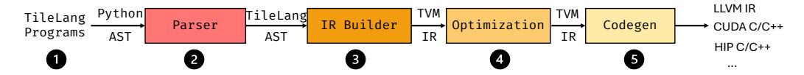

# 3 The Tile Language

In this section, we introduce the foundations of our tile-based programming model, explain how TileLang systematically manages AI kernel development efficiently, and outline TileLang's design philosophy of separating data flow from other scheduling spaces.

Figure 2 illustrates the five-stage compilation pipeline of TileLang. Initially, developers write high-level programs using TileLang to describe computational logic and data access patterns. In the Parser stage, TileLang programs are parsed into Python AST and subsequently transformed into TileLang AST. Next, the IR Builder converts the AST into TVM intermediate representation (IR), enabling us to leverage TVM's syntax tree and related infrastructure. Following this, the Optimization stage performs a series of graph optimizations and scheduling transformations to enhance execution efficiency. Finally, the Codegen stage translates the optimized IR into backend code such as LLVM IR, CUDA C/C++, or HIP C/C++, supporting various hardware platforms.

Fig. 2. Stages of TILELANG Compile Pipeline.

Table 1 showcases a representative subset of the dataflow operators and scheduling primitives provided by Tilelang. The Tile Language embraces a data-centric programming paradigm, where core computational semantics are expressed through tile-level operators such as T. copy, T. gemm, and T. reduce. Complementing these operators, Tilelang exposes a set of scheduling primitives that allow developers to fine-tune performance-critical aspects such as parallelism, pipelining, and memory layout. We will explain the design of these two components in the following sections.

| Tab | le 1. A | partial l | ist of | the data | ıflow a | operators and | l sched | luling | primitives | support | ed by | √ TILELANG. |
|-----|---------|-----------|--------|----------|---------|---------------|---------|--------|------------|---------|-------|-------------|
|     |         |           |        |          |         |               |         |        |            |         |       |             |

| I        | Oataflow Centric Tile Operators                                                                                             | <b>Scheduling Primitives</b> |                                                                                                                                                           |  |  |
|----------|-----------------------------------------------------------------------------------------------------------------------------|------------------------------|-----------------------------------------------------------------------------------------------------------------------------------------------------------|--|--|
| T.copy   | A specialized memory copy operator that abstracts parallel data movement among registers, shared memory, and global memory. | T.Parallel                   | Automates parallelization of loop iterations, mapping them to hardware threads, can also enable vectorization for additional performance gains.           |  |  |
| T.gemm   | Automatically selects implementations (cute/cuda/hip) for high-performance matrix multiplication on different GPUs.         | T.Pipelined                  | Enables loop-level pipelining to overlap data trans- fers with computation and supports hardware- specific instructions such as async copy and TMA. |  |  |
| T.reduce | A flexible reduction operator (e.g., sum, min, max) exploiting warp- and block-level parallelism.                           | T.annotate_layout            | Allows the definition of custom memory layouts to minimize bank conflicts and optimize thread binding.                                                    |  |  |
| T.atomic | Provides atomic operations (e.g., add, min, max) to ensure thread-safe updates in shared or global memory.                  | T.use_swizzle                | Improves L2 cache locality via swizzle thread blocks.                                                                                                     |  |  |

