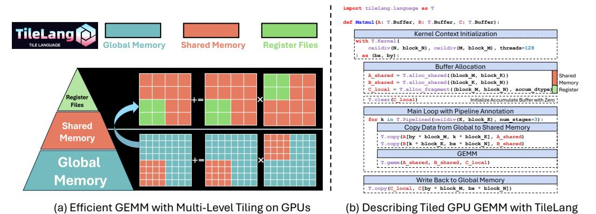

# 3.1 Tile-based Programming Model

Figure [11](#page-12-0) provides a concise matrix multiplication (GEMM) example in TileLang, illustrating how developers can employ high-level constructs such as tiles, memory placement, pipelining, and operator calls to manae data movement and computation with fine-grained control. In particular, this snippet Figure [11\(](#page-12-0)a) demonstrates how multi-level tiling leverages different memory hierarchies (global, shared, and registers) to optimize bandwidth utilization and reduce latency. Overall, Figure [11](#page-12-0) (b) showcases how the Python-like syntax of TileLang allows developers to reason about performance-critical optimizations within a user-friendly programming model.

Fig. 3. Optimizing GEMM with Multi-Level Tiling on GPUs via TileLang.

Tile declarations. At the heart of our approach is the notion of tiles as first-class objects in the programming model. A tile represents a shaped portion of data, which can be owned and manipulated by a warp, thread block, or equivalent parallel unit. In the Matmul example, the A and B buffers are read in tiled chunks (determined by block\_M, block\_N, block\_K) inside the kernel loop. With T.Kernel, TileLang defines the execution context, which includes the thread block index (bx and by) and the number of threads. These contexts can help us compute the index for each thread block, and making it easier for the TileLang to automatically inference and optimize memory access and computation. Additionally, these contexts allow users to manually control the behavior of each independent thread within a thread block.

Explicit Hardware Memory Allocation. A hallmark of TileLang is the ability to explicitly place these tile buffers in the hardware memory hierarchy. Rather than leaving it to a compiler's opaque optimization passes, TileLang exposes user-facing intrinsics that map directly to physical memory spaces or accelerator-specific constructs. In particular:

- T.alloc\_shared: Allocates memory in a fast, on-chip storage space, which corresponds to shared memory on NVIDIA GPUs. Shared memory is ideal for caching intermediate data during computations, as it is significantly faster than global memory and allows for efficient data sharing between threads in the same thread block. For example, in matrix multiplication, tiles of matrices can be loaded into shared memory to reduce global memory bandwidth demands and improve performance.
- T.alloc\_fragment: Allocates accumulators in fragment memory, which corresponds to register files on NVIDIA GPUs. By keeping inputs and partial sums in registers or hardwarelevel caches, latency is further minimized. Note that in this tile program, each tile allocates the same local buffers as shared memory, which might seem counterintuitive, as shared memory is generally faster but more abundant, whereas register files is limited. This is because the

allocation here refers to the register files for an entire thread block. TileLang uses a Layout Inference Pass during compilation to derive a Layout object T.Fragment, which determines how to allocate the corresponding register files for each thread. This process will be discussed in detail in subsequent sections.

Data transfer between global memory and hardware-specific memory can be managed using T.copy. Furthermore, hardware-specific buffers can be initialized using T.clear or T.fill. For data assignments, operations can also be performed in parallel using T.Parallel, as demonstrated in [8.](#page-10-0)

