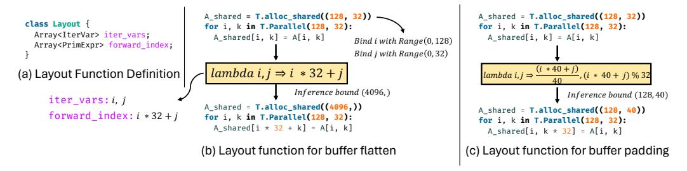
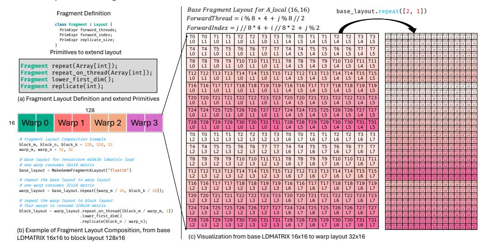

# 3.2 Dataflow Centric Tile Operators

TileLang abstracts a set of Tile Operators that allow developers to focus on the dataflow logic without needing to manage the low-level implementation details of each tile operation. Figure [4](#page-6-0) illustrates the interface of a Tile Operator along with several representative examples, including GEMM, Copy, and Parallel. Each Tile Operator is required to implement two key interfaces: Lower and InferLayout. The Lower interface defines how the high-level Tile Operator is lowered into a lower-level IR, such as thread bindings or vectorized memory accesses. For example, Copy can be lowered into a loop with explicit thread binding and vectorized loads/stores. The InferLayout interface is responsible for determining the memory and loop layouts associated with the Tile Operator. This includes inferring buffer layouts (e.g., swizzled memory) or loop-level layouts (e.g., thread bindings). For instance, T.gemm applies swizzled layouts to its shared memory inputs and uses a matrix-specific layout for writing back MMA fragments. Similarly, the parallel loop structure in T.Parallel can be expressed using thread-level bindings and vectorized access patterns, both of which are derived via layout inference. Section [4.1](#page-8-0) provides a more detailed discussion of layout composition and its role in the lowering process.

| class GEMM                                                 | class Copy                               | class Parallel                                       |  |
|---------------------------------------------------------------|---------------------------------------------|---------------------------------------------------------|--|
| T.GEMM(A_shared, B_shared, C_local)                           | T.Copy(A, A_shared)                         | for i, j in T.Parallel(128, 8):                         |  |
| T.call_extern("cute::gemm_ss", args)                          | for i in T.vectorized(8):                   | C_local[i, j] *= Scale[j]                               |  |
| AShared: MakeSwizzleLayout,                                   | A_shared[tx, i] = A[tx, i]                  | for i in T.vectorized(8): C_local[tx, i] += Scale[i] |  |
| BShared: MakeSwizzleLayout, CLocal: MakeMMASTMatrixLayout, | Loop Layout Lambda i, j->(tid, local_id) | Scale: InferencedScaleLayout,                           |  |

Fig. 4. Interface of a Tile-Operator, and example instances of TileOP.

Table [1](#page-4-1) lists a subset of TileLang operators to simplify common operations in tile-based programming. These built-in operators abstract low-level details of hardware memory access and computation, allowing developers to focus on high-level algorithm design from dataflow perspective while maintaining fine-grained control over performance-critical aspects. Each operator is designed to integrate seamlessly with the tile programming model, ensuring efficient data movement and computation across the hardware memory hierarchy. Below, we describe several key operators along with their roles in optimizing memory transfers and arithmetic computations.

- copy: The copy op is a sugar syntax for T.Parallel with memory copy, which allows copy from and into scope fragment for registers, shared scope for static shared memory, shared.dyn for dynamic shared memory, and global for global memory.
- gemm: The built-in T.gemm operator is a highly optimized implementation for general matrix multiplication, supporting various memory access patterns (ss, sr, rs, rr), where r denotes register memory and s denotes shared memory. The operator automatically selects the optimal implementation based on the kernel configuration. For CUDA backends, T.gemm utilizes Nvidia's CUTLASS library to efficiently leverage Tensor Cores or CUDA Cores, while for AMD GPUs, it employs both composable kernels and hand-written HIP code for

performance optimization. Users can also extend T. gemm by registering custom primitives in Python, making it flexible for specific use cases.

- reduce: The T. reduce operator provides a flexible and efficient reduction mechanism for aggregating data across dimensions. It supports a variety of reduction operations such as sum, min, max, and product, among others. The reduction can be performed across specified axes, enabling operations like row-wise or column-wise reductions in a matrix. T. reduce is implemented to utilize warp-level and block-level parallelism for optimal performance on both CUDA and AMD backends. Users can also customize the reduction operation by defining their own reduction kernels.
- atomic: The T. atomic operator provides atomic operations for safe updates to shared or global memory in a parallel context. Common atomic operations like add, min, and max are supported out-of-the-box. T. atomic ensures thread safety during concurrent updates, making it essential for operations like histogram updates, reductions with shared memory, and synchronization-free counters. It is designed to leverage native hardware atomic instructions on both NVIDIA and AMD GPUs, ensuring high performance while maintaining correctness in parallel executions.

#### 3.3 Schedule Annotations and Primitives

While dataflow patterns form the foundation of computation organization, modern high-performance computing demands more fine-grained control over execution patterns. To address this need, Tile-Lang provides a comprehensive suite of scheduling primitives that enable developers to precisely tune performance-critical aspects of their applications, as detailed in Table 1:

- **Pipelined**: The T.Pipelined primitive allows efficient pipelined execution of loops to improve performance by overlapping computation and memory operations. In Figure 11, the loop iterating over k (the reduction dimension) is pipelined with num\_stages=3, creating a 3-stage pipeline. This pipeline allows data transfer, computation, and subsequent data preparation to overlap, effectively reducing memory bottlenecks and improving computational throughput. The detailed design for lowering the process from T.Pipelined into CUDA source code will be discussed in Section 4.4.
- Parallel: The T.Parallel primitive enables automatic parallelization of loops by mapping iterations to threads. In Figure 8, the operation copying data into A\_shared uses T.Parallel(8, 32) to parallelize across both the 8 and 32 dimensions. It not only improves performance by leveraging hardware parallelism but also automatically maps threads to iterations and supports vectorization for further optimization.
- annotate\_layout: The T. annotate\_layout primitive enables you to specify memory layout
  optimizations for shared or global memory using a user-defined memory layout. By default,
  TILELANG adopts an optimized memory layout designed to minimize bank conflicts on both
  Nvidia and AMD GPUs.
- use\_swizzle: The T.use\_swizzle primitive improves L2 cache locality by enabling swizzled memory accesses. improving the data reuse for rasterization. This primitive is particularly effective when processing tiled data in parallel threads blocks.

## 4 Scheduling Design and Automation

In this section, we discuss four types of schedule spaces and their automation design in TileLang besides Dataflow. Some of these are relatively independent (such as pipeline and tensorization), while others are more coupled, such as Thread Binding and Memory Layouts design. In the following sections, we will first explain the design of Memory Layout Infrastructure, followed by Thread

Binding. Then, we will discuss the automation design for Tensorization, and finally share the design of Pipeline.

### 4.1 Memory Layout Composition

In TileLang, we support indexing into multi-dimensional arrays using a high-level interface such as A[i, k]. This high-level indexing is ultimately translated into a physical memory address through a series of software and hardware abstraction layers. To model this index translation process, we introduce key abstraction **Layout**, which describe how data is organized and mapped in memory. At the physical address level, a layout can be represented as a linearized address expression of the form  $\sum_i y_i s_i$ , where  $y_i$  denotes the index along the i-th dimension, and  $s_i$  is the stride that dimension contributes to the overall linear memory address. Given a layout  $L = s : d = (s_0, s_1, \ldots, s_{n-1}) : (d_0, d_1, \ldots, d_{n-1})$ , TileLang adopts a design inspired by TVM [8], introducing a composable and stackable layout function abstraction built upon IterVar. Since an IterVar can encapsulate stride information, layout expressions can be simplified into algebraic forms over IterVars. Consequently, a layout function can be formally expressed as a mapping  $f : \mathbb{K}^n \to \mathbb{K}^m$ , where f encodes the transformation from high-level indices to memory addresses.

Fig. 5. Interface and example instances of Layout Function.

Figure 5(a) illustrates the definition of a Layout in TileLang. Its core components include iter\_vars, which may optionally carry range information, and a set of forward\_index expressions that compute memory locations based on those iteration variables. These expressions collectively define an algebraic function  $f:\mathbb{K}^n\to\mathbb{K}^m$ . As shown in Figure 5(b), this allows expressing a 2D-to-1D layout transformation. Given the shape of the buffer, iter\_vars are bound to specific regions, and the resulting expressions are passed to arithmetic analyzer to determine the symbolic or constant bounds. These bounds are used to infer the transformed buffer's shape and to adjust buffer access indices accordingly.

TILELANG also supports non-bijective layout transformations. For example, Figure 5(c) demonstrates how layouts can be used to apply padding to buffer accesses. These layout transformations are composable, and TILELANG includes several built-in layout strategies, such as layout swizzling, which is commonly employed to mitigate shared memory bank conflicts on GPUs.

In addition, TileLang introduces an extension of the **Layout** abstraction, referred to as **Fragment**. In contrast to standard layouts, a Fragment Layout always produces an output of the form  $f: \mathbb{K}^n \to \mathbb{K}^2$ , where the two output dimensions represent the thread's position within the register file and the index into the local register file, respectively. For instance, in Figure 11, the kernel allocates a register file  $C_{\text{local}}$  at the block level. However, since GPU register files must be partitioned among threads within a block, the Fragment Layout provides an accurate description of this partitioning scheme.

Figure 6(a) illustrates the definition of the Fragment Layout, and TileLang provides four primitive operations to help users extend existing Fragment Layouts. Figure 6(b) shows an example of how

these primitives are used to derive a complete block-level layout from a base layout used in the mma\_ldmatrix instruction for m16k16 matrix fragments. Here, base\_layout denotes the layout for a single warp consuming a m16k16 matrix. This layout is extended via the repeat primitive to form a warp\_layout, which allows a single warp to consume a m32k16 matrix. Figure [6\(](#page-9-0)c) visualizes this transformation. The warp\_layout is then further extended using primitives like repeat\_on\_thread and replicate to produce a block\_layout, which represents four warps collectively consuming a m128k16 matrix.

Fig. 6. Interface and example instances of Fragment Layout.

