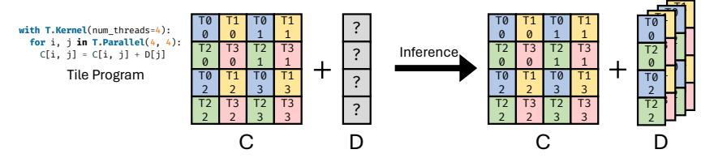
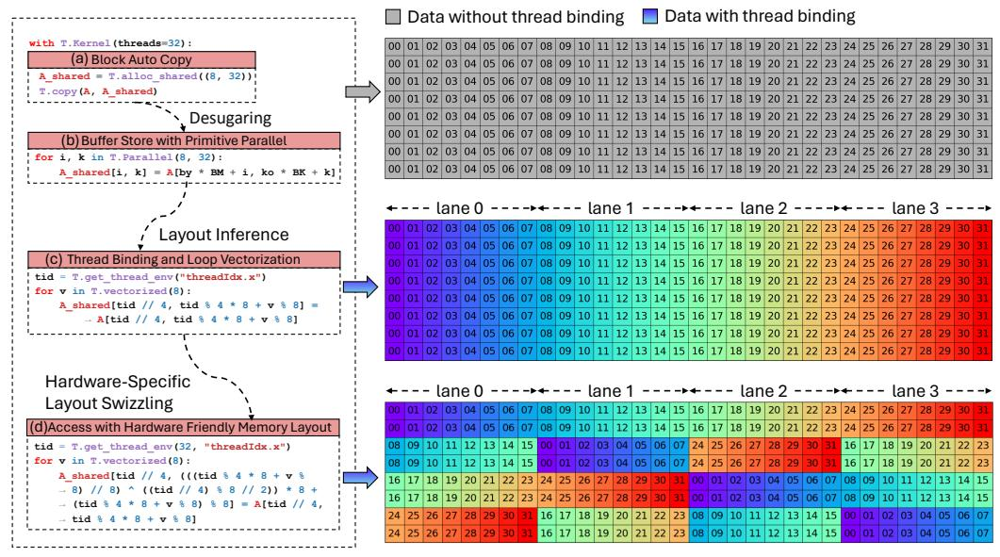
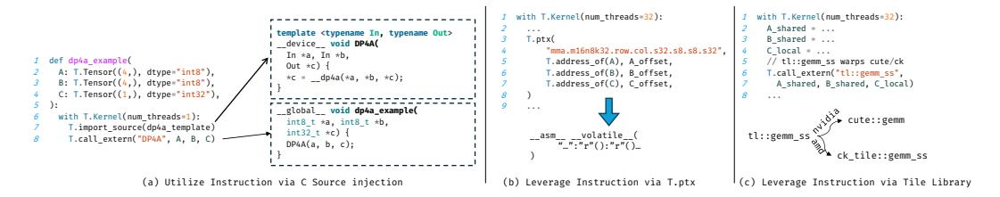
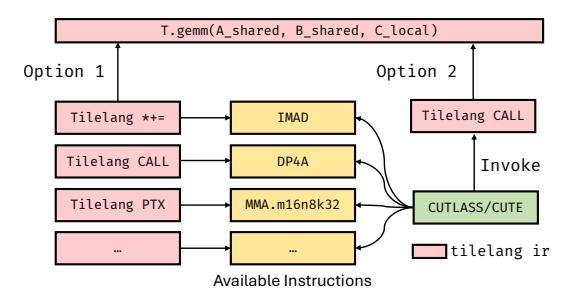

# 4.2 Thread Binding

Building on the abstraction of Fragment Layouts, a key challenge that arises is how to map these layouts onto threads during execution. This leads to the Thread Binding problem, which involves determining how to distribute block-level register files among individual threads and how to infer appropriate fragment layouts. Moreover, it also requires identifying how loops should be correctly parallelized to match the layout constraints.

While Section [4.1](#page-8-0) introduces Fragment Layouts to help simplify this process, determining suitable fragment layouts for all buffers remains difficult for arbitrary computational expressions. We make two key observations to guide this process. First, since multiple tile operators often share the same buffers, their respective layout and thread binding strategies are interdependent. Second, the strictness of layout and thread binding requirements varies across operators. For instance, on GPUs, the GEMM operator (which leverages Tensor Cores) imposes stringent constraints on both layout and thread binding, whereas element-wise operators typically allow more flexibility.

Based on these observations, we propose an inference scheme based on Layout and Fragment objects to optimize buffer layouts and thread bindings. To systematically manage buffer layouts, we maintain a LayoutMap that records the layout information for all buffers. We define a hierarchical priority system for tile operator layouts, where higher priority levels indicate stricter layout requirements and greater performance impact. TileLang processes layout inference in a top-down manner, sequentially inferring layouts from the highest to the lowest priority levels. At each priority level, TileLang attempts to infer layouts for all undetermined buffers until no further progress can be achieved, before proceeding to the next lower priority level.

As illustrated in Figure 7, consider a scenario where matrix C represents the result of a GEMM operation, corresponding to a Fragment object, which requires the addition of bias D post-GEMM computation. Given that GEMM holds the highest priority during the inference process, its thread binding configuration is predetermined, whereas the thread binding strategy for D remains to be determined. The output matrix C has dimensions of  $4\times4$ , distributed across 8 threads with each thread responsible for 2 elements. Consequently, the layout of the bias buffer D must be aligned with this configuration. Since each row of tensor C is processed by 2 threads, both threads require access to identical elements from D for the addition operation. Thus, D must be replicated to ensure that each thread can access the corresponding elements. The layout of D can be inferred using the same methodology.

Fig. 7. An example of thread binding inference for Fragments.

Figure 8 illustrates an example of the thread binding inference process. In particular, Figure 8(a) presents a simple code snippet for copying data, which describes the dataflow of a subtile being transferred from global memory to shared memory. Proper thread binding and vectorized access can fully exploit the parallelism of GPUs and take advantage of high-performance memory access instructions. In Figure 8(b), the T. copy operation is expanded into multiple loop axes. After applying the Layout Inference Pass, as shown in Figure 8(c), the program undergoes automatic vectorization and parallelization. Finally, at the stage depicted in Figure 8(d), Layout Swizzling is applied.

Fig. 8. Multi-Stage Automatic Thread Binding Inference for Efficient Parallel Memory Access.

## 4.3 Leveraging High-Performance Hardware Instructions

Modern hardware architectures often support multiple instruction pathways for implementing the same computational operation. On NVIDIA GPUs, for instance, an 8-bit multiply-accumulate operation can be realized through several types of instructions. The IMAD instruction performs a scalar fused multiply-add operation, computing  $d=a\cdot b+c$ , where all operands are internally promoted to 32-bit integers for computation. The DP4A instruction enables a vectorized dot-product operation, evaluating  $d=\langle \mathbf{a},\mathbf{b}\rangle+c=\sum_{i=0}^3 a_ib_i+c$ , where  $\mathbf{a}$  and  $\mathbf{b}$  are 8-bit integer vectors of length four, and both the bias c and the output d are represented in 32-bit integer precision. For higher-throughput matrix computations, the MMA instruction leverages Tensor Cores to perform  $\mathbf{D}=\mathbf{A}\cdot\mathbf{B}+\mathbf{C}$ , where  $\mathbf{A}\in\mathbb{R}^{16\times32}$ ,  $\mathbf{B}\in\mathbb{R}^{32\times8}$ ,  $\mathbf{C}$ ,  $\mathbf{D}\in\mathbb{R}^{16\times8}$ ; in this case,  $\mathbf{A}$  and  $\mathbf{B}$  are 8-bit integer matrices, while  $\mathbf{C}$  and the accumulated result  $\mathbf{D}$  use 32-bit integer precision. On NVIDIA RTX 3090 GPUs, the throughput of these instructions is approximately 17.8 TOPS, 71.2 TOPS, and 284 TOPS, respectively. Moreover, MMA instructions support various shapes under the same precision setting.

In TileLang, as illustrated in Figure 10(a) and (b), there are two approaches to invoking hardware tensor instructions. The first approach (Figure 10(a)) uses C++ source injection, where instructions like dp4a are manually wrapped using C++ templates and injected into the kernel via T.import\_source and T.call\_extern. This enables low-level control while leveraging familiar C-style syntax. The injected function is defined at the beginning of the generated code and called within the kernel. Alternatively, as shown in Figure 10(b), TileLang provides a built-in T.ptx primitive that allows direct emission of inline PTX instructions (e.g., mma.m16n8k32.row.col.s32.s8.s32) inside the kernel. This provides another low-level mechanism for utilizing specialized instructions, especially for warp-level operations.

Fig. 9. Different methods of using high performance hardware instructions in tilelang

However, choosing the most appropriate instruction based on input shapes and data types can be challenging. To simplify this process, TileLang also supports integration with Tile Libraries, as shown in Figure 10(c). Tile Libraries—such as NVIDIA's cute or AMD's composable kernel (ck)—offer high-level, standardized tile-based APIs (e.g., tl::gemm\_ss) for operations like GEMM. These libraries abstract away hardware-specific details and allow the underlying implementation to automatically select the most efficient instruction for a given input configuration. In TileLang, developers can invoke these libraries using T.call\_extern in a straightforward and consistent way.

In summary, TileLang provides two complementary methods for leveraging high-performance instructions. The first leverages Tile Libraries, which simplify integration and benefit from vendor-optimized performance. However, the high-level abstraction may limit low-level control. For example, the cute::gemm\_ss interface performs GEMM operations on shared memory inputs, but the data flow from shared memory to registers is internally managed by the cute templates. This makes it impossible to externally annotate or override internal layouts, thus reducing flexibility. Furthermore, due to heavy use of templates, compilation can become significantly slower. Analysis

using the NVCC 12.8 trace tool shows that template expansion accounts for approximately 90% of compilation time for CUDA code generated by tilelang.

Fig. 10. Different methods of using DP4A and mma in tilelang

In contrast, TileLang allows direct implementation of instructions via T.gemm using tilelang itself. This avoids layout annotation limitations and reduces compilation time. However, it requires users to implement a complete instruction set within tilelang for each target hardware instruction. Currently, TileLang supports both approaches, defaulting to the Tile Library-based method to facilitate rapid support for new hardware instructions.

