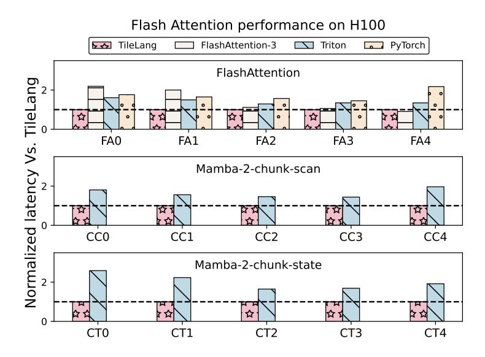
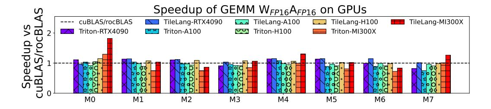
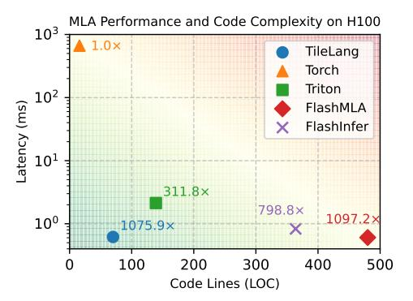
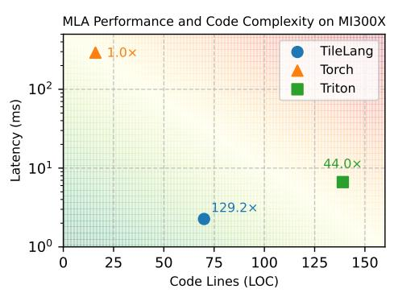
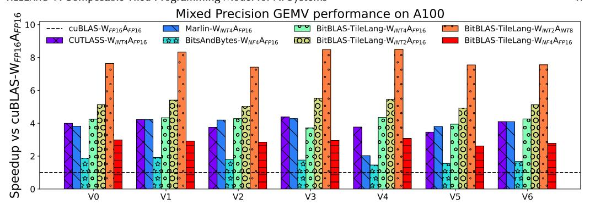

# 5 Numerical Experiments

In this section, we evaluated the performance of TileLang through a series of comprehensive numerical experiments across diverse hardware platforms and workloads. Our goal is to demonstrate the effectiveness, generality, and scalability of TileLang in optimizing key operator kernels that form the backbone of modern machine learning workloads. By benchmarking against state-of-theart solutions, we aim to highlight both the versatility of TileLang in handling mixed-precision computations and its ability to deliver significant performance gains across multiple GPU architectures.

## 5.1 Experimental Setup

Hardware platforms. We evaluate TileLang on both NVIDIA and AMD GPUs, as they are among the most widely used accelerators. Our experiments use three cutting-edge GPUs: the NVIDIA H100 (80 GB) [10], the NVIDIA A100 (80 GB) [9], and the AMD Instinct MI300X (192 GB) [5]. For the NVIDIA H100, we use CUDA 12.4; for the MI300X, we use ROCm 6.1.0. All platforms run under Ubuntu 20.04.

Operator workloads. We evaluate TileLang on a range of operator workloads that frequently appear in large-scale deep learning pipelines. On the NVIDIA H100, we focus on multi-head attention (MHA), linear attention, and general matrix multiplication (GEMM). For the NVIDIA A100, we measure performance on our dequantized GEMM kernels. Meanwhile, on the AMD Instinct MI300X, we benchmark both GEMM and MHA to capture representative use cases spanning different GPU architectures. These workloads form the foundational building blocks for many contemporary neural network models, including large language models.

Baselines. To evaluate the performance of TILELANG, we compare it against several state-of-the-art baselines widely used in machine learning and GPU programming. These include FlashAttention-3, optimized for multi-head attention with CUDA instructions like tma and wgmma.mma\_async; Triton, an open-source framework for efficient GPU kernels that supports

Nvidia and AMD GPUs but requires manual optimizations; **cuBLAS**, NVIDIA's high-performance dense linear algebra library; AMD's BLAS library, **rocBLAS**; **PyTorch**, featuring hand-optimized kernels like GEMM and FlashAttention-2 but not fully optimized; **BitsandBytes**, designed for supporting formats like  $W_{NF4}A_{FP16}$  and provide efficient kernels; and **Marlin**, highly optimized kernels for  $W_{INT4}A_{FP16}$  computations. This selection provides a comprehensive comparison across various optimization strategies and hardware compatibilities for TILELANG.

### 5.2 Experiments

Flash Attention Performance. Compared to FlashAttention-3, Triton, and PyTorch, TileLang achieves speedups of 1.36×, 1.41×, and 1.70×, respectively. Because FlashAttention-3 is a hand-crafted approach, it cannot efficiently adapt to varying workload sizes. In particular, its fixed tile sizes cause suboptimal performance for smaller sequence lengths. For longer sequence lengths (e.g., 8k), TileLang's performance remains close to that of FlashAttention-3. PyTorch uses a hand-optimized FlashAttention-2 kernel, which results in lower performance compared to FlashAttention-3.

Fig. 12. FlashAttention, LinearAtten Performance on Hopper Architecture.

Compared with these manually template-based implementations, TileLang can automatically utilize instructions such as cp.async.bulk and wgmma.mma\_async, and also automatically apply optimizations like warp specialization. Notably, on H100 GPUs, TileLang is capable of expressing pipeline scheduling schemes as complex as those used in FlashAttention-3.

Linear Attention Performance. In our Linear Attention experiments, we use the chunk-scan and chunk-state functions from Mamba-2. Compared to Triton, TileLang achieves an average speedup of  $1.77\times$  and  $2.10\times$ .

Multi-Head Latent Attention Performance. Figure 14 illustrates the performance of MLA and the lines of code (LOC) for the corresponding kernel implementations on H100 and MI300X GPUs. On H100, TileLang achieves a 1075.9× speedup over Torch, significantly outperforming both Triton and FlashInfer, and reaching up to 98% of the performance of the hand-optimized FlashMLA implementation. In addition, TileLang requires only around 70 lines of Python code, demonstrating substantially better usability compared to other baselines. On MI300X, TileLang attains a 129.2×

Fig. 13. GEMM performance on Nvidia and AMD GPUs.

- (a) MLA performance and code lines on H100.
- (b) MLA performance and code lines on MI300X.

Fig. 14. Comparison of MLA performance and code lines on H100 and MI300X.

speedup over Torch and surpasses Triton in both performance and code compactness. Compared to the hand-written library AITER, TILELANG achieves 95% of its performance. Since AITER's kernel implementation is not open-sourced, its LOC is not included in the figure.

Matmul Performance. Figure 13 illustrates the performance of GEMM workloads on NVIDIA and AMD GPUs, comparing TileLang with Triton and vendor-optimized libraries. On the RTX 4090, A100, H100, and MI300X, TileLang achieves speedups of 1.10×, 0.97×, 1.00×, and 1.04× over the vendor libraries, respectively. When compared to Triton, TileLang delivers speedups of 1.08×, 1.03×, 1.13×, and 1.25× on the same GPUs. For matrix multiplication, TileLang matches the performance of vendor-optimized libraries using a simple syntax. Additionally, by employing Layout Swizzling, TileLang ensures bank conflict-free execution across all tested devices.

Dequantize Matmul Performance. BitBLAS is a high-performance library for mixed-precision computations, featuring an advanced custom type system and scheduling for tensor numerical types and properties. Originally built on TensorIR, we have replaced its underlying backend with TileLang, enabling direct comparisons against other mixed-precision acceleration libraries. Compared to cuBLAS- $W_{\rm FP16}A_{\rm FP16}$ , TileLang achieves a maximum speedup of 7.65×, driven by the BitBLAS-TileLang- $W_{\rm INT2}A_{\rm INT8}$  configuration. Additionally, for the  $W_{\rm INT4}A_{\rm FP16}$  format, our approach delivers an average speedup of 1.04× over Marlin, and for the  $W_{\rm NF4}A_{\rm FP16}$  format, it provides an average speedup of 1.62× relative to BitsandBytes. By exposing a thread-level programming interface and allowing control over data layout and pipeline configurations, TileLang offers developers finer-grained optimization capabilities. For example, developers can utilize PTX-based fast numerical precision conversion instructions and leverage Ladder to achieve smoother memory

Fig. 15. Dequantize Matmul Performance on A100 GPU.

access within tiles. These optimizations are challenging to implement in Triton, making TileLang uniquely capable of delivering superior performance that Triton struggles to implement.

