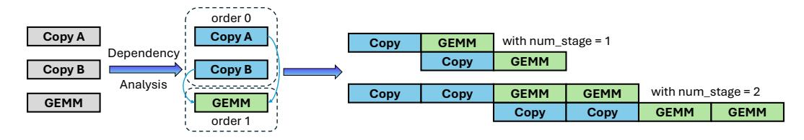

# 4.4 Software Defined Pipeline

TileLang employs an automated software pipeline inference mechanism to analyze dependencies among computational blocks (e.g., Copy and GEMM in this case) and to generate a structured pipeline schedule that maximizes parallelism while preserving correct execution order. In particular, the mechanism interleaves Copy tasks with other compute-intensive operations to reduce idle time, and when opportunities for asynchronous processing are detected, it automatically maps these tasks onto available hardware resources for concurrent execution. Consequently, TileLang can only expose a single num\_stages interface to users, significantly simplifying the process. However, we also allow users to explicitly provide information about the order and stages if needed.

Fig. 11. Software pipeline scheduling in TileLang. This illustration demonstrates how TileLang interleaves Copy and GEMM.

For the Ampere architecture, TileLang provides support for asynchronous memory copy operations using cp.async. The cp.async instruction facilitates fast data movement between global memory and shared memory, enabling overlapping of memory transfers with computation to improve performance. TileLang incorporates this capability by analyzing loop structures and automatically inserting cp.async instructions for eligible memory transfers. Additionally, TileLang ensures proper usage of cp.async.commit and cp.async.wait instructions to handle synchronization, guaranteeing data correctness. This optimization is particularly effective as it alleviates the pressure on register files and enables more efficient utilization of the hardware bandwidth.

In the Hopper architecture, two new features have been introduced. First, a new TMA unit is introduced as a dedicated hardware unit responsible for data copy between global memory and shared memory. Second, the PTX instruction set introduces a new wgmma instruction, which enables the execution of matrix multiplication (MMA) operations by a warpgroup (composed of four warps) to improve TensorCore utilization. Furthermore, the wgmma.mma\_async instruction is asynchronous. In addition, kernel optimization for the Hopper architecture commonly employs warp specialization, wherein threads are divided into producers and consumers. The producer threads use TMA to move data, while the consumer threads are responsible for the computation.

In TileLang, we automatically perform warp specialization optimization during the lowering process. Specifically, TileLang analyzes the buffer usage of all statements and determines their roles (producers or consumers). Based on this analysis, producers and consumers are divided into different execution paths according to threadIdx. To ensure computational correctness, TileLang leverages Live Variable Analysis to determine the appropriate synchronization points and inserts memory barriers (mbarriers) accordingly.

Asynchronous copy instructions and DMA support are also provided in the AMD CDNA architecture, which TileLang leverages through HIP-wrapped Copy primitives to support. Specifically, TileLang utilizes instructions such as s\_waitcnt lgkmcnt and buffer\_load\_dword lds to efficiently manage memory transfers. This integration enables the system to fully utilize the hardware's capabilities for overlapping data movement with computation, further improving pipeline performance and reducing idle time.

