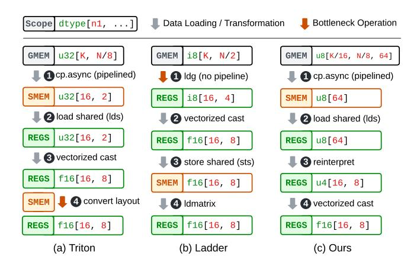
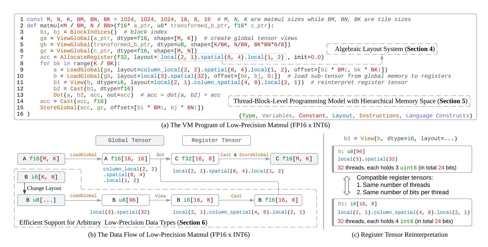
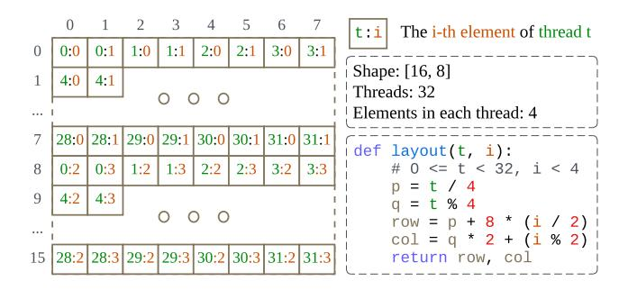
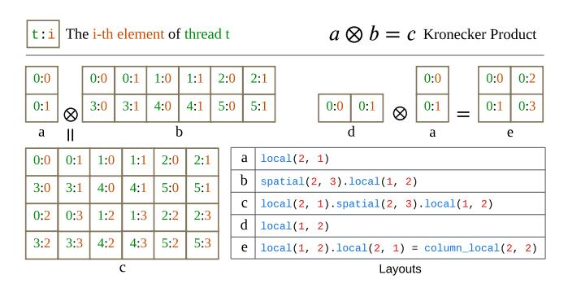
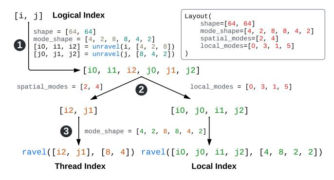
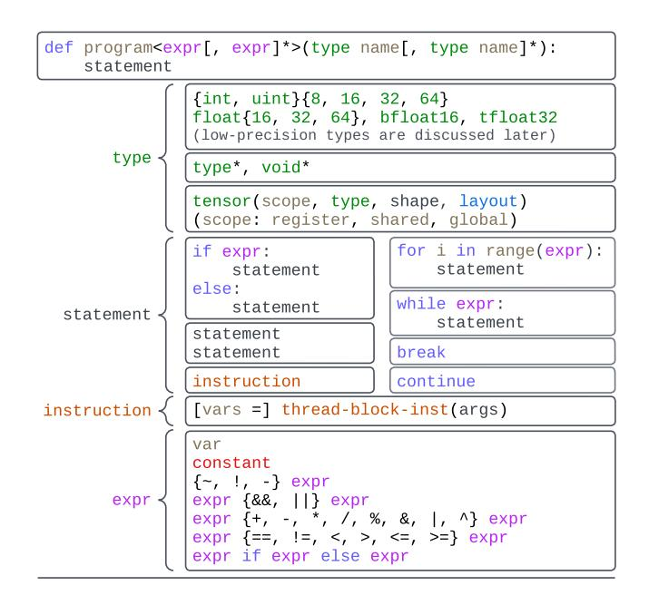
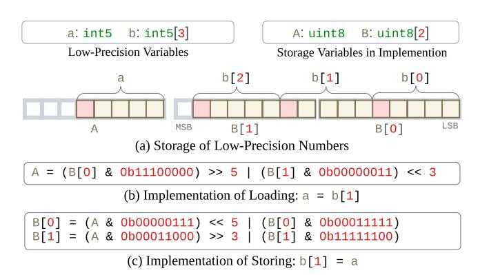

# 2 Background

### 2.1 LLM Serving and Quantization

LLM serving consists of two inference stages: prefill and decode. The prefill stage processes the input prompt to establish context, while the decode stage iteratively generates output tokens based on prior tokens. Key LLM layers include multi-head attention, feed-forward networks, and layer normalization [\[56\]](#page-15-6). Among these, matrix multiplications dominate computation time and memory consumption, making their optimization crucial for efficient LLM serving. Quantization [\[13,](#page-14-9) [20\]](#page-14-4) improves their efficiency by reducing model weights and activations to lower-precision formats, such as 8-bit or 4-bit integers. It reduces memory usage, bandwidth requirements, and inference latency while aiming to preserve model accuracy. While 4-bit quantization provides significant

computational savings, state-of-the-art methods [\[8,](#page-14-2) [11,](#page-14-3) [32\]](#page-15-1) still suffer from accuracy degradation. Increasing precision to 5-bit, 6-bit, or 7-bit quantization [\[3,](#page-13-0) [60\]](#page-16-2) can help preserve accuracy while maintaining efficiency, but these bit widths lack optimized GPU support, limiting their adoption. Current GPU architectures and software stacks primarily optimize for power-of-two bit widths (e.g., 4-bit and 8-bit), making arbitrary bit widths computationally inefficient. However, demand for flexible quantization is growing, as 4-bit can be too aggressive for some models while 8-bit wastes resources. Supporting a broader spectrum of bit widths enables better accuracy-efficiency trade-offs in LLM serving, driving the need for new kernel generation techniques that can efficiently handle non-standard low-precision formats (e.g., those with 3, 5, 6, 7 bit widths) on modern GPUs.

### 2.2 GPGPU Programming

General-Purpose GPU (GPGPU) programming enables parallel computation by organizing tasks within a structured execution and memory hierarchy [\[37\]](#page-15-7). The execution hierarchy begins with the thread, the smallest unit of execution, which performs instructions independently, using its own registers and local memory. Threads are grouped into thread blocks, which enable data sharing through shared memory and support synchronized execution. A grid consists of multiple independent thread blocks, enabling large-scale parallelism by organizing thousands or millions of threads. The GPU memory hierarchy comprises registers, shared memory, and global memory. Registers provide the fastest and threadprivate storage. Shared memory is accessible by all threads within a thread block and faster than global memory. Global memory is accessible across the entire grid with high latency. This structure allows for highly efficient parallel execution by leveraging both the execution and memory hierarchies.

#### 2.3 The GPGPU Languages and Compilers

2.3.1 GPGPU Programming Languages. GPGPU programming involves various languages and compilers that balance hardware abstraction with control. Low-level languages like SASS [\[42\]](#page-15-8) and CDNA3 [\[6\]](#page-14-10) offer direct hardware access for fine-grained optimizations but require deep architectural knowledge. Slightly higher in abstraction, NVIDIA's PTX [\[41\]](#page-15-9) serves as an intermediate representation that links high-level languages like CUDA [\[40\]](#page-15-10) to GPU-specific instructions while preserving optimization flexibility. High-level languages like CUDA [\[40\]](#page-15-10) and HIP [\[7\]](#page-14-11) simplify programming by extending the C programming language. Despite these languages, GPGPU programming remains complex. It is constrained by hardware-specific memory and computation hierarchies and requires workload-specific optimizations. To address these challenges, researchers have introduced higherlevel languages and compilers, classified into two categories: tile-oriented compilers, which simplify programming through

abstractions beyond CUDA [\[40\]](#page-15-10), and schedule-oriented compilers, which optimize computation-hardware mappings via declarative scheduling primitives.

2.3.2 Tile-Oriented Compilers. This type of compilers, such as Graphene [\[23\]](#page-14-12), Hidet [\[14\]](#page-14-13), and Triton [\[53\]](#page-15-3), enables programmers to write kernels directly, offering abstractions like tile types or tile-level task/element distribution to simplify the process. Triton [\[53\]](#page-15-3), for instance, introduces the tile programming model, where thread block behavior is defined programmatically, and tiles replace scalars as the basic data type. This approach combines programming simplicity with high-performance kernel generation, making Triton widely adopted. However, Triton lacks native support for low precision data types like uint4. Handling these types requires manually unpacking sub-byte data from larger storage types (e.g., uint32) [\[25\]](#page-14-14). Additionally, Triton does not expose the GPU memory hierarchy, limiting programmers' control over data loading and memory scope usage, which complicates performance optimization for low-precision kernels. These limitations result in inefficient low-precision kernel execution. Figure [1\(](#page-3-0)a) illustrates the inefficiencies in Triton-generated low-precision kernels, using a uint4 weight loading pipeline as an example. The process includes four steps: 1 weights are asynchronously copied from global memory to shared memory using pipelined cp.async instructions [\[26\]](#page-14-8); 2 shared memory data is loaded into registers; 3 unpacking and casting operations are performed; and 4 the register tensor layout is converted to meet the requirements of tensor core instructions. Among these, step 4 is a major bottleneck due to the reliance on shared memory for layout conversion, which incurs significant overhead.

2.3.3 Schedule-Oriented Compilers. Schedule-oriented compilers decouple computation from scheduling to optimize the computation-to-hardware mappings. Halide [\[46\]](#page-15-11) pioneered this approach, which was later extended by TVM [\[12\]](#page-14-7) and subsequent works [\[19,](#page-14-15) [26,](#page-14-8) [49,](#page-15-12) [57,](#page-15-13) [58,](#page-15-4) [67,](#page-16-4) [68\]](#page-16-5) in the domain of deep learning. Among them, Ladder [\[58\]](#page-15-4) is the first one to support low-precision computation by introducing dedicated primitives to pack low-precision data (e.g., 4-bit integers) into larger types (e.g., 8-bit integers). However, Ladder [\[58\]](#page-15-4) has two limitations. First, it cannot handle nonpower-of-two bit widths efficiently due to type-level packing, packing low-precision types into storage types. Second, its primitive-style scheduling prevents optimizations like software pipelining [\[26\]](#page-14-8), resulting in suboptimal performance. Figure [1](#page-3-0) (b) illustrates the weight loading process in Ladder's low-precision kernels. This process includes 1 loading weights from global memory to registers without pipelining; 2 vectorized casting; 3 storing the cast results in shared memory; and finally 4 using the ldmatrix instruction to load weights from shared memory to registers for subsequent tensor core operations. This lack of pipelining between weight loading and computation significantly hinders performance.

<span id="page-3-0"></span>

**Figure 1.** The weight loading pipeline of Triton, Ladder, and our approach. The tensors could be in global memory (GMEM), shared memory (SMEM), or registers (REGS).

### 3 System Overview

### 3.1 Key Ideas

Our work introduces a domain-specific language, Tilus, that provides fine-grained control over shared memory and registers, making it possible to program efficient low-precision deep learning kernels. Tilus supports low-precision data types with arbitrary bit widths ranging from 1 to 8, enabling efficient weight loading and computation. Figure 1 (c) shows the weight loading pipeline of a Tilus program, using uint4 as an example. It begins with **1** a pipelined asynchronous memory copy from global memory to shared memory, followed by **2** loading the register tensor from shared memory. Next, it 3 reinterprets the register tensor into a different data type and layout at no cost, before finally 4 performing vectorized casting. This pipeline achieves superior efficiency compared to the other methods in Figure 1, as it eliminates layout conversion (unlike Triton [53]) and incorporates pipelining (unlike Ladder [58]). More importantly, our pipeline is generic, making our work the first to seamlessly support arbitrary low-precision data types with bit widths ranging from 1 to 8 bits.

To achieve this efficiency, our design is built on several key ideas. A GPGPU Virtual Machine: every Tilus program is a program for an abstract GPGPU virtual machine (VM) that contains an instruction set. This decision stems from the need for greater flexibility in GPU programming. By abstracting GPU functionalities, such as memory loading and computation, into instructions, it becomes easier to add support for new architectural features while keeping support for older ones. A Thread-Block-Level Programming Model with Hierarchical Memory Spaces: The underlying VM explicitly exposes the GPU memory hierarchy — including registers, shared memory, and global memory — that existing solutions like Triton [53] abstract away. By granting programmers fine-grained control over data placement

and movement, our approach enables memory pipelining and eliminates unnecessary layout conversions, as shown in Figure 1. An Algebraic Layout System: we introduce an algebraic layout system that precisely defines how elements within a register tensor are distributed among threads. This structured representation simplifies the construction, analysis, and interpretation of tensor layouts. Notably, it enables seamless reinterpretation of low-precision register tensors into standard data types, as demonstrated in Step 3 of Figure 1(c). Native Support for Arbitrary Low-Precision **Data Types**: Tilus provides built-in support for a wide range of low-precision data types, including both signed and unsigned integers and floating-point numbers with bit widths from 1 to 8. Supported types include int2 to int8, uint1 to uint8, and float3 to float8, with arbitrary exponent and mantissa distribution for floating-point types. These innovations collectively enhance the programmability, efficiency, and flexibility of low-precision kernel development on modern GPUs. We chose not to extend Triton [53] because its programming model inherently abstracts away tensor layouts, making it incompatible with our approach of explicit layout control. Similarly, Ladder [58] relies on type-level packing, whereas Tilus employs tile-level reinterpretation, making the two fundamentally incompatible. The next section presents a Tilus-programmed example of low-precision matrix multiplication.

### 3.2 An Example of Tilus Program

Figure 2 illustrates a low-precision matrix multiplication in Tilus. Matrix multiplication is defined as  $C_{M,N} = A_{M,K} \times B_{K,N}$ , where A and B are float16 (a 16-bit floating-point number [27]) and int6 (a 6-bit signed integer), respectively. The kernel performs matrix multiplication with dimensions M, N, and K, where each thread block computes a BM  $\times$  BN tile of the C matrix (**Line 1**). Therefore, a grid of (M / BM, N / BN) thread blocks must be launched (**Line 2**). Inside the kernel, the BlockIndices instruction retrieves the thread block indices bi and bj (**Line 3**), which determine the offset (bi  $\times$  BM, bj  $\times$  BN) for computing the corresponding C tile. Three tensor views are created for the input and output tensors in global memory by specifying their addresses and shapes (**Line 4-6**). Then, a register tensor of type f16[16, 8] is created with the following layout:

It distributes  $16 \times 8 = 128$  elements across 32 threads. Each thread stores 4 elements (**Line** 7). This layout is *composed* of three *primitive layouts* (Section 4) and aligns with the C matrix layout used by the mma.m16n8k16 tensor core instruction in PTX [41]. The reduction loop over the k dimension (**Line** 8-13) repeatedly loads tiles of A and B from global memory into registers and accumulates their product. For each iteration, we first load a f16[16, 16] tile from global memory to register with a LoadGlobal instruction (**Line** 9). The layout of

<span id="page-4-0"></span>

Figure 2. This figure provides a concrete example of how the Tilus is used to implement low-precision matrix multiplication (FP16 × INT6). Figure (a) illustrates the virtual machine program, highlighting key features such as the algebraic layout system (Section 4), thread-block-level instructions (Section 6), and efficient low-precision data support. Figure (b) illustrates the kernel's data flow, emphasizing tensor movement across the memory hierarchy and intermediate operations such as tensor reinterpretation and type casting. This similar weight-loading strategy can be applied to arbitrary type widths (Section 7). Finally, Figure (c) demonstrates register tensor reinterpretation, showing how tensors with compatible bit distributions across threads (e.g., 24 bits per thread) can be efficiently reinterpreted into different data types and layouts.

the loaded register tile is specified and required by the tensor core instruction. The offset parameter specifies the position of the loaded tile within the global tensor. Loading tensor B, with data type int6, involves a more complex process, detailed in Section 7. We summarize the high-level ideas here. As a pre-processing step before launching the kernel, the weight tensor's layout in global memory is transformed from i6[K, N] to u8[K / BK, N / BN, BK \* BN \* 6 / 8], enabling efficient loading via the LoadGlobal instruction (the 'Change Layout' step in Figure 2 (b)). Next, in the kernel, the transformed tile is loaded into a register tensor (Line 10) and then reinterpreted to a tensor with a different data type and layout (Line 11). This reinterpretation is valid because both tensors are stored across the same number of threads (32), with each thread holding exactly 24 bits:  $3 \times u8$  or  $4 \times i6$ , as shown in Figure 2 (c). Following this, the 16 tensor is cast to an f16 tensor (Line 12), which is then fed to the tensor core to perform matrix-multiply accumulate (mma) (Line 13). Finally, the accumulation tensor is cast from f32 to f16 and stored in global memory (Line 14-15). For simplicity, this program does not use shared memory and omits optimizations like software pipelining [26]. Additionally, each k-iteration performs only a single tensor core instruction [40].

The following sections introduce the three core components of Tilus. Section 4 introduces an algebraic layout formulation to systematically define how the elements of a tile are stored in the registers among the block threads. Section 6 introduces the thread-block-level programming model with a hierarchical memory space exposed explicitly. Section 7 introduces the native support for arbitrary low-precision data types to address the growing demand for low-precision computation in deep learning workloads.

#### <span id="page-4-1"></span>4 Algebraic Layout System

Tilus exposes a hierarchical memory space to programmers, comprising global memory, shared memory, and registers. We need a way to model the mapping between the logical index of a tensor element and the location of the corresponding element in memory for all three memory scopes. Such a mapping is usually called the *layout* of the tensor. Of the memory scopes, the layout for register tensors is the most complicated. Figure 3 illustrates an example of the layout used by a tensor core instruction: mma.m16n8k8.f32.f16.f16.f32 D, A, B, C. It performs the following computation:  $D_{16.8} = A_{16.8}B_{8.8} + C_{16.8}$  where A, B, C, D are tensors stored in thread registers and distributed across the 32 threads in a warp. Since the elements are spread across different threads, we

<span id="page-5-0"></span>

**Figure 3.** Layout of operand A in a Tensor Core instruction. The operand, with  $16 \times 8$  elements, is distributed across 32 threads, with each thread storing four elements. The logical index of each element is determined by a layout function given the thread index t and the local element index i.

refer to this layout as a *distributed layout* [53]. Such a layout can be defined as a function f that maps a thread index t and a local index i to the logical index f(t,i) of the tensor element. For example, the layout in Figure 3 can be represented as:

$$f(t,i) = (t/4 + i/2 \times 8, t \% 4 \times 2 + i \% 2)^{1}$$

Here, t ranges from 0 to 31, and i from 0 to 3. The function f(t, i) represents the logical index of the element stored in the local element i in thread t.

#### 4.1 Parameterized Primitive Layouts

<span id="page-5-2"></span>

|             | local(2, 3)<br>f(t, i) = (i / 3, i % 3) | Local Layout   |
|-------------|-----------------------------------------|----------------|
|             | spatial(2, 3)                           | Spatial Layout |
| 3:0 4:0 5:0 | f(t, i) = (t / 3, t % 3)                |                |

**Figure 4.** Two types of primitive layouts: local and spatial. A local layout stores all tile elements within a single thread, whereas a spatial layout distributes them across multiple threads, with each thread holding only a single element.

With the formal definition of layout, we introduce parameterized primitive layouts that serve as the fundamental building blocks of our layout algebra. Given a tile<sup>2</sup> with shape  $(n_1, n_2)$ , there are two primary ways to store it: (1) to store all  $n_1n_2$  elements in a single thread, or (2) to distribute all elements across  $n_1n_2$  threads, with each thread holding a single element. We refer to the first type as *local layouts*, denoted as local(n1, n2), and the second as *spatial layouts*, denoted as spatial(n1, n2). This concept naturally extends to tiles with arbitrary dimensions. Figure 4 illustrates these two primitive layouts. The local(2, 3) layout maps the *i*-th local element of thread *t* to the logical index (i/3, i% 3), while the spatial(2, 3) layout maps it to (t/3, t% 3). We

observe that the layouts for all common operators in LLMs can be constructed using these two primitive layouts. In the next section, we introduce the Kronecker product of layouts to construct more complex layouts.

#### 4.2 Kronecker Product

<span id="page-5-3"></span>

**Figure 5.** Examples of Kronecker products over layouts. In the figure, layout (c) is the product of layouts (a) and (b), while layout (e) is the product of layouts (d) and (a).

The layouts used in modern deep learning workloads, as well as those defined by hardware instructions, typically exhibit a hierarchical structure. Consider layout (c) in Figure 5 as an example. This layout has shape (4,6), storing 24 elements across 6 threads. Each thread holds four elements. We denote the four elements stored in each thread as  $a_0$ ,  $a_1$ ,  $a_2$ ,  $a_3$ . Comparing its first two rows with the last two, we observe a similar structure, except that the last two rows store elements in  $a_2$  and  $a_3$  instead of  $a_0$  and  $a_1$ . To model this structural invariance, layout (c) can be viewed as a *Kronecker product* of layouts (a) and (b), with each element in layout (a) representing a tile with layout (b). Indeed, layouts (a) and (b) can be multiplied to represent layout (c):

$$c(t,i) = a(t/6,i/2) \odot (2,6) + b(t\%6,i\%2),$$

where  $0 \le t < 6$ ,  $0 \le i < 4$ ,  $\odot$  denotes the element-wise product, and (2,6) represents the shape of layout (c). The Kronecker product can be generalized. Given two layouts f and g with the same number of dimensions, we define their Kronecker product,  $h = f \otimes g$  as

$$h(t,i) = f(t/T_q,i/N_q) \odot S_q + g(t \% T_q,i \% N_q),$$

where  $T_g$ ,  $N_g$ ,  $S_g$  represent the number of threads, the number of local elements per thread, and the shape of layout g, respectively. We can prove that this operation is *associative*, meaning that for any three layouts f, g, and h, the equality  $f \otimes (g \otimes h) = (f \otimes g) \otimes h$  holds. However, the operation is not commutative, meaning that, in general,  $f \otimes g \neq g \otimes f$ . Spatial and local layouts follow a row-major ordering for threads and local elements, respectively. Using this operation, we can construct their column-major counterparts, column\_spatial(...) and column\_local(...)

<span id="page-5-1"></span><sup>&</sup>lt;sup>2</sup>We use the terms *tile* and *tensor* interchangeably.

as demonstrated by layout (e) in Figure 5. Returning to the tensor core instruction layout in Figure 3, it can be expressed as a Kronecker product local(2, 1).spatial(8, 4).local(1, 2). We can also define its inverse operation. If  $h=f\otimes g$ , we define f=h/g as the result of dividing layout h by layout g. For example, dividing local(2, 4) by local(1, 2) results in local(2, 2). We also refer to the Kronecker product as layout composition in some contexts.

### 5 Unified Layout Representation

<span id="page-6-1"></span>

Figure 6. Example of the unified layout representation.

We use a unified representation for all layouts of register tensors in Tilus. This representation gives each layout four attributes: shape, mode\_shape, spatial\_modes, and local\_modes. The shape is a sequence of integers that defines the shape of the register tensor. We can split each dimension of the register tensor into some sub-dimensions (we call them mode following prior work [23]) and concatenate these sub-dimensions to get the mode\_shape. Then we use spatial\_modes and local\_modes to specify the sub-dimensions assigned to spatial threads and to the local storage of each thread. The dimension split-distribute-merge method uniquely defines a register layout.

Figure 6 shows an example of a layout and how we map the logical index of a register tensor element to the pair of thread\_index and local\_index. There are three steps: 1) split dimensions, 2) distribute sub-dimensions; and 3) merge sub-dimensions. Given a logical index [i, j], we first 1 split each index into the indices of its sub-dimensions (i.e., [i0, i1, i2] for i and [j0, j1, j2] for j) with the unravel operation. After that, we 2 distribute the sub-dimension indices to get the indices for spatial threads (i.e., [i2, j1]) and local storage ([i0, j0, i1, j2]). Finally, we 3 convert the multi-dimensional indices for threads and local storage into linear index to get the thread index and local index. The ravel and unravel functions are used to convert between multi-dimensional index in a grid with given shape and its row-major linear index. For example: unravel(i, [4, 2, 8]) = [i / 16, i / 8 % 2, i % 8], and ravel([i2, j1], [8,4]) = i2 \* 4 + j1.

The layouts represented in this form are closed under the Kronecker product, meaning that the product result of two layouts in this form can also be represented in this form.

### <span id="page-6-0"></span>6 Thread-Block-Level Programming Model

Modern GPU programming models, such as PTX [41] and CUDA [40], define operations at the thread level, following the Single-Instruction-Multiple-Thread (SIMT) paradigm [1]. To simplify GPU programming, we adopt the thread-block-level programming model, defining operations at the granularity of thread blocks rather than individual threads. Additionally, building on the layout system introduced previously, we propose explicitly exposing the hierarchical memory structure in modern GPUs, enabling fine-grained memory control while reducing programming complexity. We refer to this model as Single-Instruction-Multiple-Block (SIMB). In this section, we will introduce the type system, program structure, and instruction set of Tilus.

### 6.1 State Space and Type System

Tilus supports three variable types. *Scalar variables* store individual values, such as integers (e.g., int32) or floating-point numbers (e.g., float16). *Pointer variables* store memory addresses rather than direct data values. *Tensor variables* represent multi-dimensional arrays, with types that specify their shape, element type, memory scope, and layout. Tensors reside in different memory scopes, including global memory, shared memory, and registers. The tensor layout determines how high-dimensional tensor elements are mapped to linear memory. All variables in Tilus operate at the thread-block level, meaning that all threads within a block collaboratively allocate and maintain their state.

#### 6.2 Program Structure and Control Flow

Figure 7 illustrates the structure of a Tilus program. Each program consists of a program name, a grid shape, a list of parameters, and a program body. The grid shape is specified as a list of expressions enclosed in <...>, where each expression is either a positive integer or an integer expression based on the program parameters. If the grid shape contains parameter-based expressions, its dimensions are determined at runtime based on the program's launch arguments. The program body consists of a sequence of statements, including if-else statements, range-based for-loops, and while-loops. Unlike other low-level virtual machines [41] or instruction set architectures (ISAs) [42], our virtual machine does not abstract control-flow statements into jump instructions. Instead, it retains high-level control structures to improve readability and ease of programming for human developers. In addition to control-flow statements, individual instructions can also serve as statements. Most of Tilus's functionality is implemented as instructions within its instruction set.

<span id="page-7-2"></span>**Table 1.** The thread-block-level instruction set of Tilus's virtual machine. Each instruction specifies an operation applied to the entire thread block. Parameters enclosed in [...] are optional. Instructions that return a new register tensor also have an in-place variant, which writes the result to an existing register tensor using the *out* parameter instead of creating a new tensor.

| Category                       | Instruction                                                           | Semantics                                                                                              |
|--------------------------------|-----------------------------------------------------------------------|--------------------------------------------------------------------------------------------------------|
| Indexing                       | indices = BlockIndices()                                              | Get the indices of the current thread block in the grid.                                               |
| Tensor Creation                | <pre>global_tensor = AllocateGlobal(dtype, shape, [layout])</pre>     | Allocate a tensor in <b>global memory</b> with the given data type, shape, and optional layout.        |
|                                | <pre>shared_tensor = AllocateShared(dtype, shape, [layout])</pre>     | Allocate a tensor in <b>shared memory</b> with the given data type, shape, and optional layout.        |
|                                | <pre>register_tensor = AllocateRegister(dtype, shape, [layout])</pre> | Allocate a tensor in <b>registers</b> with the given data type, shape, optional layout and init value. |
|                                | <pre>global_tensor = ViewGlobal(ptr, [dtype], shape, [layout])</pre>  | Create a tensor view in <b>global memory</b> given the pointer, data type, shape, and layout.          |
| Tensor<br>Transferring         | register_tensor = LoadGlobal(global_tensor, layout, offset)           | Load a tensor from <b>global memory</b> to register, given the layout and offset.                      |
|                                | register_tensor = LoadShared(shared_tensor, layout, offset)           | Load a tensor from <b>shared memory</b> to register, given the layout and offset.                      |
|                                | <pre>StoreGlobal(register_tensor, global_tensor, offset)</pre>        | Store a register tensor in the <b>global tensor</b> at the given offset.                               |
|                                | <pre>StoreShared(register_tensor, shared_tensor, offset)</pre>        | Store a register tensor in the <b>shared tensor</b> at the given offset.                               |
|                                | <pre>CopyAsync(shared_tensor, global_tensor)</pre>                    | Issue an asynchronous copy task from <b>global tensor</b> to <b>shared tensor</b> .                    |
|                                | CopyAsyncCommitGroup(), CopyAsyncWaitGroup(n)                         | Commit CopyAsync instructions as a group, or wait until there are only n ongoing groups.               |
| Register Tensor<br>Computation | c = {Add, Sub, Mul, Div, Mod}(a, b); b = Neg(a)                       | Arithmetic operations.                                                                                 |
|                                | b = Cast(a, dtype)                                                    | Cast a register tensor from one data type to another without changing the layout.                      |
|                                | b = View(a, [dtype], [layout])                                        | Reinterpret a register tensor with another data type and layout at no cost.                            |
|                                | d = Dot(a, b, c)                                                      | Compute the dot product: $d = dot(a, b) + c$ .                                                         |
| Control                        | Synchronize(), Exit()                                                 | Synchronize or exit the thread block execution.                                                        |
| Debug                          | Print(tensor)                                                         | Print a tensor to standard output.                                                                     |

<span id="page-7-1"></span>

**Figure 7.** A Tilus program contains parameters and a body. The body is a list of control-flow statements or block-level instructions. The majority of functionality, such as tensor allocation and computation, is provided by instructions.

#### 6.3 Thread-Block-Level Instruction Set

Each instruction in the Tilus's instruction set operates at the thread-block level rather than the thread level. Table 1 shows a list of the instructions in the instruction set, with the

signature of each instruction and a brief description of the instruction semantics. These instructions allocate tensors with specific data types, shapes, and layouts in designated memory spaces (e.g., global memory, shared memory, registers), transfer tensors between memory spaces, and perform computations or transformations on register tensors. The execution model of modern GPUs allows different warps to execute different instructions at the same time. Similarly, the execution of instructions in Tilus exhibits this behavior: certain subsequent instructions may begin execution before the current instruction completes, resulting in multiple block-level instructions being in-flight simultaneously. Generally, this behavior does not pose significant issues. However, an exception occurs when two instructions access the same region of shared or global memory, and the second instruction depends on the completion of the first. In such cases, a Synchronize instruction must be inserted to ensure all preceding instructions complete before subsequent ones execute. Instructions like Print are used for debugging.

### <span id="page-7-0"></span>7 Arbitrary Low-Precision Data Types

Modern processors use bytes (8 bits each) as the smallest processing unit. As a result, standard data types in modern programming languages typically have bit widths that are multiples of 8. However, the high computational and memory demands of LLMs make low-precision data types with less than 8 bits essential for reducing resource consumption. This section describes how Tilus efficiently supports low-precision data types with bit width from 1 to 8.

#### 7.1 Storage of Low-Precision Data

<span id="page-8-0"></span>

**Figure 8.** Compact storage and access of low-precision data. Figure (a) illustrates the use of the uint8 type to store low-precision data, where some elements may span two consecutive bytes. Figure (b–c) illustrate the implementation of loading and storing low-precision elements.

Since modern processors, including CPUs and GPUs, use bytes as the smallest unit for memory access and computation, we store low-precision data (fewer than 8 bits per element) compactly within bytes, as shown in Figure 8. Compact storage eliminates bit gaps between consecutive lowprecision values, which may result in a single value spanning two uint8 entries (e.g., b[1] in Figure 8). Bitwise operations are employed to extract, manipulate, and store low-precision values within packed byte arrays. To load a low-precision value, we first extract relevant bits using bitwise AND, adjust their position with bitwise SHIFT operations, and finally combine separated parts using bitwise OR if the value spans multiple bytes. Similarly, to store a low-precision value, we first clear the target bit positions using a bitwise mask, then insert the new value using bitwise OR while preserving the other bits. Low-precision data is cast to standard data types before arithmetic computations and is cast back afterward. While these methods enable support for arbitrary bit-width data types, they are often inefficient. They serve only as a fallback mechanism. More efficient handling of low-precision data is necessary for LLM serving.

#### <span id="page-8-3"></span>7.2 Efficient Low-Precision Support in LLMs

Low-precision kernels in LLMs typically follow two steps before computation: (1) loading weights into on-chip memory (registers or shared memory) from global memory, and (2) casting and de-quantizing low-precision weights to high-precision (e.g., float16). Efficient memory loading and casting are thus critical for performance. Efficient Low-Precision Weight Loading. With the low-precision support as discussed in the previous subsection, we can use the LoadGlobal instruction to load low-precision tensors. However, directly loading in this way is inefficient due to multiple bitwise

```
const M, N, K, BM, BN, BK = 1024, 1024, 1024, 16, 8, 16
def transform_b<K / BK, N / BN>(
    i6* b_ptr, u8* transformed_b_ptr
 3
 4
    ):
          bk, bj = BlockIndices()
b_in = ViewGlobal(b_ptr, dtype=i6, shape=[K, N])
b_out = ViewGlobal(transformed_b_ptr, dtype=u8,

 5
 6
7
 8
 q
10
              the register tensor b is stored in 32 threads, each
11
              thread holds 4 int6 elements (in total 24 bits)
12
              = LoadGlobal(b_in,
13
14
                 layout=column(2, 2).spatial(8, 4).local(1, 2),
offset=[bk*BK:, bj*BM:]
15
16
17
             reinterpret the tensor with uint8 data type and a
new layout. The 24 bits held by each thread will
18
             be reinterpreted into 3 uint8 elements.
19
           b = View(b, dtype=u8, layout=local(3).spatial(32))
20
21 )
           StoreGlobal(b, b_out, offset=[bk, bj, 0:])
```

**Figure 9.** Program to rearrange tensor B with data type int6, used in the "Change Layout" step of Figure 2 (b).

operations and non-coalesced memory accesses [40]. To address this, we transform the weight tensor layout in global memory to facilitate more efficient loading. Without transformation, loading a register tensor with dtype i6 and layout local(2, 1).column\_spatial(4, 8).local(2, 1) results in non-contiguous memory accesses, causing multiple memory access transactions [40]. Moreover, extracting low-precision bits requires additional bitwise operations. To optimize this, we identify a *compatible* tensor type with dtype uint8 and layout local(3).spatial(32), which retains the number of threads and thread local elements, while enabling efficient memory loading. As illustrated in Figure 9, we partition the weight tensor [K, N] into tiles of shape [BK, BN]. Each tile is reinterpreted from i6[BK, BN] to u8[BK \* BN \* 6 / 8] (Line 19) and stored contiguously (Line 20). This allows us to load tiles efficiently using the hardware-friendly instructions in Figure 2 (Line 10, 11), while also enabling pipelined asynchronous memory transfers like standard data types and avoiding any layout conversion that relies on shared memory. This method generalizes to loading any low-precision tensor with arbitrary layout. More formally, given a tensor with nbytes per thread and T threads, we reinterpret it using dtype uint8 and layout local(n2).spatial(T).local(n1), where  $n_1 = \gcd(n, 16) \text{ and } n_2 = n/\gcd(n_1, 16)^3.$ 

Efficient Casting. After loading, weights must be cast from low-precision to high-precision (e.g., float16) for computation, especially if hardware lacks native support for the given low-precision format. We leverage target-specific instructions for efficient vectorized casting. On CUDA, we use the PRMT (permute bytes in a 32-bit register), LOP3 (arbitrary logical operation on three inputs), and bitwise instructions to execute casting with minimal overhead, as all operations are performed within registers and do not require any communication between threads.

<span id="page-8-2"></span> $<sup>^{3}</sup>$ gcd(a, b) represents the greatest common divisor of a and b

