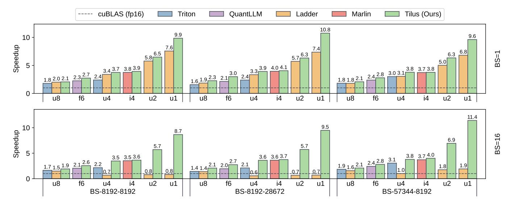
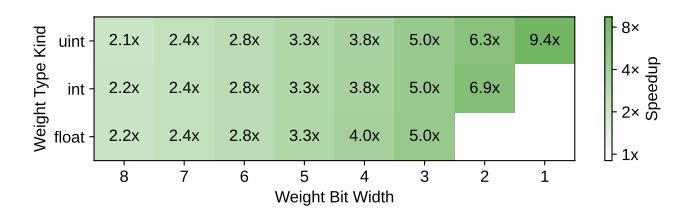
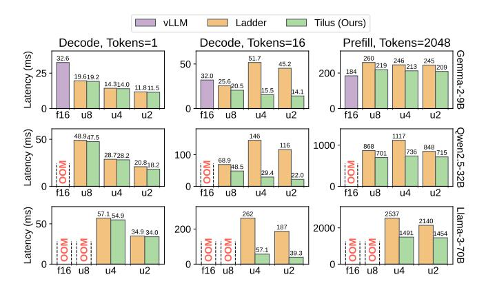
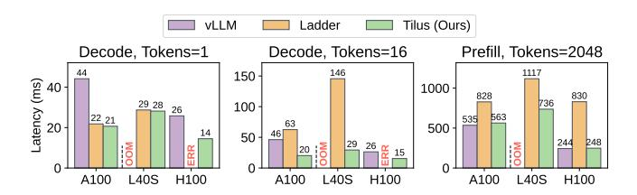
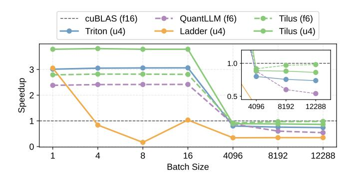

# 9 Evaluation

#### 9.1 Experimental Setup

Workloads. We benchmark three representative LLMs with varying model sizes: Gemma-2-9B [\[52\]](#page-15-14), QWen2.5-32B [\[62\]](#page-16-6), and Llama-3.3-70B-Instruct [\[22\]](#page-14-17). Both the prefill and decode stages are evaluated. For operator-level analysis, we focus on matrix multiplication kernels extracted from these models. Tilus supports all kernels supported by Triton in principle, but we focus on quantized matmul in this work.

Baselines. We compare our approach, Tilus, against the vendor library cuBLAS [\[39\]](#page-15-15), state-of-the-art DL compilers Triton [\[53\]](#page-15-3) and Ladder [\[58\]](#page-15-4), and hand-crafted kernels QuantLLM [\[60\]](#page-16-2) and Marlin [\[21\]](#page-14-6). Auto-tuning for Triton [\[53\]](#page-15-3) and Ladder [\[58\]](#page-15-4) was enabled, while QuantLLM [\[60\]](#page-16-2) used its heuristic policy to select kernel hyperparameters. For end-to-end evaluations, we integrate our quantized kernels into the stateof-the-art LLM serving framework vLLM [\[29\]](#page-14-18) and compare them against vLLM [\[29\]](#page-14-18) and Ladder [\[58\]](#page-15-4) in end to end execution. The specific versions of the tools are: vLLM v0.5.3, Triton v3.1.0, bitblas v0.0.1.dev15 (Ladder), QuantLLM with commit 9802c5a, and Marlin v0.1.1.

Hardware Configuration. Experiments were primarily conducted on a server equipped with an NVIDIA L40S GPU (48 GiB), with GPU driver 565.57.01 and CUDA Toolkit 12.6.3. Benchmarks were also performed on NVIDIA A100 and H100 GPUs to demonstrate the general applicability of our approach across different hardware platforms.

Experimental Protocol. For operator experiments, each kernel was executed 50 times, while for model experiments, each model was executed 10 times. In both cases, latency was measured using CUDA Events [\[40\]](#page-15-10), and the median latency

Figure 10. Speedup of low-precision kernels in Triton, QuantLLM, Ladder, and Tilus (Ours) compared against the standard half-precision kernel from cuBLAS. Benchmarked data types include uint8 (u8), f6e3m2 (f6), int4 (i4), uint4 (u4), uint2 (u2), and uint1 (u1). Each workload (BS-N-K) corresponds to a matrix multiplication in Llama-3.3-70B, with batch sizes 1 and 16.

was reported. To eliminate artifacts from consecutive runs, the L2 cache was cleared before each execution.

#### 9.2 Performance of Low-Precision Kernels

A single virtual machine program template is implemented to support matrix multiplication with all quantized types, taking tile sizes as tunable hyperparameters. We denote the performance of this auto-tuned program as Tilus in the evaluation. Figure 10 compares the speedup of Triton [53], Ladder [58], QuantLLM [60], Marlin [21], and Tilus (ours) against cuBLAS [39] for various low-precision matrix multiplications: uint8 (u8), float6\_e3m2 (f6), uint4 (u4), int4 (i4), uint2 (u2), and uint1 (u1). While each baseline supports a limited set of quantized data types, Tilus consistently achieves speedups across all cases. For small batch sizes, the primary bottleneck is loading weights from global memory to registers for computation on SIMT or Tensor Cores. Triton struggles here due to costly layout conversions after weights are loaded into registers. Although changing layout in global memory could mitigate this, Triton's programming model lacks explicit layout control, making such optimizations infeasible. Ladder improves upon Triton by modifying data layouts in global memory, avoiding redundant conversions. However, it lacks critical optimizations such as software pipelining [26, 38], and its type-level packing limits efficient support for arbitrary bit widths, leading to underutilized memory bandwidth. Expert-crafted kernels from QuantLLM [60] and Marlin [21] are optimized for specific quantization schemes but lack flexibility and maintainability. In contrast, Tilus consistently outperforms all baselines using

a single parameterized Tilus program template, which efficiently supports a full range of quantization types through a well-abstracted programming model.

### 9.3 Arbitrary Data Type Support

**Figure 11.** Speedup of quantized matrix multiplication compared against the cuBLAS FP16 kernel. A full spectrum of quantized data types is evaluated.

Tilus supports low-precision matrix multiplications of the form matmul (A, B), where operand A can have data types with 32, 16, or 8 bits, and weight B supports a wide range of bit widths, from 32 bits down to 1 bit. Standard data types such as float32, float16, and int8 are supported, along with customized low-precision types with fewer than 8 bits, which include signed integers, unsigned integers, and floating-point formats with arbitrary exponent and mantissa distributions. Leveraging the algebraic layout system (Section 4 and 7.2), Tilus enables efficient memory access for low-precision data. Figure 11 illustrates the speedup achieved for the full spectrum of quantized weight data types: uint1 to uint8, int2 to int8, and float3 to float8. Representative exponent-mantissa distribution of floating-point data types such as e4m3, e3m3, e3m2, e2m2, e2m1, and e1m1 are chosen.

Each row represents the type kind (e.g., unsigned integer, signed integer or floating data type) while each column represents the bit width. Using matrix multiplication dimensions of BS=16, K=8192, and N=57344 the results demonstrate substantial speedups. These findings validate Tilus's effectiveness in supporting arbitrary low-precision types with high efficiency, making it a robust solution for low-precision computations in modern GPUs. Notably, all kernels are generated from the same program template by parameterizing tile sizes, which limits the required programming effort. There are around 200 configurations per operator, and it takes around one minute to compile. We used float16 as the activation data type in the experiment and we also support bfloat16 and int8.

#### 9.4 End-to-End Performance

**Figure 12.** End-to-end performance across representative LLMs. The first two columns correspond to the decode stage with 1 and 16 tokens, respectively, while the third column shows latency for the prefill stage with 2048 prompt tokens.

We evaluated the end-to-end performance of representative LLMs: Gemma-2-9B [52], OWen-2.5-32B [62], and Llama-3.3-70B [22], across both prefill and decode stages. The prefill stage processes all prompt tokens at once, generating the kv-cache for subsequent token generation. The decode stage then iteratively generates one token at a time. Prefill latency determines the time-to-first-token (TTFT), while decode latency impacts the speed of subsequent token generation. Both stages are critical for optimizing user experience and system utilization. Contiguous batching [29, 63] was used to efficiently batch multiple decode requests. Figure 12 shows the latency of both stages across these models. Our method consistently outperforms Ladder [58], particularly in the decode stage for batch sizes greater than one (middle column of Figure 12). Analysis of Ladder's generated kernels revealed suboptimal use of CUDA Cores for 1-15 tokens and Tensor Cores for 16 or more tokens, as key optimizations like software pipelining [26] and k-dimension parallelization [44] were not implemented, leading to poor performance. For the

prefill stage, quantized weights are decoded to float16, and computations are performed using standard f16xf16 matrix multiplication kernels, as computation becomes the bottleneck at this stage. Our efficient handling of quantized weight layouts ensures minimal overhead for decoding, contributing to the superior performance observed.

#### 9.5 Case Studies

**Figure 13.** End-to-end performance of the QWen2.5-30B model across NVIDIA A100, L40S, and H100 GPUs. The weight data types for vLLM, Ladder, and Tilus are float16, uint4, and uint4, respectively. OOM indicates out-of-memory error, and ERR indicates a runtime error.

9.5.1 Speedup over Different Hardware. We evaluate the end-to-end performance of the QWen2.5-30B model on NVIDIA A100, L40S, and H100 GPUs, which correspond to the Ampere, Ada Lovelace, and Hopper architectures, respectively. Figure 13 presents a performance comparison of vLLM [29] (float16), Ladder [58] (uint4), and Tilus (uint4, ours) across the decode and prefill stages. On the Hopper architecture (H100), Ladder is unable to generate valid kernels, leading to a CUDA error ('an illegal instruction was encountered'), which we denote as ERR in the figure. On the L40S GPU, vLLM [29] exceeds the available 48 GiB DRAM capacity, leading to out-of-memory (OOM) errors. In all other configurations, Tilus consistently outperforms Ladder across all GPUs and both processing stages, highlighting its robust performance and adaptability across architectures.

**Figure 14.** Speedup of quantized matmuls across different batch sizes from both prefill and decode stages.

9.5.2 Speedup over Different Batch Sizes. We analyze the relationship between speedup and batch size by benchmarking matrix multiplication performance under different batch sizes. For the decode stage, we evaluate batch sizes of 1, 4, 8, and 16, while for the prefill stage, we use batch sizes of 4096, 8192, and 12,288. The batch size corresponds to the number of tokens processed in one step. In the prefill stage, it equals the sum of sequence length of all requests, while in decode stage, it equals to the number of requests since each request only generates one token each time. Experiments are conducted on Llama-3.3-70B-Instruct [\[22\]](#page-14-17) model with quantized data types float6\_e3m2 (f6) and uint4 (u4), using = 8192 and = 57344. As shown in Figure [14,](#page-11-2) Tilus consistently outperforms baselines across all batch sizes that are used in both decode and prefill stages of LLM serving.

