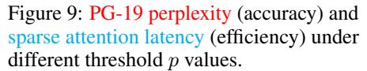
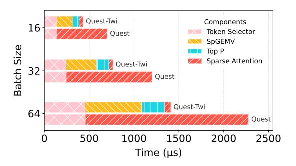

# 5 Evaluation

In this section, we perform quantitative experiments to demonstrate that equipping state-of-the-art (SOTA) sparse attention algorithms with Twilight could improve efficiency while preserving accuracy. We present the accuracy and efficiency results in [Section 5.1](#page-7-0) and [Section 5.2,](#page-7-1) respectively. At last, we perform ablation studies in [Section 5.3.](#page-9-0)

#### 5.1 Accuracy Evaluation

**Benchmarks and Models.** We evaluate Twilight on two types of benchmarks: long-context, which includes Longbench [1] and RULER [16], and medium-context (500 to 2k tokens), which includes GSM8K [13], COQA [14], and the perplexity on the PG-19 dataset [15]. We select three widely used models, Longchat-7B-v1.5-32k [52], LLaMA2-7B-Chat [53], and LLaMA-3.1-8B-Instruct [54] (128k context length), with two of them having long context ability  $\geq$  32k. They cover two mainstream attention implementations of multi-head attention (MHA) and group query attention (GQA) [54].

**Baselines.** We use two SOTA top-k sparse attention methods, Quest [9] and DS [12], and one SOTA non-top-k method, MagicPIG [30], as our baselines. Following the baselines, we do not apply any sparse methods to the first two layers to ensure fair comparison. For DS, we use the optimized configurations tuned for each model provided by its official repository. The hyperparameter p of Twilight is set to 0.95 for LLaMA-2/3 and 0.85 for Longchat, which will be explored in Section 5.3. Note that MagicPIG does not employ the budget mechanism but instead relies on two configurable parameters, K and L, which directly influence its accuracy. In our experiments, we adopt two standard configurations from the original MagicPIG paper. Due to the lack of official MagicPIG support for LLaMA-2, we exclude these experiments from our evaluation.

Results on Longbench. We comprehensively evaluate Twilight's long context ability on 12 different tasks chosen from Longbench, covering all task types, using two long-context models. For each top-k baseline, we vary the budget from 256 to 8192, and then apply Twilight to dynamically determine the budget. We also equip "Full" with Twilight, in which the Token Selector is a trivial one that keeps all tokens.

The results are shown in Table 2. In Longchat, the Twilight framework is able to outperform its original version by up to 5.7% in the score, while successfully pruning up to 98% of the redundant tokens overselected by the base algorithm. In LLaMA-3.1-8B-Instruct, Twilight achieves nearly zero accuracy loss (<1%) with a slight increase in budget usage. We hypothesize that this slight increase is due to the knowledge being more compressed in LLaMA-3.1.

Table 2: Average scores on 12 different tasks from Longbench. We report relative error changes (improvement or degradation) when integrating Twilight with each base algorithm. Detailed results are in Table 5 in Appendix C.

|          | Budget                 | Longchat-7B -v1.5-32k | LLaMA-3.1-8B -Instruct |  |
|----------|------------------------|--------------------------|---------------------------|--|
| Full     | 32k <b>Twilight</b> | 36.78 38.52 (+4.7%)   | 52.01 51.64 (-0.7%)    |  |
|          | 1 Willight             | 30.32 (14.770)           | 31.0+(-0.770)             |  |
| MagiaDIC | K=8, L=75              | -                        | 51.70                     |  |
| MagicPIG | K=10, L=150            | -                        | 51.32                     |  |
|          | 256                    | 31.26                    | 38.20                     |  |
|          | 1024                   | 36.85                    | 47.79                     |  |
| Quest    | 4096                   | 37.33                    | 50.79                     |  |
|          | 8192                   | 37.10                    | 51.44                     |  |
|          | Twilight               | 38.04 (+2.5%)            | 51.57 (+0.3%)             |  |
|          | 256                    | 35.32                    | 45.74                     |  |
|          | 1024                   | 35.96                    | 49.43                     |  |
| DS       | 4096                   | 36.31                    | 50.98                     |  |
|          | 8192                   | 36.62                    | 51.14                     |  |
|          | Twilight               | <b>38.71</b> (+5.7%)     | <b>51.73</b> (+1.2%)      |  |

**Results on RULER.** We further evaluate Twilight on the RULER benchmark using the LLaMA-3.1-8B-Instruct model, which incorporates specialized tests including CWE/FWE for comprehensive non-retrieval accuracy evaluation. As presented in Table 3, while the standard Quest implementation underperforms the non-top-k approaches, DS demonstrates surprisingly competitive results. When enhanced with Twilight, both variants show significant improvements: Quest-Twi achieves performance comparable to the SOTA non-top-k method MagicPIG, while DS-Twi establishes new record-breaking performance, surpassing all existing methods.

**Results on Medium-Context Tasks.** We then demonstrate that the Twilight Pruner itself does not negatively impact performance on two zero-shot generation tasks, GSM8K and COQA using the lm-harness framework [55], as well as one perplexity test on the PG-19 dataset. Since we are specifically evaluating the Pruner, we do not integrate Twilight into the baseline models. All the baselines use a budget of 128, which is comparable to the budget after Twilight's pruning. The results in Table 4 show that Twilight outperforms Quest and DS by significant margins, with nearly zero loss compared to full attention.

#### **5.2** Efficiency Evaluation

**Datasets.** We evaluate the efficiency of Twilight on both the self-attention operator and the end-to-end decoding stage on a single A100 GPU. We use Longbench, from which we select three different

Table 3: Average scores on RULER.

|          |             |       |       |       |       | •     |
|----------|-------------|-------|-------|-------|-------|-------|
|          | Budget      | 16k   | 32k   | 64k   | 96k   | Avg.  |
| Full     | 100%        |       |       |       | 85.23 |       |
|          | Twilight    | 93.13 | 89.10 | 84.64 | 83.10 | 87.49 |
| MagicPIG | K=8, L=75   | 92.22 | 89.37 | 84.07 | 82.58 | 87.06 |
| MagicPiG | K=10, L=150 | 91.38 | 88.20 | 83.34 | 82.02 | 86.23 |
|          | 4%          | 79.35 | 79.8  | 78.64 | 73.22 | 77.75 |
| Quest    | 8%          | 87.31 | 83.06 | 80.82 | 75.28 | 81.62 |
|          | Twilight    | 91.53 | 87.97 | 84.12 | 82.96 | 86.65 |
| DS       | 4%          | 92.04 | 88.11 | 84.43 | 82.56 | 86.79 |
|          | 8%          | 92.89 | 88.70 | 84.39 | 82.72 | 87.18 |
|          | Twilight    | 93.54 | 89.24 | 85.91 | 82.81 | 87.88 |

Table 4: Results on 3 medium-context benchmarks.

| G                      | SM8K(flexible/strict | )↑ COQA(em/f1)↑ PO | 3-19 Perplexity↓ |
|------------------------|----------------------|--------------------|------------------|
|                        | Ll                   | LaMA-2-7B-Chat     |                  |
| Full                   | 0.2290/0.2282        | 0.5935/0.7511      | 7.503            |
| Quest                  | 0.0523/0.0508        | 0.5710/0.7425      | 14.15            |
| DS                     | 0.2191/0.2190        | 0.5855/0.7401      | 7.622            |
| Twilight               | 0.2153/0.2115        | 0.6088/0.7642      | 7.600            |
| (Twilight Avg. Budget) | 90.82                | 91.86              | 102.58           |
|                        | LLa                  | MA-3.1-8B-Instruct |                  |
| Full                   | 0.7726/0.7475        | 0.6363/0.7882      | 7.490            |
| Quest                  | 0.3639/0.3533        | 0.6007/0.7554      | 19.00            |
| DS                     | 0.6194/0.6027        | 0.6455/0.7964      | 7.967            |
| Twilight               | 0.7771/0.7604        | 0.6325/0.7869      | 7.529            |
| (Twilight Avg. Budget) | 112.40               | 86.85              | 110.98           |
|                        |                      |                    |                  |

Figure 7: Latencies and speedups of self-attention at different sequence lengths and batch sizes.

types of tasks: Qasper [56] for QA, GovReport [57] for summarization, and LCC [58] for coding. We use prompts ranging from 10k to 30k tokens for evaluation. Given that Twilight is designed for deploying sparse attention in LLM serving systems, we use batch inference in our experiments.

**Baselines and Implementation Details.** We compare our methods with the following baselines: PyTorch's scaled-dot-product-attention (SDPA), with **FlashAttention2** (FA2) [39] and Memory-Efficient Attention [59] as the backends; **FlashInfer** [47], a high-performance kernel library for LLM serving; **Quest**, which achieves SOTA runtime performance among sparse attention methods. We integrate Twilight with both FlashInfer and Quest, resulting in **FlashInfer-Twi** and **Quest-Twi**. We modify the Quest kernels to support batch inference. We implement Twilight using both CUDA and OpenAI Triton [60], following the technical details described in Section 4.2.

**Self-Attention Speedup.** We first evaluate the speedups on the self-attention operator across different batch sizes and sequence lengths. As Figure 7 shows, FlashInfer-Twi and Quest-Twi achieve speedups up to  $6.5\times$  and  $15.8\times$  compared with FlashAttention2. Moreoever, they accelerate the respective base algorithms FlashInfer and Quest by  $2.4\times$  and  $1.4\times$ .

**End-to-End Decoding Speedup.** We evaluate end-to-end decoding with batch sizes ranging from 32 to 256 for various serving scenarios. Figure 8 illustrates that Quest-Twi achieves up to a  $3.9 \times$  speedup compared with FlashInfer, and a  $1.35 \times$  speedup compared to Quest without Twilight.

Figure 8: Time-Per-Output-Token (TPOT) improvements in end-to-end serving scenarios.

Figure 10: Time breakdown of self-attention. At batch size 64, Quest-Twi outperforms Quest by about  $2\times$ .

#### 5.3 Ablation Study

**Sensitivity to Threshold** p. Notably, although we introduce the threshold p in order to get rid of the budget k, we argue that p is a more reasonable and tunable hyperparameter. This is because p represents the accumulated probability, which is less influenced by the different distributions that may occur for different heads/layers/queries. In contrast, k is highly sensitive to different distributions, as illustrated in Figure 1. This allows us to simply tune p for a fixed model, in a way such as calibrating with a small dataset.

For the impact of p on model accuracy, we test the perplexity on the PG-19 dataset when using different thresholds p. For the impact on runtime efficiency, the p value directly controls the pruning aggressiveness and affects the attention time via the pruned token number. We evaluate the sparse attention kernel speed after pruned on the TrivialQA dataset. As Figure 9 shows, the accuracy and efficiency strike a balance at  $p\approx 0.85$ , making us choose p=0.85 for Longchat-7B-v1.5-32k.

**Time Breakdown for Twilight.** Given Twilight's hierarchical architecture, which comprises three distinct components, it is insightful to analyze the execution time breakdown to further understand the benefit and cost. Figure 10 illustrates the time breakdown for different batch sizes in a 32k retrieval task. In this scenario, Quest employs a budget of 8192 (1/4 sparsity), while Twilight further prunes this budget down to 256. The breakdown aligns closely with the theoretical cost model presented in Section 4.3, demonstrating that Twilight significantly reduces the time required for the sparse attention kernel while introducing minor overheads.

#### 6 Conclusion

In this paper, we first highlight that existing top-k sparse attention methods struggle to find optimal budgets due to the dynamic nature of attention weight distributions. We then introduce Twilight, a framework with a hierarchical select-then-prune architecture that leverages top-p sampling to address this issue. Twilight can adaptively prune up to 98% tokens, resulting in a  $15.4\times$  speedup for the self-attention operator and a  $3.9\times$  reduction in the end-to-end per-token latency. Comparing to the base sparse attention algorithm it is applied to, Twilight offers an additional  $1.4\times$  speedup. Our work underscores the importance of adaptive attention sparsity, and paves a promising way for future research on sparse attention mechanisms.

#### Acknowledgment

The authors thank the anonymous reviewers for their valuable suggestions, Yilong Zhao for helping us on kernel optimization, and the Tsinghua IDEAL group members for constructive discussion. Mingyu Gao is the corresponding author.

