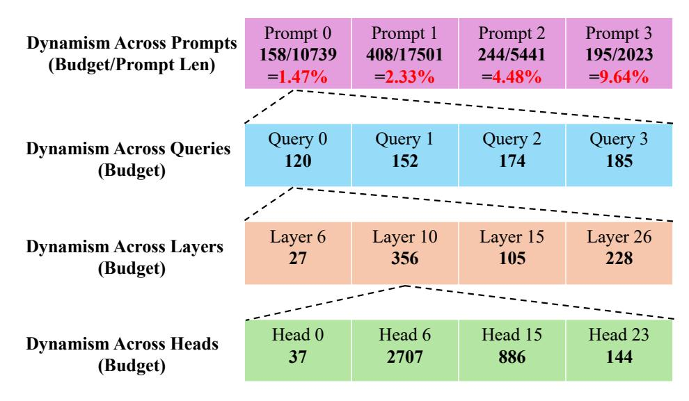
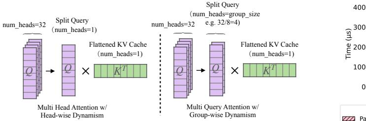

# References

- [1] Yushi Bai, Xin Lv, Jiajie Zhang, Hongchang Lyu, Jiankai Tang, Zhidian Huang, Zhengxiao Du, Xiao Liu, Aohan Zeng, Lei Hou, Yuxiao Dong, Jie Tang, and Juanzi Li. LongBench: A bilingual, multitask benchmark for long context understanding. In *Proceedings of the 62nd Annual Meeting of the Association for Computational Linguistics (Volume 1: Long Papers)*, pages 3119–3137, Bangkok, Thailand, August 2024. Association for Computational Linguistics.
- [2] Naman Jain, King Han, Alex Gu, Wen-Ding Li, Fanjia Yan, Tianjun Zhang, Sida Wang, Armando Solar-Lezama, Koushik Sen, and Ion Stoica. LiveCodeBench: Holistic and contamination free evaluation of large language models for code. *arXiv preprint 2403.07974*, 2024.
- [3] An Yang, Bowen Yu, Chengyuan Li, Dayiheng Liu, Fei Huang, Haoyan Huang, Jiandong Jiang, Jianhong Tu, Jianwei Zhang, Jingren Zhou, Junyang Lin, Kai Dang, Kexin Yang, Le Yu, Mei Li, Minmin Sun, Qin Zhu, Rui Men, Tao He, Weijia Xu, Wenbiao Yin, Wenyuan Yu, Xiafei Qiu, Xingzhang Ren, Xinlong Yang, Yong Li, Zhiying Xu, and Zipeng Zhang. Qwen2.5-1M technical report. *arXiv preprint 2501.15383*, 2025.
- [4] Gemini Team, Petko Georgiev, Ving Ian Lei, Ryan Burnell, Libin Bai, Anmol Gulati, Garrett Tanzer, Damien Vincent, Zhufeng Pan, Shibo Wang, Soroosh Mariooryad, Yifan Ding, Xinyang Geng, Fred Alcober, Roy Frostig, Mark Omernick, Lexi Walker, Cosmin Paduraru, Christina Sorokin, Andrea Tacchetti, Colin Gaffney, Samira Daruki, Olcan Sercinoglu, Zach Gleicher, Juliette Love, Paul Voigtlaender, Rohan Jain, Gabriela Surita, Kareem Mohamed, Rory Blevins, Junwhan Ahn, Tao Zhu, Kornraphop Kawintiranon, Orhan Firat, Yiming Gu, Yujing Zhang, Matthew Rahtz, Manaal Faruqui, Natalie Clay, Justin Gilmer, JD Co-Reyes, Ivo Penchev, Rui Zhu, Nobuyuki Morioka, Kevin Hui, Krishna Haridasan, Victor Campos, Mahdis Mahdieh, Mandy Guo, Samer Hassan, Kevin Kilgour, Arpi Vezer, Heng-Tze Cheng, Raoul de Liedekerke, Siddharth Goyal, Paul Barham, DJ Strouse, Seb Noury, Jonas Adler, Mukund Sundararajan, Sharad Vikram, Dmitry Lepikhin, Michela Paganini, Xavier Garcia, Fan Yang, Dasha Valter, Maja Trebacz, Kiran Vodrahalli, Chulayuth Asawaroengchai, Roman Ring, Norbert Kalb, Livio Baldini Soares, Siddhartha Brahma, David Steiner, Tianhe Yu, Fabian Mentzer, Antoine He, Lucas Gonzalez, Bibo Xu, Raphael Lopez Kaufman, Laurent El Shafey, Junhyuk Oh, Tom Hennigan, George van den Driessche, Seth Odoom, Mario Lucic, Becca Roelofs, Sid Lall, Amit Marathe, Betty Chan, Santiago Ontanon, Luheng He, Denis Teplyashin, Jonathan Lai, Phil Crone, Bogdan Damoc, Lewis Ho, Sebastian Riedel, Karel Lenc, Chih-Kuan Yeh, Aakanksha Chowdhery, Yang Xu, Mehran Kazemi, Ehsan Amid, Anastasia Petrushkina, Kevin Swersky, Ali Khodaei, Gowoon Chen, Chris Larkin, Mario Pinto, Geng Yan, Adria Puigdomenech Badia, Piyush Patil, Steven Hansen, Dave Orr, Sebastien M. R. Arnold, Jordan Grimstad, Andrew Dai, Sholto Douglas, Rishika Sinha, Vikas Yadav, Xi Chen, Elena Gribovskaya, Jacob Austin, Jeffrey Zhao, Kaushal Patel, Paul Komarek, Sophia Austin, Sebastian Borgeaud, Linda Friso, Abhimanyu Goyal, Ben Caine, Kris Cao, Da-Woon Chung, Matthew Lamm, Gabe Barth-Maron, Thais Kagohara, Kate Olszewska, Mia Chen, Kaushik Shivakumar, Rishabh Agarwal, Harshal Godhia, Ravi Rajwar, Javier Snaider, Xerxes Dotiwalla, Yuan Liu, Aditya Barua, Victor Ungureanu, Yuan Zhang, Bat-Orgil Batsaikhan, Mateo Wirth, James Qin, Ivo Danihelka, Tulsee Doshi, Martin Chadwick, Jilin Chen, Sanil Jain, Quoc Le, Arjun Kar, Madhu Gurumurthy, Cheng Li, Ruoxin Sang, Fangyu Liu, Lampros Lamprou, Rich Munoz, Nathan Lintz, Harsh Mehta, Heidi Howard, Malcolm Reynolds, Lora Aroyo, Quan Wang, Lorenzo Blanco, Albin Cassirer, Jordan Griffith, Dipanjan Das, Stephan Lee, Jakub Sygnowski, Zach Fisher, James Besley, Richard Powell, Zafarali Ahmed, Dominik Paulus, David Reitter, Zalan Borsos, Rishabh Joshi, Aedan Pope, Steven Hand, Vittorio Selo, Vihan Jain, Nikhil Sethi, Megha Goel, Takaki Makino, Rhys May, Zhen Yang, Johan Schalkwyk, Christina Butterfield, Anja Hauth, Alex Goldin, Will Hawkins, Evan Senter, Sergey Brin, Oliver Woodman, Marvin Ritter, Eric Noland, Minh Giang, Vijay Bolina, Lisa Lee, Tim Blyth, Ian Mackinnon, Machel Reid, Obaid Sarvana, David Silver, Alexander Chen, Lily Wang, Loren Maggiore, Oscar Chang, Nithya Attaluri, Gregory Thornton, Chung-Cheng Chiu, Oskar Bunyan, Nir Levine, Timothy Chung, Evgenii Eltyshev, Xiance Si, Timothy Lillicrap, Demetra Brady, Vaibhav Aggarwal, Boxi Wu, Yuanzhong Xu, Ross McIlroy, Kartikeya Badola, Paramjit Sandhu, Erica Moreira, Wojciech Stokowiec, Ross Hemsley, Dong Li, Alex Tudor, Pranav Shyam, Elahe Rahimtoroghi, Salem Haykal, Pablo Sprechmann, Xiang Zhou, Diana Mincu, Yujia Li, Ravi Addanki, Kalpesh Krishna, Xiao Wu, Alexandre Frechette, Matan Eyal, Allan Dafoe, Dave

Lacey, Jay Whang, Thi Avrahami, Ye Zhang, Emanuel Taropa, Hanzhao Lin, Daniel Toyama, Eliza Rutherford, Motoki Sano, HyunJeong Choe, Alex Tomala, Chalence Safranek-Shrader, Nora Kassner, Mantas Pajarskas, Matt Harvey, Sean Sechrist, Meire Fortunato, Christina Lyu, Gamaleldin Elsayed, Chenkai Kuang, James Lottes, Eric Chu, Chao Jia, Chih-Wei Chen, Peter Humphreys, Kate Baumli, Connie Tao, Rajkumar Samuel, Cicero Nogueira dos Santos, Anders Andreassen, Nemanja Rakicevi ´ c, Dominik Grewe, Aviral Kumar, Stephanie Winkler, ´ Jonathan Caton, Andrew Brock, Sid Dalmia, Hannah Sheahan, Iain Barr, Yingjie Miao, Paul Natsev, Jacob Devlin, Feryal Behbahani, Flavien Prost, Yanhua Sun, Artiom Myaskovsky, Thanumalayan Sankaranarayana Pillai, Dan Hurt, Angeliki Lazaridou, Xi Xiong, Ce Zheng, Fabio Pardo, Xiaowei Li, Dan Horgan, Joe Stanton, Moran Ambar, Fei Xia, Alejandro Lince, Mingqiu Wang, Basil Mustafa, Albert Webson, Hyo Lee, Rohan Anil, Martin Wicke, Timothy Dozat, Abhishek Sinha, Enrique Piqueras, Elahe Dabir, Shyam Upadhyay, Anudhyan Boral, Lisa Anne Hendricks, Corey Fry, Josip Djolonga, Yi Su, Jake Walker, Jane Labanowski, Ronny Huang, Vedant Misra, Jeremy Chen, RJ Skerry-Ryan, Avi Singh, Shruti Rijhwani, Dian Yu, Alex Castro-Ros, Beer Changpinyo, Romina Datta, Sumit Bagri, Arnar Mar Hrafnkelsson, Marcello Maggioni, Daniel Zheng, Yury Sulsky, Shaobo Hou, Tom Le Paine, Antoine Yang, Jason Riesa, Dominika Rogozinska, Dror Marcus, Dalia El Badawy, Qiao Zhang, Luyu Wang, Helen Miller, Jeremy Greer, Lars Lowe Sjos, Azade Nova, Heiga Zen, Rahma Chaabouni, Mihaela Rosca, Jiepu Jiang, Charlie Chen, Ruibo Liu, Tara Sainath, Maxim Krikun, Alex Polozov, Jean-Baptiste Lespiau, Josh Newlan, Zeyncep Cankara, Soo Kwak, Yunhan Xu, Phil Chen, Andy Coenen, Clemens Meyer, Katerina Tsihlas, Ada Ma, Juraj Gottweis, Jinwei Xing, Chenjie Gu, Jin Miao, Christian Frank, Zeynep Cankara, Sanjay Ganapathy, Ishita Dasgupta, Steph Hughes-Fitt, Heng Chen, David Reid, Keran Rong, Hongmin Fan, Joost van Amersfoort, Vincent Zhuang, Aaron Cohen, Shixiang Shane Gu, Anhad Mohananey, Anastasija Ilic, Taylor Tobin, John Wieting, Anna Bortsova, Phoebe Thacker, Emma Wang, Emily Caveness, Justin Chiu, Eren Sezener, Alex Kaskasoli, Steven Baker, Katie Millican, Mohamed Elhawaty, Kostas Aisopos, Carl Lebsack, Nathan Byrd, Hanjun Dai, Wenhao Jia, Matthew Wiethoff, Elnaz Davoodi, Albert Weston, Lakshman Yagati, Arun Ahuja, Isabel Gao, Golan Pundak, Susan Zhang, Michael Azzam, Khe Chai Sim, Sergi Caelles, James Keeling, Abhanshu Sharma, Andy Swing, YaGuang Li, Chenxi Liu, Carrie Grimes Bostock, Yamini Bansal, Zachary Nado, Ankesh Anand, Josh Lipschultz, Abhijit Karmarkar, Lev Proleev, Abe Ittycheriah, Soheil Hassas Yeganeh, George Polovets, Aleksandra Faust, Jiao Sun, Alban Rrustemi, Pen Li, Rakesh Shivanna, Jeremiah Liu, Chris Welty, Federico Lebron, Anirudh Baddepudi, Sebastian Krause, Emilio Parisotto, Radu Soricut, Zheng Xu, Dawn Bloxwich, Melvin Johnson, Behnam Neyshabur, Justin Mao-Jones, Renshen Wang, Vinay Ramasesh, Zaheer Abbas, Arthur Guez, Constant Segal, Duc Dung Nguyen, James Svensson, Le Hou, Sarah York, Kieran Milan, Sophie Bridgers, Wiktor Gworek, Marco Tagliasacchi, James Lee-Thorp, Michael Chang, Alexey Guseynov, Ale Jakse Hartman, Michael Kwong, Ruizhe Zhao, Sheleem Kashem, Elizabeth Cole, Antoine Miech, Richard Tanburn, Mary Phuong, Filip Pavetic, Sebastien Cevey, Ramona Comanescu, Richard Ives, Sherry Yang, Cosmo Du, Bo Li, Zizhao Zhang, Mariko Iinuma, Clara Huiyi Hu, Aurko Roy, Shaan Bijwadia, Zhenkai Zhu, Danilo Martins, Rachel Saputro, Anita Gergely, Steven Zheng, Dawei Jia, Ioannis Antonoglou, Adam Sadovsky, Shane Gu, Yingying Bi, Alek Andreev, Sina Samangooei, Mina Khan, Tomas Kocisky, Angelos Filos, Chintu Kumar, Colton Bishop, Adams Yu, Sarah Hodkinson, Sid Mittal, Premal Shah, Alexandre Moufarek, Yong Cheng, Adam Bloniarz, Jaehoon Lee, Pedram Pejman, Paul Michel, Stephen Spencer, Vladimir Feinberg, Xuehan Xiong, Nikolay Savinov, Charlotte Smith, Siamak Shakeri, Dustin Tran, Mary Chesus, Bernd Bohnet, George Tucker, Tamara von Glehn, Carrie Muir, Yiran Mao, Hideto Kazawa, Ambrose Slone, Kedar Soparkar, Disha Shrivastava, James Cobon-Kerr, Michael Sharman, Jay Pavagadhi, Carlos Araya, Karolis Misiunas, Nimesh Ghelani, Michael Laskin, David Barker, Qiujia Li, Anton Briukhov, Neil Houlsby, Mia Glaese, Balaji Lakshminarayanan, Nathan Schucher, Yunhao Tang, Eli Collins, Hyeontaek Lim, Fangxiaoyu Feng, Adria Recasens, Guangda Lai, Alberto Magni, Nicola De Cao, Aditya Siddhant, Zoe Ashwood, Jordi Orbay, Mostafa Dehghani, Jenny Brennan, Yifan He, Kelvin Xu, Yang Gao, Carl Saroufim, James Molloy, Xinyi Wu, Seb Arnold, Solomon Chang, Julian Schrittwieser, Elena Buchatskaya, Soroush Radpour, Martin Polacek, Skye Giordano, Ankur Bapna, Simon Tokumine, Vincent Hellendoorn, Thibault Sottiaux, Sarah Cogan, Aliaksei Severyn, Mohammad Saleh, Shantanu Thakoor, Laurent Shefey, Siyuan Qiao, Meenu Gaba, Shuo yiin Chang, Craig Swanson, Biao Zhang, Benjamin Lee, Paul Kishan Rubenstein, Gan Song, Tom Kwiatkowski, Anna Koop, Ajay Kannan, David Kao, Parker Schuh, Axel Stjerngren, Golnaz Ghiasi, Gena Gibson, Luke

Vilnis, Ye Yuan, Felipe Tiengo Ferreira, Aishwarya Kamath, Ted Klimenko, Ken Franko, Kefan Xiao, Indro Bhattacharya, Miteyan Patel, Rui Wang, Alex Morris, Robin Strudel, Vivek Sharma, Peter Choy, Sayed Hadi Hashemi, Jessica Landon, Mara Finkelstein, Priya Jhakra, Justin Frye, Megan Barnes, Matthew Mauger, Dennis Daun, Khuslen Baatarsukh, Matthew Tung, Wael Farhan, Henryk Michalewski, Fabio Viola, Felix de Chaumont Quitry, Charline Le Lan, Tom Hudson, Qingze Wang, Felix Fischer, Ivy Zheng, Elspeth White, Anca Dragan, Jean baptiste Alayrac, Eric Ni, Alexander Pritzel, Adam Iwanicki, Michael Isard, Anna Bulanova, Lukas Zilka, Ethan Dyer, Devendra Sachan, Srivatsan Srinivasan, Hannah Muckenhirn, Honglong Cai, Amol Mandhane, Mukarram Tariq, Jack W. Rae, Gary Wang, Kareem Ayoub, Nicholas FitzGerald, Yao Zhao, Woohyun Han, Chris Alberti, Dan Garrette, Kashyap Krishnakumar, Mai Gimenez, Anselm Levskaya, Daniel Sohn, Josip Matak, Inaki Iturrate, Michael B. Chang, Jackie Xiang, Yuan Cao, Nishant Ranka, Geoff Brown, Adrian Hutter, Vahab Mirrokni, Nanxin Chen, Kaisheng Yao, Zoltan Egyed, Francois Galilee, Tyler Liechty, Praveen Kallakuri, Evan Palmer, Sanjay Ghemawat, Jasmine Liu, David Tao, Chloe Thornton, Tim Green, Mimi Jasarevic, Sharon Lin, Victor Cotruta, Yi-Xuan Tan, Noah Fiedel, Hongkun Yu, Ed Chi, Alexander Neitz, Jens Heitkaemper, Anu Sinha, Denny Zhou, Yi Sun, Charbel Kaed, Brice Hulse, Swaroop Mishra, Maria Georgaki, Sneha Kudugunta, Clement Farabet, Izhak Shafran, Daniel Vlasic, Anton Tsitsulin, Rajagopal Ananthanarayanan, Alen Carin, Guolong Su, Pei Sun, Shashank V, Gabriel Carvajal, Josef Broder, Iulia Comsa, Alena Repina, William Wong, Warren Weilun Chen, Peter Hawkins, Egor Filonov, Lucia Loher, Christoph Hirnschall, Weiyi Wang, Jingchen Ye, Andrea Burns, Hardie Cate, Diana Gage Wright, Federico Piccinini, Lei Zhang, Chu-Cheng Lin, Ionel Gog, Yana Kulizhskaya, Ashwin Sreevatsa, Shuang Song, Luis C. Cobo, Anand Iyer, Chetan Tekur, Guillermo Garrido, Zhuyun Xiao, Rupert Kemp, Huaixiu Steven Zheng, Hui Li, Ananth Agarwal, Christel Ngani, Kati Goshvadi, Rebeca Santamaria-Fernandez, Wojciech Fica, Xinyun Chen, Chris Gorgolewski, Sean Sun, Roopal Garg, Xinyu Ye, S. M. Ali Eslami, Nan Hua, Jon Simon, Pratik Joshi, Yelin Kim, Ian Tenney, Sahitya Potluri, Lam Nguyen Thiet, Quan Yuan, Florian Luisier, Alexandra Chronopoulou, Salvatore Scellato, Praveen Srinivasan, Minmin Chen, Vinod Koverkathu, Valentin Dalibard, Yaming Xu, Brennan Saeta, Keith Anderson, Thibault Sellam, Nick Fernando, Fantine Huot, Junehyuk Jung, Mani Varadarajan, Michael Quinn, Amit Raul, Maigo Le, Ruslan Habalov, Jon Clark, Komal Jalan, Kalesha Bullard, Achintya Singhal, Thang Luong, Boyu Wang, Sujeevan Rajayogam, Julian Eisenschlos, Johnson Jia, Daniel Finchelstein, Alex Yakubovich, Daniel Balle, Michael Fink, Sameer Agarwal, Jing Li, Dj Dvijotham, Shalini Pal, Kai Kang, Jaclyn Konzelmann, Jennifer Beattie, Olivier Dousse, Diane Wu, Remi Crocker, Chen Elkind, Siddhartha Reddy Jonnalagadda, Jong Lee, Dan Holtmann-Rice, Krystal Kallarackal, Rosanne Liu, Denis Vnukov, Neera Vats, Luca Invernizzi, Mohsen Jafari, Huanjie Zhou, Lilly Taylor, Jennifer Prendki, Marcus Wu, Tom Eccles, Tianqi Liu, Kavya Kopparapu, Francoise Beaufays, Christof Angermueller, Andreea Marzoca, Shourya Sarcar, Hilal Dib, Jeff Stanway, Frank Perbet, Nejc Trdin, Rachel Sterneck, Andrey Khorlin, Dinghua Li, Xihui Wu, Sonam Goenka, David Madras, Sasha Goldshtein, Willi Gierke, Tong Zhou, Yaxin Liu, Yannie Liang, Anais White, Yunjie Li, Shreya Singh, Sanaz Bahargam, Mark Epstein, Sujoy Basu, Li Lao, Adnan Ozturel, Carl Crous, Alex Zhai, Han Lu, Zora Tung, Neeraj Gaur, Alanna Walton, Lucas Dixon, Ming Zhang, Amir Globerson, Grant Uy, Andrew Bolt, Olivia Wiles, Milad Nasr, Ilia Shumailov, Marco Selvi, Francesco Piccinno, Ricardo Aguilar, Sara McCarthy, Misha Khalman, Mrinal Shukla, Vlado Galic, John Carpenter, Kevin Villela, Haibin Zhang, Harry Richardson, James Martens, Matko Bosnjak, Shreyas Rammohan Belle, Jeff Seibert, Mahmoud Alnahlawi, Brian McWilliams, Sankalp Singh, Annie Louis, Wen Ding, Dan Popovici, Lenin Simicich, Laura Knight, Pulkit Mehta, Nishesh Gupta, Chongyang Shi, Saaber Fatehi, Jovana Mitrovic, Alex Grills, Joseph Pagadora, Tsendsuren Munkhdalai, Dessie Petrova, Danielle Eisenbud, Zhishuai Zhang, Damion Yates, Bhavishya Mittal, Nilesh Tripuraneni, Yannis Assael, Thomas Brovelli, Prateek Jain, Mihajlo Velimirovic, Canfer Akbulut, Jiaqi Mu, Wolfgang Macherey, Ravin Kumar, Jun Xu, Haroon Qureshi, Gheorghe Comanici, Jeremy Wiesner, Zhitao Gong, Anton Ruddock, Matthias Bauer, Nick Felt, Anirudh GP, Anurag Arnab, Dustin Zelle, Jonas Rothfuss, Bill Rosgen, Ashish Shenoy, Bryan Seybold, Xinjian Li, Jayaram Mudigonda, Goker Erdogan, Jiawei Xia, Jiri Simsa, Andrea Michi, Yi Yao, Christopher Yew, Steven Kan, Isaac Caswell, Carey Radebaugh, Andre Elisseeff, Pedro Valenzuela, Kay McKinney, Kim Paterson, Albert Cui, Eri Latorre-Chimoto, Solomon Kim, William Zeng, Ken Durden, Priya Ponnapalli, Tiberiu Sosea, Christopher A. Choquette-Choo, James Manyika, Brona Robenek, Harsha Vashisht, Sebastien Pereira, Hoi Lam, Marko Velic, Denese Owusu-Afriyie, Katherine Lee, Tolga Bolukbasi, Alicia Parrish, Shawn

Lu, Jane Park, Balaji Venkatraman, Alice Talbert, Lambert Rosique, Yuchung Cheng, Andrei Sozanschi, Adam Paszke, Praveen Kumar, Jessica Austin, Lu Li, Khalid Salama, Bartek Perz, Wooyeol Kim, Nandita Dukkipati, Anthony Baryshnikov, Christos Kaplanis, XiangHai Sheng, Yuri Chervonyi, Caglar Unlu, Diego de Las Casas, Harry Askham, Kathryn Tunyasuvunakool, Felix Gimeno, Siim Poder, Chester Kwak, Matt Miecnikowski, Vahab Mirrokni, Alek Dimitriev, Aaron Parisi, Dangyi Liu, Tomy Tsai, Toby Shevlane, Christina Kouridi, Drew Garmon, Adrian Goedeckemeyer, Adam R. Brown, Anitha Vijayakumar, Ali Elqursh, Sadegh Jazayeri, Jin Huang, Sara Mc Carthy, Jay Hoover, Lucy Kim, Sandeep Kumar, Wei Chen, Courtney Biles, Garrett Bingham, Evan Rosen, Lisa Wang, Qijun Tan, David Engel, Francesco Pongetti, Dario de Cesare, Dongseong Hwang, Lily Yu, Jennifer Pullman, Srini Narayanan, Kyle Levin, Siddharth Gopal, Megan Li, Asaf Aharoni, Trieu Trinh, Jessica Lo, Norman Casagrande, Roopali Vij, Loic Matthey, Bramandia Ramadhana, Austin Matthews, CJ Carey, Matthew Johnson, Kremena Goranova, Rohin Shah, Shereen Ashraf, Kingshuk Dasgupta, Rasmus Larsen, Yicheng Wang, Manish Reddy Vuyyuru, Chong Jiang, Joana Ijazi, Kazuki Osawa, Celine Smith, Ramya Sree Boppana, Taylan Bilal, Yuma Koizumi, Ying Xu, Yasemin Altun, Nir Shabat, Ben Bariach, Alex Korchemniy, Kiam Choo, Olaf Ronneberger, Chimezie Iwuanyanwu, Shubin Zhao, David Soergel, Cho-Jui Hsieh, Irene Cai, Shariq Iqbal, Martin Sundermeyer, Zhe Chen, Elie Bursztein, Chaitanya Malaviya, Fadi Biadsy, Prakash Shroff, Inderjit Dhillon, Tejasi Latkar, Chris Dyer, Hannah Forbes, Massimo Nicosia, Vitaly Nikolaev, Somer Greene, Marin Georgiev, Pidong Wang, Nina Martin, Hanie Sedghi, John Zhang, Praseem Banzal, Doug Fritz, Vikram Rao, Xuezhi Wang, Jiageng Zhang, Viorica Patraucean, Dayou Du, Igor Mordatch, Ivan Jurin, Lewis Liu, Ayush Dubey, Abhi Mohan, Janek Nowakowski, Vlad-Doru Ion, Nan Wei, Reiko Tojo, Maria Abi Raad, Drew A. Hudson, Vaishakh Keshava, Shubham Agrawal, Kevin Ramirez, Zhichun Wu, Hoang Nguyen, Ji Liu, Madhavi Sewak, Bryce Petrini, DongHyun Choi, Ivan Philips, Ziyue Wang, Ioana Bica, Ankush Garg, Jarek Wilkiewicz, Priyanka Agrawal, Xiaowei Li, Danhao Guo, Emily Xue, Naseer Shaik, Andrew Leach, Sadh MNM Khan, Julia Wiesinger, Sammy Jerome, Abhishek Chakladar, Alek Wenjiao Wang, Tina Ornduff, Folake Abu, Alireza Ghaffarkhah, Marcus Wainwright, Mario Cortes, Frederick Liu, Joshua Maynez, Andreas Terzis, Pouya Samangouei, Riham Mansour, Tomasz K˛epa, François-Xavier Aubet, Anton Algymr, Dan Banica, Agoston Weisz, Andras Orban, Alexandre Senges, Ewa Andrejczuk, Mark Geller, Niccolo Dal Santo, Valentin Anklin, Majd Al Merey, Martin Baeuml, Trevor Strohman, Junwen Bai, Slav Petrov, Yonghui Wu, Demis Hassabis, Koray Kavukcuoglu, Jeff Dean, and Oriol Vinyals. Gemini 1.5: Unlocking multimodal understanding across millions of tokens of context. *arXiv preprint 2403.05530*, 2024.

- [5] Peng Wang, Shuai Bai, Sinan Tan, Shijie Wang, Zhihao Fan, Jinze Bai, Keqin Chen, Xuejing Liu, Jialin Wang, Wenbin Ge, Yang Fan, Kai Dang, Mengfei Du, Xuancheng Ren, Rui Men, Dayiheng Liu, Chang Zhou, Jingren Zhou, and Junyang Lin. Qwen2-VL: Enhancing visionlanguage model's perception of the world at any resolution. *arXiv preprint 2409.12191*, 2024.
- [6] DeepSeek-AI, Daya Guo, Dejian Yang, Haowei Zhang, Junxiao Song, Ruoyu Zhang, Runxin Xu, Qihao Zhu, Shirong Ma, Peiyi Wang, Xiao Bi, Xiaokang Zhang, Xingkai Yu, Yu Wu, Z. F. Wu, Zhibin Gou, Zhihong Shao, Zhuoshu Li, Ziyi Gao, Aixin Liu, Bing Xue, Bingxuan Wang, Bochao Wu, Bei Feng, Chengda Lu, Chenggang Zhao, Chengqi Deng, Chenyu Zhang, Chong Ruan, Damai Dai, Deli Chen, Dongjie Ji, Erhang Li, Fangyun Lin, Fucong Dai, Fuli Luo, Guangbo Hao, Guanting Chen, Guowei Li, H. Zhang, Han Bao, Hanwei Xu, Haocheng Wang, Honghui Ding, Huajian Xin, Huazuo Gao, Hui Qu, Hui Li, Jianzhong Guo, Jiashi Li, Jiawei Wang, Jingchang Chen, Jingyang Yuan, Junjie Qiu, Junlong Li, J. L. Cai, Jiaqi Ni, Jian Liang, Jin Chen, Kai Dong, Kai Hu, Kaige Gao, Kang Guan, Kexin Huang, Kuai Yu, Lean Wang, Lecong Zhang, Liang Zhao, Litong Wang, Liyue Zhang, Lei Xu, Leyi Xia, Mingchuan Zhang, Minghua Zhang, Minghui Tang, Meng Li, Miaojun Wang, Mingming Li, Ning Tian, Panpan Huang, Peng Zhang, Qiancheng Wang, Qinyu Chen, Qiushi Du, Ruiqi Ge, Ruisong Zhang, Ruizhe Pan, Runji Wang, R. J. Chen, R. L. Jin, Ruyi Chen, Shanghao Lu, Shangyan Zhou, Shanhuang Chen, Shengfeng Ye, Shiyu Wang, Shuiping Yu, Shunfeng Zhou, Shuting Pan, S. S. Li, Shuang Zhou, Shaoqing Wu, Shengfeng Ye, Tao Yun, Tian Pei, Tianyu Sun, T. Wang, Wangding Zeng, Wanjia Zhao, Wen Liu, Wenfeng Liang, Wenjun Gao, Wenqin Yu, Wentao Zhang, W. L. Xiao, Wei An, Xiaodong Liu, Xiaohan Wang, Xiaokang Chen, Xiaotao Nie, Xin Cheng, Xin Liu, Xin Xie, Xingchao Liu, Xinyu Yang, Xinyuan Li, Xuecheng Su, Xuheng Lin, X. Q. Li, Xiangyue Jin, Xiaojin Shen, Xiaosha Chen, Xiaowen Sun, Xiaoxiang Wang, Xinnan Song, Xinyi Zhou, Xianzu Wang, Xinxia Shan, Y. K. Li, Y. Q. Wang, Y. X.

- Wei, Yang Zhang, Yanhong Xu, Yao Li, Yao Zhao, Yaofeng Sun, Yaohui Wang, Yi Yu, Yichao Zhang, Yifan Shi, Yiliang Xiong, Ying He, Yishi Piao, Yisong Wang, Yixuan Tan, Yiyang Ma, Yiyuan Liu, Yongqiang Guo, Yuan Ou, Yuduan Wang, Yue Gong, Yuheng Zou, Yujia He, Yunfan Xiong, Yuxiang Luo, Yuxiang You, Yuxuan Liu, Yuyang Zhou, Y. X. Zhu, Yanhong Xu, Yanping Huang, Yaohui Li, Yi Zheng, Yuchen Zhu, Yunxian Ma, Ying Tang, Yukun Zha, Yuting Yan, Z. Z. Ren, Zehui Ren, Zhangli Sha, Zhe Fu, Zhean Xu, Zhenda Xie, Zhengyan Zhang, Zhewen Hao, Zhicheng Ma, Zhigang Yan, Zhiyu Wu, Zihui Gu, Zijia Zhu, Zijun Liu, Zilin Li, Ziwei Xie, Ziyang Song, Zizheng Pan, Zhen Huang, Zhipeng Xu, Zhongyu Zhang, and Zhen Zhang. DeepSeek-R1: Incentivizing reasoning capability in LLMs via reinforcement learning. *arXiv preprint 2501.12948*, 2025.
- [7] Kimi Team, Angang Du, Bofei Gao, Bowei Xing, Changjiu Jiang, Cheng Chen, Cheng Li, Chenjun Xiao, Chenzhuang Du, Chonghua Liao, Chuning Tang, Congcong Wang, Dehao Zhang, Enming Yuan, Enzhe Lu, Fengxiang Tang, Flood Sung, Guangda Wei, Guokun Lai, Haiqing Guo, Han Zhu, Hao Ding, Hao Hu, Hao Yang, Hao Zhang, Haotian Yao, Haotian Zhao, Haoyu Lu, Haoze Li, Haozhen Yu, Hongcheng Gao, Huabin Zheng, Huan Yuan, Jia Chen, Jianhang Guo, Jianlin Su, Jianzhou Wang, Jie Zhao, Jin Zhang, Jingyuan Liu, Junjie Yan, Junyan Wu, Lidong Shi, Ling Ye, Longhui Yu, Mengnan Dong, Neo Zhang, Ningchen Ma, Qiwei Pan, Qucheng Gong, Shaowei Liu, Shengling Ma, Shupeng Wei, Sihan Cao, Siying Huang, Tao Jiang, Weihao Gao, Weimin Xiong, Weiran He, Weixiao Huang, Wenhao Wu, Wenyang He, Xianghui Wei, Xianqing Jia, Xingzhe Wu, Xinran Xu, Xinxing Zu, Xinyu Zhou, Xuehai Pan, Y. Charles, Yang Li, Yangyang Hu, Yangyang Liu, Yanru Chen, Yejie Wang, Yibo Liu, Yidao Qin, Yifeng Liu, Ying Yang, Yiping Bao, Yulun Du, Yuxin Wu, Yuzhi Wang, Zaida Zhou, Zhaoji Wang, Zhaowei Li, Zhen Zhu, Zheng Zhang, Zhexu Wang, Zhilin Yang, Zhiqi Huang, Zihao Huang, Ziyao Xu, and Zonghan Yang. Kimi k1.5: Scaling reinforcement learning with LLMs. *arXiv preprint 2501.12599*, 2025.
- [8] Zhenyu Zhang, Ying Sheng, Tianyi Zhou, Tianlong Chen, Lianmin Zheng, Ruisi Cai, Zhao Song, Yuandong Tian, Christopher Re, Clark Barrett, Zhangyang Wang, and Beidi Chen. H2O: Heavy-hitter oracle for efficient generative inference of large language models. *Advances in Neural Information Processing Systems (NeurIPS)*, 36:34661–34710, 2023.
- [9] Jiaming Tang, Yilong Zhao, Kan Zhu, Guangxuan Xiao, Baris Kasikci, and Song Han. Quest: Query-aware sparsity for efficient long-context LLM inference. *arXiv preprint 2406.10774*, 2024.
- [10] Guangxuan Xiao, Jiaming Tang, Jingwei Zuo, Junxian Guo, Shang Yang, Haotian Tang, Yao Fu, and Song Han. DuoAttention: Efficient long-context LLM inference with retrieval and streaming heads. *arXiv preprint arXiv:2410.10819*, 2024.
- [11] Wenhao Wu, Yizhong Wang, Guangxuan Xiao, Hao Peng, and Yao Fu. Retrieval head mechanistically explains long-context factuality. *arXiv preprint 2404.15574*, 2024.
- [12] Shuo Yang, Ying Sheng, Joseph E Gonzalez, Ion Stoica, and Lianmin Zheng. Post-training sparse attention with double sparsity. *arXiv preprint arXiv:2408.07092*, 2024.
- [13] Karl Cobbe, Vineet Kosaraju, Mohammad Bavarian, Mark Chen, Heewoo Jun, Lukasz Kaiser, Matthias Plappert, Jerry Tworek, Jacob Hilton, Reiichiro Nakano, Christopher Hesse, and John Schulman. Training verifiers to solve math word problems. *arXiv preprint arXiv:2110.14168*, 2021.
- [14] Siva Reddy, Danqi Chen, and Christopher D Manning. CoQA: A conversational question answering challenge. *Transactions of the Association for Computational Linguistics*, 7:249–266, 2019.
- [15] Jack W Rae, Anna Potapenko, Siddhant M Jayakumar, and Timothy P Lillicrap. Compressive transformers for long-range sequence modelling. *arXiv preprint arXiv:1911.05507*, 2019.
- [16] Cheng-Ping Hsieh, Simeng Sun, Samuel Kriman, Shantanu Acharya, Dima Rekesh, Fei Jia, Yang Zhang, and Boris Ginsburg. RULER: What's the real context size of your long-context language models? *arXiv preprint arXiv:2404.06654*, 2024.
- [17] Guangxuan Xiao, Yuandong Tian, Beidi Chen, Song Han, and Mike Lewis. Efficient streaming language models with attention sinks. *arXiv preprint arXiv:2309.17453*, 2023.
- [18] Yuhong Li, Yingbing Huang, Bowen Yang, Bharat Venkitesh, Acyr Locatelli, Hanchen Ye, Tianle Cai, Patrick Lewis, and Deming Chen. SnapKV: LLM knows what you are looking for before generation. *arXiv preprint arXiv:2404.14469*, 2024.

- [19] Luka Ribar, Ivan Chelombiev, Luke Hudlass-Galley, Charlie Blake, Carlo Luschi, and Douglas Orr. SparQ attention: Bandwidth-efficient LLM inference. *arXiv preprint arXiv:2312.04985*, 2023.
- [20] Huaijin Wu, Lianqiang Li, Hantao Huang, Yi Tu, Jihang Zhang, Minghui Yu, and Junchi Yan. HShare: Fast LLM decoding by hierarchical key-value sharing. In *The Thirteenth International Conference on Learning Representations (ICLR)*, 2025.
- [21] Di Liu, Meng Chen, Baotong Lu, Huiqiang Jiang, Zhenhua Han, Qianxi Zhang, Qi Chen, Chengruidong Zhang, Bailu Ding, Kai Zhang, Chen Chen, Fan Yang, Yuqing Yang, and Lili Qiu. RetrievalAttention: Accelerating long-context LLM inference via vector retrieval. *arXiv preprint arXiv:2409.10516*, 2024.
- [22] Hailin Zhang, Xiaodong Ji, Yilin Chen, Fangcheng Fu, Xupeng Miao, Xiaonan Nie, Weipeng Chen, and Bin Cui. PQCache: Product quantization-based KVcache for long context LLM inference. *Proceedings of the ACM on Management of Data*, 3(3):1–30, 2025.
- [23] Jingyang Yuan, Huazuo Gao, Damai Dai, Junyu Luo, Liang Zhao, Zhengyan Zhang, Zhenda Xie, YX Wei, Lean Wang, Zhiping Xiao, Yuqing Wang, Chong Ruan, Ming Zhang, Wenfeng Liang, and Wangding Zeng. Native sparse attention: Hardware-aligned and natively trainable sparse attention. *arXiv preprint arXiv:2502.11089*, 2025.
- [24] Enzhe Lu, Zhejun Jiang, Jingyuan Liu, Yulun Du, Tao Jiang, Chao Hong, Shaowei Liu, Weiran He, Enming Yuan, Yuzhi Wang, Zhiqi Huang, Huan Yuan, Suting Xu, Xinran Xu, Guokun Lai, Yanru Chen, Huabin Zheng, Junjie Yan, Jianlin Su, Yuxin Wu, Neo Y. Zhang, Zhilin Yang, Xinyu Zhou, Mingxing Zhang, and Jiezhong Qiu. MoBA: Mixture of block attention for long-context LLMs. *arXiv preprint arXiv:2502.13189*, 2025.
- [25] Zefan Cai, Yichi Zhang, Bofei Gao, Yuliang Liu, Tianyu Liu, Keming Lu, Wayne Xiong, Yue Dong, Baobao Chang, Junjie Hu, and Xiao Wen. PyramidKV: Dynamic KV cache compression based on pyramidal information funneling. *arXiv preprint arXiv:2406.02069*, 2024.
- [26] Dongjie Yang, XiaoDong Han, Yan Gao, Yao Hu, Shilin Zhang, and Hai Zhao. Pyramid-Infer: Pyramid KV cache compression for high-throughput LLM inference. *arXiv preprint arXiv:2405.12532*, 2024.
- [27] Yuan Feng, Junlin Lv, Yukun Cao, Xike Xie, and S. Kevin Zhou. Ada-KV: Optimizing KV cache eviction by adaptive budget allocation for efficient LLM inference. *arXiv preprint 2407.11550*, 2025.
- [28] Hanlin Tang, Yang Lin, Jing Lin, Qingsen Han, Shikuan Hong, Yiwu Yao, and Gongyi Wang. RazorAttention: Efficient KV cache compression through retrieval heads. *arXiv preprint arXiv:2407.15891*, 2024.
- [29] Xiabin Zhou, Wenbin Wang, Minyan Zeng, Jiaxian Guo, Xuebo Liu, Li Shen, Min Zhang, and Liang Ding. DynamicKV: Task-aware adaptive KV cache compression for long context LLMs. *arXiv preprint arXiv:2412.14838*, 2024.
- [30] Zhuoming Chen, Ranajoy Sadhukhan, Zihao Ye, Yang Zhou, Jianyu Zhang, Niklas Nolte, Yuandong Tian, Matthijs Douze, Leon Bottou, Zhihao Jia, and Beidi Chen. MagicPIG: LSH sampling for efficient LLM generation. *arXiv preprint arXiv:2410.16179*, 2024.
- [31] Qianchao Zhu, Jiangfei Duan, Chang Chen, Siran Liu, Guanyu Feng, Xin Lv, Xiao Chuanfu, Dahua Lin, and Chao Yang. SampleAttention: Near-lossless acceleration of long context LLM inference with adaptive structured sparse attention. *arXiv preprint arXiv:2406.15486*, 2024.
- [32] Kan Zhu, Tian Tang, Qinyu Xu, Yile Gu, Zhichen Zeng, Rohan Kadekodi, Liangyu Zhao, Ang Li, Arvind Krishnamurthy, and Baris Kasikci. Tactic: Adaptive sparse attention with clustering and distribution fitting for long-context LLMs. *arXiv preprint arXiv:2502.12216*, 2025.
- [33] Coleman Hooper, Sehoon Kim, Hiva Mohammadzadeh, Michael W. Mahoney, Yakun Sophia Shao, Kurt Keutzer, and Amir Gholami. KVQuant: Towards 10 million context length LLM inference with KV cache quantization. *arXiv preprint 2401.18079*, 2024.
- [34] Zirui Liu, Jiayi Yuan, Hongye Jin, Shaochen Zhong, Zhaozhuo Xu, Vladimir Braverman, Beidi Chen, and Xia Hu. KIVI: A tuning-free asymmetric 2bit quantization for KV cache. *arXiv preprint arXiv:2402.02750*, 2024.

- [35] Hao Kang, Qingru Zhang, Souvik Kundu, Geonhwa Jeong, Zaoxing Liu, Tushar Krishna, and Tuo Zhao. GEAR: An efficient KV cache compression recipe for near-lossless generative inference of LLM. *arXiv preprint 2403.05527*, 2024.
- [36] Piotr Nawrot, Adrian Łancucki, Marcin Chochowski, David Tarjan, and Edoardo M. Ponti. ´ Dynamic memory compression: Retrofitting LLMs for accelerated inference. *arXiv preprint 2403.09636*, 2024.
- [37] Sinong Wang, Belinda Z. Li, Madian Khabsa, Han Fang, and Hao Ma. Linformer: Self-attention with linear complexity. *arXiv preprint 2006.04768*, 2020.
- [38] Angelos Katharopoulos, Apoorv Vyas, Nikolaos Pappas, and François Fleuret. Transformers are RNNs: Fast autoregressive transformers with linear attention. *arXiv preprint 2006.16236*, 2020.
- [39] Tri Dao. FlashAttention-2: Faster attention with better parallelism and work partitioning. In *The Twelfth International Conference on Learning Representations (ICLR)*, 2024.
- [40] Jintao Zhang, Jia Wei, Pengle Zhang, Jianfei Chen, and Jun Zhu. SageAttention: Accurate 8-bit attention for plug-and-play inference acceleration. In *The Thirteenth International Conference on Learning Representations (ICLR)*, 2025.
- [41] Jintao Zhang, Haofeng Huang, Pengle Zhang, Jia Wei, Jun Zhu, and Jianfei Chen. SageAttention2: Efficient attention with thorough outlier smoothing and per-thread INT4 quantization. *arXiv preprint 2411.10958*, 2024.
- [42] Yilong Zhao, Chien-Yu Lin, Kan Zhu, Zihao Ye, Lequn Chen, Size Zheng, Luis Ceze, Arvind Krishnamurthy, Tianqi Chen, and Baris Kasikci. Atom: Low-bit quantization for efficient and accurate LLM serving. In *Proceedings of Machine Learning and Systems (MLSys)*, volume 6, pages 196–209, 2024.
- [43] Ari Holtzman, Jan Buys, Li Du, Maxwell Forbes, and Yejin Choi. The curious case of neural text degeneration. *arXiv preprint arXiv:1904.09751*, 2019.
- [44] Woosuk Kwon, Zhuohan Li, Siyuan Zhuang, Ying Sheng, Lianmin Zheng, Cody Hao Yu, Joseph Gonzalez, Hao Zhang, and Ion Stoica. Efficient memory management for large language model serving with PagedAttention. In *Proceedings of the 29th Symposium on Operating Systems Principles*, SOSP '23, page 611–626, New York, NY, USA, 2023. Association for Computing Machinery.
- [45] Lianmin Zheng, Liangsheng Yin, Zhiqiang Xie, Jeff Huang, Chuyue Sun, Cody Hao Yu, Shiyi Cao, Christos Kozyrakis, Ion Stoica, Joseph E. Gonzalez, Clark Barrett, and Ying Sheng. Efficiently programming large language models using SGLang. *arXiv preprint 2312.07104*, 2023.
- [46] Lijie Yang, Zhihao Zhang, Zhuofu Chen, Zikun Li, and Zhihao Jia. TidalDecode: Fast and accurate LLM decoding with position persistent sparse attention. *arXiv preprint arXiv:2410.05076*, 2024.
- [47] Zihao Ye, Lequn Chen, Ruihang Lai, Wuwei Lin, Yineng Zhang, Stephanie Wang, Tianqi Chen, Baris Kasikci, Vinod Grover, Arvind Krishnamurthy, and Luis Ceze. FlashInfer: Efficient and customizable attention engine for LLM inference serving. *arXiv preprint arXiv:2501.01005*, 2025.
- [48] Chaofan Lin, Zhenhua Han, Chengruidong Zhang, Yuqing Yang, Fan Yang, Chen Chen, and Lili Qiu. Parrot: Efficient serving of LLM-based applications with semantic variable. In *18th USENIX Symposium on Operating Systems Design and Implementation (OSDI 24)*, Santa Clara, CA, July 2024. USENIX Association.
- [49] Lei Zhu, Xinjiang Wang, Wayne Zhang, and Rynson W. H. Lau. RelayAttention for efficient large language model serving with long system prompts. *arXiv preprint 2402.14808*, 2024.
- [50] Lu Ye, Ze Tao, Yong Huang, and Yang Li. ChunkAttention: Efficient self-attention with prefix-aware KV cache and two-phase partition. *arXiv preprint arXiv:2402.15220*, 2024.
- [51] Zihao Ye, Ruihang Lai, Bo-Ru Lu, Chien-Yu Lin, Size Zheng, Lequn Chen, Tianqi Chen, and Luis Ceze. Cascade inference: Memory bandwidth efficient shared prefix batch decoding, February 2024.

- [52] Dacheng Li, Rulin Shao, Anze Xie, Ying Sheng, Lianmin Zheng, Joseph E. Gonzalez, Ion Stoica, Xuezhe Ma, and Hao Zhang. How long can open-source LLMs truly promise on context length?, June 2023.
- [53] Hugo Touvron, Thibaut Lavril, Gautier Izacard, Xavier Martinet, Marie-Anne Lachaux, Timothée Lacroix, Baptiste Rozière, Naman Goyal, Eric Hambro, Faisal Azhar, Aurelien Rodriguez, Armand Joulin, Edouard Grave, and Guillaume Lample. Llama: Open and efficient foundation language models. *arXiv preprint arXiv:2302.13971*, 2023.
- [54] Llama Team, AI @ Meta. The Llama 3 herd of models. *arXiv preprint arXiv:2407.21783*, 2024.
- [55] Leo Gao, Jonathan Tow, Stella Biderman, Sid Black, Anthony DiPofi, Charles Foster, Laurence Golding, Jeffrey Hsu, Kyle McDonell, Niklas Muennighoff, Jason Phang, Laria Reynolds, Eric Tang, Anish Thite, Ben Wang, Kevin Wang, and Andy Zou. A framework for few-shot language model evaluation. *Version v0. 0.1. Sept*, 10:8–9, 2021.
- [56] Pradeep Dasigi, Kyle Lo, Iz Beltagy, Arman Cohan, Noah A Smith, and Matt Gardner. A dataset of information-seeking questions and answers anchored in research papers. *arXiv preprint arXiv:2105.03011*, 2021.
- [57] Luyang Huang, Shuyang Cao, Nikolaus Parulian, Heng Ji, and Lu Wang. Efficient attentions for long document summarization. *arXiv preprint arXiv:2104.02112*, 2021.
- [58] Daya Guo, Canwen Xu, Nan Duan, Jian Yin, and Julian McAuley. Longcoder: A long-range pre-trained language model for code completion. In *International Conference on Machine Learning (ICML)*, pages 12098–12107. PMLR, 2023.
- [59] Benjamin Lefaudeux, Francisco Massa, Diana Liskovich, Wenhan Xiong, Vittorio Caggiano, Sean Naren, Min Xu, Jieru Hu, Marta Tintore, Susan Zhang, Patrick Labatut, Daniel Haziza, Luca Wehrstedt, Jeremy Reizenstein, and Grigory Sizov. xFormers: A modular and hackable transformer modelling library. <https://github.com/facebookresearch/xformers>, 2022.
- [60] Philippe Tillet, Hsiang-Tsung Kung, and David Cox. Triton: an intermediate language and compiler for tiled neural network computations. In *Proceedings of the 3rd ACM SIGPLAN International Workshop on Machine Learning and Programming Languages*, pages 10–19, 2019.
- [61] Yujun Lin, Haotian Tang, Shang Yang, Zhekai Zhang, Guangxuan Xiao, Chuang Gan, and Song Han. QServe: W4A8KV4 quantization and system co-design for efficient LLM serving. *arXiv preprint arXiv:2405.04532*, 2024.
- [62] Young Jin Kim, Rawn Henry, Raffy Fahim, and Hany Hassan Awadalla. Who says elephants can't run: Bringing large scale moe models into cloud scale production. *arXiv preprint arXiv:2211.10017*, 2022.
- [63] NVIDIA. FasterTransformer: Providing a script and recipe to run the highly optimized transformer-based encoder and decoder component. [https://github.com/NVIDIA/](https://github.com/NVIDIA/FasterTransformer) [FasterTransformer](https://github.com/NVIDIA/FasterTransformer), 2023.
- [64] DeepSeek-AI. Deepseek-v2: A strong, economical, and efficient mixture-of-experts language model. *arXiv preprint arXiv:2405.04434*, 2024.

### A Budget Dynamism at Different Levels

As introduced in Section 1, various levels of budget dynamism exist. We propose and analyze four distinct levels of KV cache budget dynamism, as illustrated in Figure 11. They are prompt-wise, query-wise, layer-wise, and head-wise dynamism.

Figure 11: Budget dynamism observed in oracle top-*p* attention. We observe the dynamism across four dimensions: different **prompts** (**tasks**), different **queries** within the same prompt, different **layers** in the same query, and different **heads** in the same layer.

Table 5: **Full results on Longbench.** The highest score in each task (except for "Full") is marked in bold. The average budget after Twilight's pruning is shown following the method name. We also report the relative error changes (improvement or degradation) when integrating Twilight with each base algorithm.

| Method   | Budget              | Single- | Doc. QA | Multi-Doc. QA |          | Sun     | nmariza      | tion  | Few-shot  | Synthetic |        | Code  | Avg. Score  |                      |
|----------|---------------------|---------|---------|---------------|----------|---------|--------------|-------|-----------|-----------|--------|-------|-------------|----------------------|
| Method   | Duager              | Qasper  | MF-en   | HotpotQA      | 2WikiMQA | Musique | GovReport    | QMSum | MultiNews | TriviaQA  | PR-en  | LCC   | Repobench-P | ing score            |
|          |                     |         |         |               |          | Longch  | nat-7B-v1.5- | 32k   |           |           |        |       |             |                      |
| Full     | 32k                 | 29.48   | 42.11   | 30.97         | 23.74    | 13.11   | 31.03        | 22.77 | 26.09     | 83.25     | 30.50  | 52.70 | 55.62       | 36.78                |
| 1 un     | Twilight (Avg. 146) | 31.74   | 43.91   | 33.59         | 25.65    | 13.93   | 32.19        | 23.15 | 26.30     | 85.14     | 34.50  | 54.98 | 57.12       | 38.52 (+4.7%)        |
|          | 256                 | 26.00   | 32.83   | 23.23         | 22.14    | 7.45    | 22.64        | 20.98 | 25.05     | 67.40     | 33.60  | 48.70 | 45.07       | 31.26                |
|          | 1024                | 31.63   | 42.36   | 30.47         | 24.42    | 10.11   | 29.94        | 22.70 | 26.39     | 84.21     | 34.5   | 51.52 | 53.95       | 36.85                |
| Quest    | 4096                | 29.77   | 42.71   | 32.94         | 23.94    | 13.24   | 31.54        | 22.86 | 26.45     | 84.37     | 31.50  | 53.17 | 55.52       | 37.33                |
|          | 8192                | 29.34   | 41.70   | 33.27         | 23.46    | 13.51   | 31.18        | 23.02 | 26.48     | 84.70     | 30.00  | 53.02 | 55.57       | 37.10                |
|          | Twilight (Avg. 131) | 31.95   | 43.28   | 31.62         | 24.87    | 13.48   | 32.21        | 22.79 | 26.33     | 84.93     | 33.50  | 54.86 | 56.70       | 38.04 (+2.5%)        |
|          | 256                 | 28.28   | 39.78   | 27.10         | 20.75    | 9.34    | 29.68        | 21.79 | 25.69     | 83.97     | 32.00  | 52.01 | 53.44       | 35.32                |
|          | 1024                | 30.55   | 41.27   | 30.85         | 21.87    | 7.27    | 26.82        | 22.95 | 26.51     | 83.22     | 31.50  | 53.23 | 55.50       | 35.96                |
| DS       | 4096                | 28.95   | 41.90   | 32.52         | 23.65    | 8.07    | 29.68        | 22.75 | 26.55     | 83.34     | 30.00  | 52.77 | 55.48       | 36.31                |
|          | 8192                | 29.05   | 41.42   | 31.79         | 22.95    | 12.50   | 30.44        | 22.50 | 26.43     | 83.63     | 30.50  | 52.87 | 55.33       | 36.62                |
|          | Twilight (Avg. 126) | 32.34   | 43.89   | 34.67         | 25.43    | 13.84   | 31.88        | 23.01 | 26.32     | 85.29     | 35.50  | 55.03 | 57.27       | 38.71 (+5.7%)        |
|          |                     |         |         |               |          | LLaMA   | -3.1-8B-Inst | ruct  |           |           |        |       |             |                      |
| F 11     | 128k                | 46.17   | 53.33   | 55.36         | 43.95    | 27.08   | 35.01        | 25.24 | 27.37     | 91.18     | 99.50  | 62.17 | 57.76       | 52.01                |
| Full     | Twilight (Avg. 478) | 43.08   | 52.99   | 52.22         | 44.83    | 25.79   | 34.21        | 25.47 | 26.98     | 91.85     | 100.00 | 64.06 | 58.22       | 51.64 (-0.7%)        |
| M : DIC  | K=8, L=75           | 45.03   | 54.24   | 56.46         | 47.34    | 26.58   | 33.63        | 24.98 | 26.70     | 92.13     | 100.00 | 61.94 | 51.40       | 51.70                |
| MagicPIG | K=10, L=150         | 44.68   | 53.63   | 56.19         | 47.18    | 26.79   | 33.31        | 25.13 | 26.22     | 91.89     | 99.50  | 60.07 | 51.15       | 51.32                |
|          | 256                 | 24.65   | 37.50   | 30.12         | 23.60    | 12.93   | 27.53        | 20.11 | 26.59     | 65.34     | 95.00  | 49.70 | 45.27       | 38.20                |
|          | 1024                | 38.47   | 49.32   | 47.43         | 38.48    | 20.59   | 33.71        | 23.67 | 26.60     | 81.94     | 99.50  | 60.78 | 52.96       | 47.79                |
| Quest    | 4096                | 43.97   | 53.64   | 51.94         | 42.54    | 24.00   | 34.34        | 24.36 | 26.75     | 90.96     | 99.50  | 62.03 | 55.49       | 50.79                |
| -        | 8192                | 44.34   | 53.25   | 54.72         | 44.84    | 25.98   | 34.62        | 24.98 | 26.70     | 91.61     | 100.00 | 62.02 | 54.20       | 51.44                |
|          | Twilight (Avg. 427) | 43.44   | 53.2    | 53.77         | 43.56    | 25.42   | 34.39        | 25.23 | 26.99     | 91.25     | 100.0  | 63.55 | 58.06       | 51.57 (+0.3%)        |
|          | 256                 | 38.24   | 49.58   | 43.38         | 31.98    | 15.52   | 33.40        | 24.06 | 26.86     | 84.41     | 99.50  | 53.28 | 48.64       | 45.74                |
|          | 1024                | 42.97   | 54.65   | 51.75         | 33.92    | 20.39   | 34.50        | 24.92 | 26.71     | 92.81     | 99.50  | 62.66 | 48.37       | 49.43                |
| DS       | 4096                | 43.50   | 53.17   | 54.21         | 44.70    | 23.14   | 34.73        | 25.40 | 26.71     | 92.78     | 99.50  | 62.59 | 51.31       | 50.98                |
|          | 8192                | 43.82   | 53.71   | 54.19         | 45.13    | 23.72   | 34.27        | 24.98 | 26.69     | 91.61     | 100.00 | 62.40 | 52.87       | 51.14                |
|          | Twilight (Avg. 446) | 43.08   | 52.89   | 54.68         | 44.86    | 24.88   | 34.09        | 25.20 | 27.00     | 91.20     | 100.00 | 63.95 | 58.93       | <b>51.73</b> (+1.2%) |

#### **B** Kernel Implementation Details

#### **B.1** Implementation of Mixed-Precision SpGEMV

Calculation Process. As outlined in Section 4.2, our implementation requires a GEMV kernel that computes the product of an FP16 query vector and an INT4 quantized key matrix (qfp16·Kint4) with paged indexing. We adapt the attention decoding kernel from FlashInfer [47] for this purpose. The kernel execution follows two main steps: (1) asynchronously loading and dequantizing the quantized K cache from the global memory into the shared memory using cp.async; and (2) computing the dot product. To mitigate long memory latency, we employ a two-stage pipeline that overlaps the data loading of a subsequent

Figure 12: SpGEMV operator latency with different quantization bits.

block with the computation of the current block. We use FP16 to store the dequantized K cache instead of FP32 to optimize the computation given that such accuracy tradeoff is tolerable as a score estimator.

**Dequantization.** Following the design of QServe [61], we employ *per-head, dynamic* KV quantization and store the FP16 scale and zero for each head using the same paged memory layout as the K cache. The K matrix is dequantized on-the-fly using per-head quantization parameters (scale and zero). Our dequantization routine builds upon the fast algorithm from [62] (as implemented in NVIDIA's FasterTransformer [63]), which utilizes custom PTX assembly instructions for efficient type conversion between INT4 and FP16.

**Bit-packing.** INT4 **K** elements are packed into an uint8\_t buffer, with two 4-bit elements stored within each 8-bit byte — this aligns with the byte-addressable nature of C++. To simplify the dequantization logic, we first add an offset of +128 to each INT4 element, converting it to an unsigned value, before packing them in an interleaved manner. Address calculation for this packed buffer is remapped to stride at a 4-bit granularity; this is achieved by halving the effective byte offset [42].

We conduct an ablation study on the impact of quantization bits on the efficiency as Figure 12 shows. Our optimizations on the dequantization and dot product make the operator memory-bound and thus benefit from quantization.

#### **B.2** Tackling Group Query Attention

Figure 13: **Left:** Head-wise/group-wise varlen attention with flattend paged KV cache in Twilight. **Right:** Comparison among the three attention methods on a real budget distribution of a LLaMA-3.1-7B layer on a 16k retrieval task. Here "Padded" means padding all heads to the maximum budget length; "Head Varlen" loads KV at the head granularity which causes repeated loading; and "Group Varlen" strikes a balance between the two methods.

Group Query Attention (GQA) [54], a technique widely adopted in recent model architectures like LLaMA 3, maps a group of query heads to a single key-value head. This structure, however, is inherently incompatible with query-aware sparse attention. The incompatibility arises because query-aware sparse attention relies on individual query vectors to identify important tokens, but

GQA creates a mismatch at the granularity of attention heads. A brute-force solution would be to load tokens independently for each query head, but this leads to inefficient, repeated memory reads. Twilight addresses this issue by operating at the granularity of query groups. Specifically, the set of tokens selected for a given query group is the union of tokens identified by all query heads within that group [\[23\]](#page-15-4).

As discussed in [Section 4.2,](#page-5-0) our top-p attention mechanism natively supports head-wise dynamism. However, when integrated with GQA, this head-wise dynamism inherently transitions to group-wise dynamism, meaning that all heads within the same group share a common token budget. [Figure 13](#page-19-2) shows our attention design with flattened paged KV cache, which supports head-wise varlen attention for MHA and group-wise varlen attention for GQA. This design represents a deliberate trade-off, balancing implementation efficiency with compatibility for modern attention algorithms. We also compare the efficiency of the three different attention implementations in [Figure 13.](#page-19-2)

