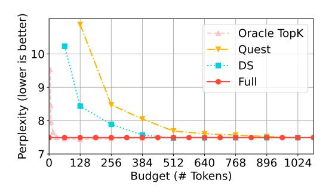
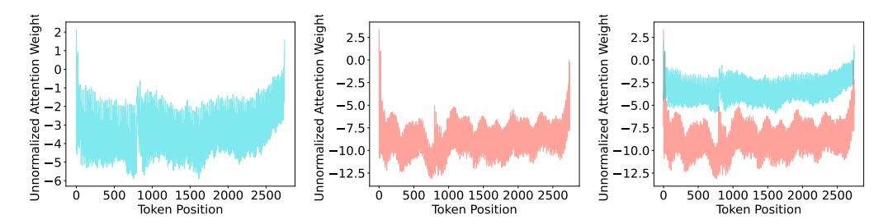
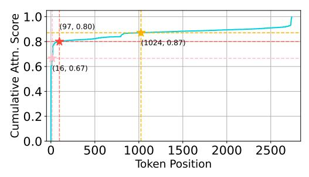

# 1 Introduction

Large language models (LLMs) with long-context capabilities have revolutionized a wide array of natural language processing applications, such as retrieval-based tasks, document summarization [\[1\]](#page-10-0), and code generation [\[2\]](#page-10-1). The increasing availability of models supporting context windows up to 1M to 10M tokens [\[3,](#page-10-2) [4\]](#page-10-3) highlights the growing potential of these advancements. For instance, video language models (VLMs) [\[5\]](#page-13-0) often require tens of thousands of tokens for video processing. Similarly, large reasoning models [\[6,](#page-13-1) [7\]](#page-14-0), which are rapidly growing in popularity, frequently demand substantial token lengths to enable chain-of-thought (CoT) reasoning. Consequently, the importance of long-context LLMs is increasing rapidly to meet the needs of these sophisticated applications.

Despite the substantial potential of long-context LLMs, they come with excessive computational and memory costs [\[8,](#page-14-1) [9,](#page-14-2) [10\]](#page-14-3), primarily from the attention mechanism. Particularly, in the decoding stage of LLMs, the key-value (KV) cache size grows rapidly as the token sequence becomes longer. These data need to be repeatedly loaded from the memory, leading to significant latency overheads. Furthermore, the substantial size of the KV cache significantly increases the GPU memory consumption, compounding the challenges of continuously scaling long-context LLMs.

Previous research has extensively investigated the use of *attention sparsity* (a.k.a., KV cache sparsity) to accelerate long-context inference, both during the prefilling and decoding stages. The core idea is to compute an approximate attention on a subset of tokens, often referred to as "critical tokens" or "heavy hitters" [\[8\]](#page-14-1). The number of selected tokens, denoted as B, is commonly referred to as the KV cache *budget*. A top-k operation is required to identify the indices of the critical tokens that correspond to the B highest estimated scores. However, a key tradeoff exists for the selection of the

Figure 1: Comparison of top-k and top-p for attention sparsity. Approximate attention typically employs techniques such as pooling, channel pruning, and quantization to approximate the query  $(\tilde{Q})$  and key  $(\tilde{K})$  and estimate the attention weights. These weights are then used to select important tokens for sparse attention. (a) Top-k sparsity, utilized by most existing designs, relies on a fixed k-token budget and often results in **over-selection**  $(\sum \tilde{p_i} > 0.9)$  or **under-selection**  $(\sum \tilde{p_i} < 0.9)$ . (b) Our proposed top-p sparsity **dynamically adjusts the budget** to accumulate just sufficient attention weights  $(\sum \tilde{p_i} = 0.9)$ , enabling more efficient and adaptive sparse attention.

budget. A smaller B value significantly reduces the memory accesses and computations, while a larger B value retains more contextual information and thereby minimizes the accuracy loss.

Identifying the optimal value of B to balance both accuracy and efficiency is inherently challenging due to two major reasons: (a) The best budget choices vary dynamically at runtime. Previous works [11, 10] have demonstrated that some heads, referred to as "retrieval heads", are trained to extract important information from long contexts, while others focus only on local information. From Figure 1 we see that the distribution of attention weights may vary across different attention heads. Some attention distributions concentrate on a small subset of tokens. which we refer to as focused attention. Other attention distributions may be flatter, where many tokens have similar attention weights; we call this diffuse attention. For focused attention, using a

Figure 2: Relationship between the KV cache budget and the perplexity on the PG-19 dataset in different top-k sparse attention methods.

fixed token budget for top-k attention often leads to over-selection, as only a few tokens are needed to accumulate sufficient attention weights. In contrast, for diffuse attention, a fixed budget can result in under-selection, as a larger number of tokens are necessary to ensure accurate attention modeling. (b) Existing algorithms need different degrees of over-selection to compensate the estimation inaccuracy. As shown in Figure 2, the optimized budgets highly depend on the specific algorithms, necessitating offline calibration to determine the appropriate budget for each algorithm individually. Certain methods, like Quest [9] or DS [12], have to over-select some tokens to compensate for the inevitable inaccuracy in estimating the importance of tokens compared to the oracle.

In this work, we reveal that the top-k methods exhibit issues similar to those previously encountered in LLM sampling. Drawing on this analogy, we introduce top-p sampling into sparse attention to address the budget selection dilemma. Our study demonstrates that top-p can determine the KV cache budget in a more intrinsic and dynamic way compared to top-k. Based on these observations, we build Twilight, a hierarchical KV cache pruning framework that enhances existing sparse attention algorithms with adaptive budget selection capabilities. Specifically, Twilight first lets the base algorithm select a relatively large subset of tokens using a conservative budget, and then further refines this subset by retaining only the top-p tokens.

Our evaluations for Twilight are conducted in two aspects: accuracy and efficiency. First, we demonstrate that Twilight optimizes the base algorithms with nearly no accuracy loss on both medium-context benchmarks (GSM8K [13], COQA [14], PG-19 [15]) and long-context benchmarks (Longbench [1], RULER [16]). Next, we show that Twilight achieves up to  $15.8 \times$  performance improvement over the full attention operation. Compared to prior sparse attention methods, Twilight

enables a  $1.4\times$  speedup for the self-attention operator itself, and a  $1.35\times$  speedup for the end-to-end decoding. Our contributions are summarized as follows:

- We conduct an in-depth investigation into a critical challenge in top-k sparse attention: the difficulty in identifying the optimal budget (i.e., the number of selected tokens). We propose to use top-p sampling instead to dynamically determine this budget at runtime.
- We introduce Twilight, a framework that can endow any existing sparse attention method with adaptive budget selection capabilities, thereby further improving their efficiency.
- We evaluate Twilight in terms of both accuracy and efficiency, demonstrating a speedup of 1.4× over existing sparse attention methods with nearly no accuracy loss.

#### 2 Related Work

**Top-**k **Sparse Attention.** H2O [8], StreamingLLM [17], and SnapKV [18] evict non-critical tokens in static, query-agnostic manners, which are often referred to as KV cache compression. In contrast, SparQ [19], Quest [9], Double Sparsity (DS) [12], and HShare [20] retain all tokens in the GPU memory but select critical tokens to save data accesses. Recent works like RetrievalAttention [21] and PQCache [22] adopt advanced algorithms to better estimate the token criticality. NSA [23] and MoBA [24] explore opportunities in trainable sparse attention. However, these methods are all based on top-k which requires proper budget selection and configuration beforehand, and thus suffer from the over/under-selection issues.

**Dynamic Budget.** More recent studies have extensively demonstrated that the optimal budgets vary significantly across different layers [25, 26], attention heads [27, 10, 28], and prompts (tasks) [29]. Please see Appendix A for details. These works tend to focus on only one aspect of the dynamism. In this paper, we point out that it is the different distributions of attention weights that are the root cause of such dynamism.

**Non-top-**k **Sparse Attention.** Some recently emerged designs also go beyond top-k methods. MagicPIG [30] uses locality-sensitive hash (LSH) sampling instead of dropping tokens to estimate attention weights, but requires complicated algorithm-system co-design. SampleAttention [31] also features adaptive sparsity but focuses on the prefill stage. A concurrent work with ours, Tactic [32], also dives into top-p sparsity but it uses function fitting to estimate the weight distributions. Although it potentially has lower estimation cost, it usually overestimates the budget.

Other KV Cache Optimizations. Several alternative approaches focus on optimizing the KV cache beyond sparsification, including quantization [33, 34, 35, 36], linear attention [37, 38], and memory-efficient attention mechanisms such as FlashAttention [39] and SageAttention [40, 41]. Our approach is orthogonal to these methods, and can be combined with them for enhanced performance.

### **3** Bringing Top-*p* Sampling to Sparse Attention

In this section, we formulate the current sparse attention methods and re-examine the root cause of their inefficiencies. We argue that to mathematically approximate the attention, the goal is to select a minimum set of indices such that the sum of their attention scores meets a certain threshold. Therefore, we propose to use top-p sampling instead of top-k to efficiently identify the critical tokens.

#### 3.1 Problem Formulation

We start by formulating the sparse attention mechanism. Consider the attention computation during the decoding phase, where we have the query vector  $\mathbf{q} \in \mathbb{R}^{1 \times d}$ , and the KV cache  $\mathbf{K}, \mathbf{V} \in \mathbb{R}^{n \times d}$ . Here, d denotes the head dimension, and n represents the context length.

**Definition 3.1** (Sparse Attention). Let  $\mathcal{I}$  be the set of selected indices. Sparse attention calculates

$$\hat{\mathbf{o}} = \operatorname{softmax}\left(\frac{\mathbf{q} \cdot \mathbf{K}^T}{\sqrt{d}}\right) \mathbf{\Lambda}_{\mathcal{I}} \mathbf{V} = \mathbf{W} \mathbf{\Lambda}_{\mathcal{I}} \mathbf{V} \in \mathbb{R}^{1 \times d}$$
(1)

where 
$$\mathbf{\Lambda}_{\mathcal{I}} \in \mathbb{R}^{n \times n}$$
,  $\mathbf{\Lambda}_{\mathcal{I}}[i,j] = \begin{cases} 1 & \text{if } i = j \text{ and } i \in \mathcal{I} \\ 0 & \text{otherwise} \end{cases}$ .

Figure 3: Diverse distributions observed in attention weights. **The leftmost image** illustrates a "flat" distribution (**diffuse attention**), where the weights are close to uniformly distributed. **The middle image** depicts a "peaked" distribution (**focused attention**), where the weights are concentrated on the tokens at the two sides. When overlaid as in **the rightmost image**, the differences between these distributions become readily apparent.

Let the accurate attention output be  $\mathbf{o} = \operatorname{softmax}(\frac{\mathbf{q} \cdot \mathbf{K}^T}{\sqrt{d}}) \mathbf{V} \in \mathbb{R}^{1 \times d}$ . To minimize the error  $\|\mathbf{o} - \hat{\mathbf{o}}\|$ , we need to carefully select the subset of tokens used in  $\mathcal{I}$ . However, directly optimizing this objective function without loading the full KV cache is challenging. According to the sub-multiplicative property of the Frobenius norm, we can bound the error as in Equation 2. Earlier research has shown that the distribution of  $\mathbf{V}$  is relatively smooth [42], which implies  $\|\mathbf{V}\|_F$  can be viewed as a constant.

$$\mathcal{L} = \|\mathbf{o} - \hat{\mathbf{o}}\| = \|\mathbf{W}(\mathbf{\Lambda}_{\mathcal{I}} - \mathbf{1}^{n \times n})\mathbf{V}\|$$

$$\leq \|\mathbf{W}(\mathbf{\Lambda}_{\mathcal{I}} - \mathbf{1}^{n \times n})\| \cdot \|\mathbf{V}\|_{F}$$
(2)

Therefore, the objective becomes minimizing  $\|\mathbf{W}(\mathbf{\Lambda}_{\mathcal{I}} - \mathbf{1}_{n \times n})\| = 1 - \sum_{i \in \mathcal{I}} \mathbf{W}[i]$ , which means selecting a subset of tokens that maximize the sum of their attention weights. If we fix the size of this subset, i.e.  $|\mathcal{I}|$ , then we have the oracle top-k attention:

**Definition 3.2** (Oracle Top-k Sparse Attention). Given the budget B,

$$\mathcal{I} = \arg \max_{\mathcal{I}} \sum_{i \in \mathcal{I}} \mathbf{W}[i] \quad \text{s.t. } |\mathcal{I}| = B$$
 (3)

This serves as a theoretical upper bound of the current top-k sparse attention methods.

#### 3.2 Rethinking the Problem of Top-k

The Achilles' heel of top-k sparse attention, as described earlier, is the dilemma in determining a universally applicable budget B to all scenarios. We find that this predicament is quite similar to a previous problem encountered in the sampling phase of LLMs, during which the model samples the final output token from the predicted probability distribution. Nucleus sampling [43], a.k.a., top-p sampling, was proposed to address the problem that top-k sampling cannot adapt to different next-word distributions.

Motivated by this insight, we examine the distributions of attention weights more closely. As indicated by Equation 2, the output error is bounded by the sum of the selected attention weights. Therefore, the objective should become selecting the minimum number of tokens B to satisfy a given requirement for the output error. Figure 3 displays two different types of attention weight distributions in several real-world LLMs mentioned in Figure 1. It is easy to observe that, compared to the peaked distribution, a greater number of tokens must be selected in the flat distribution to reach the same cumulative threshold.

Therefore, we argue that the core reason for budget dynamism is the dynamic nature of attention weight distributions at runtime. We thus introduce top-p sparse attention by directly applying a threshold to the sum of attention weights.

**Definition 3.3** (Oracle Top-p Sparse Attention). Given the threshold p,

$$\mathcal{I} = \arg\min_{\mathcal{I}} |\mathcal{I}| \quad \text{s.t. } \sum_{i \in \mathcal{I}} \mathbf{W}[i] \ge p$$
 (4)

Compared to top-k, top-p is more advantageous because it provides a theoretical upper bound of error as  $(1-p)\cdot \|\mathbf{V}\|_F$  from Equation 2. Under this circumstance, top-p reduces the budget as low as possible, making it both efficient and adaptive to different distributions. To demonstrate how top-p reduces the budget, we investigate a real distribution of attention scores as shown in Figure 4. Compared to two fixed budget strategies B=16 and B=1024 that respectively result in under-selection and over-selection, the p=0.8 point selects a very small budget B=97 to reach a similar error requirement to that of B=1024.

Figure 4: Cumulative attention scores of different budget selections in one example attention head.

### 4 Twilight

With the efficient and adaptive top-p sparse attention, our primary goal is to use it to endow existing algorithms with adaptive budget selection capabilities, rather than simply inventing yet another sparse attention design. We are mainly motivated by two reasons. On one hand, despite the challenge of budget selection, existing sparse attention algorithms have achieved significant success in LLM serving systems [44, 45], thanks to their effective token selection strategies. These strategies can be readily reused and enhanced with our adaptive sparsity. On the other hand, we anticipate that future sparse attention methods may still employ top-k selection. By developing a general solution, we aim to automatically equip these future methods with adaptive attention sparsity, while avoiding extensive redesign. Consequently, we position our system, Twilight, as an **optimizer** for existing algorithms.

Nevertheless, applying top-p to various existing sparse attention algorithms faces three key challenges on both the algorithm and system perspectives. **(C1) Not all algorithms are suitable for top-p.** Top-p imposes strict constraints on the layout of attention weights. For example, simply replacing top-k with top-p in

Nevertheless, applying top-p to various existing sparse attention algoweights. "Normalization" means softmax.

| Method     | Efficiency | Precision Requirement | Output Accuracy | Need Normalization? |
|------------|------------|--------------------------|--------------------|------------------------|
| Top-k      | High       | Low                      | Median             | ×                      |
| Top-p      | High       | Median                   | High               | $\checkmark$           |
| Full Attn. | Low        | High                     | High               | V                      |

Quest [9] would not work, as Quest performs max pooling on weights with a per-page layout (16 tokens per page). Additionally, some other methods [46, 21] do not use attention weights to select critical tokens at all. (C2) It is harder to estimate weights for top-p than top-k. In order to find critical tokens without loading full K data, low-precision representation of the K cache is usually used [12, 22]. However, the precision requirement of top-p is higher than that of top-k, because the former requires a certain degree of numerical accuracy while the latter only demands ordinality. Table 1 compares top-k, top-p, and full attention. The precision requirement of top-p attention lies in between the other two, necessitating reconsideration of appropriate precision choices for the K cache. (C3) System-level optimizations are needed. Since our work is the first to introduce top-p to attention weights, the relevant algorithms need to be efficiently implemented on the GPU, including efforts on both parallel algorithm designs and kernel optimizations.

In Section 4.1, we address C1 by proposing a unified hierarchical pruning framework for top-p sparse attention. In Section 4.2, we mitigate the runtime overheads with efficient kernel implementations (Top-p, SpGEMV, Attention) and 4-bit quantization of the K cache, addressing C2 and C3. Lastly, in Section 4.3, we analyze the overheads of Twilight and discuss some additional issues.

### 4.1 Hierarchical Pruning with a Select-then-Prune Architecture

To uniformly support various sparse attention mechanisms, we propose a two-step, hierarchical pruning process. We first capture the base algorithm into a black-box **Token Selector** as long as it has the common semantics of selecting a subset of critical tokens, while the exact algorithm details of *how* to select do not matter. We let the Token Selector use a conservative, relatively large budget,

Figure 5: Twilight architecture. Twilight incorporates a certain existing base sparse attention algorithm and further optimizes it. It computes self-attention in three steps. First, the **Token Selector** selects critical tokens using the base algorithm under a conservative budget. Then, the **Twilight Pruner** prunes the selected token subset via top-p thresholding. Finally, the pruned token indices are passed to the **Sparse Attention Kernel** to perform the attention computation.

e.g. 1/4 sparsity. Then, we have a **Twilight Pruner** after it to further optimize the selected indices by only retaining the top-p tokens, i.e., the minimum subset whose attention weight sum exceeds the threshold p. We call this design as the *Select-then-Prune* architecture, as illustrated in the middle of Figure 5. The final sparse attention kernel thus only computes on the top-p tokens, achieving the benefits of efficiency and adaptivity as proved in Section 3.

#### **4.2** Efficient Kernel Implementations

Now we briefly describe the details of the Twilight architecture, particularly for the Pruner step. For more details of the kernel implementations, please refer to Appendix B.

Efficient SpGEMV with 4-bit Quantization of Key Cache. The beginning part of the Pruner is similar to other sparse attention algorithms, which is to estimate the importance of tokens. As we formulated in Section 3.1, this can be done by estimating the similarity between  $\mathbf{q}$  and  $\mathbf{K}$ , i.e.,  $\mathbf{q} \cdot \mathbf{K}$ . Since loading  $\mathbf{K}$  is known to be memory bound, we reduce the memory access cost by quantizing  $\mathbf{K}$  into lower precision. But what precision shall we choose? Table 1 shows the precision requirement of top-p lies in between top-k and full attention. Some existing top-k designs [12, 22] have pushed the compression of the  $\mathbf{K}$  cache to extremely low precisions of 1 to 2 bits. For full attention, SageAttention [40] has demonstrated 8-bit precision

Figure 6: Sums of normalized attention weights for the selected tokens under different quantization precisions, with p=0.85.

with smoothing **K** and per-block quantization. In this work, we empirically find that *4-bit precision strikes a balance between accuracy and efficiency for top-p*, as illustrated in Figure 6. Here the sum of attention weights with 2-bit quantization drops significantly, while 4-bit and 8-bit methods both maintain enough stability.

Hence we implement an efficient sparse GEMV (SpGEMV) kernel based on FlashInfer [47], a high-performance kernel library for LLM serving. Here "sparse" means the quantized K cache data are stored/loaded in a paged manner [44] to align with the original KV cache layout. We maintain this extra INT4 asymmetrically quantized K cache on the GPU as shown at the right of Figure 5. The INT4  $\bf K$  vectors are unpacked and dequantized in the shared memory, reducing data accesses from the global memory to at most 1/4, resulting in considerable end-to-end speedup.

Efficient Top-p via Binary Search. A brute-force way to do top-p sampling is to sort the elements by descending order and accumulate them until the sum meets the threshold. This is quite inefficient in parallel hardware like modern GPUs. As our top-p method is motivated by the top-p sampling, we also implement this kernel by modifying the top-p sampling kernel from FlashInfer [\[47\]](#page-16-12). Specifically, our kernel adopts a parallel-friendly binary search method as in Algorithm [1.](#page-6-1) Note that element-wise operations like max, where, and sum can be fused into a single loop, which is tensorized on the GPU. Thus we do not need to materialize the intermediate variables like W0.

