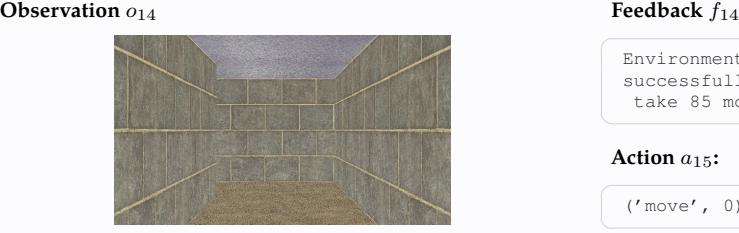

# **Action** a14**:**

('move', 3)

### **VLM Raw Output:**

I can't move left from here either. Let me continue moving down to explore more of the maze and find an alternative path to the red target.

'('move', 3)'

# **Action** a14**:**

('move', 3)

# **Action** a14**:**

('move', 0)

Environment feedback: Action executed successfully. This is step 15. You are allowed to take 85 more steps.

