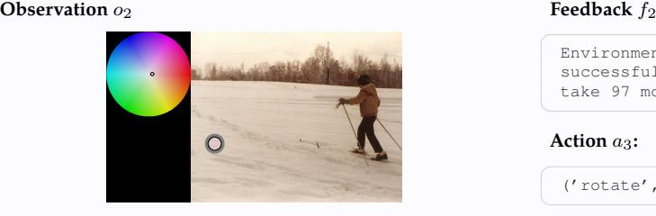

# **Action** a2**:**

('move', 1)

### **VLM Raw Output:**

I see that I cannot move left from my current position because there's a wall there. Let me reassess my surroundings.

Looking at my current position (blue circle), I need to find which directions have white paths available. From what I can see, I should try moving up to find an available path.

'('move', 1)'

# **Action** a2**:**

('move', [4, 0, 0, 0])

### **VLM Raw Output:**

Okay, the previous move was illegal. Let's rethink the approach. The current equation appears to be something like 01 + 23 = 4567. A simple correction could be to transform it into 1 + 1 = 2, or 1 + 0 = 1. Let's try to get 1 + 1 = 2 first.

We need to change the zero in '0' to '1'. We can accomplish this by moving one match from '4' (which currently looks like a 4) to the '0' (making it '1').

''' ('move', [4, 0, 0, 0]) '''

# **Action** a2**:**

('rotate', 73)

Environment feedback: Action executed successfully. This is step 3. You are allowed to take 97 more steps.

# **Action** a2**:**

('mark', (0.4058, 0.5663))

# **Action** a2**:**

('swap', ((2, 1), (1, 0)))

# **Action** a2**:**

('move', 3)

# **Action** a2**:**

('move', 0)

# **Action** a2**:**

('stop', 'stop')

