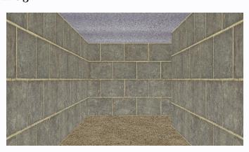

# **Action** a3**:**

('move', 1)

# **Action** a3**:**

('move', [1, 0, 2, 0])

# **Action** a3**:**

('rotate', 15)

# **Action** a3**:**

('mark', (0.8144, 0.6096))

# **Action** a3**:**

('swap', ((0, 2), (1, 0)))

# **Action** a3**:**

('move', 3)

# **Action** a3**:**

('move', 0)

