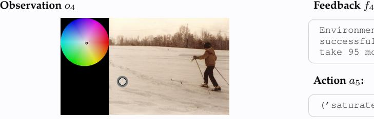
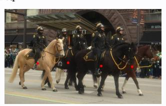
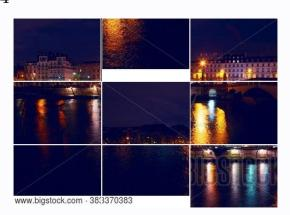
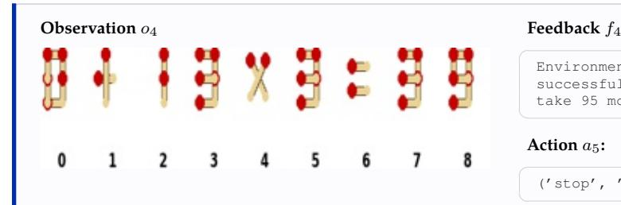
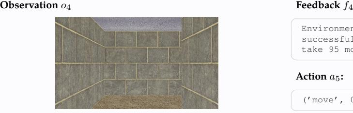

# **Action** a4**:**

('move', 1)

# **Action** a4**:**

('move', [1, 0, 0, 0])

# **Action** a4**:**

('rotate', 17)

Environment feedback: Action executed successfully. This is step 5. You are allowed to take 95 more steps.

# **Action** a4**:**

('mark', (0.6180, 0.6005))

# **Action** a4**:**

('swap', ((1, 2), (1, 1)))

# **Action** a4**:**

('move', [7, 5, 4, 8])

Environment feedback: Action executed successfully. This is step 5. You are allowed to take 95 more steps.

# **Action** a4**:**

('move', 3)

# **Action** a4**:**

('move', 0)

Environment feedback: Action executed successfully. This is step 5. You are allowed to take 95 more steps.

