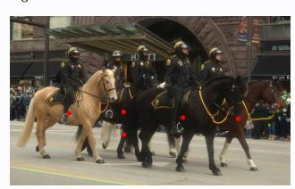

# **Action** a6**:**

('move', 2)

# **Action** a6**:**

('move', [6, 0, 7, 0])

# Action a6:

('rotate', [35.0, -20.0, 0.0])

# **Action** a6**:**

('stop', 'stop')

# **Action** a6**:**

('guess', 5)

# **Action** a6**:**

('swap', ((1, 1), (0, 1)))

# **Action** a6**:**

('move', 0)

# **Action** a6**:**

('move', 0)

