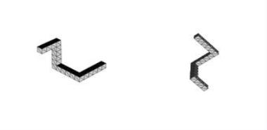

# **Action** a7**:**

('move', 2)

# **Action** a7**:**

('undo', 'undo')

# Action a7:

('rotate', [40.0, 0.0, 0.0])

## **VLM Raw Output:**

\*\*Analysis of Current State:\*\*

- \*\*Target (Left):\*\* A horizontal 'Z' shape, viewed from above.

  \*\*Current (Right):\*\* The object is now a 'Z' shape, but it's still oriented diagonally from topright to bottom-left. My previous yaw correction of +35 was not enough. The pitch correction seems to have worked well, as the side faces are now visible, similar to the target.

\*\*Plan:\*\*

- 1. The primary remaining error is the yaw. It's still rotated too much clockwise. I need to apply a
- counter-clockwise (positive) yaw rotation.

  2. The current angle is about -45 to -50 degrees from horizontal. The target is maybe -10 degrees from horizontal. So I need to rotate it by about 35-40 degrees counter-clockwise. Let's try another +40 degrees of yaw.

\*\*Action:\*\*

'('rotate', [40.0, 0.0, 0.0])'

### Observation o7

### Feedback f7

Environment feedback: Action executed successfully.

This is step 8. You are allowed to take  $12\ \mathrm{more}$ steps.

# **Action** a7**:**

('stop', 'stop')

# **Action** a7**:**

('swap', ((0, 0), (0, 1)))

# **Action** a7**:**

('move', 0)

# **Action** a7**:**

('turn', 2)

