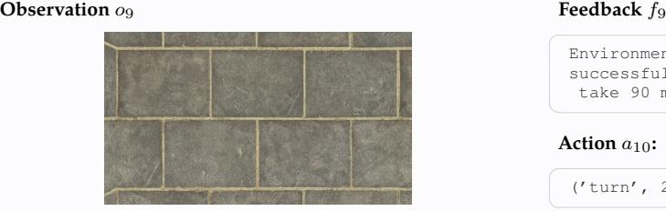

# **Action** a9**:**

('move', 1)

# **Action** a9**:**

('move', [1, 0, 0, 0])

### **VLM Raw Output:**

Eight illegal moves... This is getting ridiculous. I suspect there's a hidden constraint or a misunderstanding of the segment labeling. Let's try a very simple move to see if \*anything\* works. I will move a match from '1' to '0'.

''' ('move', [1, 0, 0, 0]) '''

# **Action** a9**:**

('move', 0)

# **Action** a9**:**

('move', 0)

Environment feedback: Action executed successfully. This is step 10. You are allowed to take 90 more steps.

