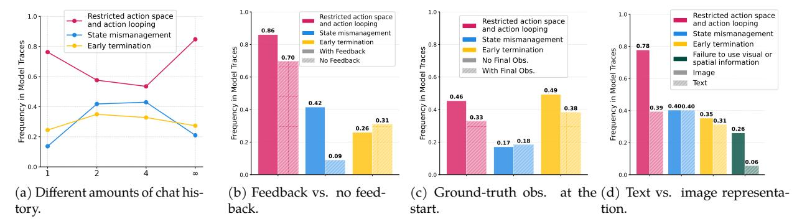

# F.1. Failure changes per ablation

To examine the effects of our ablations on model behavior, we run the failure labeling pipeline above on the ablations described in Section 4 and show the comparison in Figure 16. We find the following:

Different amounts of chat history (Figure 16a): As more history is given, the model is less likely to repeat immediate actions, but still suffers from state mismanagement. We suspect the decreased action looping occurs because the model has a default action (e.g., moving left), so with no history, it continues to repeat this move. With history, it is less likely to immediately repeat prior actions, but after a certain amount of context, the model struggles to manage earlier state and reverts to its default behavior. This is reflected by action looping decreasing when full history is given, consistent with decreased performance under full history.

Feedback vs. no feedback (Figure 16b): When no feedback is provided, the model is less likely to terminate. Inspecting these traces shows that this is largely due to a reduction in "giving up," since the model often gives up when told its moves are invalid. We also observe decreases in action looping and state mismanagement, which is surprising given that overall performance decreases without feedback. This suggests the presence of additional failure modes not captured by our taxonomy, which we leave for future work.

*Ground truth state given at the beginning (Figure 16c):* When given the ground truth state at the start of the task, the model is less likely to "guess" or give up early, reflected in lower rates of action looping and early termination.

Figure 16. Failure-pattern frequency under different information settings. Due to cost, images were only analyzed in the original split, thus the "failure to use visual or spatial information" case is removed in all but the text vs image representation ablation (d).

*Image vs. text representation (Figure 16d):* For tasks aside from Matchstick Equation, models process visual information more effectively when it is presented as text rather than an image. The large reduction in action looping suggests that this text-based representation provides clearer guidance for selecting actions.

