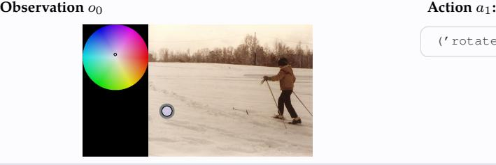

# **Instruction** I

You are solving a 2x2 jigsaw puzzle. The puzzle pieces are currently scrambled. Your goal is to rearrange the pieces to recover the image.

Available actions:

- 1. 'swap': Swap two pieces by specifying their coordinates. Format: '('swap', ((row1, col1), (row2, col2 )))' where coordinates start from (0,0) at the top-left corner. 2. 'reorder': Reorder all pieces at once. Format: '('reorder', [0, 1, 2, ..., 3])' where the list represents the desired order of pieces from top-left to bottom-right.
- 3. 'stop': End the puzzle solving session. Format: '('stop', 'stop')'

Please respond with exactly one action and its arguments in the specified format. For example:

- To swap two pieces: '('swap', ((0, 0), (1, 1)))'
- To reorder all pieces: '('reorder', [0, 1, 2, ..., 3])'
- To stop: '('stop', 'stop')'

Index-to-cell mapping (0-based rows/cols):

- Index = row \* 2 + col.
- Row 0 covers indices 0..1, row 1 covers 2..3, etc. Example for 2x2: (0,0)->0, (0,1)->1, (1,0)->2, (1,1)->3.

This is step 1. You are allowed to take 19 more steps.

# **Instruction** I

```
You see a broken matchstick equation.
Your goal is to fix the equation by moving ONE match per action.
You see an image of the equation.
Symbols are indexed 0..N-1 from left to right (N = number of symbols).
Available actions:
1. 'move': Remove one match from segment 'src_seg' of symbol at 'src_idx', then add it to segment '
dst_seg' of symbol at 'dst_idx'. Format: '('move', [src_idx, src_seg, dst_idx, dst_seg])' where:
   - src_idx, dst_idx ∈ [0, N-1], with src_idx ̸= dst_idx
   - src_seg, dst_seg ∈ matchstick_puzzles.TOTAL (e.g., {0..12})
   - The move must result in valid symbols at BOTH positions.
2. 'undo': Revert the last move (if any). Format: '('undo', 'undo')'
3. 'stop': Submit your current equation as final. Format: '('stop', 'stop')'
Success: The submitted equation must be mathematically correct (evaluated as lhs == rhs).
Segment legend (indices depend on symbol):
  0..6 : 7-seg digits (a,b,c,d,e,f,g), 6 is also the horizontal stroke used by '+'
  7 : plus vertical stroke (used by '+')
  8 : the multiply sign that goes from top left to bottom right
  9 : the multiply sign that goes from top right to bottom left
  11,12: equals upper/lower bars (used by '=')
A segment is valid for a symbol only if the resulting set of segments maps to a known glyph.
Please respond with exactly one action and its arguments in the specified format. For example:
- To move a match: '('move', [0, 6, 2, 0])'
- To undo: '('undo', 'undo')'
- To stop: '('stop', 'stop')'
This is step 1. You are allowed to take 29 more steps.
```

# **Instruction** I

You are performing a color-matching task. You see two images side by side:

- LEFT: A color wheel showing your current hue and saturation selection
- RIGHT: An image with a circular region colored with your current selection (gray outside the circle)

Your goal is to adjust the hue and saturation to match the original color that appears at the center of the circular region in the right image. The circle's border shows the exact target location.

Success criteria: You succeed when your color selection closely matches the target color in both hue and saturation.

### Available actions:

- 1. 'rotate': Adjust the hue by rotating around the color wheel (circular motion). Format: '('rotate', angle)' where angle is an integer between -360 and 360 degrees.
- 2. 'saturate': Adjust the saturation by moving toward or away from the center of the wheel. Format: '(' saturate', delta)' where delta is an integer between -255 and 255.
- 3. 'stop': Submit your final color choice when you're satisfied with the match. Format: '('stop', 'stop ')'.

Please respond with exactly one action and its arguments in the specified format. For example:

- '('rotate', 30)' to rotate the hue +30 degrees clockwise
- '('rotate', -45)' to rotate the hue 45 degrees counter-clockwise
- '('saturate', 20)' to move away from center (increase saturation, more vivid)
- '('saturate', -30)' to move toward the center (decrease saturation, more muted)
- '('stop', 'stop')' to submit your answer when the colors match

This is step 1. You are allowed to take 99 more steps.



('rotate', 25)

# **Instruction** I

You are solving a horse-counting task. Count the number of horse in the image. You can place dots to mark instances and then record your final count.

### Available actions:

- 1. 'mark': Place a dot at normalized coordinates. Format: '('mark', (x, y))' where x and y are
- normalized coordinates between 0.0 and 1.0. 2. 'undo': Remove your last placed dot. Format: '('undo', 'undo')'
- 3. 'guess': Record your count guess. Format: '('guess', N)' where N is an integer between 5 and 30.
- 4. 'stop': End the counting session. Format: '('stop', 'stop')'

Success: You succeed if your final count guess matches the true number of objects.

Please respond with exactly one action and its arguments in the specified format. For example:

- To mark a point: '('mark', (0.5, 0.3))'
- To undo: '('undo', 'undo')'
- To guess count: '('guess', 5)'
- To stop: '('stop', 'stop')'

This is step 1. You are allowed to take 99 more steps.

# **Instruction** I

You are solving a 3x3 jigsaw puzzle. The puzzle pieces are currently scrambled. Your goal is to rearrange the pieces to recover the image.

### Available actions:

- 1. 'swap': Swap two pieces by specifying their coordinates. Format: '('swap', ((row1, col1), (row2, col2 )))' where coordinates start from (0,0) at the top-left corner. 2. 'reorder': Reorder all pieces at once. Format: '('reorder', [0, 1, 2, ..., 8])' where the list represents the desired order of pieces from top-left to bottom-right.
- 3. 'stop': End the puzzle solving session. Format: '('stop', 'stop')'

Please respond with exactly one action and its arguments in the specified format. For example:

- To swap two pieces: '('swap', ((0, 0), (1, 1)))'
- To reorder all pieces: '('reorder', [0, 1, 2, ..., 8])'
- To stop: '('stop', 'stop')'

Index-to-cell mapping (0-based rows/cols):

- Index = row \* 3 + col.
- Row 0 covers indices 0..2, row 1 covers 3..5, etc. Example for 2x2: (0,0)->0, (0,1)->1, (1,0)->2, (1,1)->3.

This is step 1. You are allowed to take 99 more steps.

# **Instruction** I

You are navigating a 11x11 maze. The maze consists of walls (gray) and paths (white). You are represented by a blue circle, and your goal is to reach the red target square. Available actions: 1. 'move': Move in one of four directions. Format: '('move', direction)' where direction is an integer: - 0=right, 1=up, 2=left, 3=down 2. 'stop': End the navigation session. Format: '('stop', 'stop')' Success: You succeed if you reach the red target square. Please respond with exactly one action and its arguments in the specified format. For example: - To move right: '('move', 0)' - To move up: '('move', 1)' - To move left: '('move', 2)' - To move down: '('move', 3)' - To stop: '('stop', 'stop')'

# **Instruction** I

You are navigating a 9x9 3D maze environment. The maze consists of walls and open paths. You are given the first-person view from your current position and orientation.

Your goal is to reach the target location which ismarked by a red sphere.

### Available actions:

- 1. 'move': Move one step forward in your current facing direction. Format: '('move', 0)'
- 2. 'turn': Rotate your view in the specified direction. Format: '('turn', direction)' where direction is 1 (left), 2 (right), or 3 (around).
- 3. 'stop': Stop the episode. Format: '('stop', 'stop')'

Success: You succeed when you reach the target location (red sphere).

Please respond with exactly one action and its arguments in the specified format. For example:

- To move forward: '('move', 0)'
- To turn left: '('turn', 1)'
- To turn right: '('turn', 2)'
- To turn around: '('turn', 3)'
- To stop: '('stop', 'stop')'

Note: If you try to move forward into a wall, you will remain in your current position. Turning actions do not change your position, only your facing direction. This is step 1. You are allowed to take 99 more steps.

# **Instruction** I

You are solving a mental rotation task. Two panels appear side by side:

- Left: the original circular image.

- Right: the image has been rotated by a secret angle.

Your job is to undo that rotation and align the right image back to match the left.

### Available actions:

1. 'rotate': Rotate the right image by an integer angle. Format: '('rotate', angle)' where angle is an integer between -180 and 180 degrees (positive is clockwise, negative is counterclockwise).

2. 'stop': Submit your final adjustment. Format: '('stop', 'stop')'

Success: You succeed if your final adjustment undoes the secret rotation within ±5.0◦.

Please respond with exactly one action and its arguments in the specified format. For example:

- To rotate clockwise: '('rotate', 45)'

- To rotate counterclockwise: '('rotate', -30)'
- To submit: '('stop', 'stop')'

This is step 1. You are allowed to take 99 more steps.

