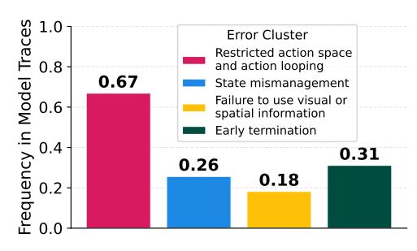
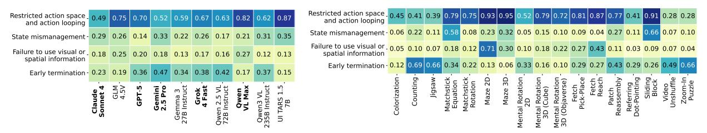

# **JSON Output Structure**

```
[
  {
    "property_description": which behavior is present in the trace,
    "reason": an explanation of the exact behaviors in the trace
              that fall under the property_description (1-2 sentences),
    "evidence": "What exactly in the trace exhibits this property?
                 Include quotes/tool calls/actions when possible."
  }
]
```

environmental feedback, revisit previously explored areas, or repeat illegal actions despite prior errors—for example, continuing to move into a wall after being told they have collided, or repeating invalid moves in the Match Equation, Sliding Block, and Toy Maze 2D tasks.

- *(3) Early termination:* the model terminates the episode before the maximum steps, despite not reaching the goal.
- *(4) Failure to use visual or spatial information:* models ignore the visual information provided, such as the target leaving the frame or the item being successfully aligned (*e.g.*, Mental Rotation).

Finally, we quantify the prevalence of each failure mode by having a VLM annotator (GPT-4.1) label each trace for these behaviors (a trace may exhibit multiple behaviors).

Frequency of failures. Figure 14 shows the proportion of traces that contain each failure. We see that action looping is very common, occurring in more than 60% of traces, followed in frequency by early termination, state mismanagement, and failure to use visual or spatial information. Looking at how the frequency of the behaviors changes compared across tasks, we see in Figure 15 (b) that certain tasks, like Matchstick Equation and Sliding Block, result in a particularly large amount of action repetition and state mismanagement failures, likely due to the difficulty of the task and the frequency of invalid moves. We additionally see that tasks like the Maze task, which provide clear visual signals

<span id="page-25-0"></span>

Figure 14. Frequency of failure patterns.

of task progress, have a very high (up to 70%) rate of ignoring this important visual information and high action repetition. Based on this information, we see that often when a model is uncertain, it defaults to repeating its previous moves, regardless of the visual or language feedback it is given from previous turns. This is further supported in Figure 15 (a), which shows that weaker models like UI TARS 1.5 7B have very high rates of action looping (87%) and state mismanagement (35%).

<span id="page-25-1"></span>

(a) Frequency of failure patterns per model. (b) Frequency of failure patterns per task on easy variants.

Figure 15. Detailed Analysis of Failure Patterns by Model and Task.

We additionally find interesting cases of early termination, such as giving up on the task entirely, where the model says things like "I give up." and "I'm stopping. This is unsolvable". These specific instances of giving up happen much more often for hard tasks like Matchstick Equation, indicating that the models' limited task comprehension leads them to question whether a solution exists in the current instance. We also see this phenomenon occur more often in Gemini and Gemma models, which we suspect is because these models are chattier and more anthropomorphic and thus may express their internal reasoning more often than others.

