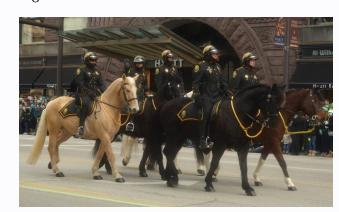
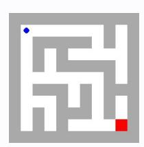
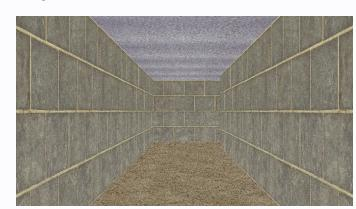
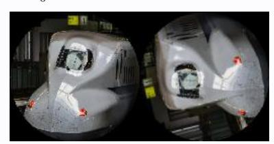

# **Observation** o0 **Action** a1**:**

('mark', (0.2122, 0.5766))

# **Observation** o0 **Action** a1**:**

('swap', ((2, 0), (0, 2)))

# **Observation** o0 **Action** a1**:**

This is step 1. You are allowed to take 99 more steps.

('move', 3)

# **Observation** o0 **Action** a1**:**

('move', 0)

# **Observation** o0 **Action** a1**:**

('rotate', 104)

