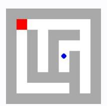
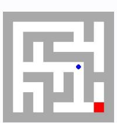
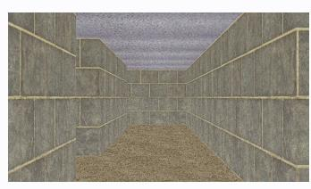

# **Observation** o10 **Feedback** f10

Environment feedback: Action executed successfully.

This is step 11. You are allowed to take 9 more steps.

# **Observation** o10 **Feedback** f10

Environment feedback: Action executed successfully. This is step 11. You are allowed to take 89 more steps.

# **Observation** o10 **Feedback** f10

Environment feedback: Action executed successfully. This is step 11. You are allowed to take 89 more steps.

