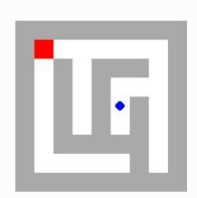
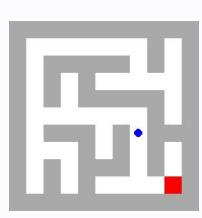
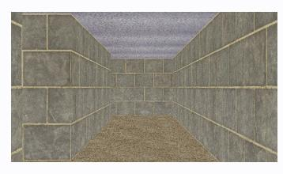

# **Observation** o11 **Feedback** f11

Environment feedback: Cannot move into a wall.

This is step 12. You are allowed to take 8 more steps.

# **Observation** o11 **Feedback** f11

Environment feedback: Action executed successfully. This is step 12. You are allowed to take 88 more steps.

# **Observation** o11 **Feedback** f11

Environment feedback: Action executed successfully. This is step 12. You are allowed to take 88 more steps.

