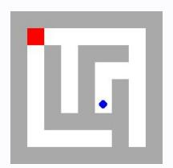
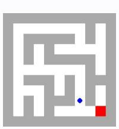
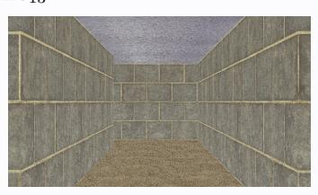

# **Observation** o13 **Feedback** f13

Environment feedback: Cannot move into a wall. This is step 14. You are allowed to take 6 more steps.

# **Observation** o13 **Feedback** f13

Environment feedback: Action executed successfully. This is step 14. You are allowed to take 86 more steps.

# **Observation** o13 **Feedback** f13

Environment feedback: Action executed successfully. This is step 14. You are allowed to take 86 more steps.

