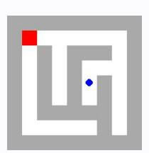
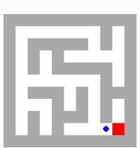
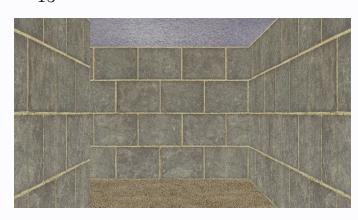

# **Observation** o15 **Feedback** f15

Environment feedback: Action executed successfully.

This is step 16. You are allowed to take 4 more steps.

# **Observation** o15 **Feedback** f15

Environment feedback: Action executed successfully. This is step 16. You are allowed to take 84 more steps.

# **Observation** o15 **Feedback** f15

Environment feedback: Action executed successfully. This is step 16. You are allowed to take 84 more steps.

