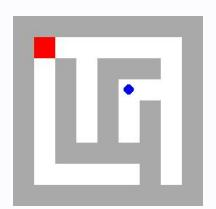
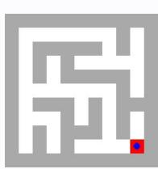
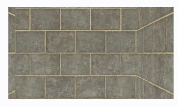

# **Observation** o16 **Feedback** f16

Environment feedback: Action executed successfully.

This is step 17. You are allowed to take 3 more steps.

# **Observation** o16 **Feedback** f16

Environment feedback: Action executed successfully. This is step 17. You are allowed to take 83 more steps.

# **Observation** o16 **Feedback** f16

Environment feedback: Action executed successfully. This is step 17. You are allowed to take 83 more steps.

