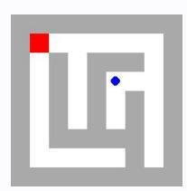

# **Observation** o18 **Feedback** f18

Environment feedback: Cannot move into a wall.

This is step 19. You are allowed to take 1 more steps.

# **Observation** o18 **Feedback** f18

Environment feedback: Action executed successfully. This is step 19. You are allowed to take 81 more steps.

