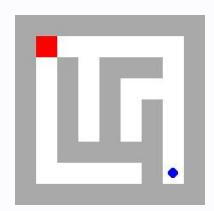
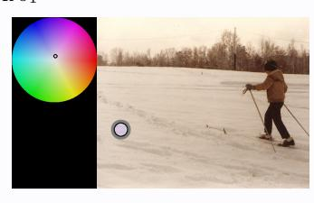
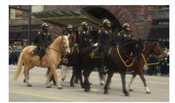
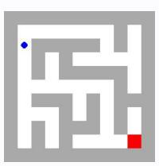
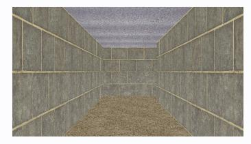
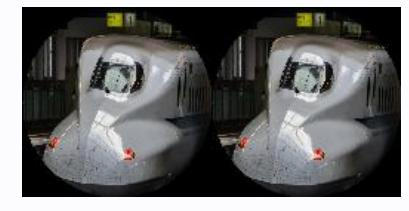

# **Observation** o1 **Feedback** f1

Environment feedback: Cannot move into a wall.

This is step 2. You are allowed to take 18 more steps.

# **Observation** o1 **Feedback** f1

Environment feedback: Illegal move.

This is step 2. You are allowed to take 28 more steps.

# **Observation** o1 **Feedback** f1

Environment feedback: Action executed successfully. This is step 2. You are allowed to take 98 more steps.

# **Observation** o1 **Feedback** f1

Environment feedback: Action executed successfully. This is step 2. You are allowed to take 98 more steps.

# **Observation** o1 **Feedback** f1

Environment feedback: Action executed successfully. This is step 2. You are allowed to take 98 more steps.

# **Observation** o1 **Feedback** f1

Environment feedback: Action executed successfully. This is step 2. You are allowed to take 98 more steps.

# **Observation** o1 **Feedback** f1

Environment feedback: Action executed successfully. This is step 2. You are allowed to take 98 more steps.

# **Observation** o1 **Feedback** f1

Environment feedback: Action executed successfully. This is step 2. You are allowed to take 98 more steps.

